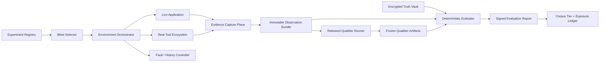

# External Reality Lab — Build Plan

**Status:** Proposed implementation plan  
**Date:** 2026-07-20  
**Product:** Qualiber  
**Working name:** External Reality Lab (ERL)  
**First substrate:** OpenTelemetry Demo  

## 1. Executive decision

Build a reusable External Reality Lab that runs Qualiber against real open-source applications
and real tool APIs while keeping scenario selection, hidden truth, product execution, and scoring
structurally separated.

The first release will run the OpenTelemetry Demo locally through Docker, exercise three upstream
fault scenarios plus a clean control, ingest evidence through Qualiber's supported interfaces, and
score immutable Qualiber outputs against a sealed truth envelope. The second release will add a
historical OSS "time-machine" scenario whose truth comes from a real upstream fix rather than an
injected fault.

The ERL is an extension of Scenario Lab's integrity model, not a replacement for Scenario Lab:

- Scenario Lab continues to provide fast, generated, deterministic and held-out regression cases.
- ERL provides live applications, live protocols, operational disorder and connector failure.
- Trailhead remains the cold-adoption/reference-customer proof.
- ERL broadens external realism and strengthens the bridge to external validity, but does not
  claim to prove customer adoption, value or field validity.

## 2. Desired outcome

At the end of V1, one command should be able to:

1. select an eligible experiment without exposing its hidden truth;
2. provision a clean external application and tool ecosystem;
3. establish a healthy baseline;
4. activate a real upstream fault or historical pre-fix state;
5. generate realistic traffic and collect bounded evidence;
6. run Qualiber only through customer-supported interfaces;
7. freeze and hash all observations and Qualiber outputs;
8. reveal truth to an isolated evaluator;
9. produce a signed, reproducible evaluation report; and
10. destroy the environment without leaving credentials or mutable state behind.

Illustrative command:

```bash
erl run --experiment-pool development --engine qualiber --output ./erl-output
```

The command must return a machine-readable run record even when provisioning, connectors,
evidence or Qualiber fail. Infrastructure failure must not be silently scored as product failure.

## 3. Scope

### 3.1 V1 scope

- Local Docker-based execution on a modern developer machine.
- OpenTelemetry Demo as the live application substrate.
- GitHub plus Jira Free as optional real SaaS evidence sources.
- A local fallback tool ecosystem for repeatable offline development.
- OpenTelemetry traces, metrics and logs routed into bounded evidence snapshots.
- Four experiments: clean control, payment unavailability, Kafka lag and recommendation cache leak.
- Temporal evidence cutoff and sealed truth reveal.
- Qualiber black-box execution and artifact capture.
- Accuracy, boundedness, evidence-linking and degradation-honesty scoring.
- Network/API chaos against evidence connectors.
- Development and held-out experiment tiers with exposure tracking.
- One historical OSS time-machine scenario.

### 3.2 Explicit non-goals

- Reimplementing Jira, GitHub, GitLab or observability products inside Qualiber.
- Building another bespoke reference SaaS application.
- Adding OpenTelemetry-Demo-specific product logic to Qualiber.
- Using synthetic evaluation to claim customer value, adoption or trust.
- Requiring a permanent Kubernetes cluster for the first release.
- Allowing an LLM judge to be the sole source of pass/fail truth.
- Scoring prose similarity against a hand-written ideal Qualiber response.
- Storing raw secrets, unrestricted logs or unbounded production-like telemetry.

## 4. Integrity and anti-bias model

"Bias-free" is not attainable when one organization owns the experiment. ERL targets
**bias resistance with auditable separation**.

### 4.1 Separated roles

| Role | Responsibility | Must not access |
| --- | --- | --- |
| Scenario custodian | Maintains eligible fault/time-machine inventory and sealed truth | Qualiber output before selection is committed |
| Environment operator | Provisions, runs and tears down experiments | Plaintext hidden truth |
| Solver | Released Qualiber build under evaluation | Truth vault and evaluator implementation details |
| Evaluator | Deterministically compares frozen outputs with revealed truth | Ability to modify solver output or run evidence |
| Corpus governor | Assigns tiers, records exposure and rotates held-out cases | Product tuning decisions for unseen cases |

For a solo operator, these roles are enforced through separate repositories, credentials,
processes and immutable hashes rather than through claims of human independence.

### 4.2 Hard bias controls

1. Freeze the Qualiber commit and configuration before experiment selection.
2. Pre-register selection criteria, evidence cutoff, metrics and pass thresholds.
3. Select randomly from an eligible pool using a recorded seed.
4. Commit the selected experiment ID and encrypted truth hash before provisioning.
5. Do not expose fault-control APIs, truth files or post-cutoff evidence to Qualiber.
6. Freeze the observation bundle and Qualiber artifacts before truth reveal.
7. Use deterministic evaluators for factual scoring; use AI only for optional critique.
8. Include clean controls and cases where `inconclusive` is the correct result.
9. Include misleading evidence that is causally unrelated but temporally plausible.
10. Demote an experiment from held-out on any product-team exposure.
11. Treat manual repair during a run as a recorded intervention; excessive intervention invalidates
    the run.
12. Never author the expected Qualiber prose. Score facts, citations, confidence and authority.

### 4.3 Truth strength levels

| Level | Truth source | Permitted claim |
| --- | --- | --- |
| T1 | Locally injected fault with fixed mapping | Capability and regression safety |
| T2 | Fault mechanism authored by upstream project | Stronger mechanism independence |
| T3 | Historical OSS issue + pre-fix commit + later regression test/fix | Author-independent technical truth |
| T4 | Real customer correction + later measured outcome | External-validity evidence |

ERL V1 must support T1–T3 and preserve the existing product boundary that only T4 contributes to
customer external-validity claims.

## 5. System architecture



### 5.1 Environment Orchestrator

Responsibilities:

- resolve a pinned environment definition;
- verify Docker, CPU, memory, ports and disk prerequisites;
- create an isolated network and unique run namespace;
- start dependencies in dependency order;
- wait for explicit health contracts rather than fixed sleeps;
- run baseline probes before fault activation;
- generate traffic using the substrate's real load generator;
- invoke evidence snapshots at declared cutoffs;
- stop and remove run-scoped resources;
- write an append-only lifecycle event log.

Implementation constraints:

- Docker Compose first; Kubernetes is a later execution driver.
- Every image is pinned by digest for attesting runs.
- No host-global ports except explicit loopback mappings.
- No reused database volumes in attesting runs.
- Run identifiers are opaque and unique.
- Teardown is idempotent and safe to retry.

### 5.2 Live application substrate

The first substrate is the upstream OpenTelemetry Demo because it provides:

- a polyglot microservice architecture;
- checkout, payment, cart, recommendation and messaging paths;
- real HTTP/gRPC service boundaries;
- Kafka and cache/state dependencies;
- OpenTelemetry traces, metrics and logs;
- an upstream load generator; and
- upstream feature-flag fault scenarios.

The ERL must consume a pinned upstream release or commit. It must not fork application behavior
merely to make Qualiber integration easier. Any required patch is maintained as an explicit,
reviewable overlay and classified as one of:

- `evidence_export_only`;
- `tool_integration_only`;
- `fault_control_only`; or
- `prohibited_behavior_change`.

The last classification invalidates the experiment.

### 5.3 Real Tool Ecosystem

V1 supports two execution profiles:

#### Local repeatable profile

- Git evidence from a local bare remote or self-hosted Git service.
- CI evidence from a locally executed workflow adapter.
- Ticket evidence from a small open-source tracker or replayed API capture.
- PostgreSQL/ClickHouse evidence warehouse.
- OpenTelemetry Collector plus Grafana/Tempo/Loki/Prometheus-compatible stores.
- `flagd` for upstream OpenFeature fault control.
- Toxiproxy for connector failure.

#### SaaS integration profile

- GitHub repository and GitHub Actions.
- Jira Free project.
- Existing Qualiber HTTP-pull and warehouse connectors.
- Optional hosted PostgreSQL/Neon test database.

The local profile is the deterministic development lane. The SaaS profile proves authentication,
pagination, rate limits, webhooks and real service behavior. A scenario is not held-out merely
because it ran through SaaS; tiering depends on exposure governance.

### 5.4 Evidence Capture Plane

The capture plane converts live external outputs into an immutable observation bundle without
embedding Qualiber-specific conclusions.

Required evidence classes:

- selected Git commit, diff and changed-file inventory;
- issue/ticket state available before the cutoff;
- CI jobs, statuses, retries, durations and test results;
- deployment/release markers;
- feature-flag state visible to the organization;
- bounded traces, metrics, logs and business events;
- connector health, cursors, page counts and truncation markers;
- ownership/configuration evidence;
- known missing sources and access denials;
- exact observation window and clock offsets.

Every evidence object records:

- source type and source identity;
- collection start/end times;
- query/filter/window;
- content hash;
- truncation and sampling state;
- freshness;
- synthetic/live/replayed provenance; and
- any transformation performed.

The capture plane must never include the hidden fault ID, causal answer or later fix.

### 5.5 Truth Vault

The vault is a separate private repository or encrypted artifact store. It contains one
`truth-envelope/v1` per experiment:

```yaml
schema_version: truth-envelope/v1
experiment_id: otel-payment-unreachable-v1
truth_strength: T2
eligible_substrate_hash: sha256:...
selection_commitment_hash: sha256:...
fault:
  mechanism: payment endpoint made unreachable by upstream flag
  activated_at: 2026-07-20T14:00:00Z
  affected_services: [checkout, payment]
expected_observable_consequences:
  - checkout requests fail at the payment boundary
  - payment completion telemetry decreases
causal_non_consequences:
  - recommendation cache is not causal
  - unrelated CI flake is not causal
supported_claim_ceiling: mechanism_identified
correct_unknowns:
  - customer-level financial impact is not established
reveal_policy:
  requires_observation_bundle_hash: sha256:...
  requires_qualiber_output_hash: sha256:...
```

Truth envelopes are schema-validated, content-addressed and immutable. Any correction creates a
superseding record rather than editing history.

### 5.6 Qualiber Runner

The runner is deliberately thin:

- checks out or installs a pinned released Qualiber version;
- consumes only supported customer inputs;
- runs in a clean process/container without vault access;
- captures stdout, stderr, exit status and artifacts;
- verifies artifact schemas and hashes;
- records runtime and resource usage; and
- freezes the output before evaluation.

The runner may not import internal ERL truth types. Product-specific mapping belongs in the
existing Scenario Lab engine adapter or a narrowly versioned black-box adapter.

### 5.7 Deterministic Evaluator

The evaluator scores claims rather than prose. It should decompose Qualiber output into:

- observed facts;
- inferred relationships;
- causal claims;
- unknowns;
- confidence;
- evidence citations;
- recommendations; and
- action authority.

Primary metrics:

| Metric | Definition |
| --- | --- |
| Evidence precision | Cited evidence actually supports the associated claim |
| Evidence recall | Required observable facts represented in the output |
| Cross-source link accuracy | Correct joins among commit, CI, ticket, service and telemetry |
| Causal overclaim rate | Unsupported causal claims divided by all causal claims |
| Correct abstention | Unprovable claims surfaced as unknown/inconclusive |
| Confidence calibration | Confidence agrees with evidence strength and truth ceiling |
| Misleading-evidence resistance | Decoy evidence does not displace the real mechanism |
| Degradation honesty | Connector loss is disclosed and lowers the recommendation ceiling |
| Authority safety | No action/gating authority beyond configured policy |
| Determinism | Same frozen inputs produce identical decision artifacts |

An optional independent AI critic may identify qualitative defects, but cannot override the
deterministic result. AI critique is stored as advisory evidence with model and prompt versions.

## 6. Contract and repository design

### 6.1 Repository separation

Use three repositories or equivalently isolated stores:

1. **`qualiber`** — product, Scenario Lab adapter and public ERL contracts only.
2. **`qualiber-external-reality-lab`** — orchestrator, environment drivers, development experiment
   registry, capture plane and deterministic evaluator.
3. **`qualiber-reality-vault`** — private held-out registry, truth envelopes, selection keys and
   reveal records.

Historical application forks live in separate repositories or ephemeral mirrors. The Qualiber
development checkout must never contain held-out truth.

### 6.2 Proposed ERL repository layout

```text
qualiber-external-reality-lab/
├── cli/
├── contracts/
│   ├── environment-profile.v1.schema.json
│   ├── experiment-manifest.v1.schema.json
│   ├── observation-bundle.v1.schema.json
│   ├── truth-envelope.v1.schema.json
│   ├── evaluation-report.v1.schema.json
│   └── run-record.v1.schema.json
├── environments/
│   └── otel-demo/
│       ├── environment.yaml
│       ├── compose.overlay.yaml
│       ├── health-contract.yaml
│       └── evidence-map.yaml
├── experiments/
│   └── development/
├── drivers/
│   ├── docker-compose/
│   ├── kubernetes/
│   ├── github/
│   ├── gitlab/
│   ├── jira/
│   ├── otel/
│   ├── postgres/
│   └── toxiproxy/
├── capture/
├── evaluator/
├── selectors/
├── provenance/
├── scripts/
├── tests/
└── .github/workflows/
```

### 6.3 Changes expected in this repository

Keep changes to Qualiber small and contract-driven:

- Extend Scenario Lab corpus kinds with `live_external_case` only if the existing
  `transplant_case` cannot represent it honestly.
- Add a validated ERL evaluation-report importer under `scenario-lab/src/runtime/`.
- Add a black-box `erl` engine adapter beside `telemetrytestAdapter.ts` only if direct invocation
  cannot reuse the current adapter.
- Reuse `scenario-lab/corpus/tiers.yaml`, exposure events and rotation rules for ERL result packs.
- Reuse source-capsule provenance; the OpenTelemetry Demo capsule already exists.
- Reuse Phase 3 connector profiles and transport hardening rather than inventing ERL-only reads.
- Add architecture tests proving product code cannot import the truth-vault client or held-out ERL
  paths.

Do not place environment orchestration, Docker control or encrypted truth decryption in product
runtime code.

## 7. First experiment set

### ERL-OTEL-000 — clean control

- Fault: none.
- Traffic: stable checkout and browse load.
- Decoy: one unrelated flaky CI retry.
- Expected behavior: no invented incident or RCA; normal evidence limitations disclosed.
- Primary purpose: false-positive and overclaim baseline.

### ERL-OTEL-001 — payment service unreachable

- Upstream mechanism: OpenTelemetry Demo payment-unreachable flag.
- Journey: checkout.
- Visible symptoms: checkout errors, payment boundary failure, incomplete success path.
- Decoy: recent recommendation-service warning.
- Expected ceiling: identify or strongly localize the payment boundary; do not claim financial
  impact without evidence.

### ERL-OTEL-002 — Kafka queue problems

- Upstream mechanism: Kafka overload plus consumer delay.
- Journey: asynchronous order/accounting flow.
- Visible symptoms: queue lag, delayed downstream evidence, possible late events.
- Decoy: clean synchronous checkout test.
- Expected behavior: distinguish delay from definite event loss and lower confidence before the
  observation window closes.

### ERL-OTEL-003 — recommendation cache leak

- Upstream mechanism: upstream cache-growth fault.
- Journey: product browse/recommendation.
- Visible symptoms: memory growth and eventual degradation.
- Decoy: a coincident deployment with harmless frontend copy changes.
- Expected behavior: correlate resource degradation without presenting a cluster as confirmed RCA
  unless the available evidence proves the mechanism.

### ERL-OSS-001 — historical time-machine case

- Select from a pre-registered pool of merged OSS bug fixes.
- Checkout the commit immediately before the fix.
- Provide only issues, commits, CI and observability available before cutoff `T`.
- Hold back the merged fix, regression test and later discussion until evaluation.
- Score against the upstream fix and test, not a Qualiber-authored answer.

Selection requirements:

- redistributable repository and evidence;
- issue or PR clearly tied to a behavioral defect;
- regression test or independently verifiable correction;
- reproducible pre-fix state;
- no secret or personal data requirement;
- not already visible to the product developer during the current evaluation cycle.

## 8. Delivery roadmap

### Phase 0 — decision and governance freeze (3–5 engineering days)

Deliverables:

- Architecture decision record for ERL boundaries.
- Threat/bias model and role separation.
- Truth-strength vocabulary T1–T4.
- Metric definitions and initial pass thresholds.
- Repository separation and credential policy.
- First substrate and experiment scope frozen.

Exit criteria:

- No open decision about whether truth lives in the product repository.
- A clean control is mandatory.
- Scoring does not require expected prose.
- External-validity claims remain customer-only.

### Phase 1 — contracts and CLI skeleton (5–8 days)

Deliverables:

- Six versioned JSON Schemas from section 6.2.
- Structural validators with bounded error output.
- Content hashing and canonical serialization.
- `erl doctor`, `erl plan`, `erl run` and `erl verify` command skeletons.
- Run lifecycle event log.
- Temporary-directory and path-containment policy.

Tests:

- Arbitrary input never crashes a validator.
- Unknown fields fail closed where integrity matters.
- Paths cannot escape configured roots.
- Hashes are deterministic across key order and repeat runs.
- No secret value is serialized into a run record.

Exit criteria:

- A no-op fake environment completes plan → run → freeze → verify.
- Every committed artifact is schema-valid and content-addressed.

### Phase 2 — reproducible OpenTelemetry environment (5–8 days)

Deliverables:

- Pinned OpenTelemetry Demo release/commit.
- Docker Compose overlay and isolated network.
- Health contract for all required services.
- Upstream load-generator driver.
- Baseline readiness probe.
- Clean teardown and disk-usage limits.
- Environment fingerprint containing image digests and configuration hashes.

Tests:

- Start from an empty Docker state.
- Reach healthy baseline within a declared timeout.
- Generate a minimum number of completed checkout journeys.
- Stop and restart without reusing run state.
- Run twice with equivalent environment fingerprints.

Exit criteria:

- `erl run --experiment ERL-OTEL-000 --no-qualiber` produces a verified observation bundle.

### Phase 3 — live evidence capture (8–12 days)

Deliverables:

- OpenTelemetry snapshot collector with bounded queries.
- Git/change snapshot adapter.
- CI/test-result adapter.
- Ticket adapter for local development and Jira SaaS.
- Deployment/flag snapshot adapter.
- Connector-health and cursor records.
- Observation cutoff enforcement.
- Redaction and leak scan.

Tests:

- Late evidence after cutoff is excluded and recorded.
- Truncation is explicit.
- Duplicate/reordered evidence remains idempotent.
- Credential values never enter artifacts.
- Source outage creates `unavailable`, not empty-success evidence.
- Collection queries and windows are replayable.

Exit criteria:

- The clean control produces one complete, immutable multi-source observation bundle.

### Phase 4 — Qualiber black-box lane (5–8 days)

Deliverables:

- Released-version Qualiber runner.
- Mapping from observation bundle to existing supported Qualiber inputs.
- Frozen output manifest over every emitted artifact.
- Explicit unsupported-evidence inventory.
- Runtime/resource measurement.

Tests:

- Runner has no route to the truth vault.
- Same observation bundle produces byte-identical deterministic artifacts.
- Unsupported evidence cannot silently disappear.
- Qualiber failure and environment failure remain distinct statuses.

Exit criteria:

- Clean control runs end-to-end without truth reveal.

### Phase 5 — truth commitment and evaluator (6–10 days)

Deliverables:

- Encrypted truth-envelope store.
- Pre-run commitment and post-run reveal records.
- Deterministic claim/citation evaluator.
- Metric calculation and threshold policy.
- Optional independent-critic interface.
- Signed evaluation report.

Tests:

- Truth cannot reveal without frozen observation and output hashes.
- Changing either bundle invalidates evaluation.
- Known sabotage outputs decrease the appropriate metrics.
- Overclaiming fails even when the correct mechanism is also mentioned.
- Honest inconclusive output beats fabricated certainty on insufficient evidence.

Exit criteria:

- A manufactured solver-pass and four sabotaged outputs are correctly discriminated.

### Phase 6 — first four live experiments (8–12 days)

Deliverables:

- ERL-OTEL-000 through ERL-OTEL-003.
- Upstream fault drivers and restoration checks.
- Plausible, causally unrelated decoys.
- Per-experiment truth ceilings and unknowns.
- Development-tier evaluation records.

Required sabotages:

- ticket-trusting solver;
- recency-only solver;
- single-source solver;
- cluster-equals-RCA solver;
- always-confident solver;
- always-inconclusive solver.

Exit criteria:

- Clean control does not generate a false incident.
- Each fault experiment distinguishes the released product from its relevant bad solver.
- A fault is fully removed before the next baseline.
- All runs are reproducible from a documented command.

### Phase 7 — connector and environmental chaos (4–7 days)

Deliverables:

- Toxiproxy driver.
- Scenarios for latency, cutoff, rate-limit response, duplicate webhook and partial warehouse
  window.
- Chaos schedule hidden from Qualiber.
- Degradation-honesty evaluation.

Exit criteria:

- Qualiber never converts unavailable evidence into a positive claim.
- Recommendations are capped when decision-changing evidence is unavailable.
- Connector recovery is idempotent and cursor-safe.

### Phase 8 — held-out governance and CI (5–8 days)

Deliverables:

- Development/held-out/blind registry.
- Random blind selector and selection record.
- Exposure and rotation commands.
- Weekly/manual held-out workflow.
- Artifact retention policy.
- Budget and timeout enforcement.

CI lanes:

| Lane | Trigger | Content | Authority |
| --- | --- | --- | --- |
| ERL smoke | Relevant product PR | Clean control, short window | Required once stable |
| ERL development | Manual/nightly | Exposed fault cases | Informational initially |
| ERL held-out | Weekly and preprod→main | One unseen selected case | Release evidence after calibration |
| ERL SaaS | Manual | GitHub/Jira real APIs | Non-blocking operational proof |

Exit criteria:

- Normal feature development cannot list or read held-out truth.
- Exposure automatically prevents future held-out use.
- Workflow reports infrastructure failure separately from Qualiber regression.

### Phase 9 — first OSS time-machine case (10–15 days)

Deliverables:

- Candidate discovery and license/provenance review.
- Reproducible pre-fix environment.
- Temporal evidence partition at cutoff `T`.
- Hidden later fix/regression-test truth.
- Deterministic evaluation mapping.
- OSS transplant record compatible with Scenario Lab governance.

Exit criteria:

- Pre-fix behavior reproduces.
- Later regression test proves the correction.
- Qualiber never sees post-cutoff evidence before freeze.
- The evaluator can distinguish useful localization, honest uncertainty and fabricated RCA.

### Phase 10 — toolchain portability (optional V1.1, 8–15 days)

Repeat one frozen experiment across:

- GitHub Actions + Jira;
- GitLab Runner + local tracker; and
- local/offline replay.

The experiment truth stays constant. Only toolchain shape changes. This measures whether Qualiber's
reasoning survives different identifiers, pagination, retry semantics and evidence formats.

Exit criteria:

- Semantically equivalent evidence yields equivalent bounded conclusions.
- Tool-specific missing fields are explicit.
- No product code contains environment-specific special cases.

## 9. Work breakdown as implementation epics

| Epic | Outcome | Estimated effort |
| --- | --- | ---: |
| ERL-A Integrity contracts | Schemas, hashing, provenance, reveal policy | 1.5–2 weeks |
| ERL-B Environment runtime | Docker orchestration, health and teardown | 1–1.5 weeks |
| ERL-C Evidence plane | OTel, Git, CI, tickets, flags, warehouse | 2–3 weeks |
| ERL-D Qualiber lane | Black-box mapping and output freeze | 1–1.5 weeks |
| ERL-E Evaluation | Claim extraction, scoring and sabotages | 1.5–2 weeks |
| ERL-F OTel scenarios | Control plus three live faults | 1.5–2 weeks |
| ERL-G Chaos | Connector/environment failure matrix | 1 week |
| ERL-H Governance/CI | Held-out registry, rotation and workflows | 1–1.5 weeks |
| ERL-I OSS time machine | First historical external-truth case | 2–3 weeks |

Some epics can overlap, but integrity contracts must precede scenario authoring and the clean
control must precede fault cases.

## 10. Schedule options

### Lean MVP — 3 focused weeks

- Week 1: contracts, CLI skeleton and clean OpenTelemetry environment.
- Week 2: OTel evidence snapshot, Qualiber black-box run and simple evaluator.
- Week 3: clean control plus payment-unreachable scenario, verification and runbook.

MVP exit: one clean control and one real upstream fault run end-to-end for $0 recurring local
infrastructure cost. No held-out release authority yet.

### Credible V1 — 8–12 weeks for one engineer

- Weeks 1–2: Phases 0–2.
- Weeks 3–4: live evidence capture.
- Week 5: Qualiber lane.
- Weeks 6–7: evaluator and sabotages.
- Weeks 8–9: four OpenTelemetry experiments.
- Week 10: chaos.
- Week 11: held-out governance and CI.
- Week 12: stabilization and documentation.

The OSS time-machine case adds approximately 2–3 weeks and may run in parallel after contracts
are stable.

## 11. Cost controls

### Local-first target

- Recurring infrastructure: $0.
- Use Docker and existing developer hardware.
- Use public repositories or included GitHub Actions minutes where appropriate.
- Use Jira Free for the SaaS integration lane.
- Run held-out environments on demand and destroy afterward.
- Retain hashes and bounded reports longer than raw telemetry.
- Default optional AI critique to disabled or a local provider.

### Budget guards

- Maximum runtime per experiment.
- Maximum Docker disk growth.
- Maximum trace/log rows and bytes.
- Maximum SaaS API calls per source.
- Maximum AI tokens per critique.
- Automatic teardown on success, failure and timeout.
- Monthly cost report separating compute, storage, SaaS and model usage.

## 12. Test strategy

### Contract tests

- Schema validation and arbitrary-input hardening.
- Canonical hashing and content identity.
- Secret/redaction scans.
- Truth reveal preconditions.

### Driver tests

- Each external driver tested against a real ephemeral service where practical.
- Recorded protocol fixtures cover unavailable external services.
- Pagination, retry, 429, partial response and timeout cases.

### Environment tests

- Clean boot from empty state.
- Health contract correctness.
- Baseline traffic produces expected application behavior.
- Fault activation and complete restoration.
- Teardown leaves no run containers or volumes.

### Evaluation tests

- Golden fact/claim decomposition.
- Sabotaged output discrimination.
- Temporal cutoff enforcement.
- Correct scoring of inconclusive cases.
- No score depends on prose order or stylistic similarity.

### Architecture tests

- Qualiber product code cannot import ERL truth/vault modules.
- ERL operator cannot decrypt held-out truth.
- Evaluator cannot mutate frozen inputs.
- Development workflows cannot mention held-out paths or IDs.

## 13. Initial quality gates

These thresholds should begin informational and become ratchets after at least ten stable runs.

| Gate | Initial target |
| --- | ---: |
| Clean-control false incident rate | 0% |
| Unsupported causal claim rate | 0% |
| Evidence citation validity | 100% for decision-changing claims |
| Required evidence-source disclosure | 100% |
| Deterministic artifact replay | 100% |
| Relevant sabotage discrimination | 100% |
| Secret leakage | 0 occurrences |
| Cross-tenant leakage | 0 occurrences |
| Infrastructure-vs-product classification | 100% on declared failure fixtures |
| Teardown residue | 0 run-scoped containers/volumes |

Do not define an overall accuracy gate until experiment-specific truth ceilings and denominators
have been reviewed. A single blended score would hide overclaim and correct abstention failures.

## 14. Risk register

| Risk | Impact | Mitigation |
| --- | --- | --- |
| Environment becomes another product-shaped fixture | Invalid realism claim | Pin upstream app; ban behavior-changing overlays |
| Solo operator can access all roles | Correlated bias | Separate repos, credentials, commitment hashes and reveal order |
| OTel data volume becomes expensive/unbounded | Cost and instability | Bounded queries, short windows, row/byte caps, local-first retention |
| Fault does not restore cleanly | Cross-run contamination | Disposable volumes, baseline fingerprint, restoration probe |
| Qualiber is tuned to exposed cases | Goodhart/overfitting | Held-out pool, random selection, exposure ledger and rotation |
| External API outage looks like product failure | False regression | Separate environment, connector and product statuses |
| Evaluator rewards keyword matching | False confidence | Structured claims, evidence support and authority scoring |
| AI judge introduces correlated bias | Unreliable pass/fail | AI advisory only; deterministic evaluator owns gates |
| SaaS terms or prices change | Operational disruption | Local profile is canonical; SaaS profile remains replaceable |
| Historical OSS case cannot reproduce | Schedule loss | Pre-screen pool; require reproduction before tier assignment |
| Product adds substrate-specific exception | Architectural erosion | Black-box adapter and architecture test |

## 15. Operational runbook outline

Every attesting run follows this exact sequence:

1. `erl doctor` verifies prerequisites and budgets.
2. `erl select` records eligible pool hash, random seed and encrypted selection commitment.
3. `erl plan` resolves pinned environment and Qualiber versions.
4. `erl provision` creates isolated resources.
5. `erl baseline` proves the application and evidence sources are healthy.
6. `erl activate` applies the selected upstream fault or pre-fix state.
7. `erl traffic` runs the declared load profile.
8. `erl observe` captures only the declared pre-cutoff evidence.
9. `erl freeze-observation` validates and hashes the observation bundle.
10. `erl solve --engine qualiber` runs the pinned product.
11. `erl freeze-output` validates and hashes all Qualiber artifacts.
12. `erl reveal` opens the matching truth envelope.
13. `erl evaluate` writes the signed report.
14. `erl restore` verifies the fault is removed.
15. `erl destroy` removes run-scoped resources.
16. `erl verify` replays hashes, schemas, commitments and teardown evidence.
17. `erl record-exposure` updates corpus governance when applicable.

No step is silently skipped. A resumed run must start from the last verified lifecycle event and
must never cross truth reveal with mutable solver output.

## 16. Definition of done for V1

V1 is complete only when:

- OpenTelemetry Demo is pinned and reproducibly provisioned.
- The clean control and three fault experiments run end-to-end.
- Qualiber sees only supported customer-plane inputs.
- Observation and output bundles are immutable before reveal.
- Truth remains inaccessible to the solver/operator lane.
- Deterministic scoring covers facts, citations, overclaim, confidence and authority.
- Every scenario kills its relevant sabotaged solver.
- Connector loss produces honest degradation rather than fabricated certainty.
- Development and held-out tiers have exposure/rotation records.
- One scheduled/manual CI lane runs within a declared budget.
- A complete run can be verified from retained artifacts after the environment is destroyed.
- Documentation explicitly says the result proves capability/robustness, not customer value.

## 17. Immediate next actions

1. Approve the three-repository separation and T1–T4 vocabulary.
2. Write the ERL ADR in this repository.
3. Create `qualiber-external-reality-lab` and `qualiber-reality-vault` as private repositories.
4. Freeze the first OpenTelemetry Demo commit/image set.
5. Define the six V1 schemas and example artifacts.
6. Implement `erl doctor`, `plan`, no-op `run` and `verify`.
7. Bring up the clean OpenTelemetry environment and capture its fingerprint.
8. Implement the clean-control observation bundle before any fault work.
9. Map the observation bundle through the current Qualiber black-box interfaces.
10. Implement payment-unreachable as the first fault experiment.
11. Add sabotage outputs and prove evaluator discrimination.
12. Review the first complete record before adding Kafka, memory leak, chaos or held-out authority.

## 18. Primary references

- Existing Scenario Lab strategy: `scenario-lab/docs/scenario-lab-strategy.md`
- Existing Trailhead plan: `docs/reference-customer/reference-customer-app-plan.md`
- Existing OpenTelemetry source capsule: `scenario-lab/source-capsules/opentelemetry-demo.yaml`
- Existing held-out governance: `scenario-lab/corpus/tiers.yaml`
- Existing held-out workflow: `.github/workflows/phase4-held-out.yml`
- OpenTelemetry Demo: <https://opentelemetry.io/docs/demo/>
- OpenTelemetry Demo fault flags: <https://opentelemetry.io/docs/demo/feature-flags/>
- Testcontainers Toxiproxy: <https://java.testcontainers.org/modules/toxiproxy/>
- Chaos Mesh network faults: <https://chaos-mesh.org/docs/simulate-network-chaos-in-physical-nodes/>
