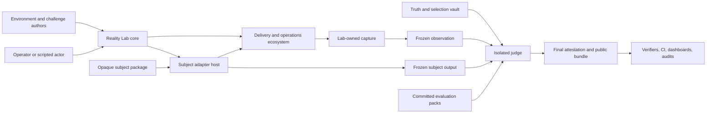
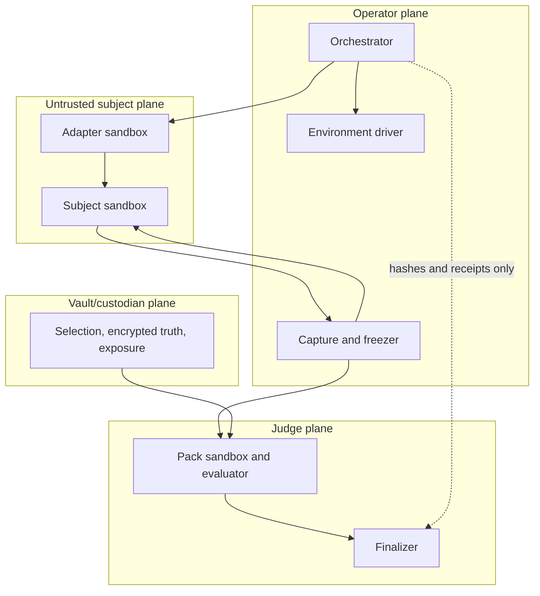
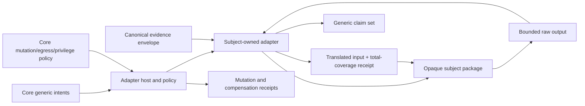
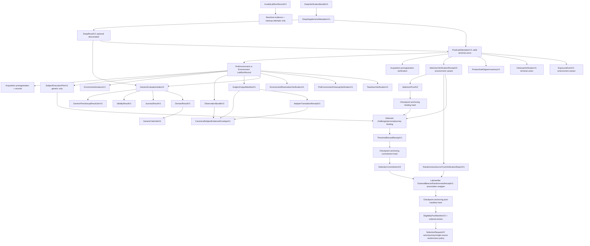
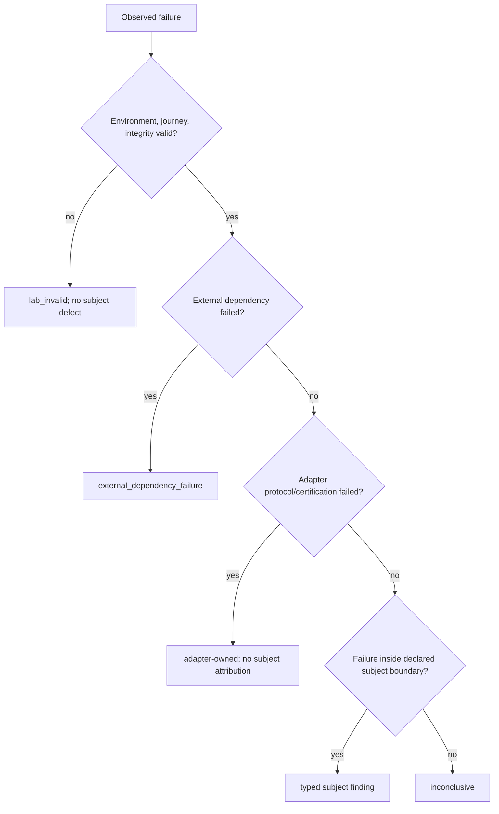
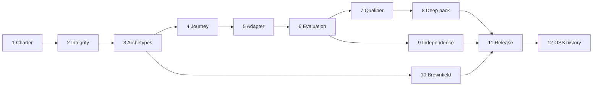

# External Reality Lab V2 — Product-Independent Detailed Design

**Status:** Proposed for architecture, security, and independent evaluation approval  
**Revision:** 2.0.0-draft.11  
**Date:** 2026-07-23  
**Authors/approvers:** Principal architect (author); Lab Core Owner, Security/Privacy Reviewer, Environment/Challenge Governor, Adapter Reviewer, Evaluation Reviewer, Qualiber Owner, and independent QE reviewer (required approvers)

Normative **MUST**, **MUST NOT**, **SHOULD**, and **MAY** use RFC 2119 meanings. “V2” means the scope in this document, not arbitrary-product test infrastructure.

## 1. Document control, authority, source snapshots and revision history

### 1.1 Authority and scope

This is the implementation-grade design for a domain-bounded, product-independent Reality Lab. It supersedes revision 0.9.8 only after approval; until then the documents coexist for review. It authorizes no implementation by itself.

Source precedence is:

1. the independent-Lab mandate and honesty constraints in `external-reality-lab-design-v2-prompt.md`;
2. accepted `ADR-ERL2-*` decisions and generally applicable security/integrity requirements;
3. the cryptographic, artifact, cutoff, reveal, and trust invariants explicitly preserved from revision 0.9.8;
4. `external-reality-lab-design.md` revision 0.9.8 as the design to migrate;
5. the implementation and build plans as historical delivery direction; and
6. Qualiber evidence only for the Qualiber adapter, deep pack, migration, and consumer integration.

The old plans conflict with V2 where they define ERL’s mission, vocabulary, completion, interfaces, case admission, or release policy around Qualiber. Those directions are replaced, not reconciled. Absolute authoring paths are evidence locations only; runtime contracts use `${LAB_WORKSPACE}`, `${LAB_RUN_ROOT}`, `${LAB_CACHE_ROOT}`, `${LAB_PACKAGE_ROOT}`, and repository-relative paths.

### 1.2 Required inputs and authority relationship

| Input | Snapshot | Authority in V2 |
|---|---|---|
| `external-reality-lab-design.md` | revision 0.9.8, 2026-07-21; SHA-256 `2e74ab1cce131a8492f858b4cce9499ebc11756833bec1b800e72dc752287928` | Detailed integrity/trust design to migrate; product-centered mission is non-authoritative |
| `external-reality-lab-implementation-plan.md` | draft, 2026-07-22; source design 0.9.8; SHA-256 `58cc4e9f53574f8f961c50a3ef3653ace7340d028fe3d255e3938aef3a669963` | Subordinate historical sequencing/estimate |
| `external-reality-lab-build-plan.md` | proposed, 2026-07-20; SHA-256 `08ce0e28db62827e4392fb4166fcec2c54bc980598c268862fbb94e5a421a68b` | Original product/delivery direction; product-centered completion criteria replaced |
| `external-reality-lab-design-doc-prompt.md` | no stated revision/date; filesystem snapshot 2026-07-20; SHA-256 `94331e6afaf76f6219bed167fc8cd71af8102ca5bba7865b650412051907efc4` | Historical authoring requirements; subordinate to this V2 mandate |

All four inputs were available and read completely. No source-dependent claim is blocked by a missing input.

### 1.3 Canonical Qualiber evidence snapshot

On 2026-07-22 the sole canonical checkout was on branch `preprod`, `HEAD` `3817b050971b7cd378173143430f8febff74c44d`, tracking `origin/preprod`. It had no reported tracked modifications. Untracked paths were `.claude/`; `docs/process/critical-review-2026-07-20-remediation-tracker.LOCAL-BACKUP-2026-07-21.md`; `docs/process/critical-review-ws2-implementation-prompt.md`; `docs/process/critical-review-ws3-implementation-prompt.md`; `docs/process/critical-review-ws4-implementation-prompt.md`; `docs/product/architecture/architecture-v2-conversion-planes-draft-1.md`; `docs/reference-customer/real-journey-run/decision-outcome-prompt.md`; and `out-phase3-overlays-qwen35-4b/`. V2 treats it as dirty and read-only: no run may execute it or derive an artifact from its worktree. No second checkout was used.

Current adapter/deep-pack evidence at that snapshot:

- Qualiber separates customer `validate` from product-plane commands and reserves customer exit 20 for an earned, signed, human-approved blocking rule (Qualiber:`README.md`:11–12, 42–47, 83–85).
- deterministic rules decide; AI remains advisory (Qualiber:`docs/architecture/decisions/adr-001-ai-deterministic-boundary.md`:40–72); earned blocking is per-rule, reversible, and human-approved (Qualiber:`docs/architecture/decisions/adr-002-rule-promotion-blocking-policy.md`:42–75).
- Scenario Lab says unsupported rules are inconclusive and customer external validity cannot be measured pre-customer (Qualiber:`scenario-lab/docs/scenario-lab-strategy.md`:56, 137–157).
- the current telemetrytest adapter is black-box but intentionally synthesizes high-confidence associations and tests validation reasoning rather than network capture; this is Qualiber adapter evidence, not a generic Lab contract (Qualiber:`scenario-lab/src/adapters/telemetrytestAdapter.ts`:1–26).
- connector profiles carry credential references, not values (Qualiber:`src/phase3/connectors/registry.ts`:19); the warehouse port exposes no arbitrary SQL and the PostgreSQL adapter begins a read-only transaction (Qualiber:`src/phase3/connectors/transport/warehouse.ts`:24–62; Qualiber:`src/phase3/connectors/adapters/postgres-warehouse-reader.ts`:246–262).

### 1.4 Upstream verification register

Verified 2026-07-22 from official primary sources: OpenTelemetry Demo remains a production-lite microservice application deployable locally with Docker; uses traces, metrics, logs, an OpenTelemetry Collector, Locust, OpenFeature/flagd, Jaeger, Prometheus, Grafana, and OpenSearch; and documents `paymentServiceUnreachable`, `kafkaQueueProblems`, and `recommendationServiceCacheFailure`. The upstream docs had changes through July 2026. Therefore V2 retains revision 0.9.8’s pinned 2.2.0/commit proposal only as an unqualified candidate: a substrate lock MUST record archive and per-platform image digests and re-run admission before use. Official sources: <https://opentelemetry.io/docs/demo/>, <https://opentelemetry.io/docs/demo/telemetry-features/>, <https://opentelemetry.io/docs/demo/feature-flags/>, and <https://github.com/open-telemetry/opentelemetry-demo>.

### 1.5 Change control and revision history

Trust, identity, canonical bytes, reveal order, mandatory graph, validity gates, or hard-safety formula changes require an accepted ADR and new golden fixtures. Breaking contract changes require a new major. Truth changes create superseding artifacts and exposure review. Editorial changes require two reviewers.

| Revision | Date | Change |
|---|---|---|
| 2.0.0-draft.11 | 2026-07-23 | Clarification (ADR-ERL2-013 accepted): the `verify_package` pre-environment terminal is the terminal of a **failed or unsupported** package verification, reached through the generic terminal step-outcome route. A successful verification freezes `SubjectPackageManifestV1` and has exactly one authorized continuation, `challenge_preregistered`; §12's forbidden list and §16.2's `PreEnvironmentSubjectOutputManifestV1` state this explicitly rather than leaving it implied by the absence of a state-diagram edge |
| 2.0.0-draft.10 | 2026-07-23 | Implementation remediation (CONFLICT-ERL2-001, ADR-ERL2-012 accepted): trust policy, signer inventory, trust verification report and lifecycle event move from the retained byte-compatible list to explicit V2 majors, because V2 changed the signer roles, terminal variants and schema identities they must describe |
| 2.0.0-draft.9 | 2026-07-22 | Review remediation: Lab-owned external-beacon association wrapper and fail-closed threshold-VRF ADR gate |
| 2.0.0-draft.8 | 2026-07-22 | Review remediation: single pre-pool randomness source binding, discriminated beacon/threshold-VRF evidence, and verifier-pinned source authorization |
| 2.0.0-draft.7 | 2026-07-22 | Review remediation: independently sourced post-pool randomness, acyclic selection timestamps, threshold reveal custody, and explicit non-collusion claim limits |
| 2.0.0-draft.6 | 2026-07-22 | Review remediation: blind actor-policy binding, explicit V2 selection-chain contracts, uniform padded pool entries, and receipt-enforced emergency actions |
| 2.0.0-draft.5 | 2026-07-22 | Review remediation: journey-family blind selection, post-restoration-failure emergency cleanup, discriminated invalid terminal reasons/phases, and offline invalid-record verification |
| 2.0.0-draft.4 | 2026-07-22 | Review remediation: invalid terminal run record, non-blind replay constraint, terminal-applicable cleanup requirement, validity-status routing, and verifier-pinned deep/customer trust heads |
| 2.0.0-draft.3 | 2026-07-22 | Review remediation: pre-selection package identity, phase-specific adapter requests, early-terminal variants, result join barrier, replay/live comparison split, verifier-derived graph closure, customer verification bundle, and V2 selection-proof reference |
| 2.0.0-draft.2 | 2026-07-22 | Review remediation: oracle-safe journey split, measured acquisition, complete generic step lifecycle, deep descendant isolation, explicit V2 schemas, T4 evidence authority, ownership union, canonical cross-subject envelope, and revised schedule |
| 2.0.0-draft.1 | 2026-07-22 | Independent-core redesign; generic journey, subject adapter, evaluation packs, independence proof, and 0.9.8 migration |
| 0.9.8 | 2026-07-21 | Source design: finalizer-only public bundle and mandatory-graph signer inventory |

## 2. Executive summary

The Lab independently constructs, operates, perturbs, and observes realistic software-delivery and production-operations ecosystems. A compatible product participates as an opaque **subject** through a versioned adapter. The core does not know product feature names, internal architecture, scoring rules, output schemas, release authority, or supported evidence classes.

V2 is bounded to products that consume software-delivery, operational, or organizational evidence and produce findings, diagnoses, hypotheses, recommendations, actions, or decisions. This gives the Lab a coherent shared object model—ecosystems, evidence, time, claims, journeys, operational outcomes, and safety—without claiming to evaluate arbitrary databases, compilers, creative tools, end-user applications, physical devices, or general-purpose agents.

Four ownership planes prevent semantic coupling:

- **Lab core:** environment/journey orchestration, evidence, immutable lifecycle, truth isolation, run validity, generic measurement, attestation, and verification.
- **Subject adapter:** package validation, installation/configuration translation, bounded interaction, output collection, generic projection, compensation, and residue reporting.
- **Evaluation pack:** precommitted domain or product semantic assertions that cannot alter selection, evidence, truth, run validity, or generic thresholds.
- **Qualiber deep pack:** optional Qualiber-only authority, determinism, schema, regression, security, and compatibility assertions.

Black-box invocation alone does not prove independence. V2 earns an architectural-independence claim only when an identical released core digest and admitted challenge run against Qualiber, limited and misleading reference subjects, and an independently selected non-Qualiber OSS subject without a named-subject core branch.

V2 preserves revision 0.9.8’s trust separation, JCS/SHA-256 identities, Ed25519 signatures, independent timestamps, immutable freeze, pre-seed selection, post-output reveal, encrypted truth, mandatory artifact graph, append-only recovery, zero-residue verification, and dual trust verdicts. It replaces Qualiber-specific invocation, vocabulary, completion, evidence projections, release policy, and importer dependencies.

The design never claims “bias-free.” It measures and mitigates authoring, admission, operator, adapter, evaluator, and survivorship bias, records residual bias, and limits simulated/OSS claims to T1–T3. Only real customer correction followed by measured outcome can contribute T4 evidence.

## 3. V2 problem statement and domain boundary

Revision 0.9.8 had a strong experiment-integrity kernel but made Qualiber the solver definition, input tuple, CLI mode, scenario compatibility filter, projector, release consumer, and V1 completion condition. That coupling can make an opaque execution look independent while the benchmark still rewards one product’s worldview.

V2 admits ecosystems and challenges because they are representative of the declared software-delivery/operations domain, not because a subject accepts their evidence. Unsupported capability is retained as a result. Environment truth is derived from control-plane receipts, independently observed behavior, source-grounded public evidence, or later outcomes—never a candidate’s output or a known-good candidate alone.

Outside V2: arbitrary semantic evaluation, production penetration testing, destructive chaos on customer systems, employee performance scoring, regulated decision automation, autonomous remediation without separately granted authority, and T4 claims without customer evidence. V2 may export recommendations but grants no customer or product release authority.

## 4. Goals, non-goals, requirements and acceptance criteria

### 4.1 Goals and non-goals

| ID | Normative goal | Verification |
|---|---|---|
| ERL2-G-001 | Run realistic software-delivery/operations challenges against opaque subjects without core product knowledge. | ERL2-AC-010 |
| ERL2-G-002 | Separate trustworthy experiment validity from subject journey and semantic outcomes. | failure decision table |
| ERL2-G-003 | Preserve independently verifiable blind evidence and final-only attestation. | offline golden |
| ERL2-G-004 | Measure bias and realism limits without claiming elimination. | bias audit |
| ERL2-G-005 | Make Qualiber the first deep subject, not the Lab’s authority. | ERL2-AC-008/009 |

Non-goals are universal-product support, production customer authorization, prose judging, product-owned case admission, and a single leaderboard score.

### 4.2 Functional and integrity requirements

| ID | Requirement | Pri | Proof |
|---|---|---:|---|
| ERL2-FR-001 | Every accepted invocation MUST yield exactly one `LabRunRecordV1` terminal variant: valid pre-environment, valid environment-complete, or invalid. Invalid runs MUST retain only available evidence and MUST NOT produce a final attestation or public bundle. | P0 | CLI-ALL/INVALID-TERMINAL |
| ERL2-FR-002 | Archetype and challenge admission MUST be independent of candidate output/capability. | P0 | ADMISSION-INDEPENDENCE |
| ERL2-FR-003 | Acquisition source/policy and adapter MUST be preregistered before acquisition; acquired bytes MUST then freeze and verify into a package manifest; only afterward may `SelectionRequestV2` bind that exact package plus the complete archetype/challenge eligibility identity before randomness. | P0 | PRESEED/ACQUISITION-BINDING |
| ERL2-FR-004 | Acquisition through uninstall MUST be observable journey stages. | P0 | JOURNEY-CAPTURE |
| ERL2-FR-005 | Unsupported inputs MUST remain admitted and produce `subject_unsupported`. | P0 | UNSUPPORTED-HONESTY |
| ERL2-FR-006 | Adapters MUST disclose every external mutation and compensation. | P0 | ADAPTER-CERT |
| ERL2-FR-007 | Observation and output MUST freeze before reveal; post-reveal subject execution is forbidden. | P0 | REVEAL-REFUSAL |
| ERL2-FR-008 | Evaluation MUST produce four distinct result planes and no scalar aggregate. | P0 | EVAL-GOLDEN |
| ERL2-FR-009 | Evaluation packs MUST be precommitted and unable to modify validity or generic thresholds. | P0 | PACK-SANDBOX |
| ERL2-FR-010 | Final attestation MUST follow terminal-stage-applicable cleanup: verified pre-environment cleanup for acquisition/package terminals, or verified restoration, applicable uninstall, teardown, exposure, and lifecycle closure for environment terminals. | P0 | FINAL-ONLY |
| ERL2-FR-011 | Public verification MUST work offline from a closed neutral bundle. | P0 | OFFLINE-VERIFY |
| ERL2-FR-012 | Human/agent assistance MUST be event-recorded; narration MUST NOT become truth. | P0 | ASSISTANCE-REPLAY |
| ERL2-FR-013 | A valid setup failure MAY finalize journey findings without functional scoring or semantic truth reveal. | P0 | SETUP-FINALIZE |
| ERL2-FR-014 | Evidence consumer integrations MUST be outside core. | P0 | DEP-GRAPH |
| ERL2-FR-015 | The adapter MUST receive only `SubjectVisibleJourneyStepV1`; judge expectations MUST remain encrypted and commitment-bound until the permitted reveal transition. | P0 | JOURNEY-ORACLE-CANARY |
| ERL2-FR-016 | Replay comparison MUST use one byte-identical subject-visible envelope across subjects; live ecosystems MUST retain distinct raw envelopes and independently verify semantic equivalence; every adapter translation in either mode MUST account for every entry as mapped, lossily mapped, or unsupported. | P0 | CANONICAL-EVIDENCE/COMPARISON-MODE |
| ERL2-FR-017 | Optional deep evaluation MUST be a descendant of frozen generic results and MUST NOT enter selection randomness, the generic execution plan, observation, subject output, or generic result identities. | P0 | DEEP-ANCESTRY |
| ERL2-FR-018 | Acquisition, package verification, and planned journey execution MUST use distinct closed request schemas whose required ancestors already exist at the request phase. | P0 | REQUEST-ANCESTRY |
| ERL2-FR-019 | Early terminals MUST use pre-environment cleanup, validity, domain-not-applicable, attestation, and bundle variants that forbid nonexistent environment artifacts. | P0 | EARLY-TERMINAL-CLOSURE |
| ERL2-FR-020 | Offline verification MUST independently derive the exact mandatory artifact closure from preregistration, selected commitments, lifecycle events, terminal stage, reveals, results, and cleanup variant; producer-supplied arrays are not authoritative. | P0 | GRAPH-CLOSURE |
| ERL2-FR-021 | Comparison policy MUST distinguish byte-identical replay from semantically equivalent live ecosystems; replay comparison is non-blind development verification and MUST be rejected for held-out/blind tiers; only replay equality may satisfy the byte-identity architecture proof. | P1 | COMPARISON-MODE |
| ERL2-FR-022 | A contextual T4 attestation MUST be emitted only inside a closed `CustomerVerificationBundleV1` with authorized signer roles, trust/current-head proof, timestamps, disclosure mode, and independently derived closure. | P1 | CUSTOMER-BUNDLE |
| ERL2-FR-023 | Deep and customer verifiers MUST obtain root and current trust head from verifier-controlled locally pinned configuration; bundle-supplied heads/checkpoints and signer inventories are evidence to validate, never trust anchors. | P1 | EXTERNAL-TRUST-PIN |
| ERL2-FR-024 | A blind-capable selection request MUST bind only a journey-family policy/root; every eligible entry MUST separately hide and commit to its exact challenge, journey, and ordered step commitments, which become available only after the selection commitment freezes and a later checkpoint anchors it. | P0 | BLIND-JOURNEY-FAMILY |
| ERL2-FR-025 | Restoration or teardown failure MUST enter bounded emergency cleanup from the actual resource frontier, attempt every independently safe containment/destruction action, freeze each outcome, and only then freeze the invalid run record. | P0 | EMERGENCY-CLEANUP |
| ERL2-FR-026 | Invalid terminal records MUST use discriminated phase and reason unions so cancellation and journey-stage failures preserve their actual evidence without fabricating findings. | P0 | INVALID-REASON-PHASE |
| ERL2-FR-027 | A read-only offline CLI MUST independently verify an `InvalidLabRunRecordV1`, lifecycle chain, reached-evidence closure, terminal reason, and cleanup result without requiring or accepting a public attestation bundle. | P1 | VERIFY-INVALID-RECORD |
| ERL2-FR-028 | Blind-capable requests MUST bind a family-level actor policy, not an exact persona script; each entry MUST hide and commit its exact persona script, which may enter the execution plan only after the selected binding opens. | P0 | BLIND-ACTOR-POLICY |
| ERL2-FR-029 | The V2 selection contracts MUST be closed schemas that prove the exact request→ordered pool→pool checkpoint→independent randomness receipt→source-trust verification→opaque commitment→commitment checkpoint→threshold opening→selected binding→binding checkpoint→proof→verification-receipt chain. | P0 | SELECTION-CHAIN-CLOSURE |
| ERL2-FR-030 | All selector-visible pool-entry metadata MUST satisfy one fixed-size padded profile; challenge-correlated recipient, policy, exposure, length, path-shape, and other metadata MUST remain uniform or encrypted until selected opening. | P1 | POOL-METADATA-UNIFORMITY |
| ERL2-FR-031 | Every succeeded or failed emergency action MUST carry an attempt receipt; only an independently unsafe action may be skipped, with a required reason and no receipt. | P1 | EMERGENCY-ACTION-EVIDENCE |
| ERL2-FR-032 | The ordered pool MUST freeze and receive an independent timestamp checkpoint before the one policy-bound external beacon’s first eligible authenticated round is associated with that pool by a signed Lab/verifier wrapper; selection MUST derive deterministically from that round output. | P0 | INDEPENDENT-RANDOMNESS |
| ERL2-FR-033 | Selection existence/order proofs MUST be acyclic: artifact core/signature, then checkpoint anchoring that artifact hash, then the next artifact; no artifact may contain the checkpoint intended to prove its own existence. | P0 | ACYCLIC-SELECTION-TIME |
| ERL2-FR-034 | Blind selection MUST declare its non-collusion assumptions and enforce separate operators, threshold reveal custody, independently sourced randomness and append-only access/decryption logs; claims MUST disclose residual collusion risk. | P1 | SELECTION-NON-COLLUSION |
| ERL2-FR-035 | A randomness policy MUST bind exactly one source before pool construction, and the immutable source identity MUST enter the pool root, source-request binding, receipt, proof, and verification receipt; alternate or adaptive source selection is forbidden. | P0 | SINGLE-RANDOMNESS-SOURCE |
| ERL2-FR-036 | The active randomness policy/receipt contract MUST be the closed external-beacon variant; the threshold-VRF identifier is a non-admissible reservation marker until ADR-ERL2-011 selects an audited construction and introduces activated major-version contracts. | P1 | RANDOMNESS-VARIANT-CLOSURE |
| ERL2-FR-037 | Randomness evidence MUST validate against verifier-controlled, policy-authorized source trust configuration; wrapper- or proof-supplied keys MUST NOT establish their own authority. | P1 | RANDOMNESS-SOURCE-TRUST |
| ERL2-FR-038 | `ExternalBeaconRandomnessReceiptV1` MUST be a Lab/verifier-signed wrapper associating the authenticated first eligible beacon round/output with the checkpointed ERL pool; it MUST NOT claim that the beacon signed or received the ERL-specific source-request binding. | P1 | BEACON-WRAPPER-OWNERSHIP |
| ERL2-FR-039 | Threshold VRF MUST remain disabled and non-emittable until ADR-ERL2-011 pins and audits DKG, share verification, uniqueness proof, transcript format, participant replacement, key rotation, and compromise recovery. | P1 | THRESHOLD-VRF-ACTIVATION-GATE |

| ID | Non-functional/security/integrity requirement | Proof |
|---|---|---|
| ERL2-NFR-001 | JCS/hash/evaluation bytes match on Node 22 macOS arm64 and Linux amd64. | CROSS-PLATFORM-GOLDEN |
| ERL2-NFR-002 | Validators cap input per contract and diagnostics at 100 problems/16 KiB. | VALIDATOR-FUZZ |
| ERL2-NFR-003 | Crash recovery duplicates no mutation and permits no post-reveal execution. | CRASH-MATRIX |
| ERL2-NFR-004 | Reference clean run targets 45 minutes; brownfield profiles declare separate budgets. | PERF-E2E |
| ERL2-SEC-001 | Subject receives no truth, future evidence, fault controls, judge state, host root/home, Docker socket, vault keys, or unrestricted egress. | MOUNT-NET-NEG |
| ERL2-SEC-002 | Package, adapter, and pack artifacts MUST be immutable, provenance-bound, scanned, and digest-pinned. | SUPPLY-LOCK |
| ERL2-SEC-003 | Privilege MUST be brokered as a closed capability with audit receipt; never general host authority. | PRIV-BROKER |
| ERL2-SEC-004 | Paths MUST be root-contained regular files; diagnostics are bounded and redacted. | PATH-FUZZ/SECRET-CANARY |
| ERL2-SEC-005 | Tenant, subject, and run resources MUST be isolated and leave zero proven residue. | TWO-TENANT/RESIDUE |
| ERL2-INT-001 | Truth MUST NOT derive solely from any subject output. | ORACLE-INDEPENDENCE |
| ERL2-INT-002 | Clean, brownfield, partial, inconsistent, restricted, skewed, degraded, multi-tenant, upgrade, and dirty-residue archetypes MUST be representable. | ARCHETYPE-MATRIX |
| ERL2-INT-003 | Same admitted challenge remains present for unsupported subjects. | CROSS-SUBJECT |
| ERL2-INT-004 | Pack and adapter reviewers MUST be distinct from truth admission for held-out runs. | GOVERNANCE |
| ERL2-OPS-001 | External mutations MUST be idempotent or compensated and reconcile after crash. | COMPENSATION |
| ERL2-OPS-002 | Limits MUST truncate explicitly or fail boundedly, never silently. | LIMIT-MATRIX |
| ERL2-OPS-003 | Lab, dependency, adapter, subject, and evaluator failure domains MUST be mechanically distinct. | FAILURE-FIXTURES |

### 4.3 Top-level acceptance criteria

| ID | Acceptance criterion and exact proof |
|---|---|
| ERL2-AC-001 | Core purity: AST/dependency/lockfile/bundle/string/CLI/schema scan finds no named Qualiber branch, import, path, exit code, or schema assumption; seeded forbidden fixtures prove scanner sensitivity. |
| ERL2-AC-002 | No-op lifecycle: generic fake subject completes acquisition and every later immutable stage, produces a closed V2 public bundle, and verifies offline in a fresh process. |
| ERL2-AC-003 | Setup finding: valid baseline plus certified adapter plus deliberately broken installer yields `subject_installation_failure`; control installer succeeds; no `lab_invalid`. A separate unreachable acquisition source with healthy Lab networking yields `subject_acquisition_failure`. |
| ERL2-AC-004 | Lab failure separation: broken provisioning/baseline yields `lab_invalid`, no subject finding, no functional score, and no final attestation. |
| ERL2-AC-005 | Unsupported honesty: limited subject receives the admitted challenge, records unsupported evidence/capability and `subject_unsupported`, and the retained case/pool are unchanged. |
| ERL2-AC-006 | Status quo: clean plus at least three independently frozen constrained/brownfield archetypes execute with repeatable disorder proofs. |
| ERL2-AC-007 | Functional discrimination: correct, limited, always-inconclusive, partially correct, and misleading subjects produce the precommitted distinct metric/finding vectors. |
| ERL2-AC-008 | Qualiber generic run: immutable Qualiber package completes a generic journey only through its certified adapter; core digest and source remain unchanged. |
| ERL2-AC-009 | Qualiber deep run: with and without a precommitted deep descendant, execution plan, observation, canonical envelope, subject output, all generic results/index, base final attestation, and base public-bundle hashes are byte-identical; only deep commitment/result and separate deep supplemental attestation/bundle exist in the deep run. |
| ERL2-AC-010 | Cross-subject replay run: same core digest, archetype, challenge, truth, actor script, generic policies/domain pack, and one byte-identical `ReplayCanonicalEvidenceEnvelopeV1` run against all §19 subjects; only acquisition/package/adapter/config and complete translation receipts differ. A live-ecosystem run is reported separately under semantic-equivalence rules and cannot satisfy this byte-identity criterion. |
| ERL2-AC-011 | Journey capture: golden and live records retain acquisition source and attempts, acquired digest, package verification, later attempts, interventions, credential scopes, documentation steps, milestone times, and residue while secret canaries remain absent. |
| ERL2-AC-012 | Reveal isolation: adapter requests contain no judge expectation fields; subject/adapter truth, success-criteria, future-evidence, control-plane, and post-freeze-call canaries are denied before and after output freeze as applicable. |
| ERL2-AC-013 | Tamper resistance: independent verifier rejects byte, path, order, graph, signature, trust, timestamp, commitment, bundle-member, and current-head mutations. |
| ERL2-AC-014 | Crash recovery: kill points before/after every side effect and marker resume, compensate, or invalidate without duplicate mutation or post-reveal execution. |
| ERL2-AC-015 | Claim honesty: report/schema tests require T1–T3 labels and reject any simulated/OSS customer-external-validity statement. |

Added criteria:

- **ERL2-AC-016 Pack isolation:** a malicious pack attempting filesystem/network/process access or validity mutation is refused.
- **ERL2-AC-017 Privilege broker:** a subject requesting undeclared privilege is refused; approved narrow operations are receipted and reversible.
- **ERL2-AC-018 Consumer independence:** removing every consumer integration leaves core build/tests unchanged.
- **ERL2-AC-019 Bias controls:** candidate-derived truth, post-hoc thresholds, capability-filtered pools, and operator hint leakage each fail admission or validity.
- **ERL2-AC-020 Deep-pack monotonicity:** adding/removing a deep pack changes only its separately committed descendant result and deep supplemental attestation/bundle; every generic ancestor and base terminal hash remains identical.
- **ERL2-AC-021 Request ancestry:** acquisition, package verification, and post-plan adapter requests validate with no forward reference and reject a later-phase field injected into an earlier request.
- **ERL2-AC-022 Early terminal closure:** acquisition and package-verification failures produce the pre-environment cleanup/validity/domain/attestation/bundle variants; schemas reject environment, observation, restoration, teardown, selection, or synthetic no-op fields that cannot exist.
- **ERL2-AC-023 Mandatory closure:** deleting, duplicating, reordering, or adding a selected step outcome, applicable reveal, result, cleanup member, or lifecycle event is rejected even when every supplied hash and signature is internally valid.
- **ERL2-AC-024 Comparison modes:** replay comparison requires one byte-identical envelope and `requested_tier="development"`; held-out/blind requests carrying replay mode are rejected. Live comparison permits volatile source differences only when the independently verified semantic-equivalence profile passes and cannot support the byte-identity claim.
- **ERL2-AC-025 Customer bundle:** T4 emission without the required roles, current trust head, timestamp chain, closure report, or correct public/confidential disclosure variant is rejected.
- **ERL2-AC-026 Invalid terminal:** provisioning, baseline, reveal, evaluator, pre-environment cleanup, restoration, validity and teardown failures each freeze exactly one `InvalidLabRunRecordV1` containing only reached evidence and cleanup attempts; no final attestation/public/deep/customer bundle can validate from it.
- **ERL2-AC-027 External trust pin:** deep/customer verification rejects a self-consistent bundle whose supplied head or signer inventory differs from verifier-controlled locally pinned root/current-head configuration.
- **ERL2-AC-028 Blind journey family:** held-out/blind requests contain a journey-family policy/root and no exact journey or step commitment; pool entries use hiding commitments, and only the selected entry opens its exact manifest/journey/ordered steps after a checkpoint anchors the selection commitment. A pre-selection exact commitment or mismatched opening is rejected.
- **ERL2-AC-029 Emergency cleanup:** injected restoration and teardown failures enter emergency cleanup, attempt every independently safe containment/destruction action from the resource frontier (recording unsafe skips), freeze the result, and only then freeze the invalid record; a direct invalid-record transition is rejected.
- **ERL2-AC-030 Invalid reason and phase:** cancellation validates with cancellation evidence and no fabricated finding, while failures in every environment journey intent retain the failed intent, exact step commitment, and lifecycle event; mismatched discriminants fail schema or closure verification.
- **ERL2-AC-031 Invalid record verification:** `erl2 verify-record` verifies a retained invalid record and lifecycle offline, rejects missing/reordered/reached-evidence or emergency-cleanup members, rejects attestation/bundle inputs, and emits a deterministic mandatory-closure report.
- **ERL2-AC-032 Blind actor policy:** blind requests contain only the family actor-policy hash; each pool entry hides its exact persona script, the selected binding opens it after commitment, and the execution plan matches it. Exact pre-selection scripts and actor-policy mismatches are rejected.
- **ERL2-AC-033 Selection chain closure:** field-level V2 fixtures prove the pool manifest binds the exact request and ordered entries, an independent receipt supplies the first eligible post-checkpoint randomness, the commitment binds that receipt plus the pool root and selected opaque handle, and proof/receipt verify every acyclic checkpoint, threshold opening, selected binding, and family-policy edge.
- **ERL2-AC-034 Pool metadata uniformity:** two challenges with deliberately distinguishable script, exposure, recipient and payload sizes produce selector-visible entries identical in all profile-controlled lengths/metadata; any unpadded length, recipient/policy variance, exposed epoch or path-shape variance is rejected.
- **ERL2-AC-035 Emergency action evidence:** succeeded/failed emergency actions without receipts, unsafe skips without reasons, safe skips, and skipped actions carrying receipts all fail schema or closure verification.
- **ERL2-AC-036 Independent randomness:** after a checkpointed ordered pool, an approved independent source issues exactly one pool-bound receipt; the verifier reproduces the selected index. Selector-generated, pre-pool, replayed, retried, wrong-round, wrong-root or source-policy-invalid randomness is rejected.
- **ERL2-AC-037 Acyclic selection time:** commitment and selected-binding cores contain no self-anchoring checkpoint hashes; later checkpoints independently anchor their hashes, and proof/receipt verify pool→randomness→source-trust verification→commitment→commitment-checkpoint→opening→binding→binding-checkpoint ordering. Cyclic, missing or wrong-target checkpoints fail.
- **ERL2-AC-038 Non-collusion controls:** role-conflict fixtures, insufficient reveal shares, unlogged decryption/access, governor/selector/reveal key reuse and randomness-source overlap are rejected; reports retain an explicit residual collusion limitation even when controls pass.
- **ERL2-AC-039 Single randomness source:** the policy, pool, fixed source-request binding, receipt, proof and verification receipt agree on one pre-pool `source_id`; multiple-source policies, source substitution, parallel observation, fallback, and a binding that omits the source are rejected.
- **ERL2-AC-040 Randomness variant closure:** external-beacon fixtures reject threshold/participant/transcript fields; `SelectionRandomnessPolicyV1` and `SelectionRandomnessReceiptV1` admit only the beacon contracts, and any threshold-VRF selection policy or receipt is rejected as inactive.
- **ERL2-AC-041 Randomness source trust:** beacon round proofs verify under verifier-controlled locally pinned source authorization; wrapper-only keys, unknown sources, stale registries, and policy/local-config disagreement are rejected.
- **ERL2-AC-042 Beacon wrapper ownership:** the beacon proof authenticates only the beacon’s canonical round/output, while the separately signed Lab/verifier wrapper binds that evidence to the ERL request/policy/source/pool/checkpoint; a fixture claiming the beacon signed the ERL binding is rejected.
- **ERL2-AC-043 Threshold-VRF activation gate:** every threshold-VRF policy/receipt or selection attempt fails with `THRESHOLD_VRF_NOT_ACTIVATED` until accepted ADR-ERL2-011 evidence and newly activated major schemas exist; the draft suite contains no successful threshold-VRF golden.

## 5. Architectural principles and decision record

1. Generic mission precedes generic interface.
2. Validity is Lab-owned; semantic quality is pack-owned; neither can impersonate the other.
3. Unsupported is data, not an eligibility escape hatch.
4. Freeze before reveal; finalize after cleanup.
5. Every abstraction has two uses: the environment driver supports fake and Compose; subject adapter supports reference and Qualiber; evaluation pack supports operations-domain and Qualiber deep packs; consumer API supports CLI verifier and optional product importer.
6. Clean controls prove experimental control; brownfield archetypes represent the status quo.
7. Human action is evidence, not oracle truth.

| ID | Decision | Alternatives / consequence | ADR |
|---|---|---|---|
| ERL2-D-001 | Four packages/ownership planes: core, adapters, packs, consumers | monolith rejected; enables dependency tests | ADR-ERL2-001 |
| ERL2-D-002 | Closed composition contracts; no inheritance hierarchy | extensible base objects rejected; simpler hashing | ADR-ERL2-002 |
| ERL2-D-003 | Preserve RFC 8785 JCS, domain-separated SHA-256, Ed25519 and age-X25519; add threshold-X25519 envelope custody for blind pool payloads | raw JSON/shared/single-custodian reveal secrets rejected | ADR-ERL2-003/011 |
| ERL2-D-004 | Four result planes, no scalar | leaderboard rejected; prevents compensation of safety failures | ADR-ERL2-004 |
| ERL2-D-005 | Core-owned adapter host with capability/privilege broker | adapter arbitrary scripts rejected | ADR-ERL2-005 |
| ERL2-D-006 | Same-challenge semantic equivalence uses generic interaction intents, not identical argv/UI | identical interface impossible | ADR-ERL2-006 |
| ERL2-D-007 | Qualiber importer is optional consumer integration | core prerequisite removed | no, unless Qualiber adopts it |
| ERL2-D-008 | Exact OSS subject selected by neutral procedure before Slice 9 | design-time convenience choice rejected | ADR-ERL2-007 |
| ERL2-D-009 | OpenTelemetry Demo may be first substrate but environment contracts are evidence-class neutral | telemetry-only substrate model rejected | ADR-ERL2-008 |
| ERL2-D-010 | Byte-compatible timestamp/trust contracts retain V1; the changed closed bundle is `PublicVerificationBundleV2` and V1 has a separate verifier | prevents schema-member substitution while preserving retained verification | ADR-ERL2-003 |

## 6. System context and trust boundaries





Boundary rules:

| Boundary | Data/authentication | Failure/audit |
|---|---|---|
| Author→core | signed archetype, journey, challenge and policy; author role | invalid signature/schema blocks admission |
| Governor→pool | signed ordered hiding entries and uniform profile; governor never supplies randomness | freeze plus checkpoint before randomness request; append-only admission log |
| Beacon→Lab/verifier→selector | beacon authenticates only native first-eligible round/output; Lab/verifier signs the separate ERL pool-association wrapper | verifier-pinned beacon authorization and wrapper signer; no claim beacon signed ERL binding; no alternate source/retry |
| Threshold reveal custodians→core | quorum shares only for a checkpointed selected commitment | per-share receipt and append-only access-log head; insufficient/unlogged release invalidates |
| Core→ecosystem | closed driver operations and run-scoped credentials | operation and compensation receipts |
| Core→adapter | frozen execution plan, subject-visible inputs, bounded credential handles | adapter violation invalidates or yields adapter failure, never subject defect |
| Adapter→subject | package-specific invocation inside sandbox | exact argv/env/mount/resource manifest retained |
| Subject→core | output directory and bounded diagnostics only | freeze or output-contract finding |
| Vault→judge | selected truth after output freeze; role-authorized reveal | append-only reveal record; partial failure invalidates |
| Pack→judge | data-only declarative rules or audited deterministic WASM-like module with no I/O | reproducibility and sandbox receipt |
| Final→consumer | closed public bundle | offline dual trust verdicts |

Blindness relies on an explicit organizational assumption as well as cryptography: the challenge governor does not collude with the selector, subject/operator, or a quorum of reveal custodians; the selector does not control the randomness source; and fewer than the configured reveal threshold collude before commitment. Held-out operation MUST use separate operator identities and signing/decryption keys for governor, selector, randomness source, reveal custodians and evaluator; role/key overlap fails admission. Threshold custody requires at least two independent shares and no single operator may meet the threshold. Every pool read, randomness request/receipt, share request, decryption share, selected opening and administrative vault access appends to an independently retained audit log reviewed before attestation.

These controls reduce and expose collusion but cannot cryptographically prevent a governor who knows an authored challenge from disclosing it out of band, nor prevent a sufficiently broad administrator/reveal-quorum conspiracy. Consequently every blind/held-out report MUST state: `blindness_assurance="role_separated_threshold_protocol"` and `residual_limitation="governor/selector/reveal-quorum or privileged-administrator collusion is not excluded"`. “Bias-free,” “collusion-proof,” and unconditional blindness claims are forbidden.

## 7. Repository/package ownership topology

```text
qualiber-reality-lab/
  packages/contracts/        # closed schemas and generated types
  packages/integrity/        # JCS, hashes, signatures, graph, verifier
  packages/core/             # lifecycle, drivers, capture, validity
  packages/adapter-sdk/      # protocol types and certification harness
  packages/evaluation-sdk/   # pack DSL/runtime, generic metrics
  packages/public-verifier/  # neutral offline consumer library/CLI
  adapters/reference/        # no-op, limited, misleading subjects
  adapters/qualiber/         # separately owned Qualiber adapter
  packs/operations/          # subject-neutral domain packs
  packs/qualiber-deep/       # separately owned optional deep pack
  environments/              # archetypes and substrate locks
  challenges/                # journeys, challenges, public dev truth commitments
  fixtures/ tests/ runbooks/ docs/adr/

qualiber-reality-vault/
  admission/ eligibility/ truth/*.age selection/ reveal/
  exposure/ trust/ timestamp-checkpoints/ protected-workflows/

consumer-integrations/
  qualiber-import/           # optional; may instead live in Qualiber repo
```

The core dependency DAG is `contracts ← integrity ← core`; SDKs depend on contracts, adapters/packs depend on SDKs, and core loads them only through signed manifests and protocol processes. Core source and package lock MUST NOT depend on `adapters/*`, `packs/qualiber-deep`, any named product package, or consumer integrations. An architecture test scans imports, strings, schema discriminators, bundled files, CLI help, and dependency graphs for named-subject branches.

Repository permissions: Core Owner may merge core with two reviews; environment/challenge governors admit cases; adapter owners cannot approve matching truth; evaluation reviewers cannot change core validity; vault custodians alone see held-out truth; finalizer and confidential auditor keys are distinct. Solo development uses separate OS identities/keychain ACLs and is labeled process separation, not personnel independence.

## 8. Generic component architecture

| Component | Owns/interface | Invariants and failure |
|---|---|---|
| CLI/dispatcher | `execute(Command, Context)`; JSON envelope | stable Lab exits; never product release exits |
| Admission registry | signed archetypes/challenges/packs | no candidate-output/capability-derived admission |
| Blind selector | request/pool/commit/proof | pre-seed binding, unique units, exposure epoch |
| Environment resolver/drivers | `provision, probe, mutate, restore, destroy, inspect` | fake + Compose uses; exact receipts and compensation |
| Journey engine | executes actor-script steps | records active/elapsed time, attempts, hints, interventions |
| Privilege broker | closed declared privileged operations | no shell; one operation/target; signer receipt |
| Capture coordinator | `snapshot(SourceRequest)` | typed cutoff, explicit source state, bounded data |
| Adapter host | validates manifest; drives protocol | no truth/selection access; deadline/capability enforcement |
| Subject sandbox | opaque package | RO input, RW output, no forbidden mounts/egress |
| Artifact freezer | validate, scan, fsync, publish | same bytes idempotent; mutation refuses |
| Reveal service | verify commitments, decrypt, record | only after observation/output freeze |
| Pack runtime | deterministic projection/assertions | no I/O, clock, random, process, network, or validity APIs |
| Generic evaluator | planes 1–3 metrics/findings | frozen policies; no prose similarity |
| Deep evaluator | plane 4 only | cannot affect validity/generic bytes |
| Auditor/finalizer | mandatory graph, inventory, final signature | final only after cleanup/exposure |
| Offline verifier | public-bundle and invalid-record/lifecycle closure/trust verification | current head from verifier config; invalid records require no attestation or bundle |
| Exposure governor | append demotion/rotation | reveal/debug access immediately demotes |

All components accept injected clock, randomness, filesystem, process, and transport seams. Mutators acquire a run-state lease and compare the prior event hash. Limits are contract-declared; diagnostics cap at 16 KiB/component and are scanned before retention.

## 9. Environment archetype model

An archetype is admitted independently of subjects and separates **topology**, **normal disorder**, **challenge mutations**, and **cleanup expectations**. A concrete instance freezes resolved images, service versions, evidence sources, tenants, permissions, budgets, and random seeds.

| Archetype | Frozen disorder | Admission/control proof | V2 stage |
|---|---|---|---|
| clean-greenfield | empty isolated state, complete config | two clean controls | required |
| brownfield-config | stale/conflicting config, legacy files | seeded-state hash + independent probes | required |
| partial-instrumentation | declared missing/partial sources | collector and source health receipts | required |
| inconsistent-identifiers | aliases/collisions across tools | mapping ground truth independent of subject | required |
| incomplete-metadata | missing owner/deploy records | source-state proofs | required |
| restricted-permissions | least-privilege credentials and denied operations | credential-scope manifest | required |
| version-skew | collector/dependency/adapter skew | lock and compatibility matrix | required |
| degraded-APIs | rate limits/delay/intermittency | proxy receipts and counters | required |
| misleading-coincidence | alerts/tickets/coincident changes | independently authored decoys | required |
| multi-tenant | two tenant canaries and shared-infra hazards | isolation probes | required |
| upgrade-recovery | prior package/config, upgrade/rollback | before/after compatibility proof | required |
| dirty-residue | failed prior attempt’s safe residual state | residue seed receipt | required |

The first live substrate MAY be OpenTelemetry Demo, but archetype source kinds are open enumerations owned by the environment contract and never filtered by subject support. At least clean plus three constrained/brownfield archetypes must pass ERL2-AC-006.

## 10. Journey and challenge model

A journey is an independently authored sequence of user intents:

```text
Acquire → Verify package → Install → Configure → Authenticate → Connect
→ Discover → Exercise → Observe → Diagnose/Decide → Recover → Upgrade → Remove
```

Each logical step is split before admission into a subject-visible instruction and an encrypted judge expectation. `SubjectVisibleJourneyStepV1` declares only intent, actor persona, permitted interaction kinds, subject-visible prerequisites/input references, safe retry/compensation, and timeout. `JudgeJourneyExpectationV1` declares success observations, proof predicates, failure-attribution constraints, and the earliest reveal phase. `JourneyStepCommitmentV1` binds the visible-step core hash to the judge-expectation plaintext core hash and ciphertext file digest. The adapter can verify that it is executing the committed visible step but cannot recover the expectation.

`JourneyDefinitionV1.persona_script_hash` is challenge-specific. In blind-capable selection it is never a request field: the request binds only the family actor policy, while the exact persona script is inside the padded entry ciphertext and hiding commitment, opens with the selected journey, and becomes executable only through the verified `SubjectExecutionPlanV1`.

The exact post-plan adapter projection is `AdapterStepRequestV1`, used only after `SubjectExecutionPlanV1` exists. It contains protocol/run/operation IDs, execution-plan hash, `SubjectVisibleJourneyStepV1` artifact/core reference, an optional canonical subject-visible evidence-envelope hash and read-only mount when that phase has been reached, prior **subject-visible** interaction hashes, scoped credential handles, resource limits, and deadline. Acquisition instead receives `AcquisitionAdapterRequestV1`, and frozen-byte verification receives `PackageVerificationRequestV1`; neither may contain a plan, environment, challenge, truth, or judge reference. All three schemas contain no journey definition body, success observation, expected predicate, truth-view selector, failure category, truth commitment, or judge artifact reference. Unknown fields fail closed. A build-time schema dependency test and runtime canary place unique success-criteria tokens in every `JudgeJourneyExpectationV1`; any token in adapter request bytes, mounts, environment, diagnostics, subject output prefill, or egress invalidates the run before subject attribution.

Human- or agent-assisted steps use a signed `AssistanceEventV1`: actor kind, script version, prompt/instruction hash, visible evidence hashes, action, start/end, active time, and intervention reason. Free narration is retained as non-deterministic commentary and cannot satisfy truth, citations, or gates. Undocumented workarounds are structured mutations with before/after hashes.

Generic measurements include elapsed and active time; discovered prerequisites; package verification; configuration attempts/diffs; documentation references and ambiguity codes; credential scopes requested/granted/used; warnings/errors/retries; manual interventions; time to first valid evidence and useful result; recovery from wrong configuration; final output; and uninstall residue.

`ComparisonPolicyV1` selects one of two non-interchangeable modes. `replay_comparison` is explicitly `development_only_non_blind`: the challenge and concrete replay envelope may be fixed before development selection, the request tier MUST be `development`, and the result carries no held-out/blind claim. The same challenge across subjects then means identical `ChallengeManifestV1`, archetype definition, selected truth, observation policy, actor script, visible-step sequence, judge-expectation commitments, generic intents, and one immutable `ReplayCanonicalEvidenceEnvelopeV1`; its exact bytes, `tree_hash`, and `core_hash` MUST be identical across the architecture-independence proof. `live_ecosystem` is `blind_capable`: policy identities remain equal but each independent environment produces its own `LiveCanonicalEvidenceEnvelopeV1`; volatile timestamps, instance IDs, trace IDs, and ordering may differ, and an independently implemented `SemanticEvidenceEquivalenceReceiptV1` must prove the committed fact/invariant projection under `EvidenceEquivalenceProfileV1`. Live equivalence is realism/calibration evidence, not byte-equality evidence and cannot satisfy ERL2-AC-010. In either mode an adapter translation MUST account for every envelope entry exactly once as `mapped_exact`, `mapped_lossy`, or `unsupported`, with target artifact references and loss reasons. It may not omit an entry under “domain compatibility,” reorder a required intent, add hidden hints, or receive/change success observations.

## 11. Subject package and adapter protocol

### 11.1 Acquisition and opaque subject package

Acquisition preregistration freezes `AcquisitionPreregistrationV1`, its `AcquisitionSourceManifestV1`, the certified adapter, acquisition actor/script, acquisition and package-verification visible-step/judge commitments, limits, and trust policy before any network or store access. The source identifies a kind (`local_delivery`, `registry`, `release_api`, or `approved_repository`), a redacted locator hash, requested version/channel, authentication-reference kind, integrity/provenance policy, network profile, documentation entrypoint, acquisition limits, and optional expected digest. It contains no challenge family, eligibility pool, selected-case identity, environment profile, or truth reference. Acquisition runs as the first measured journey step and emits `SubjectAcquisitionRecordV1` with attempts, active/elapsed time, redirects, authentication prompts, bytes, errors, documentation steps, and the acquired artifact ref. Lab-owned network/store controls distinguish source failure from Lab failure.

Only after acquisition succeeds does the freezer copy the artifact into the content-addressed Lab package store. `PackageVerificationRequestV1` binds the acquisition record, frozen artifact bytes, integrity/provenance policies, and adapter but no future case identity. Package verification emits `SubjectPackageVerificationRecordV1`; a successful record creates `SubjectPackageManifestV1`. The subject is then an immutable archive, OCI image, signed native package, or directory bundle identified by exact bytes plus provenance. Source worktrees are forbidden in attesting runs. A package manifest declares required runtime, resources, interfaces, capabilities, permissions, credential-reference kinds, output limits, and supported uninstall/upgrade operations. These declarations inform environment feasibility but cannot change truth, evidence, generic thresholds, or the package-independent challenge inventory.

Only after the package manifest freezes may challenge preregistration create `SelectionRequestV2`. It binds the exact package manifest, adapter, admissible archetype set, challenge family, environment profile, eligibility policy, generic policies/domain packs, configuration intent, family-level actor policy, comparison mode, journey-selection policy/family root, one discriminated single-source randomness policy and trust-policy hash, tier, and expiry before randomness. A blind-capable request contains no exact persona script, journey, step commitment, manifest hash, or opening. Each pool entry instead carries a hiding commitment to its own exact challenge/persona/journey/ordered steps, and the selected entry opens them only after the independently randomized selection commitment freezes and receives a checkpoint. The exact persona script enters `SubjectExecutionPlanV1` from that verified opening. The acquisition preregistration’s separately named acquisition actor script governs only acquire/verify-package work common to every candidate entry and cannot constrain pool eligibility. Thus a mutable channel cannot change attesting bytes after selection, while acquisition and blind selection are measured without access to selected-case, persona, or journey identity.

### 11.2 Versioned adapter interface

The adapter runs as a separate process over framed canonical JSON on stdin/stdout. Every request contains `protocol_version`, `run_id`, `operation_id`, deadline, and exactly its closed phase-appropriate ancestor set: acquisition preregistration/source, acquisition record plus frozen package-verification input, or post-provision execution plan. Responses repeat identifiers and contain status, receipts, disclosed mutations, diagnostics references, and typed errors. A schema or host receiving any ancestor from a later phase fails closed with `REQUEST_ANCESTRY_INVALID`.

```ts
interface SubjectAdapterV1 {
  acquire(req: AcquisitionAdapterRequestV1): SubjectAcquisitionRecordV1;
  validatePackage(req: PackageVerificationRequestV1): SubjectPackageVerificationRecordV1;
  install(req: AdapterStepRequestV1): SubjectInstallationRecordV1;
  configure(req: AdapterStepRequestV1): SubjectConfigurationRecordV1;
  start(req: AdapterStepRequestV1): HealthResult;
  interact(req: AdapterStepRequestV1): SubjectInteractionRecordV1;
  translateEvidence(req: AdapterStepRequestV1): AdapterTranslationReceiptV1;
  collectOutputs(req: AdapterStepRequestV1): SubjectOutputManifestV1;
  project(req: AdapterStepRequestV1): GenericClaimSetV1;
  stop(req: AdapterStepRequestV1): MutationReceiptV1;
  uninstall(req: AdapterStepRequestV1): MutationReceiptV1;
  reportResidue(req: AdapterStepRequestV1): ResidueReportV1;
  compensate(req: AdapterStepRequestV1): MutationReceiptV1;
}
```

Adapters MAY translate I/O but MUST NOT choose/filter cases, read selection handles, judge expectations, or truth, write canonical environment evidence, alter thresholds, assert validity, suppress canonical entries or unsupported inputs, classify infrastructure failure as subject outcome, or run after output freeze/reveal. Every filesystem, network, service, credential, configuration, or package mutation is declared before execution and followed by a receipt and compensation identifier. `translateEvidence` consumes the frozen canonical envelope, writes only a new translated tree, and returns a total-coverage receipt; it cannot rewrite or replace the canonical envelope.

### 11.3 Certification

`ADAPTER-CERT-V1` runs a fake core and hostile fixtures: schema/ordering, idempotency/conflicting replay, acquisition timing, timeout, mutation disclosure, compensation, total evidence-translation coverage, unsupported retention, diagnostic bounds/redaction, forbidden path/network/truth/judge-expectation canaries, output projection determinism, installation residue, and post-freeze refusal. The architecture test performs AST import analysis, lockfile graph analysis, bundled-string/path scan, schema discriminator scan, and CLI help snapshot to prove core has no named-subject branches. Certification permits an adapter version/digest; it does not certify subject quality.



## 12. Lifecycle and state machine

```mermaid
stateDiagram-v2
  [*] --> created
  created --> acquisition_preregistered
  acquisition_preregistered --> step_planned: acquire
  step_planned --> step_started
  step_planned --> invalid_failure_detected: cancellation
  step_started --> step_succeeded
  step_started --> step_failed
  step_started --> step_unsupported
  step_started --> invalid_failure_detected: cancellation
  step_succeeded --> step_outcome_frozen
  step_failed --> step_outcome_frozen
  step_unsupported --> step_outcome_frozen
  step_outcome_frozen --> subject_package_frozen: acquire succeeded
  subject_package_frozen --> step_planned: verify package
  step_outcome_frozen --> package_manifest_frozen: package verified
  package_manifest_frozen --> challenge_preregistered
  challenge_preregistered --> selection_role_separation_audit_frozen: disjoint operators and keys verified
  selection_role_separation_audit_frozen --> eligibility_pool_manifest_frozen: exact ordered entries and uniform profile
  eligibility_pool_manifest_frozen --> eligibility_pool_checkpointed: checkpoint anchors pool-manifest hash
  eligibility_pool_checkpointed --> independent_randomness_requested: single policy-fixed source and first eligible round
  independent_randomness_requested --> selection_randomness_receipt_frozen: Lab/verifier wraps authenticated beacon round and ERL association
  selection_randomness_receipt_frozen --> randomness_source_trust_verified: locally pinned registry authorizes proof keys
  randomness_source_trust_verified --> selection_committed: deterministically derived opaque handle
  selection_committed --> selection_commitment_checkpointed: checkpoint anchors commitment hash
  selection_commitment_checkpointed --> threshold_reveal_receipt_frozen: threshold shares and access log verified
  threshold_reveal_receipt_frozen --> selected_challenge_journey_binding_frozen: open selected entry only
  selected_challenge_journey_binding_frozen --> selected_binding_checkpointed: checkpoint anchors binding hash
  selected_binding_checkpointed --> selection_proof_frozen: prove pool/randomness/commitment/opening order
  selection_proof_frozen --> selection_receipt_verified: independently verify pool/randomness/checkpoints/commitment/threshold opening/binding/proof/policies
  selection_receipt_verified --> case_selected: manifest, persona, journey and ordered steps verified
  challenge_preregistered --> invalid_failure_detected: role separation audit failed
  independent_randomness_requested --> invalid_failure_detected: randomness source unavailable, retried, or invalid
  selection_randomness_receipt_frozen --> invalid_failure_detected: beacon proof, wrapper signature/scope, round, pool binding, or local authorization failed
  selection_committed --> invalid_failure_detected: commitment checkpoint failed
  selection_commitment_checkpointed --> invalid_failure_detected: reveal threshold, access log, or role separation failed
  selected_challenge_journey_binding_frozen --> invalid_failure_detected: opening, actor/journey family, or binding checkpoint failed
  selected_binding_checkpointed --> invalid_failure_detected: selection proof or metadata profile failed
  case_selected --> environment_provisioned
  environment_provisioned --> baseline_verified
  baseline_verified --> execution_plan_frozen
  execution_plan_frozen --> step_planned: install through connect
  step_outcome_frozen --> step_planned: next permitted step
  step_outcome_frozen --> challenge_activated: connected
  challenge_activated --> traffic_or_journey_started
  traffic_or_journey_started --> evidence_cutoff_realized
  evidence_cutoff_realized --> observation_frozen
  observation_frozen --> canonical_evidence_envelope_frozen: freeze/verify mode-specific envelope
  canonical_evidence_envelope_frozen --> adapter_translation_frozen
  adapter_translation_frozen --> step_planned: exercise through remove
  step_outcome_frozen --> pre_reveal_subject_cleanup_started: failed or unsupported
  pre_reveal_subject_cleanup_started --> step_planned: recover, rollback, remove
  pre_reveal_subject_cleanup_started --> subject_output_frozen: no applicable subject cleanup
  step_outcome_frozen --> subject_output_frozen: all subject steps terminal
  subject_output_frozen --> truth_revealed
  subject_output_frozen --> judge_journey_expectation_revealed: failed or unsupported path
  state functional_results_fork <<fork>>
  state functional_results_join <<join>>
  state nonfunctional_results_fork <<fork>>
  state nonfunctional_results_join <<join>>
  truth_revealed --> functional_results_fork
  functional_results_fork --> functional_journey_result_frozen
  functional_results_fork --> domain_result_frozen
  functional_journey_result_frozen --> functional_results_join
  domain_result_frozen --> functional_results_join
  judge_journey_expectation_revealed --> nonfunctional_results_fork
  nonfunctional_results_fork --> nonfunctional_journey_result_frozen
  nonfunctional_results_fork --> domain_not_applicable_frozen
  nonfunctional_journey_result_frozen --> nonfunctional_results_join
  domain_not_applicable_frozen --> nonfunctional_results_join
  functional_results_join --> generic_precleanup_results_complete
  nonfunctional_results_join --> generic_precleanup_results_complete
  generic_precleanup_results_complete --> pre_environment_cleanup_started: environment never provisioned
  generic_precleanup_results_complete --> lab_cleanup_started: environment provisioned
  pre_environment_cleanup_started --> pre_environment_cleanup_verified
  pre_environment_cleanup_started --> invalid_lab_run_record_frozen: cleanup failed
  pre_environment_cleanup_verified --> pre_environment_validity_result_frozen
  pre_environment_validity_result_frozen --> generic_evaluation_index_frozen: status valid
  pre_environment_validity_result_frozen --> invalid_lab_run_record_frozen: status invalid
  lab_cleanup_started --> environment_restored
  lab_cleanup_started --> emergency_cleanup_started: restoration failed
  environment_restored --> teardown_started
  teardown_started --> teardown_verified
  teardown_started --> emergency_cleanup_started: teardown failed
  emergency_cleanup_started --> emergency_cleanup_terminal: every safe attempt receipted; every unsafe skip reasoned without receipt
  emergency_cleanup_terminal --> invalid_lab_run_record_frozen
  teardown_verified --> environment_validity_result_frozen
  environment_validity_result_frozen --> generic_evaluation_index_frozen: status valid
  environment_validity_result_frozen --> invalid_lab_run_record_frozen: status invalid
  generic_evaluation_index_frozen --> generic_finalized
  generic_evaluation_index_frozen --> invalid_lab_run_record_frozen: finalizer or closure failure
  generic_finalized --> deep_result_frozen: optional committed descendant; environment variant only
  deep_result_frozen --> deep_supplement_finalized
  case_selected --> invalid_failure_detected: provisioning failed
  environment_provisioned --> invalid_failure_detected: provisioning or baseline failed
  baseline_verified --> invalid_failure_detected: planning or integrity failed
  subject_output_frozen --> invalid_failure_detected: reveal failed
  truth_revealed --> invalid_failure_detected: evaluator failed
  judge_journey_expectation_revealed --> invalid_failure_detected: evaluator failed
  step_outcome_frozen --> invalid_failure_detected: adapter, Lab, integrity, or attribution precondition failed; retain intent/commitment/event
  invalid_failure_detected --> invalid_pre_environment_cleanup_started: no environment resource exists
  invalid_failure_detected --> invalid_environment_cleanup_started: partial or complete environment exists
  invalid_pre_environment_cleanup_started --> invalid_cleanup_terminal: completed or failed
  invalid_environment_cleanup_started --> invalid_cleanup_terminal: completed
  invalid_environment_cleanup_started --> emergency_cleanup_started: restoration, teardown, or partial-environment cleanup failed
  invalid_cleanup_terminal --> invalid_lab_run_record_frozen
  invalid_lab_run_record_frozen --> invalidated
  generic_finalized --> [*]: no deep evaluation
  deep_supplement_finalized --> [*]
  invalidated --> [*]
```



Every transition validates the prior state/event hash and required immutable inputs; writes intent before external mutation; reconciles a mutation receipt; appends an event; and atomically updates a derived snapshot. Same operation ID and bytes are idempotent; same ID with different bytes is a conflict. A crash resumes only after side-effect reconciliation.

After durable run-ID acceptance, a cancellation request from any nonterminal state first appends a signed cancellation request/event, freezes `InvalidCancellationPhaseV1` from the current lifecycle state (including `journey_intent` when applicable), and enters the same frontier-derived invalid cleanup routing. Cancellation is not a finding and cannot skip independently safe cleanup.

`InvalidLabRunRecordV1` is the mandatory sink for any accepted run that cannot satisfy a valid terminal variant, including provisioning, baseline, reveal, evaluator, cleanup, validity, finalizer-integrity, cancellation and teardown failures. The core first performs the bounded cleanup possible from the actual resource frontier. In particular, failed restoration or teardown MUST enter `emergency_cleanup_started`; the core attempts every independently safe stop, isolation, credential revocation, partial destruction, residual teardown, or containment action, freezes a receipt for every success or failure, records each unsafe skip with a reason and no receipt, freezes `EmergencyCleanupVerificationV1`, and only then freezes the invalid record. The invalid record carries a discriminated terminal reason, exact phase (including journey intent where applicable), lifecycle head, cleanup result and only artifacts that were reached. It never invents a finding for cancellation or another unavailable artifact, never enters `GenericEvaluationIndexV1` when validity is invalid, and is not eligible for final attestation, public bundle, deep supplement or customer bundle.

The generic step submachine is authoritative for **every** journey intent. It emits derived event names such as `subject_acquisition_started|completed|failed`, `subject_package_verification_*`, `subject_install_*`, `subject_config_*`, `subject_authentication_*`, `subject_connection_*`, `subject_discovery_*`, `subject_interaction_*`, `subject_recovery_*`, `subject_upgrade_*`, `subject_rollback_*`, and `subject_uninstall_*`. Thus every promised stage has `planned`, `started`, `succeeded`, `failed`, and `unsupported` legal outcomes without a privileged installation/configuration path. A step outcome freezes attempts, visible inputs, mutations, diagnostics, timing, and adapter receipt before either the next step or evaluation.

| Phase | Guard and immutable output | Failure ownership/recovery |
|---|---|---|
| acquisition preregister | signed source/policy, adapter, acquisition actor/script and acquisition/package visible-step/expectation commitments; explicitly no case identity | invalid request; no acquisition or randomness |
| acquire | preregistered source manifest and healthy Lab network/store controls; `SubjectAcquisitionRecordV1` | subject acquisition finding only after Lab/dependency controls pass |
| package freeze/verify | acquired artifact copied and frozen, then scanned/provenance verified with `PackageVerificationRequestV1`; successful package manifest | package-verification subject finding only after Lab freezer/validator control passes |
| challenge preregister/select | exact package manifest plus archetype set, challenge family, environment profile, eligibility/generic/actor/journey/randomness policies and comparison mode; one pre-pool beacon/trust identity, checkpointed ordered pool, authenticated first eligible beacon round plus separately signed ERL association wrapper, deterministic opaque commitment, checkpoint, threshold opening, binding checkpoint and verified receipt | Lab invalid; no threshold VRF before ADR activation, source list/fallback, wrapper-supplied trust, false beacon signing scope, pre-checkpoint randomness, redraw, or exact persona before checkpointed commitment |
| provision/baseline | instance fingerprint and clean/control probes | `lab_invalid`; destroy, no subject defect |
| freeze execution plan/each later journey step | plan only after package, selection and environment instance exist; only subject-visible `AdapterStepRequestV1`, mutation receipts and attempt record | subject finding if environment and adapter certification remain valid; otherwise typed dependency/adapter/Lab failure |
| activate/start/cutoff | signed controller and traffic receipts, typed clock domain | invalid on mismatch; restore |
| freeze observation/envelope/translation/output | terminal source states; canonical envelope; total translation receipt; immutable output | Lab invalid unless valid subject output-contract failure is proven by independent freezer |
| reveal/evaluate | failure/unsupported reveals only its committed judge expectation; functional path reveals truth after output freeze | no subject rerun; identical-input evaluator retry only |
| recover/rollback/remove | ordinary generic steps completed and frozen before reveal | journey finding may be retained; forced compensation follows only after subject output freezes |
| pre-environment cleanup | Lab-owned disposal of acquisition temporaries, copied bytes and adapter workspace; no synthetic environment/restoration/teardown artifacts | `PreEnvironmentCleanupVerificationV1`; exact early-terminal closure |
| environment restore/teardown | Lab-owned controller compensation/restoration only; no adapter/subject execution after reveal; failure enters emergency cleanup | `EnvironmentRestorationVerificationV1` plus teardown when successful, otherwise `EmergencyCleanupVerificationV1` after every safe attempt has a receipt and every unsafe skip a reason/no receipt; no final pass until complete |
| finalize | result join satisfied, cleanup variant valid, zero applicable residue, exposure/trust/graph closure complete | invalid Lab runs retain a terminal record but receive no final attestation/public bundle |
| invalid terminal | any Lab/integrity/evaluator/cleanup/teardown failure, cancellation, or `ValidityResultV1.status="invalid"`; bounded cleanup from actual resource frontier, with mandatory emergency branch after restoration/teardown failure | exactly one `InvalidLabRunRecordV1` with discriminated phase/reason; no attestation or bundle |

A failed or unsupported acquisition/setup/operation step can finalize without functional scoring when its outcome and all applicable pre-reveal recovery/rollback/remove attempts are frozen into the subject output; applicable Lab/adapter attribution prerequisites pass; only then is the matching committed `JudgeJourneyExpectationV1` revealed; `JourneyResultV1` and `DomainResultNotApplicableV1` freeze; and the explicit result join closes. If no environment was provisioned, `PreEnvironmentCleanupVerificationV1` proves only the resources that could exist and the early-terminal attestation/bundle variants forbid environment, observation, restoration, teardown, selection, and synthetic no-op fields. If an environment exists, the environment restoration and teardown path is mandatory. Functional mechanism truth stays encrypted. There is no direct jump from a step failure to cleanup and no subject/adapter execution after reveal.

Forbidden: challenge selection before a verified package manifest; a pre-environment terminal after a **successful** package verification — `package_manifest_frozen` has exactly one authorized continuation, `challenge_preregistered`, because `PreEnvironmentLabRunRecordV1` has no member that could close over `SubjectPackageManifestV1`, while a failed or unsupported verification reaches `subject_output_frozen` through the generic terminal step-outcome route (ADR-ERL2-013); a randomness policy with zero/multiple/fallback sources; randomness before the ordered pool checkpoint; selector-originated, parallel-observed, retried, substituted, wrong-source or wrong-round randomness; any threshold-VRF policy/receipt/runtime attempt before an activated post-ADR major; a beacon wrapper claiming the beacon signed or received ERL request/pool/binding data; wrapper-supplied source authorization; an exact persona script, journey/step commitment or selected-entry opening before a checkpointed `SelectionCommitmentV2`; a commitment or binding containing its own anchoring checkpoint; insufficient-threshold or unlogged reveal; prohibited role/key overlap; nonuniform/unpadded selector-visible pool metadata; challenge activation before verified `SelectionVerificationReceiptV2`, baseline and connection; case, package, or acquisition-source substitution; package verification before acquired bytes freeze; any acquisition request carrying case/environment/truth identity; post-plan request before the execution plan; judge expectation before subject-output freeze; functional truth before subject-output freeze; adapter/subject execution after any reveal; cleanup before the journey/domain join; functional score after failed connection; synthetic environment cleanup evidence for a pre-environment terminal; direct invalid-record freeze after restoration/teardown failure without receipt-backed emergency cleanup; deep evaluation before the base final attestation/public bundle freeze; finalization before the applicable cleanup closure; and transition from terminal invalidated/base-final/deep-final states except the one-way optional base-final→deep-descendant path.

```mermaid
sequenceDiagram
  participant O as Operator/Core
  participant E as Ecosystem
  participant A as Adapter/Subject
  participant V as Vault/Judge
  O->>V: preregister acquisition source, adapter and acquisition commitments
  O->>A: acquire package
  O->>O: freeze package bytes
  O->>A: verify package
  O->>V: preregister exact package + challenge eligibility; select case
  O->>E: provision and baseline
  O->>O: freeze execution plan
  O->>A: install, configure, authenticate, connect
  O->>E: activate challenge and start journey
  O->>O: realize cutoff and freeze observation Hobs
  O->>O: bind replay envelope or freeze live envelope/equivalence input Henv
  O->>A: visible step + Henv; freeze total translation receipt
  O->>A: execute generic interactions
  A-->>O: outputs and projection
  O->>A: recover, rollback, remove while truth remains hidden
  O->>O: freeze all subject output Hout
  O->>V: reveal commitment + Hobs + Hout
  V-->>O: freeze journey + evaluated-or-N/A domain result; join
  O->>E: applicable pre-environment cleanup or environment restore/destroy
  O->>O: freeze validity, generic index, base attestation and V2 public bundle
  O->>V: optionally evaluate committed deep descendant against frozen base
  V-->>O: separate deep result and supplemental attestation/bundle
```

## 13. Evidence capture, time and cutoff model

V2 retains `CutoffPolicyV1`, `TrafficProcessStartReceiptV1`, `RuntimeMilestoneV1`, `MonotonicClockDomainV1`, and `TrustedTimestampCheckpointV1` semantics from 0.9.8 with `solver` renamed `subject`. The concrete cutoff is derived from the independently signed journey/traffic process start plus the selected warmup and observation durations; wall, monotonic, supervisor, runtime-attestor, and timestamp-service bounds must agree. Exactly-at-cutoff event time is excluded; late ingestion is allowed only through the committed grace and never changes event-time eligibility.

`SourceSnapshotV1.state` is one of `complete`, `healthy_empty`, `partial`, `unavailable`, or `error`. A snapshot records source identity, schema, request/window, clocks, pagination/cursors, deduplication, ordering, sampling, truncation, record/byte limits, health, provenance, sensitivity, and artifact ref. Evidence classes are ecosystem-defined (Git, CI, ticket, deployment, feature flag, trace, metric, log, event, warehouse, ownership, configuration, documentation, package registry, audit, or admitted extension), never “supported by Qualiber.”

Core builds the comparison-mode envelope from the frozen evidence policy and cutoff evidence set before subject-specific translation. `ReplayCanonicalEvidenceEnvelopeV1` is a single comparison-level artifact with canonical logical paths and no run, package, adapter, plan, or run-local snapshot identity; every replay run binds that exact hash. `LiveCanonicalEvidenceEnvelopeV1` is run-bound and preserves its independently observed volatile source bytes. It additionally binds an equivalence profile and deterministic semantic projection; the independent equivalence verifier compares projections and invariants, never raw timestamps/IDs/order, and emits `SemanticEvidenceEquivalenceReceiptV1`. A failed or inconclusive equivalence check remains visible and cannot be relabeled byte-identical. In either mode the envelope contains every admitted subject-visible evidence entry plus explicit source-state and unsupported descriptors and is never adapter-authored. An adapter’s translated tree is a descendant and cannot replace the envelope; `AdapterTranslationReceiptV1` proves total entry coverage and records every lossy or unsupported mapping. Post-cutoff refetch may verify mutation but never replace frozen evidence. Historical cases split a pre-cutoff subject mirror from later judge-only evidence with signed reachability manifests.

## 14. Filesystem, artifact graph and freeze protocol

```text
${LAB_RUN_ROOT}/<run-id>/
  state/ events/ locks/ raw/ normalized/ observation/
  subject-visible/canonical/ subject-visible/translated/ adapter-work/ subject-output/
  commitments/ judge-tmp/ evaluation/ restoration/
  teardown/ diagnostics/ retained/
```

Files are created root-relative with no-follow/exclusive semantics, mode 0600 and directories 0700 under umask 077. Paths are NFC, slash-relative, with no empty, dot, dot-dot, backslash, NUL, drive, symlink, hard-link, device, FIFO, or socket entries. Freeze writes a temp file in the destination filesystem, validates bytes/schema/scans, fsyncs file, renames without replacement, fsyncs parent, writes the manifest and marker last, and removes write permission. Cross-device atomic freeze is forbidden; a verified copy may precede the final same-device rename.

Identities remain distinct:

- semantic `core_hash = SHA256(JCS(core))` with contract-declared top-level signature/hash/volatile exclusions;
- `file_sha256` over exact stored bytes;
- `tree_hash = SHA256(JCS(sorted ArtifactRef entries))`;
- signatures over `ERL2-SIGN-V1\n` plus the ASCII core hash; retained V1 contracts continue their `ERL-SIGN-V1` domain.



The verifier treats all producer arrays and graph illustrations as claims, never authority. `erl2-mandatory-closure/v1` independently derives the exact closure:

1. Start from exactly one terminal `LabRunRecordV1` and verify the lifecycle genesis→head chain. For a valid variant, also verify the externally pinned trust root/current head, signatures, timestamps, public-bundle variant and final attestation; for `InvalidLabRunRecordV1`, require that all attestation/public/deep/customer bundle roots are absent. Derive terminal phase/stage from events and require it to equal every discriminant.
2. Start with the ordered acquisition/package step commitments in `AcquisitionPreregistrationV1`. For blind-capable selection, require only journey-family, actor-policy and the active external-beacon randomness-policy identity in the request; require that policy to name exactly one source and trust-policy hash; derive the pool root from the exact request/source, ordered entries and uniform profile; and verify every entry’s fixed-size/profile conformance. Then verify the acyclic chain: pool-manifest hash anchored by its checkpoint; the first eligible authenticated round from that beacon; one Lab/verifier-signed wrapper associating the beacon evidence, derived source-request binding, policy and pool checkpoint without claiming the beacon signed ERL data; source authorization against verifier-controlled locally pinned registry state; deterministic rejection sampling; commitment hash anchored by a later checkpoint; threshold reveal receipt after that checkpoint; selected binding hash anchored by another later checkpoint; proof; and verification receipt. Any threshold-VRF policy or receipt is non-admissible pending ADR-ERL2-011. No source list, wrapper/beacon scope confusion, receipt-supplied trust anchor, selector retry, alternate source/round, self-anchoring checkpoint or insufficient/unlogged reveal is permitted. Recompute the selected hiding commitment, require its manifest/persona/journey/ordered steps to match `ChallengeManifestV1` and `JourneyDefinitionV1`, require `SubjectExecutionPlanV1.actor_script_hash` to equal the opened persona, and independently reproduce every `SelectionVerificationReceiptV2` check. For non-blind replay, require the request’s direct persona/journey/steps to match the fixed manifest. Add the exact selected commitments in declared order only after this chain closes. If a verified package and selection do not exist, selection, environment and functional artifacts are forbidden.
3. Replay the state machine to derive every required planned/started/terminal step occurrence, including policy-required recovery/rollback/remove. Require exactly one `JourneyStepOutcomeV1` per occurrence and exact ordered equality in subject output and journey result; attempts remain children of that outcome.
4. Derive the only permitted reveal set from terminal outcomes: matching judge expectations for failed/unsupported steps, or functional truth only after subject output. Reject a missing, extra, early or unreachable reveal.
5. Derive `DomainResultEvaluatedV1` versus `DomainResultNotApplicableV1`, require both journey and domain artifacts, verify `GenericPrecleanupResultJoinV1`, and prove its lifecycle event precedes cleanup.
6. Select cleanup from the actual resource frontier. A valid terminal uses exactly one pre-environment or complete-environment cleanup branch and requires `ValidityResultV1.status="valid"`. Restoration or teardown failure derives the emergency branch: enumerate the frontier; require an attempted result and receipt for every independently safe action; require a failed-action reason in addition to its receipt; and allow `skipped_unsafe` only with `independently_safe:false`, a reason and no receipt. Verify every receipt against its action/target and then `EmergencyCleanupVerificationV1` before permitting the invalid record. Any other failure event, cancellation, or invalid validity status derives `InvalidLabRunRecordV1`; verify its discriminated phase and reason against lifecycle evidence, independently derive its available-evidence set and cleanup attempt/result, forbid fabricated findings or unavailable roles, and stop before generic index/finalization.
7. Walk every typed reference to a fixed point, reject missing, duplicate, reordered, unreferenced mandatory, cross-variant or unreachable artifacts, and independently compute signer inventory for valid branches. An optional deep bundle is verified only as a descendant of a closed valid environment base; a customer bundle uses its separate customer-closure algorithm and likewise cannot descend from an invalid record.

`MandatoryGraphClosureReportV1` is verifier output, not a bundle input or producer assertion. It records the algorithm version, derived terminal stage/variant, ordered required hashes by role, rejected extras, lifecycle head, trust head and verdict. Raw evidence is ephemeral (default immediate deletion, maximum 24 h), normalized evidence 30 d, attestations seven years, and vault commitments/exposure/trust append-only unless an approved policy shortens non-regulatory data.

## 15. Blind selection, truth, reveal and exposure governance

Before randomness—and only after acquisition, byte freeze, verification and package-manifest freeze—`SelectionRequestV2` binds the acquisition preregistration/source/record, exact package manifest, adapter, admissible archetype set, challenge family, environment profile, eligibility policy, configuration intent, family-level actor policy, comparison policy, `JourneySelectionPolicyV1` family root, one active `ExternalBeaconRandomnessPolicyV1` with exactly one `source_id`, cutoff/evidence/generic evaluation policies, domain-pack ordered set, run trust policy, requested tier, and expiry. `SelectionRandomnessPolicyV1` aliases only that active beacon policy. A source list, fallback source, output-dependent source-selection rule or `ThresholdVrfRandomnessPolicyV1` is schema/cross-validation-forbidden. In `live_ecosystem` + `blind_capable`, exact persona script, journey and step commitments are forbidden. Before pool construction, `SelectionRoleSeparationAuditV1` freezes the request-bound operator/key assignments and verifies their disjointness. Each `EligibilityPoolEntryV2` has a unique fixed-length opaque handle and a salted hiding commitment over its exact challenge manifest, persona script, journey and ordered step commitments; the fixed-size padded payload and opening nonce remain encrypted under a pool-common threshold-reveal profile. The selector has no decryption share. `EligibilityPoolManifestV2` binds the exact request, single source and source-trust policy, pre-pool role audit, ordered entry hashes, derived pool root and uniform profile, freezes, and is then anchored by a timestamp checkpoint. Only afterward may the Lab/verifier observe the policy-fixed beacon’s first finalized eligible round, validate its native proof, and freeze the matching `ExternalBeaconRandomnessReceiptV1` wrapper. The round rule has no selector retry, fallback, parallel-source observation, or alternate-seed choice. The selected index is derived deterministically, then `SelectionCommitmentV2` freezes the request/pool/randomness receipt and selected opaque handle. A later checkpoint anchors the commitment hash before threshold custodians may issue decryption shares. `SelectedChallengeJourneyBindingV1` opens the selected manifest/persona/journey/steps and is itself anchored by a later checkpoint. Only then may `SelectionProofV2` and `SelectionVerificationReceiptV2` freeze. Unselected openings are never disclosed. Cross-contract validation requires `replay_comparison` + `development_only_non_blind` + `requested_tier="development"`; that non-blind mode MAY bind its exact replay persona, journey and ordered steps directly. A replay envelope or replay policy in a held-out/blind request is rejected before pool construction. Compatibility means domain and resource feasibility, not declared subject support. Acquisition requests are schema-forbidden from receiving this request, its pool, randomness receipt, or any selected identity.

An optional `DeepEvaluationCommitmentV1` is signed and independently timestamped before the randomness request and binds `run_id`, `selection_request_hash`, subject identity selector, ordered deep-pack hashes, deep policy, and expiry. It is registered in a separate deep ledger; the selector neither receives nor hashes it. The deep finalizer later proves its security timestamp precedes the checkpointed selection commitment. It is deliberately not an input to the eligibility pool, randomness policy/receipt, selection algorithm, generic execution plan, canonical evidence envelope, subject output, generic results, base final attestation, or base V2 public bundle. After the base bundle freezes, `DeepResultV1`, `DeepSupplementAttestationV1`, and `DeepVerificationBundleV1` form a separate descendant chain. This preserves precommitment without allowing deep evaluation to perturb generic or base terminal ancestors. Deep verification loads the authoritative root/current head from verifier-controlled `local_root_pinned_configuration`; the bundle’s policy, inventory and presented checkpoint must chain to and equal that external state and can never establish it.

V2 replaces selector-originated seed commitment with a policy-bound external-beacon wrapper. The policy chooses exactly one beacon before pool construction. It retains domain-separated HMAC-SHA-256 rejection sampling and a single-use request nonce, but the selector cannot choose a source, request nonce, retry, fallback, or substitute the randomness output. Beacon timeout, invalid proof or wrong round invalidates the run; it never authorizes another source or a second draw from the same pool. Threshold VRF is not an available fallback. Exposure on reveal/debug access is appended and demotes before another selection. Product teams receive no unselected metadata.

`JourneySelectionPolicyV1.journey_family_root_hash` commits to admitted journey schemas, intent/ordering constraints and family-level admission material—not a list or Merkle tree of exact challenge step hashes. Its `actor_policy_hash` commits to family-level persona capabilities, assistance bounds and actor behavior constraints, not a concrete script. For a pool entry, `challenge_actor_journey_hiding_commitment = SHA-256("ERL2-POOL-ACTOR-JOURNEY-V1\n" || JCS({challenge_manifest_hash, persona_script_hash, journey_hash, ordered_step_commitment_hashes, exposure_epoch, opening_nonce_base64}))`. The nonce is 256 CSPRNG bits and lives only in the encrypted binding payload until selected. The reveal authority MUST prove that the opened `JourneyDefinitionV1.persona_script_hash`, `ChallengeManifestV1.journey_hash` and `journey_step_commitment_hashes` equal `SelectedChallengeJourneyBindingV1`; `SubjectExecutionPlanV1.actor_script_hash` MUST equal the opened persona script. The verifier recomputes the hiding commitment and rejects a mismatch, a pre-commit opening, an unselected opening, or a journey/actor-family-policy violation.

`EligibilityPoolManifestV2.pool_root_hash = SHA-256("ERL2-POOL-ROOT-V2\n" || JCS({selection_request_hash, journey_selection_policy_hash, selection_randomness_policy_hash, randomness_source_id, randomness_source_trust_policy_hash, selection_role_separation_audit_hash, ordered_entry_hashes, selector_visible_profile_core_hash}))`. `entry_count` MUST equal the ordered array length and every entry hash resolves exactly once. The pool’s source fields MUST equal its policy’s single `source_id` and `source_trust_policy_hash`; the referenced role audit MUST be request-bound and earlier than pool freeze in the signed lifecycle. The Lab/verifier computes `source_request_binding_hash = SHA-256("ERL2-RANDOMNESS-REQUEST-V1\n" || JCS({selection_request_hash, selection_randomness_policy_hash, source_id, source_trust_policy_hash, pool_root_hash, pool_manifest_timestamp_checkpoint_hash}))` and records it in its `ExternalBeaconRandomnessReceiptV1` association wrapper; this hash is not sent to or signed by the beacon. A caller-selected source, nonce or salt is forbidden. Policy fixes the beacon and `first_finalized_round_after_pool_checkpoint`, while the beacon-native proof establishes the round/output without selector choice and the wrapper separately binds it to ERL. Selection derives `HMAC-SHA-256(randomness_output, "ERL2-SELECT-V2\n" || request_nonce || pool_root_hash)` with rejection sampling. `SelectionCommitmentV2` repeats the exact request, manifest, pool root, randomness receipt, source-trust verification report, selected opaque handle and selected entry hash, so an unverified source cannot reach commitment.

`ExternalBeaconRandomnessReceiptV1` is owned and produced by the Lab/verifier, not by the public beacon. The beacon-native inclusion and signature proofs authenticate only `beacon_signed_payload_hash`, whose scope is the canonical beacon round and output. The beacon neither receives nor signs `selection_request_hash`, `pool_root_hash`, the pool checkpoint, or `source_request_binding_hash`. The wrapper associates the independently authenticated first eligible round with those ERL artifacts under `association_rule:"first_finalized_round_after_pool_checkpoint"`; `wrapper_signature` signs domain `ERL2-BEACON-ASSOCIATION-V1\n` plus the wrapper `core_hash`, and the core excludes that signature. Verification separately proves (1) the beacon-native round/output evidence under beacon trust configuration and (2) the Lab/verifier wrapper’s ERL association under the run trust policy. Conflating those signing scopes or reporting that the beacon signed the ERL binding is a verification failure.

Threshold VRF is explicitly disabled. `ThresholdVrfRandomnessPolicyV1` is only a closed reservation marker with `admissible:false`, `emittable:false`, and `activation_status:"disabled_pending_adr_erl2_011"`; it is not a member of `SelectionRandomnessPolicyV1`. There is no `ThresholdVrfRandomnessReceiptV1` schema and no successful threshold-VRF fixture in this revision. Any threshold-VRF policy, receipt schema ID or runtime attempt fails with `THRESHOLD_VRF_NOT_ACTIVATED`. ADR-ERL2-011 MUST select an audited construction and pin DKG, authenticated share distribution and verification, uniqueness proof, canonical transcript format/domain separation, participant admission/replacement, proactive and ordinary key rotation, compromise detection/recovery, abort/restart rules, threshold bounds and test vectors. Activation requires new major-version policy/receipt contracts, security review and adversarial goldens; accepting the ADR alone cannot silently activate these V1 contracts.

`ThresholdRevealReceiptV1.core_hash` excludes `participant_signatures`; reveal custodians sign `ERL2-THRESHOLD-REVEAL-V1\n` plus that core hash. Reveal thresholds, participant counts and distinct authorized keys are derived from policy and verifier-controlled trust state, never trusted from receipt arrays. Threshold reveal custody is unrelated to and does not activate threshold VRF.

`source_trust_policy_hash` is an expected identity, not a trust anchor. Selection and offline verification load the authoritative randomness-source registry/current head and authorized beacon keys from verifier-controlled locally pinned configuration, require the policy hash to equal the authorized source entry, and validate the beacon-native proof against those keys. They separately authorize `wrapper_signature.key_id` under the locally pinned run trust policy’s Lab/verifier role. A wrapper-provided key, registry head or self-consistent signature chain cannot authorize either the beacon or wrapper signer. Unknown, stale, revoked, policy-mismatched or locally unpinned evidence invalidates selection and produces no blind attestation.

Timestamping is deliberately acyclic: pool manifest core/signature → checkpoint anchoring pool-manifest hash → randomness receipt → source-trust verification report → selection commitment core/signature → checkpoint anchoring commitment hash → threshold reveal receipt/opening event → selected-binding core/signature → checkpoint anchoring binding hash → selection proof → verification receipt. The source-trust report consumes the already-frozen receipt and locally pinned state; it does not enter or alter the earlier pool/source choice. The opening event is frozen before the binding and contains the commitment/checkpoint, selected entry and threshold-reveal receipt—not the later binding hash. The commitment and binding cores contain no checkpoint intended to anchor themselves. `SelectionProofV2` references artifacts plus later checkpoints and verifies each checkpoint’s target hash and lifecycle position; the receipt independently re-evaluates every check rather than trusting its boolean literals. Any false, cyclic, wrong-target or underivable edge rejects the receipt.

The selector-visible entry profile fixes ciphertext byte length, serialized entry byte length, opaque-handle/path shape, media type, classification, encryption, padding algorithm, threshold, reveal-participant set, release-policy identity and entry signer identity for the entire pool. Exact exposure epoch and all other challenge-correlated metadata live only inside the encrypted padded payload and selected opening. Ciphertext bytes, their hashes, hiding commitments, handles and signature values necessarily vary; every other selector-visible value and length MUST equal the pool profile. The verifier rejects any entry whose payload is not padded exactly, whose path/serialization length varies, or whose threshold/participant/policy/signer/profile metadata differs. Thus neither script choice nor artifact metadata becomes a pre-selection dictionary or correlation oracle.

Truth admission requires source-grounded independent controls: signed mutation/restoration receipts plus behavioral probes for injected cases, or independently reproduced pre-fix/fix behavior and public history for OSS cases. A known-good subject may calibrate but cannot be the sole oracle. Lab truth strength is T1–T3. T4 is not a selectable Lab truth strength and cannot appear in `FinalLabAttestationV1`; it is a later, separately authorized customer-outcome evidence variant defined in §16. Simulated and OSS results never state customer external validity.

## 16. Generic contracts and schema invariants

### 16.1 Universal rules

All contracts are closed objects. UTF-8 JSON uses RFC 8785 JCS; input strings are NFC before validation; duplicate keys and non-safe integers are rejected; decimals are canonical strings; timestamps are UTC RFC 3339 seconds; hashes are `sha256:` plus 64 lowercase hex; IDs match `^[a-z][a-z0-9-]{0,63}$` except UUIDv7 run IDs. Set arrays are unique and lexically sorted; all other arrays are ordered. References resolve to exactly one schema-valid object in the authorized domain.

### 16.2 Required closed contract shapes

The following TypeScript-like shapes list every semantic field. Shared `core_hash`, signatures, provenance, classifications, artifact refs, and bounds are required as shown; JSON Schemas additionally set exact string and array maxima.

```ts
type Hash=`sha256:${string}`; type Instant=`${string}Z`; type Decimal=string;
type SourceState="complete"|"healthy_empty"|"partial"|"unavailable"|"error";
type Classification="PUBLIC"|"INTERNAL"|"CONFIDENTIAL"|"SECRET";
interface ArtifactRef {path:string;media_type:string;byte_length:number;file_sha256:Hash;classification:Classification}
interface Provenance {producer:string;producer_version:string;source_uri?:string;source_commit?:string;transformations:string[]}
interface Signature {algorithm:"Ed25519";key_id:string;signed_hash:Hash;signature_base64:string}
interface BundleMember {artifact:ArtifactRef;artifact_core_hash:Hash}

interface EnvironmentArchetypeV1 {schema_version:"environment-archetype/v1";archetype_id:string;version:number;
 domain:"software_delivery_operations";topology:{node_id:string;kind:string;version_constraint:string}[];
 evidence_sources:{source_id:string;kind:string;required:boolean}[];organization_metadata_schema:string;
 access_constraints:{constraint_id:string;kind:string;scope:string}[];normal_disorder:{disorder_id:string;kind:string;parameters_hash:Hash}[];
 resource_budget:{cpu_millis:number;memory_mib:number;disk_mib:number;runtime_ms:number};cleanup_contract_hash:Hash;
 compatibility_tags:string[];admission_proof_hash:Hash;core_hash:Hash;signature:Signature}
interface EnvironmentInstanceV1 {schema_version:"environment-instance/v1";run_id:string;archetype_hash:Hash;driver_manifest_hash:Hash;
 resolved_nodes:{node_id:string;artifact_digest:Hash;instance_identity_hash:Hash}[];source_bindings:{source_id:string;endpoint_hash:Hash;tenant_hash:Hash}[];
 credential_scope_hashes:Hash[];disorder_seed_commitment:Hash;resource_inventory:ArtifactRef[];baseline_hash?:Hash;created_at:Instant;core_hash:Hash}

interface JourneyDefinitionV1 {schema_version:"journey-definition/v1";journey_id:string;version:number;domain:string;persona_script_hash:Hash;
 ordered_step_commitment_hashes:Hash[];prerequisite_policy_hash:Hash;assistance_policy_hash:Hash;core_hash:Hash;signature:Signature}
type JourneyIntent="acquire"|"verify_package"|"install"|"configure"|"authenticate"|"connect"|"discover"|"exercise"|"observe"|"diagnose_decide"|"recover"|"upgrade"|"rollback"|"remove";
type EnvironmentJourneyIntent="install"|"configure"|"authenticate"|"connect"|"discover"|"exercise"|"observe"|"diagnose_decide"|"recover"|"upgrade"|"rollback"|"remove";
interface SubjectVisibleJourneyStepV1 {schema_version:"subject-visible-journey-step/v1";step_id:string;intent:JourneyIntent;actor_role:string;
 interaction_kinds:("cli"|"api"|"ui"|"file"|"documentation")[];visible_prerequisite_ids:string[];visible_input_refs:Hash[];
 timeout_ms:number;retry_policy:{max_attempts:number;backoff_id:string};compensation_intent?:string;core_hash:Hash}
interface JudgeJourneyExpectationV1 {schema_version:"judge-journey-expectation/v1";step_id:string;visible_step_hash:Hash;
 expected_observations:{observation_id:string;predicate_id:string;required:boolean;proof_source_ids:string[]}[];
 permitted_failure_categories:string[];attribution_requirements:Hash[];earliest_reveal:"after_subject_output_freeze";
 truth_scope:"journey_only"|"functional";oracle_canary_id:string;core_hash:Hash}
interface JourneyStepCommitmentV1 {schema_version:"journey-step-commitment/v1";step_id:string;visible_step_hash:Hash;
 judge_expectation_core_hash:Hash;judge_expectation_plaintext_file_sha256:Hash;judge_expectation_ciphertext:ArtifactRef;
 encryption:"age-x25519";recipient_key_ids:string[];committed_at:Instant;core_hash:Hash;signature:Signature}
interface AcquisitionPreregistrationV1 {schema_version:"acquisition-preregistration/v1";preregistration_id:string;run_id:string;
 acquisition_source_manifest_hash:Hash;adapter_manifest_hash:Hash;acquisition_actor_script_hash:Hash;acquisition_actor_schema_hash:Hash;acquisition_step_commitment_hash:Hash;
 package_verification_step_commitment_hash:Hash;generic_run_policy_hash:Hash;run_trust_policy_hash:Hash;limits_hash:Hash;registered_at:Instant;expires_at:Instant;
 selected_case_identity:"absent";core_hash:Hash;signature:Signature}
interface AcquisitionAdapterRequestV1 {schema_version:"acquisition-adapter-request/v1";protocol_version:"subject-adapter/v1";run_id:string;operation_id:string;
 acquisition_preregistration_hash:Hash;acquisition_source_manifest_hash:Hash;adapter_manifest_hash:Hash;
 visible_step:{artifact:ArtifactRef;core_hash:Hash};credential_handle_ids:string[];resource_limit_hash:Hash;deadline:Instant;core_hash:Hash}
interface PackageVerificationRequestV1 {schema_version:"package-verification-request/v1";protocol_version:"subject-adapter/v1";run_id:string;operation_id:string;
 acquisition_preregistration_hash:Hash;acquisition_record_hash:Hash;frozen_acquired_artifact:ArtifactRef;frozen_package_file_sha256:Hash;
 integrity_policy_hash:Hash;provenance_policy_hash:Hash;adapter_manifest_hash:Hash;visible_step:{artifact:ArtifactRef;core_hash:Hash};deadline:Instant;core_hash:Hash}
interface AdapterStepRequestV1 {schema_version:"adapter-step-request/v1";protocol_version:"subject-adapter/v1";run_id:string;operation_id:string;execution_plan_hash:Hash;
 visible_step:{artifact:ArtifactRef;core_hash:Hash};canonical_evidence_envelope_hash?:Hash;canonical_evidence_mount_handle_id?:string;
 prior_visible_interaction_hashes:Hash[];credential_handle_ids:string[];resource_limit_hash:Hash;deadline:Instant;core_hash:Hash}
interface ChallengeManifestV1 {schema_version:"challenge-manifest/v1";challenge_id:string;version:number;domain:string;archetype_hashes:Hash[];
 journey_hash:Hash;journey_step_commitment_hashes:Hash[];truth_commitment_hash:Hash;traffic_profile_hash?:Hash;evidence_policy_hash:Hash;cutoff_policy_hash:Hash;
 required_domain_capabilities:string[];tier:"development"|"held_out"|"blind";exposure_epoch:number;admission_proof_hash:Hash;core_hash:Hash;signature:Signature}

interface AcquisitionSourceManifestV1 {schema_version:"acquisition-source-manifest/v1";source_id:string;source_kind:"local_delivery"|"registry"|"release_api"|"approved_repository";
 locator_hash:Hash;requested_version_or_channel:string;authentication_ref_kind?:string;integrity_policy_hash:Hash;provenance_policy_hash:Hash;
 network_profile_hash:Hash;documentation_entrypoint_hash?:Hash;expected_package_sha256?:Hash;limits:{runtime_ms:number;bytes:number;redirects:number};core_hash:Hash;signature:Signature}
interface AcquisitionPreregistrationVerificationReceiptV1 {schema_version:"acquisition-preregistration-verification-receipt/v1";run_id:string;
 acquisition_preregistration_hash:Hash;source_manifest_hash:Hash;adapter_manifest_hash:Hash;trust_policy_hash:Hash;
 selected_case_identity_absent:true;signature_valid:true;verified_at:Instant;core_hash:Hash;signature:Signature}
interface SubjectAcquisitionRecordV1 {schema_version:"subject-acquisition-record/v1";run_id:string;acquisition_request_hash:Hash;step_commitment_hash:Hash;source_manifest_hash:Hash;
 attempts:{attempt_id:string;started_at:Instant;ended_at:Instant;status:"completed"|"failed";bytes:number;redirect_count:number;error_codes:string[]}[];
 authentication_prompt_count:number;documentation_step_ids:string[];active_operator_ms:number;elapsed_ms:number;acquired_artifact?:ArtifactRef;
 lab_network_control_hash:Hash;dependency_health_hash?:Hash;status:"completed"|"failed"|"unsupported";core_hash:Hash}
interface SubjectPackageVerificationRecordV1 {schema_version:"subject-package-verification-record/v1";run_id:string;verification_request_hash:Hash;step_commitment_hash:Hash;
 acquisition_record_hash:Hash;frozen_package_file_sha256:Hash;integrity_policy_hash:Hash;provenance_policy_hash:Hash;checks:{check_id:string;passed:boolean;evidence_refs:Hash[]}[];
 status:"completed"|"failed"|"unsupported";started_at:Instant;ended_at:Instant;core_hash:Hash}
interface SubjectPackageManifestV1 {schema_version:"subject-package-manifest/v1";subject_id:string;subject_version:string;package_kind:"archive"|"oci"|"native"|"bundle";
 acquisition_record_hash:Hash;package_verification_record_hash:Hash;
 package_file_sha256:Hash;provenance:Provenance;sbom?:ArtifactRef;signature_evidence:ArtifactRef[];entrypoints:string[];runtime_requirements:string[];
 requested_resources:{cpu_millis:number;memory_mib:number;disk_mib:number;network_profile:string};configuration_schema_hash:Hash;capability_declaration_hash:Hash;core_hash:Hash;signature?:Signature}
interface SubjectAdapterManifestV1 {schema_version:"subject-adapter-manifest/v1";adapter_id:string;version:string;protocol_version:"subject-adapter/v1";
 adapter_artifact_hash:Hash;supported_package_kinds:string[];operations:string[];required_broker_capabilities:string[];network_allowlist_ids:string[];
 projection_schema:"generic-claim-set/v1";certification_receipt_hash:Hash;owner:string;core_hash:Hash;signature:Signature}
interface SubjectCapabilityDeclarationV1 {schema_version:"subject-capability-declaration/v1";subject_id:string;domain:string;
 consumes:{evidence_kind:string;schema_ids:string[];required:boolean}[];produces:{claim_categories:string[];action_kinds:string[]}[];
 credential_needs:{kind:string;scope:string;required:boolean}[];limitations:string[];declared_at:Instant;core_hash:Hash;signature?:Signature}
interface GenericRunPolicyV1 {schema_version:"generic-run-policy/v1";policy_id:string;version:number;evidence_policy_hash:Hash;cutoff_policy_hash:Hash;
 journey_policy_hash:Hash;generic_evaluation_policy_hash:Hash;domain_pack_hashes:Hash[];run_trust_policy_hash:Hash;core_hash:Hash;signature:Signature}
interface ComparisonPolicyV1 {schema_version:"comparison-policy/v1";policy_id:string;mode:"replay_comparison"|"live_ecosystem";
 selection_eligibility:"development_only_non_blind"|"blind_capable";replay_envelope_hash?:Hash;equivalence_profile_hash?:Hash;
 independent_equivalence_verifier_hash?:Hash;core_hash:Hash;signature:Signature}
interface JourneySelectionPolicyV1 {schema_version:"journey-selection-policy/v1";policy_id:string;challenge_family_hash:Hash;
 journey_family_root_hash:Hash;allowed_intents:JourneyIntent[];journey_schema_hash:Hash;step_commitment_schema_hash:Hash;
 actor_policy_hash:Hash;actor_policy_schema_hash:Hash;admission_policy_hash:Hash;core_hash:Hash;signature:Signature}
interface ExternalBeaconRandomnessPolicyV1 {schema_version:"external-beacon-randomness-policy/v1";policy_id:string;
 source_kind:"external_beacon";source_id:string;source_trust_policy_hash:Hash;beacon_trust_configuration_hash:Hash;
 round_rule:"first_finalized_round_after_pool_checkpoint";finality_rule_hash:Hash;retry_policy:"none_invalidate_run";
 required_operator_separation_policy_hash:Hash;randomness_domain:"ERL2-SELECTION-RANDOMNESS-V1";core_hash:Hash;signature:Signature}
interface ThresholdVrfRandomnessPolicyV1 {schema_version:"threshold-vrf-randomness-policy/v1";source_kind:"threshold_vrf";
 activation_status:"disabled_pending_adr_erl2_011";activation_gate:"ADR-ERL2-011";admissible:false;emittable:false;
 core_hash:Hash;signature:Signature}
type SelectionRandomnessPolicyV1=ExternalBeaconRandomnessPolicyV1;
interface EligibilityPoolEntryV2 {schema_version:"eligibility-pool-entry/v2";opaque_entry_handle:string;weight:1;
 challenge_actor_journey_hiding_commitment:Hash;encrypted_binding_payload:ArtifactRef;selector_visible_profile_hash:Hash;
 core_hash:Hash;signature:Signature}
interface SelectionRequestV2 {schema_version:"selection-request/v2";request_id:string;run_id:string;request_nonce:string;requested_tier:"development"|"held_out"|"blind";
 acquisition_preregistration_hash:Hash;acquisition_source_manifest_hash:Hash;acquisition_record_hash:Hash;subject_package_manifest_hash:Hash;
 adapter_manifest_hash:Hash;admissible_archetype_set_hash:Hash;challenge_family_hash:Hash;environment_profile_hash:Hash;eligibility_policy_hash:Hash;
 configuration_intent_hash:Hash;generic_run_policy_hash:Hash;actor_policy_hash:Hash;comparison_policy_hash:Hash;selection_randomness_policy_hash:Hash;
 journey_selection_policy_hash:Hash;non_blind_replay_persona_script_hash?:Hash;non_blind_replay_journey_hash?:Hash;non_blind_replay_step_commitment_hashes?:Hash[];
 requested_at:Instant;expires_at:Instant;core_hash:Hash;signature:Signature}
interface EligibilityPoolManifestV2 {schema_version:"eligibility-pool-manifest/v2";pool_id:string;selection_request_hash:Hash;
 journey_selection_policy_hash:Hash;selection_randomness_policy_hash:Hash;randomness_source_id:string;randomness_source_trust_policy_hash:Hash;
 selection_role_separation_audit_hash:Hash;
 ordered_entry_hashes:Hash[];entry_count:number;pool_root_hash:Hash;eligibility_proof_hash:Hash;
 selector_visible_profile:{payload_ciphertext_byte_length:number;entry_serialized_byte_length:number;opaque_handle_encoding:"base64url-256";
 artifact_path_pattern_id:string;artifact_path_byte_length:number;payload_media_type:"application/vnd.erl2.selection-binding+age";
 payload_classification:"SECRET";payload_encryption:"threshold-x25519-envelope/v1";payload_padding:"iso7816-4-to-fixed-size";
 reveal_threshold:number;reveal_participant_key_ids:string[];decryption_release_policy_hash:Hash;entry_signer_key_id:string;hidden_payload_schema_hash:Hash;
 challenge_correlated_cleartext_fields:[];exposure_epoch_visibility:"encrypted_until_selected";core_hash:Hash};
 created_at:Instant;expires_at:Instant;core_hash:Hash;signature:Signature}
interface ExternalBeaconRandomnessReceiptV1 {schema_version:"external-beacon-randomness-receipt/v1";receipt_id:string;run_id:string;
 selection_request_hash:Hash;eligibility_pool_manifest_hash:Hash;pool_root_hash:Hash;pool_manifest_timestamp_checkpoint_hash:Hash;
 randomness_policy_hash:Hash;source_kind:"external_beacon";source_id:string;source_trust_policy_hash:Hash;
 source_round_id:string;source_request_binding_hash:Hash;randomness_output_base64:string;randomness_output_hash:Hash;
 beacon_signed_payload_hash:Hash;beacon_inclusion_proof:ArtifactRef;beacon_signature_proof:ArtifactRef;
 wrapper_kind:"lab_verifier_beacon_association";association_rule:"first_finalized_round_after_pool_checkpoint";
 beacon_signed_scope:"canonical_beacon_round_and_output_only";wrapper_signed_scope:"erl_request_policy_source_pool_checkpoint_round_association";
 round_observed_at:Instant;wrapped_at:Instant;core_hash:Hash;wrapper_signature:Signature}
type SelectionRandomnessReceiptV1=ExternalBeaconRandomnessReceiptV1;
interface RandomnessSourceTrustVerificationReportV1 {schema_version:"randomness-source-trust-verification-report/v1";report_id:string;run_id:string;
 selection_randomness_policy_hash:Hash;selection_randomness_receipt_hash:Hash;source_kind:"external_beacon";
 source_id:string;source_trust_policy_hash:Hash;verifier_pinned_registry_head_hash:Hash;
 authorized_beacon_key_ids:string[];verified_beacon_key_ids:string[];authorized_wrapper_key_ids:string[];verified_wrapper_key_ids:string[];
 checks:{policy_source_authorized:true;policy_trust_hash_pinned:true;receipt_source_matches:true;beacon_keys_subset_authorized:true;
 wrapper_key_authorized_by_run_trust_policy:true;
 beacon_native_scope_verified:true;source_proof_valid:true;wrapper_signature_valid:true;wrapper_scope_verified:true;
 registry_current_and_non_revoked:true};verified_at:Instant;core_hash:Hash;signature:Signature}
interface SelectionCommitmentV2 {schema_version:"selection-commitment/v2";commitment_id:string;run_id:string;selection_request_hash:Hash;
 eligibility_pool_manifest_hash:Hash;pool_root_hash:Hash;selection_randomness_receipt_hash:Hash;source_trust_verification_report_hash:Hash;
 selected_opaque_entry_handle:string;selected_entry_hash:Hash;selection_algorithm:"hmac-sha256-rejection-sampling/v1";
 committed_at:Instant;core_hash:Hash;signature:Signature}
interface ThresholdRevealReceiptV1 {schema_version:"threshold-reveal-receipt/v1";receipt_id:string;run_id:string;
 selection_commitment_hash:Hash;commitment_timestamp_checkpoint_hash:Hash;selected_entry_hash:Hash;threshold:number;
 participant_key_ids:string[];decryption_share_receipt_hashes:Hash[];append_only_access_log_head_hash:Hash;
 released_at:Instant;core_hash:Hash;participant_signatures:Signature[]}
interface SelectionRoleSeparationAuditV1 {schema_version:"selection-role-separation-audit/v1";audit_id:string;run_id:string;
 selection_request_hash:Hash;role_assignments:{role:"challenge_governor"|"selector"|"randomness_source"|"reveal_custodian"|"evaluator";
 operator_identity_hash:Hash;key_ids:string[]}[];reveal_threshold:number;reveal_participant_key_ids:string[];
 prohibited_operator_overlaps:[];prohibited_key_overlaps:[];append_only_access_log_head_hash:Hash;
 all_required_roles_disjoint:true;status:"passed";audited_at:Instant;core_hash:Hash;signature:Signature}
interface SelectedChallengeJourneyBindingV1 {schema_version:"selected-challenge-journey-binding/v1";run_id:string;selection_commitment_hash:Hash;
 selected_opaque_entry_handle:string;pool_entry_hash:Hash;encrypted_binding_payload_file_sha256:Hash;payload_plaintext_hash:Hash;
 challenge_manifest_hash:Hash;persona_script_hash:Hash;journey_hash:Hash;ordered_step_commitment_hashes:Hash[];exposure_epoch:number;
 threshold_reveal_receipt_hash:Hash;opening_nonce_base64:string;opening_event_hash:Hash;opened_at:Instant;core_hash:Hash;signature:Signature}
interface SelectionProofV2 {schema_version:"selection-proof/v2";proof_id:string;run_id:string;selection_request_hash:Hash;
 eligibility_pool_manifest_hash:Hash;pool_manifest_timestamp_checkpoint_hash:Hash;selection_randomness_policy_hash:Hash;
 randomness_source_kind:"external_beacon";randomness_source_id:string;randomness_source_trust_policy_hash:Hash;
 source_request_binding_hash:Hash;source_trust_verification_report_hash:Hash;
 selection_randomness_receipt_hash:Hash;selection_commitment_hash:Hash;commitment_timestamp_checkpoint_hash:Hash;
 threshold_reveal_receipt_hash:Hash;selected_binding_hash:Hash;binding_timestamp_checkpoint_hash:Hash;request_nonce:string;
 algorithm:"hmac-sha256-rejection-sampling/v1";rejection_count:number;derived_index:number;derived_opaque_entry_handle:string;
 pool_checkpoint_precedes_randomness:true;randomness_precedes_source_trust:true;source_trust_precedes_commitment:true;
 commitment_checkpoint_precedes_opening:true;
 opening_precedes_binding:true;binding_checkpoint_precedes_proof:true;
 opening_event_hash:Hash;proved_at:Instant;core_hash:Hash;signature:Signature}
interface SelectionVerificationReceiptV2 {schema_version:"selection-verification-receipt/v2";receipt_id:string;run_id:string;
 selection_request_hash:Hash;eligibility_pool_manifest_hash:Hash;selection_commitment_hash:Hash;selection_proof_hash:Hash;
 selection_randomness_policy_hash:Hash;randomness_source_kind:"external_beacon";
 randomness_source_id:string;randomness_source_trust_policy_hash:Hash;
 source_request_binding_hash:Hash;source_trust_verification_report_hash:Hash;
 selection_randomness_receipt_hash:Hash;pool_manifest_timestamp_checkpoint_hash:Hash;
 commitment_timestamp_checkpoint_hash:Hash;threshold_reveal_receipt_hash:Hash;selected_binding_hash:Hash;binding_timestamp_checkpoint_hash:Hash;
 selection_role_separation_audit_hash:Hash;journey_selection_policy_hash:Hash;verified_selected_entry_hash:Hash;
 checks:{request_pool_bound:true;role_separation_precedes_pool:true;ordered_entry_root_verified:true;uniform_selector_metadata_verified:true;selected_entry_in_pool:true;
 pool_checkpoint_verified:true;single_policy_source_verified:true;source_request_binding_verified:true;randomness_variant_verified:true;
 beacon_native_proof_verified:true;beacon_wrapper_signature_verified:true;beacon_wrapper_scope_verified:true;threshold_vrf_inactive_verified:true;
 verifier_pinned_source_trust_verified:true;independent_randomness_verified:true;pool_checkpoint_precedes_randomness:true;
 randomness_precedes_source_trust:true;source_trust_precedes_commitment:true;
 commitment_checkpoint_verified:true;commitment_checkpoint_precedes_opening:true;threshold_reveal_verified:true;opening_precedes_binding:true;
 binding_checkpoint_verified:true;binding_checkpoint_precedes_proof:true;
 selection_algorithm_verified:true;hiding_commitment_opened:true;manifest_journey_steps_verified:true;
 journey_family_verified:true;actor_family_verified:true;exposure_eligible:true;role_separation_verified:true;access_log_verified:true};
 verified_at:Instant;core_hash:Hash;signature:Signature}
interface DeepEvaluationCommitmentV1 {schema_version:"deep-evaluation-commitment/v1";commitment_id:string;run_id:string;selection_request_hash:Hash;
 subject_identity_selector_hash:Hash;deep_pack_hashes:Hash[];deep_policy_hash:Hash;committed_at:Instant;expires_at:Instant;core_hash:Hash;signature:Signature}
interface SubjectExecutionPlanV1 {schema_version:"subject-execution-plan/v1";run_id:string;selection_commitment_hash:Hash;selection_verification_receipt_hash:Hash;
 selected_challenge_journey_binding_hash:Hash;environment_instance_hash:Hash;
 challenge_hash:Hash;journey_hash:Hash;acquisition_source_manifest_hash:Hash;subject_package_manifest_hash:Hash;adapter_manifest_hash:Hash;configuration_hash:Hash;
 generic_run_policy_hash:Hash;actor_script_hash:Hash;limits:{runtime_ms:number;output_bytes:number;diagnostic_bytes:number};core_hash:Hash}

interface SubjectInstallationRecordV1 {schema_version:"subject-installation-record/v1";run_id:string;attempt_id:string;plan_hash:Hash;adapter_hash:Hash;
 started_at:Instant;ended_at:Instant;status:"completed"|"failed"|"unsupported";package_verification_hash:Hash;mutations:Hash[];compensation_ids:string[];
 warnings:string[];error_codes:string[];active_operator_ms:number;elapsed_ms:number;core_hash:Hash}
interface SubjectConfigurationRecordV1 {schema_version:"subject-configuration-record/v1";run_id:string;attempt_id:string;installation_hash:Hash;
 input_configuration_hash:Hash;redacted_change_refs:ArtifactRef[];credential_scopes_requested:string[];credential_scopes_granted:string[];credential_scopes_used:string[];
 documentation_step_ids:string[];warnings:string[];error_codes:string[];manual_intervention_ids:string[];status:"completed"|"failed"|"unsupported";
 started_at:Instant;ended_at:Instant;active_operator_ms:number;core_hash:Hash}
interface SubjectInteractionRecordV1 {schema_version:"subject-interaction-record/v1";run_id:string;interaction_id:string;step_hash:Hash;intent:string;
 request_core_hash:Hash;subject_visible_input_hash:Hash;response_artifacts:ArtifactRef[];mutations:Hash[];status:"completed"|"failed"|"unsupported";
 started_at:Instant;ended_at:Instant;active_operator_ms:number;retry_count:number;core_hash:Hash}
interface JourneyStepOutcomeV1 {schema_version:"journey-step-outcome/v1";run_id:string;step_id:string;step_commitment_hash:Hash;
 visible_step_hash:Hash;adapter_request_hash:Hash;intent:JourneyIntent;status:"succeeded"|"failed"|"unsupported";
 attempt_record_hashes:Hash[];detail_record_hashes:Hash[];visible_input_hashes:Hash[];output_refs:ArtifactRef[];mutation_receipt_hashes:Hash[];
 compensation_receipt_hashes:Hash[];diagnostic_refs:ArtifactRef[];started_at:Instant;ended_at:Instant;active_operator_ms:number;
 next_permitted_intents:JourneyIntent[];core_hash:Hash}
interface SubjectOutputManifestV1 {schema_version:"subject-output-manifest/v1";run_id:string;terminal_stage:JourneyIntent;
 acquisition_source_manifest_hash:Hash;acquisition_record_hash:Hash;subject_package_manifest_hash?:Hash;adapter_hash:Hash;plan_hash?:Hash;
 canonical_evidence_envelope_hash?:Hash;adapter_translation_receipt_hash?:Hash;step_outcome_hashes:Hash[];interaction_hashes:Hash[];
 entries:ArtifactRef[];tree_hash:Hash;stdout?:ArtifactRef;stderr?:ArtifactRef;exit_status?:number;timed_out:boolean;
 unsupported_inputs:string[];projection_input_hash?:Hash;frozen_at:Instant;core_hash:Hash}

interface SourceSnapshotV1 {schema_version:"source-snapshot/v1";run_id:string;snapshot_id:string;source_id:string;source_kind:string;source_schema:string;
 source_identity_hash:Hash;state:SourceState;query_hash:Hash;window:{from:Instant;to_exclusive:Instant};started_at:Instant;ended_at:Instant;
 pages:number;records:number;bytes:number;cursor_start_hash?:Hash;cursor_end_hash?:Hash;dedupe_key:string;ordering_id:string;
 sampling:{kind:string;rate?:Decimal;seed_commitment?:Hash};truncation:{truncated:boolean;reason?:string};health_record_hash:Hash;
 unavailable_reason_code?:string;records_artifact?:ArtifactRef;provenance:Provenance;core_hash:Hash}
interface ObservationBundleV2 {schema_version:"observation-bundle/v2";run_id:string;plan_hash:Hash;environment_instance_hash:Hash;
 cutoff:{instant:Instant;policy_hash:Hash;process_start_receipt_hash:Hash;runtime_milestone_hash:Hash};source_snapshots:{snapshot_id:string;snapshot_hash:Hash;state:SourceState}[];
 subject_visible_projection_policy_hash:Hash;comparison_policy_hash:Hash;canonical_evidence_envelope_hash:Hash;redaction_policy_hash:Hash;leak_scan:{version:string;findings:number;canaries_found:number};entries:ArtifactRef[];tree_hash:Hash;frozen_at:Instant;core_hash:Hash}
interface ReplayCanonicalEvidenceEnvelopeV1 {schema_version:"replay-canonical-evidence-envelope/v1";comparison_id:string;mode:"replay_comparison";
 generic_run_policy_hash:Hash;challenge_hash:Hash;evidence_policy_hash:Hash;cutoff_evidence_set_hash:Hash;
 entries:{entry_id:string;source_content_hash:Hash;artifact:ArtifactRef;source_state:SourceState}[];
 unsupported_descriptors:{entry_id:string;evidence_kind:string;reason_code:string}[];tree_hash:Hash;frozen_at:Instant;core_hash:Hash}
interface LiveCanonicalEvidenceEnvelopeV1 {schema_version:"live-canonical-evidence-envelope/v1";run_id:string;comparison_id:string;mode:"live_ecosystem";
 generic_run_policy_hash:Hash;challenge_hash:Hash;evidence_policy_hash:Hash;equivalence_profile_hash:Hash;semantic_projection_hash:Hash;
 entries:{entry_id:string;source_content_hash:Hash;artifact:ArtifactRef;source_state:SourceState}[];
 unsupported_descriptors:{entry_id:string;evidence_kind:string;reason_code:string}[];tree_hash:Hash;frozen_at:Instant;core_hash:Hash}
type CanonicalSubjectEvidenceEnvelopeV1=ReplayCanonicalEvidenceEnvelopeV1|LiveCanonicalEvidenceEnvelopeV1;
interface EvidenceEquivalenceProfileV1 {schema_version:"evidence-equivalence-profile/v1";profile_id:string;challenge_family_hash:Hash;
 semantic_fact_schema_hash:Hash;normalization_rule_hashes:Hash[];ignored_volatile_field_paths:string[];required_invariant_ids:string[];
 forbidden_omission_classes:string[];core_hash:Hash;signature:Signature}
interface SemanticEvidenceEquivalenceReceiptV1 {schema_version:"semantic-evidence-equivalence-receipt/v1";comparison_id:string;
 equivalence_profile_hash:Hash;independent_verifier_hash:Hash;live_envelope_hashes:Hash[];semantic_projection_hashes:Hash[];
 invariant_results:{invariant_id:string;status:"passed"|"failed"|"inconclusive";proof_refs:Hash[]}[];
 status:"equivalent"|"not_equivalent"|"inconclusive";verified_at:Instant;core_hash:Hash;signature:Signature}
interface AdapterTranslationReceiptV1 {schema_version:"adapter-translation-receipt/v1";run_id:string;adapter_hash:Hash;canonical_envelope_hash:Hash;
 translated_tree_hash:Hash;mappings:{entry_id:string;disposition:"mapped_exact"|"mapped_lossy"|"unsupported";target_refs:ArtifactRef[];loss_reason_code?:string}[];
 total_input_entries:number;accounted_entries:number;complete:true;translated_at:Instant;core_hash:Hash}

interface GenericClaimSetV1 {schema_version:"generic-claim-set/v1";run_id:string;adapter_hash:Hash;subject_output_hash:Hash;domain_vocabulary_hash:Hash;
 claims:{claim_id:string;category:"fact"|"association"|"causal"|"unknown"|"hypothesis"|"recommendation"|"action"|"decision";
 subject:{kind:string;id:string};predicate_id:string;object:{type:string;value:string};temporal_scope:{from?:Instant;to_exclusive?:Instant};
 polarity:"asserted"|"negated"|"unknown";confidence:Decimal;authority:"none"|"advisory"|"human_approval_required"|"external_authority_required";
 citations:{artifact_file_sha256:Hash;locator:string}[];source_output_path:string}[];contradictions:{claim_id_a:string;claim_id_b:string}[];
 unprojected:{path:string;reason_code:string}[];complete:boolean;core_hash:Hash}
type SubjectFindingCategory="subject_acquisition_failure"|"subject_package_verification_failure"|"subject_installation_failure"|"subject_configuration_failure"|"subject_authentication_failure"|"subject_connection_failure"|"subject_discovery_failure"|"subject_interaction_failure"|"subject_integration_failure"|"subject_compatibility_failure"|"subject_runtime_failure"|"subject_output_contract_failure"|"subject_functional_miss"|"subject_misdiagnosis"|"subject_recovery_failure"|"subject_upgrade_failure"|"subject_rollback_failure"|"subject_uninstall_failure"|"subject_uninstall_residue"|"subject_documentation_friction"|"subject_unsupported";
interface FindingBase {schema_version:"finding/v1";finding_id:string;run_id:string;journey_step_id?:string;severity:"info"|"low"|"medium"|"high"|"critical";proof_refs:Hash[];safe_summary:string;core_hash:Hash}
interface SubjectFindingV1 extends FindingBase {kind:"subject_finding";owner:"subject";category:SubjectFindingCategory;subject_attribution_proven:true;
 attribution_proof_hash:Hash;counterfactual_control_refs:Hash[];scoreable_planes:("journey"|"domain"|"deep")[]}
interface DependencyFindingV1 extends FindingBase {kind:"dependency_failure";owner:"external_dependency";category:"external_dependency_failure";
 dependency_id:string;dependency_health_hash:Hash;subject_attribution_proven:false;scoreable_planes:[]}
interface AdapterFailureV1 extends FindingBase {kind:"adapter_failure";owner:"adapter";category:"adapter_protocol_failure"|"adapter_projection_failure"|"adapter_mutation_violation";
 adapter_hash:Hash;certification_receipt_hash:Hash;subject_attribution_proven:false;scoreable_planes:[]}
interface EvaluatorFailureV1 extends FindingBase {kind:"evaluator_failure";owner:"evaluator";category:"evaluator_execution_failure"|"evaluation_pack_failure"|"evaluator_nondeterminism";
 evaluator_or_pack_hash:Hash;subject_attribution_proven:false;scoreable_planes:[]}
interface LabInvalidityV1 extends FindingBase {kind:"lab_invalidity";owner:"lab";category:"lab_invalid"|"lab_provisioning_failure"|"lab_baseline_failure"|"lab_evidence_failure"|"lab_reveal_failure"|"lab_restoration_failure"|"lab_teardown_failure"|"lab_integrity_failure";failed_gate_ids:string[];
 subject_attribution_proven:false;scoreable_planes:[]}
interface InconclusiveFindingV1 extends FindingBase {kind:"inconclusive";owner:"inconclusive";category:"inconclusive";missing_proof_ids:string[];
 subject_attribution_proven:false;scoreable_planes:("journey"|"domain"|"deep")[]}
type FindingV1=SubjectFindingV1|DependencyFindingV1|AdapterFailureV1|EvaluatorFailureV1|LabInvalidityV1|InconclusiveFindingV1;

interface EvaluationPackManifestV1 {schema_version:"evaluation-pack-manifest/v1";pack_id:string;version:string;scope:"domain"|"subject_deep";
 domain:string;subject_id?:string;pack_artifact_hash:Hash;vocabulary_hash:Hash;truth_schema_hash:Hash;assertion_ids:string[];metric_definitions:Hash[];
 prohibited_core_apis:string[];reviewer_ids:string[];bias_review_hash:Hash;certification_receipt_hash:Hash;core_hash:Hash;signature:Signature}
interface PreEnvironmentCleanupVerificationV1 {schema_version:"pre-environment-cleanup-verification/v1";run_id:string;
 terminal_stage:"acquire"|"verify_package";acquisition_preregistration_hash:Hash;acquisition_record_hash:Hash;subject_output_hash:Hash;
 acquired_artifact_disposition:"never_created"|"deleted"|"retained_quarantined";cleanup_receipt_hashes:Hash[];
 residual_acquisition_resources:{kind:string;identity_hash:Hash}[];verified_at:Instant;passed:boolean;core_hash:Hash}
interface EnvironmentRestorationVerificationV1 {schema_version:"environment-restoration-verification/v1";run_id:string;environment_instance_hash:Hash;
 activation_receipt_hashes:Hash[];compensation_receipt_hashes:Hash[];subject_stop_hash?:Hash;subject_uninstall_hash?:Hash;
 baseline_before_hash:Hash;baseline_after_hash:Hash;residual_resources:{kind:string;identity_hash:Hash}[];restored_at:Instant;passed:boolean;core_hash:Hash}
type EmergencyCleanupActionKind="stop_subject"|"isolate_network"|"revoke_credentials"|"compensate_mutation"|"destroy_partial_resource"|"teardown_remaining"|"contain_residual";
interface EmergencyCleanupActionBaseV1 {action_id:string;kind:EmergencyCleanupActionKind}
interface SucceededEmergencyCleanupActionV1 extends EmergencyCleanupActionBaseV1 {independently_safe:true;status:"succeeded";attempt_receipt_hash:Hash}
interface FailedEmergencyCleanupActionV1 extends EmergencyCleanupActionBaseV1 {independently_safe:true;status:"failed";attempt_receipt_hash:Hash;reason_code:string}
interface SkippedUnsafeEmergencyCleanupActionV1 extends EmergencyCleanupActionBaseV1 {independently_safe:false;status:"skipped_unsafe";reason_code:string}
type EmergencyCleanupActionV1=SucceededEmergencyCleanupActionV1|FailedEmergencyCleanupActionV1|SkippedUnsafeEmergencyCleanupActionV1;
interface EmergencyCleanupVerificationV1 {schema_version:"emergency-cleanup-verification/v1";run_id:string;environment_instance_hash:Hash;
 trigger:"restoration_failure"|"teardown_failure"|"invalid_environment_failure";resource_frontier_event_hash:Hash;
 actions:EmergencyCleanupActionV1[];
 all_independently_safe_actions_attempted:true;remaining_resources:{kind:string;identity_hash:Hash;containment_status:"contained"|"uncontained"|"unknown"}[];
 completed_at:Instant;core_hash:Hash}
type CleanupVerificationV1=PreEnvironmentCleanupVerificationV1|EnvironmentRestorationVerificationV1|EmergencyCleanupVerificationV1;
interface PreEnvironmentValidityResultV1 {schema_version:"pre-environment-validity-result/v1";run_id:string;terminal_stage:"acquire"|"verify_package";
 generic_run_policy_hash:Hash;gate_results:{gate_id:string;passed:boolean;evidence_refs:Hash[]}[];pre_environment_cleanup_hash:Hash;
 status:"valid"|"invalid";invalidity_finding_hashes:Hash[];evaluated_at:Instant;core_hash:Hash}
interface EnvironmentValidityResultV1 {schema_version:"environment-validity-result/v1";run_id:string;terminal_stage:EnvironmentJourneyIntent;
 generic_run_policy_hash:Hash;gate_results:{gate_id:string;passed:boolean;evidence_refs:Hash[]}[];environment_restoration_hash:Hash;teardown_hash:Hash;
 status:"valid"|"invalid";invalidity_finding_hashes:Hash[];evaluated_at:Instant;core_hash:Hash}
type ValidityResultV1=PreEnvironmentValidityResultV1|EnvironmentValidityResultV1;
interface PreSelectionJourneyResultV1 {schema_version:"pre-selection-journey-result/v1";run_id:string;terminal_stage:"acquire"|"verify_package";
 acquisition_preregistration_hash:Hash;generic_run_policy_hash:Hash;step_outcome_hashes:Hash[];revealed_judge_expectation_hashes:Hash[];
 metric_result_hashes:Hash[];finding_hashes:Hash[];status:"evaluated"|"inconclusive";recorded_at:Instant;core_hash:Hash}
interface SelectedJourneyResultV1 {schema_version:"selected-journey-result/v1";run_id:string;generic_run_policy_hash:Hash;journey_hash:Hash;
 step_outcome_hashes:Hash[];revealed_judge_expectation_hashes:Hash[];metric_result_hashes:Hash[];finding_hashes:Hash[];
 status:"evaluated"|"not_applicable"|"inconclusive";recorded_at:Instant;core_hash:Hash}
type JourneyResultV1=PreSelectionJourneyResultV1|SelectedJourneyResultV1;
interface DomainResultEvaluatedV1 {schema_version:"domain-result-evaluated/v1";run_id:string;generic_run_policy_hash:Hash;domain_pack_hashes:Hash[];
 observation_bundle_hash:Hash;canonical_evidence_envelope_hash:Hash;subject_output_hash:Hash;claim_set_hash?:Hash;truth_reveal_hash:Hash;
 metric_result_hashes:Hash[];finding_hashes:Hash[];status:"evaluated"|"unsupported"|"inconclusive";recorded_at:Instant;core_hash:Hash}
interface DomainResultNotApplicableV1 {schema_version:"domain-result-not-applicable/v1";run_id:string;generic_run_policy_hash:Hash;
 terminal_stage:JourneyIntent;reason:"pre_environment_terminal"|"setup_terminal"|"connection_terminal"|"functional_evidence_unavailable";
 journey_result_hash:Hash;finding_hashes:Hash[];status:"not_applicable";recorded_at:Instant;core_hash:Hash}
type DomainResultV1=DomainResultEvaluatedV1|DomainResultNotApplicableV1;
interface GenericPrecleanupResultJoinV1 {schema_version:"generic-precleanup-result-join/v1";run_id:string;journey_result_hash:Hash;
 domain_result_hash:Hash;domain_variant:"evaluated"|"not_applicable";both_frozen_before_cleanup:true;lifecycle_event_hash:Hash;joined_at:Instant;core_hash:Hash}
interface GenericEvaluationIndexV1 {schema_version:"generic-evaluation-index/v1";run_id:string;generic_run_policy_hash:Hash;
 validity_result_hash:Hash;journey_result_hash:Hash;domain_result_hash:Hash;precleanup_result_join_hash:Hash;evaluator_version:string;core_hash:Hash}
interface DeepResultV1 {schema_version:"deep-result/v1";run_id:string;deep_evaluation_commitment_hash:Hash;generic_evaluation_index_hash:Hash;base_environment_final_attestation_hash:Hash;
 deep_pack_hashes:Hash[];subject_output_hash?:Hash;metric_result_hashes:Hash[];finding_hashes:Hash[];
 status:"evaluated"|"not_applicable"|"failed";recorded_at:Instant;core_hash:Hash}
interface PreEnvironmentLabRunRecordV1 {schema_version:"pre-environment-lab-run-record/v1";run_id:string;terminal_stage:"acquire"|"verify_package";
 acquisition_preregistration_hash:Hash;acquisition_source_manifest_hash:Hash;acquisition_record_hash:Hash;package_verification_record_hash?:Hash;
 adapter_hash:Hash;generic_run_policy_hash:Hash;subject_output_hash:Hash;journey_result_hash:Hash;domain_not_applicable_result_hash:Hash;
 precleanup_result_join_hash:Hash;pre_environment_cleanup_hash:Hash;validity_result_hash:Hash;generic_evaluation_index_hash:Hash;
 lifecycle_head_hash:Hash;core_hash:Hash}
interface EnvironmentLabRunRecordV1 {schema_version:"environment-lab-run-record/v1";run_id:string;terminal_stage:EnvironmentJourneyIntent;
 acquisition_preregistration_hash:Hash;acquisition_source_manifest_hash:Hash;acquisition_record_hash:Hash;subject_package_manifest_hash:Hash;
 selection_request_hash:Hash;selection_receipt_hash:Hash;selected_challenge_journey_binding_hash:Hash;adapter_hash:Hash;generic_run_policy_hash:Hash;plan_hash:Hash;environment_instance_hash:Hash;
 observation_hash?:Hash;canonical_evidence_envelope_hash?:Hash;adapter_translation_receipt_hash?:Hash;subject_output_hash:Hash;
 journey_result_hash:Hash;domain_result_hash:Hash;precleanup_result_join_hash:Hash;generic_evaluation_index_hash:Hash;
 environment_restoration_hash:Hash;teardown_hash:Hash;lifecycle_head_hash:Hash;core_hash:Hash}
type InvalidNonJourneyPhase="acquisition_preregistration"|"acquisition"|"package_verification"|"challenge_preregistration"|"selection"|"provisioning"|"baseline"|"planning"|"activation"|"observation"|"output_freeze"|"reveal"|"evaluation"|"pre_environment_cleanup"|"environment_restoration"|"emergency_cleanup"|"teardown"|"validity"|"finalization";
interface InvalidLifecyclePhaseV1 {kind:"lifecycle_phase";phase:InvalidNonJourneyPhase;lifecycle_event_hash:Hash}
interface InvalidJourneyExecutionPhaseV1 {kind:"journey_execution";failed_intent:EnvironmentJourneyIntent;step_commitment_hash:Hash;lifecycle_event_hash:Hash}
interface InvalidCancellationPhaseV1 {kind:"cancellation";cancelled_during:"pre_environment"|"selection"|"environment_setup"|"journey_execution"|"cleanup"|"finalization";
 journey_intent?:EnvironmentJourneyIntent;lifecycle_event_hash:Hash}
type InvalidFailurePhaseV1=InvalidLifecyclePhaseV1|InvalidJourneyExecutionPhaseV1|InvalidCancellationPhaseV1;
type InvalidFailureClassification="lab_invalidity"|"dependency_failure"|"adapter_failure"|"evaluator_failure"|"integrity_failure"|"cleanup_failure"|"teardown_failure";
interface ClassifiedFailureTerminalReasonV1 {kind:"classified_failure";classification:InvalidFailureClassification;failure_event_hash:Hash;
 primary_finding_hash:Hash;invalidity_finding_hash?:Hash}
interface CancellationTerminalReasonV1 {kind:"cancellation";classification:"cancellation";cancellation_request_hash:Hash;
 cancellation_event_hash:Hash;requested_by_actor_hash:Hash;reason_code:string}
type InvalidTerminalReasonV1=ClassifiedFailureTerminalReasonV1|CancellationTerminalReasonV1;
interface InvalidLabRunRecordV1 {schema_version:"invalid-lab-run-record/v1";run_id:string;terminal_state:"invalidated";failed_phase:InvalidFailurePhaseV1;
 terminal_reason:InvalidTerminalReasonV1;available_evidence:{artifact_role:string;artifact_hash:Hash;reached_event_hash:Hash}[];
 cleanup:{variant:"none"|"pre_environment"|"partial_environment"|"environment"|"emergency_environment";status:"not_required"|"attempted_succeeded"|"attempted_failed";
 attempt_hashes:Hash[];result_hash?:Hash};lifecycle_head_hash:Hash;invalidated_at:Instant;core_hash:Hash}
type LabRunRecordV1=PreEnvironmentLabRunRecordV1|EnvironmentLabRunRecordV1|InvalidLabRunRecordV1;
interface MandatoryGraphClosureReportV1 {schema_version:"mandatory-graph-closure-report/v1";algorithm:"erl2-mandatory-closure/v1";run_id:string;
 derived_terminal_phase:JourneyIntent|InvalidFailurePhaseV1;derived_terminal_variant:"pre_environment"|"environment"|"invalid";lifecycle_head_hash:Hash;verified_trust_head_hash?:Hash;
 required_hashes_by_role:{role:string;ordered_hashes:Hash[]}[];rejected_extra_hashes:Hash[];missing_roles:string[];
 verdict:"valid"|"invalid";verified_at:Instant;verifier_release_hash:Hash;core_hash:Hash}
interface NonBlindSelectionAssuranceV1 {mode:"non_blind_development";blindness_claim:"none"}
interface BlindSelectionAssuranceV1 {mode:"blind_or_held_out";blindness_assurance:"role_separated_threshold_protocol";
 residual_limitation:"governor/selector/reveal-quorum or privileged-administrator collusion is not excluded";
 role_separation_audit_hash:Hash;randomness_source_id:string;randomness_source_trust_policy_hash:Hash;
 source_trust_verification_report_hash:Hash;selection_randomness_receipt_hash:Hash;threshold_reveal_receipt_hash:Hash;access_log_head_hash:Hash}
type SelectionAssuranceV1=NonBlindSelectionAssuranceV1|BlindSelectionAssuranceV1;
interface PreEnvironmentFinalLabAttestationV1 {schema_version:"pre-environment-final-lab-attestation/v1";attestation_id:string;run_id:string;
 terminal_variant:"pre_environment";run_record_hash:Hash;acquisition_preregistration_verification_receipt_hash:Hash;signer_inventory_hash:Hash;
 timestamp_checkpoint_hash:Hash;run_trust_policy_hash:Hash;acquisition_source_manifest_hash:Hash;acquisition_record_hash:Hash;adapter_hash:Hash;
 generic_run_policy_hash:Hash;generic_evaluation_index_hash:Hash;cleanup:{kind:"pre_environment";verification_hash:Hash};lab_validity:"valid";
 claim_scope:"T1"|"T2"|"T3";finalized_at:Instant;core_hash:Hash;signature:Signature}
interface EnvironmentFinalLabAttestationV1 {schema_version:"environment-final-lab-attestation/v1";attestation_id:string;run_id:string;
 terminal_variant:"environment";run_record_hash:Hash;acquisition_preregistration_verification_receipt_hash:Hash;selection_receipt_hash:Hash;signer_inventory_hash:Hash;timestamp_checkpoint_hash:Hash;
 run_trust_policy_hash:Hash;acquisition_source_manifest_hash:Hash;acquisition_record_hash:Hash;subject_package_manifest_hash:Hash;adapter_hash:Hash;
 generic_run_policy_hash:Hash;generic_evaluation_index_hash:Hash;cleanup:{kind:"environment";restoration_hash:Hash;teardown_hash:Hash};
 exposure_event_hash:Hash;selection_assurance:SelectionAssuranceV1;lab_validity:"valid";claim_scope:"T1"|"T2"|"T3";finalized_at:Instant;core_hash:Hash;signature:Signature}
type FinalLabAttestationV1=PreEnvironmentFinalLabAttestationV1|EnvironmentFinalLabAttestationV1;
interface DeepSupplementAttestationV1 {schema_version:"deep-supplement-attestation/v1";attestation_id:string;run_id:string;base_environment_final_attestation_hash:Hash;
 base_environment_public_bundle_hash:Hash;deep_evaluation_commitment_hash:Hash;deep_result_hash:Hash;deep_trust_policy_hash:Hash;deep_signer_inventory_hash:Hash;deep_timestamp_checkpoint_hash:Hash;
 finalized_at:Instant;core_hash:Hash;signature:Signature}
interface CustomerOutcomeEvidenceV1 {schema_version:"customer-outcome-evidence/v1";evidence_id:string;base_environment_attestation_hash:Hash;customer_context_hash:Hash;
 customer_authorization:ArtifactRef;correction:{recorded_at:Instant;correction_artifact:ArtifactRef;subject_claim_or_action_hash:Hash};
 later_outcome:{observed_from:Instant;observed_to:Instant;metric_definition_hash:Hash;outcome_artifact:ArtifactRef};
 confounder_assessment_hash:Hash;privacy_review_hash:Hash;independent_verifier_id:string;verified_at:Instant;core_hash:Hash;signature:Signature}
interface CustomerValidatedLabAttestationV1 {schema_version:"customer-validated-lab-attestation/v1";attestation_id:string;base_environment_final_lab_attestation_hash:Hash;
 customer_outcome_evidence_hash:Hash;claim_scope:"T4_contextual_evidence";context_limit_hash:Hash;issued_at:Instant;
 role_signatures:{role:"customer_authorizer"|"outcome_custodian"|"privacy_reviewer"|"independent_outcome_verifier"|"attestation_issuer";signature:Signature}[];core_hash:Hash}
interface CustomerOutcomeTrustPolicyV1 {schema_version:"customer-outcome-trust-policy/v1";policy_id:string;authorized_role_key_ids:{role:"customer_authorizer"|"outcome_custodian"|"privacy_reviewer"|"independent_outcome_verifier"|"attestation_issuer";key_ids:string[];threshold:number}[];
 root_key_ids:string[];claimed_current_head_hash:Hash;revocation_policy_hash:Hash;valid_from:Instant;valid_to:Instant;core_hash:Hash;signature:Signature}
interface CustomerOutcomeSignerInventoryV1 {schema_version:"customer-outcome-signer-inventory/v1";customer_attestation_hash:Hash;trust_policy_hash:Hash;
 signers:{role:"customer_authorizer"|"outcome_custodian"|"privacy_reviewer"|"independent_outcome_verifier"|"attestation_issuer";key_id:string;signature_hash:Hash}[];
 current_head_hash:Hash;derived_at:Instant;core_hash:Hash}
interface CustomerEvidenceDisclosureManifestV1 {schema_version:"customer-evidence-disclosure-manifest/v1";customer_outcome_evidence_hash:Hash;
 mode:"public_projection"|"confidential_auditor";public_projection:BundleMember;confidential_evidence_members:BundleMember[];
 encryption?:"age-x25519";recipient_key_ids:string[];access_policy_hash?:Hash;core_hash:Hash;signature:Signature}
interface CustomerVerificationBundleV1 {schema_version:"customer-verification-bundle/v1";bundle_id:string;customer_attestation:BundleMember;
 base_public_verification_bundle:BundleMember;customer_outcome_evidence_commitment:BundleMember;disclosure_manifest:BundleMember;
 customer_signer_inventory:BundleMember;customer_trust_policy:BundleMember;customer_timestamp_checkpoint_chain:[BundleMember,...BundleMember[]];
 presented_current_trust_checkpoint:BundleMember;verification_trust_head_source:"local_root_pinned_configuration";
 mandatory_graph_algorithm:"erl2-customer-closure/v1";execution_artifacts:[];created_at:Instant;core_hash:Hash}
interface PreEnvironmentPublicVerificationBundleV2 {schema_version:"public-verification-bundle/v2";terminal_variant:"pre_environment";bundle_id:string;run_id:string;
 final_attestation:BundleMember;acquisition_preregistration_verification_receipt:BundleMember;signer_inventory:BundleMember;run_trust_policy:BundleMember;
 acquisition_timestamp_checkpoint_chain:[BundleMember,...BundleMember[]];verification_trust_head_source:"local_root_pinned_configuration";
 execution_verification_mode:"finalizer_verdict_only";execution_artifacts:[];created_at:Instant;core_hash:Hash}
interface EnvironmentPublicVerificationBundleV2 {schema_version:"public-verification-bundle/v2";terminal_variant:"environment";bundle_id:string;run_id:string;
 final_attestation:BundleMember;acquisition_preregistration_verification_receipt:BundleMember;selection_verification_receipt:BundleMember;signer_inventory:BundleMember;run_trust_policy:BundleMember;
 selected_run_timestamp_checkpoint_chain:[BundleMember,...BundleMember[]];verification_trust_head_source:"local_root_pinned_configuration";
 execution_verification_mode:"finalizer_verdict_only";execution_artifacts:[];created_at:Instant;core_hash:Hash}
type PublicVerificationBundleV2=PreEnvironmentPublicVerificationBundleV2|EnvironmentPublicVerificationBundleV2;
interface DeepVerificationBundleV1 {schema_version:"deep-verification-bundle/v1";bundle_id:string;run_id:string;base_environment_public_bundle:BundleMember;
 deep_supplement_attestation:BundleMember;deep_result:BundleMember;deep_evaluation_commitment:BundleMember;deep_trust_policy:BundleMember;deep_signer_inventory:BundleMember;
 deep_timestamp_checkpoint_chain:[BundleMember,...BundleMember[]];presented_current_trust_checkpoint:BundleMember;
 verification_trust_head_source:"local_root_pinned_configuration";created_at:Instant;core_hash:Hash}
interface LegacyV1VerificationWrapperV1 {schema_version:"legacy-v1-verification-wrapper/v1";legacy_public_bundle:BundleMember;
 legacy_verification_report:BundleMember;legacy_verifier_release_hash:Hash;semantic_translation:"none";wrapped_at:Instant;core_hash:Hash;signature:Signature}
```

Byte-compatible retained contracts are `TrustedTimestampCheckpointV1`, `CutoffPolicyV1`, `TrafficProcessStartReceiptV1`, `RuntimeMilestoneV1`, `MonotonicClockDomainV1`, `ExposureEventV1`, and `TeardownVerificationV1`. Their V1 schema IDs and domains remain unchanged.

Three contracts that revision 2.0.0-draft.9 listed as retained are instead superseded by explicit V2 majors, because V2 changed the signer roles, terminal variants and referenced schema identities they must describe. Per §26 a changed field or invariant takes a new major or a new name rather than a silent redefinition, so the V1 identities remain readable and unmodified for retained V1 artifacts and the legacy verification wrapper, and no retained bytes are rewritten. This is ADR-ERL2-012, accepted 2026-07-23; the analysis is CONFLICT-ERL2-001.

| Superseded V1 contract | V2 major | Reason the V1 shape cannot describe a V2 run |
|---|---|---|
| `TrustPolicyManifestV1` | `TrustPolicyManifestV2` (`trust-policy-manifest/v2`) | §15 requires authorizing a wrapper signer under a Lab/verifier role, and §16.2 introduces reveal-custodian and randomness-source roles; the V1 `signer_roles` enumeration is closed and contains none of them |
| `ProductSafeSignerInventoryV1` | `SignerInventoryV2` (`signer-inventory/v2`), a closed union on `terminal_variant` | the V1 shape requires `selection_commitment_hash`, which a pre-environment terminal cannot have (§16.3), and pins `excluded_public_terminal_types` to two schema identities V2 replaced |
| `TrustVerificationReportV1` | `TrustVerificationReportV2` (`trust-verification-report/v2`) | `selection_verification_receipt_hash` must be conditional on the terminal variant |

For the same reason `RunLifecycleEventV1` (`run-lifecycle-event/v1`) is replaced by the distinctly named `LabLifecycleEventV1` (`lab-lifecycle-event/v1`): the V2 state machine, produced-artifact roles and failure union all changed. The rejection-sampling algorithm is retained, but the field-level `SelectionRequestV2`, `EligibilityPoolManifestV2`, `EligibilityPoolEntryV2`, active external-beacon `SelectionRandomnessPolicyV1`/`SelectionRandomnessReceiptV1` aliases, Lab/verifier-owned beacon association wrapper, `RandomnessSourceTrustVerificationReportV1`, `SelectionCommitmentV2`, `ThresholdRevealReceiptV1`, `SelectionProofV2`, and `SelectionVerificationReceiptV2` replace selector-originated seed/source choice with one verifier-authorized beacon and independently sourced post-pool randomness, while hiding challenge-specific actor/journey commitments until a checkpointed selected opaque handle authorizes threshold reveal. Threshold VRF remains a rejected reservation pending an audited ADR-defined major. Subject-generalized activation/reveal records use `ActivationCapsuleV2`, `ActivationCapsuleEnvelopeV2`, `ControllerExecutionReceiptV2`, `ControllerRestorationReceiptV2`, `TruthCommitmentV2`, and `TruthRevealRecordV2` whenever a field name or referential invariant changes; no V1 schema is silently redefined.

Stable contract identifiers are: ERL2-C-001 `EnvironmentArchetypeV1`; C-002 `EnvironmentInstanceV1`; C-003 `JourneyDefinitionV1`; C-004 `SubjectVisibleJourneyStepV1`; C-005 `JudgeJourneyExpectationV1`; C-006 `JourneyStepCommitmentV1`; C-007 `AcquisitionPreregistrationV1`; C-008 `AcquisitionAdapterRequestV1`; C-009 `PackageVerificationRequestV1`; C-010 `AdapterStepRequestV1`; C-011 `ChallengeManifestV1`; C-012 `AcquisitionSourceManifestV1`; C-013 `AcquisitionPreregistrationVerificationReceiptV1`; C-014 `SubjectAcquisitionRecordV1`; C-015 `SubjectPackageVerificationRecordV1`; C-016 `SubjectPackageManifestV1`; C-017 `SubjectAdapterManifestV1`; C-018 `SubjectCapabilityDeclarationV1`; C-019 `GenericRunPolicyV1`; C-020 `ComparisonPolicyV1`; C-021 `SelectionRequestV2`; C-022 `DeepEvaluationCommitmentV1`; C-023 `SubjectExecutionPlanV1`; C-024 `SubjectInstallationRecordV1`; C-025 `SubjectConfigurationRecordV1`; C-026 `SubjectInteractionRecordV1`; C-027 `JourneyStepOutcomeV1`; C-028 `SubjectOutputManifestV1`; C-029 `SourceSnapshotV1`; C-030 `ObservationBundleV2`; C-031 `ReplayCanonicalEvidenceEnvelopeV1`; C-032 `LiveCanonicalEvidenceEnvelopeV1`; C-033 `CanonicalSubjectEvidenceEnvelopeV1` union; C-034 `EvidenceEquivalenceProfileV1`; C-035 `SemanticEvidenceEquivalenceReceiptV1`; C-036 `AdapterTranslationReceiptV1`; C-037 `GenericClaimSetV1`; C-038 `FindingV1` union; C-039 `EvaluationPackManifestV1`; C-040 `PreEnvironmentCleanupVerificationV1`; C-041 `EnvironmentRestorationVerificationV1`; C-042 `CleanupVerificationV1` union; C-043 `PreEnvironmentValidityResultV1`; C-044 `EnvironmentValidityResultV1`; C-045 `ValidityResultV1` union; C-046 `PreSelectionJourneyResultV1`; C-047 `SelectedJourneyResultV1`; C-048 `JourneyResultV1` union; C-049 `DomainResultEvaluatedV1`; C-050 `DomainResultNotApplicableV1`; C-051 `DomainResultV1` union; C-052 `GenericPrecleanupResultJoinV1`; C-053 `GenericEvaluationIndexV1`; C-054 `DeepResultV1`; C-055 `PreEnvironmentLabRunRecordV1`; C-056 `EnvironmentLabRunRecordV1`; C-057 `InvalidLabRunRecordV1`; C-058 `LabRunRecordV1` union; C-059 `MandatoryGraphClosureReportV1`; C-060 `PreEnvironmentFinalLabAttestationV1`; C-061 `EnvironmentFinalLabAttestationV1`; C-062 `FinalLabAttestationV1` union; C-063 `DeepSupplementAttestationV1`; C-064 `CustomerOutcomeEvidenceV1`; C-065 `CustomerValidatedLabAttestationV1`; C-066 `CustomerOutcomeTrustPolicyV1`; C-067 `CustomerOutcomeSignerInventoryV1`; C-068 `CustomerEvidenceDisclosureManifestV1`; C-069 `CustomerVerificationBundleV1`; C-070 `PreEnvironmentPublicVerificationBundleV2`; C-071 `EnvironmentPublicVerificationBundleV2`; C-072 `PublicVerificationBundleV2` union; C-073 `DeepVerificationBundleV1`; C-074 `LegacyV1VerificationWrapperV1`; C-075 `JourneySelectionPolicyV1`; C-076 `EligibilityPoolEntryV2`; C-077 `SelectedChallengeJourneyBindingV1`; C-078 `EmergencyCleanupVerificationV1`; C-079 `InvalidFailurePhaseV1` union; C-080 `InvalidTerminalReasonV1` union; C-081 `EligibilityPoolManifestV2`; C-082 `SelectionCommitmentV2`; C-083 `SelectionProofV2`; C-084 `SelectionVerificationReceiptV2`; C-085 `EmergencyCleanupActionV1` union; C-086 `SelectionRandomnessPolicyV1` active-beacon alias; C-087 `SelectionRandomnessReceiptV1` active-beacon alias; C-088 `ThresholdRevealReceiptV1`; C-089 `SelectionAssuranceV1` union; C-090 `SelectionRoleSeparationAuditV1`; C-091 `ExternalBeaconRandomnessPolicyV1`; C-092 `ThresholdVrfRandomnessPolicyV1` disabled reservation marker; C-093 `ExternalBeaconRandomnessReceiptV1`; C-094 reserved for a post-ADR threshold-VRF receipt major and has no V1 schema; C-095 `RandomnessSourceTrustVerificationReportV1`; and C-096 onward the retained or explicitly major-versioned trust, cutoff, activation, reveal, exposure, and teardown contracts listed above. Every abbreviated `C-nnn` in this paragraph has the `ERL2-` prefix.

### 16.3 Contract operational matrix

| Family | Max | Producer→consumer | Freeze/retention/failure |
|---|---:|---|---|
| archetype/visible journey/judge expectation/challenge | 2 MiB each | governor→registry/core or encrypted judge vault | admission; permanent; refuse case/oracle partition |
| acquisition requests/package/adapter/capability/generic plan | 2 MiB each | governor/adapter/planner→host | acquisition preregistered, package frozen before challenge selection, plan after environment instance; 7y; refuse forward reference |
| selection request/pool/beacon wrapper/source-trust/commitment/threshold reveal/binding/proof/receipt | 2 MiB each; one pool-common fixed ciphertext size | governor/beacon/Lab-verifier wrapper/selector/threshold custodians/verifier→core | checkpointed source-bound pool before authenticated first eligible beacon round plus separately signed ERL association; checkpointed commitment before threshold opening; 7y; refuse false beacon signing scope, threshold VRF, source fallback/self-authorization, retries, role overlap, exact blind persona, nonuniform metadata, timestamp cycle or unclosed edge |
| install/config/interaction/step outcome | 4 MiB each | adapter host→journey/evaluator | each terminal step; 7y; typed finding |
| snapshots/observation-v2/replay-or-live envelope/equivalence/translation | 4 MiB/256 MiB tree | capture/core/independent equivalence verifier→adapter/subject/judge | cutoff/freeze; 30d bodies, 7y metadata; invalidate unsafe, incomplete or mode-confused evidence |
| output/claims | 64 MiB each | subject/adapter→judge | pre-reveal freeze; 7y; output finding/non-scoreable |
| pack/separate generic results/deep descendant/findings | 8/16 MiB | reviewer/judge→finalizer | packs committed pre-selection, results frozen independently; 7y |
| cleanup/result join/run/final/public-v2/customer bundle | 4/16 MiB | core/finalizer/customer verifier→verifier | terminal variant; 7y; no signature on incomplete derived closure |

Secret fields never appear in public objects; judge expectations are encrypted artifacts and public contracts contain only commitments. `SubjectOutputManifestV1` is a `oneOf` keyed by `terminal_stage`: acquisition/package/setup failures forbid descendants that could not yet exist, while later stages require the package, plan, envelope, translation, and projection fields at the first lifecycle point where each is defined. The pre-environment branch is therefore reached only from a failed or unsupported `acquire`/`verify_package` outcome and declares no `subject_package_manifest_hash` member at all: a successful verification freezes a package manifest and continues to challenge preregistration, so the manifest can only be closed over by the environment branch (ADR-ERL2-013). Cleanup, validity, domain, run-record, final-attestation and public-bundle schemas are also closed unions; the pre-environment branch forbids selection/environment/observation/restoration/teardown/exposure members, while the environment branch requires its package, selection, environment and cleanup ancestry.

`InvalidLabRunRecordV1` is the third run-record branch. Its phase is a closed union: `journey_execution` requires the failed `EnvironmentJourneyIntent`, exact selected step commitment and matching lifecycle event; cancellation records where it occurred and requires an intent only when it occurred during journey execution; other phases carry their exact lifecycle phase/event. Its terminal reason is independently discriminated. A classified failure requires one primary finding; Lab, integrity, cleanup and teardown classifications additionally require `invalidity_finding_hash`, while dependency, adapter and evaluator failures permit it only if an invalidity result was actually reached. Cancellation instead requires request/event/actor/reason evidence and schema-forbids primary or invalidity finding fields. Cross-validation pairs `failed_phase.kind="cancellation"` only with `terminal_reason.kind="cancellation"` and forbids either cancellation discriminant on a classified failure. Cleanup conditionals require `none/not_required`, an attempted pre/partial/full-environment result, or an emergency-environment result as actually reached. A restoration or teardown failure specifically requires `emergency_environment`, an `EmergencyCleanupVerificationV1` result, and proof that every independently safe action was attempted; it cannot transition directly to the record. Emergency actions are a closed `oneOf`: succeeded or failed means `independently_safe:true` and requires an attempt receipt (failed also requires a reason); skipped means `independently_safe:false`, requires a reason and forbids a receipt. No safe action may be skipped. The schema contains no attestation/bundle fields.

`ComparisonPolicyV1` conditionals require replay mode to be `development_only_non_blind` with a replay hash and live mode to be `blind_capable` with only equivalence-profile/verifier hashes. Every request requires `journey_selection_policy_hash`, its matching family `actor_policy_hash`, and one active external-beacon `selection_randomness_policy_hash`. That policy requires exactly one `source_id` and `source_trust_policy_hash`; arrays or fallback rules are impossible. `ThresholdVrfRandomnessPolicyV1` is not a union member and always fails admission. A live blind-capable request schema-forbids all three `non_blind_replay_*` fields; a replay development request requires persona, journey and ordered steps, and their values must equal its fixed challenge manifest/journey. Every pool entry must satisfy one manifest profile and the journey/actor family policies. Cross-validation requires a request-bound role-separation audit before pool freeze, exact policy/pool/source/trust equality, the pool checkpoint before the fixed beacon’s first eligible authenticated round, one wrapper with separately verified beacon-native and ERL-association signing scopes, the derived source-request binding, verifier-pinned source authorization and its frozen report before commitment, deterministic selection, a commitment checkpoint before any threshold-reveal share, the threshold-reveal receipt before binding, and a binding checkpoint before proof. The external-beacon contract forbids threshold-VRF fields and any threshold-VRF schema ID is inactive. `SelectionCommitmentV2` and `SelectedChallengeJourneyBindingV1` schema-forbid self-anchoring checkpoint fields. A selected binding is valid only after its threshold-reveal receipt, exact hiding-commitment opening, manifest/persona/journey/ordered-step equality and exposure eligibility verify. `EligibilityPoolManifestV2`, the beacon policy/wrapper, `RandomnessSourceTrustVerificationReportV1`, `SelectionCommitmentV2`, `ThresholdRevealReceiptV1`, `SelectionProofV2` and `SelectionVerificationReceiptV2` repeat the hashes needed to prevent edge substitution; no receipt boolean or presented key substitutes for independent derivation and locally pinned authorization. `SelectionRequestV2` cross-validation rejects replay for held-out/blind tiers.

`AcquisitionPreregistrationV1.acquisition_actor_script_hash` validates against a pre-environment actor schema permitting only `acquire` and `verify_package`; it is common to the entire later pool, is not a `JourneyDefinitionV1.persona_script_hash`, and eligibility evaluation MUST NOT use it to include, exclude or weight an entry. This prevents the separately measured acquisition journey from becoming a surrogate selected-persona commitment.

`EnvironmentFinalLabAttestationV1.selection_assurance` is tier/mode-discriminated. Non-blind development carries `blindness_claim:"none"`. Held-out/blind requires the exact role-separated-threshold assurance and residual-collusion limitation literals plus the role-separation audit, single randomness source/trust-policy identity, source-trust verification report, independent randomness, threshold reveal and access-log hashes; omission or a stronger claim fails schema validation.

`CustomerEvidenceDisclosureManifestV1` conditionals require public mode to have zero confidential members/recipients and forbid encryption/access fields; confidential-auditor mode requires encrypted members, `age-x25519`, recipients and access policy. `CustomerValidatedLabAttestationV1.core_hash` excludes `role_signatures`; every role signs `ERL2-CUSTOMER-ATTEST-V1\n` plus that core hash, preventing a signature/core cycle. Customer T4 emission is invalid outside a closed `CustomerVerificationBundleV1` whose role thresholds, externally pinned current head, timestamp chain, disclosure and `erl2-customer-closure/v1` graph all verify. `recorded_at`/`evaluated_at` presentation times are excluded from result cores; all security timestamps remain included. `ProvisionalEvaluationV1` is removed before schema freeze because its combined planes violate descendant isolation. Schema migration writes a new wrapper/reference artifact; retained bytes and schema identities are never rewritten.

`erl2-customer-closure/v1` first verifies the referenced base `PublicVerificationBundleV2` under the Lab trust root, then independently derives the customer evidence→correction→later-outcome→context/confounder/privacy chain. The verifier loads the authoritative customer root and current non-revoked head from its own locally pinned configuration; the bundle’s claimed policy head, inventory and presented checkpoint are untrusted inputs that must chain to and equal that external head. It then requires every role and threshold in `CustomerOutcomeTrustPolicyV1`, verifies checkpoint ordering, recomputes `CustomerOutcomeSignerInventoryV1`, and requires the customer attestation context to equal the disclosure projection. Public mode verifies signed commitments and the redacted projection while explicitly reporting `confidential_body_not_publicly_reproduced`; confidential-auditor mode additionally decrypts and validates every evidence member under the access policy. Missing roles, stale/self-anchored heads, mode crossover, omitted confidential evidence in auditor mode, or an uncommitted public projection reject the T4 bundle.

## 17. Evaluation packs, finding taxonomy and deterministic metrics

Evaluation artifacts are independent and ordered. After the applicable reveal, the judge freezes `JourneyResultV1` and exactly one of `DomainResultEvaluatedV1` or `DomainResultNotApplicableV1`. `GenericPrecleanupResultJoinV1` can freeze only after both hashes exist and its lifecycle event is the sole cleanup-entry guard. The core then freezes the terminal-stage cleanup and matching validity variant. Only `ValidityResultV1.status="valid"` may enter `GenericEvaluationIndexV1`, which binds validity, journey, domain and join hashes; `status="invalid"` instead freezes `InvalidLabRunRecordV1` and cannot reach generic finalization. Core next freezes the matching valid run-record, final-attestation and `PublicVerificationBundleV2` variants. Only then may an optional precommitted deep pack produce `DeepResultV1`, which references the generic index and base final attestation; a separate supplement/bundle attests it. No generic or base-terminal artifact references the deep commitment, pack, policy, or result. If validity is invalid, domain/deep results are not attestable and no subject defect is asserted; already frozen measurements remain diagnostic in the invalid record’s available-evidence closure.

Packs are reviewed by a domain reviewer and bias reviewer distinct from adapter/truth authors for held-out use. Certification scans for subject names in domain packs, candidate-specific tokens, shortcut predicates, I/O, nondeterminism, post-selection inputs, and threshold/validity APIs. A pack that encodes product vocabulary without a subject-deep scope is refused. Pack additions cannot overwrite generic metric IDs.

| Evaluation concern | Generic journey/domain plane | Qualiber deep plane |
|---|---|---|
| acquisition/install/config/connect/remove | identical generic measurements/findings | may add package/interface-specific detail only |
| evidence support/causality/abstention | domain vocabulary and independent truth | may assert Qualiber-specific supported contracts |
| run validity/cutoff/isolation/restoration | core-owned, immutable | read-only; never override |
| determinism/output | generic projection and replay | exact Qualiber artifact/schema/mode invariants |
| authority | no unauthorized action/release claim | Qualiber customer/product CI and AI boundaries |
| result mutation | separate validity/journey/domain artifacts and generic index | `DeepResultV1` descendant only; every generic ancestor hash unchanged |

Attribution proof requires: valid baseline; valid visible journey intent and revealed matching judge expectation; independently functioning adapter/host; the failure occurs within the subject boundary or declared contract; reproducible control/counterfactual where feasible; and no unresolved Lab/dependency cause. `FindingV1` is a JSON Schema `oneOf` discriminated by `kind`; owner, category, attribution flag, and scoreable planes are literal per branch. Contradictory combinations cannot validate.

| Finding group | Proof requirement |
|---|---|
| acquisition/package verification | authoritative location/signature/hash policy valid; Lab network/store control passes; subject package absent/invalid |
| install/config/auth/integration/compatibility | valid environment and adapter certification; exact attempt/mutation evidence; independent prerequisite probe |
| runtime/output contract | successful connect and valid inputs; sandbox/resource limit evidence; independent freezer/schema evidence |
| functional miss/misdiagnosis | valid run, revealed independent truth, exact claims/citations, applicable domain assertion |
| recovery/upgrade/uninstall residue | precommitted operation, before/after probes, compensation/zero-residue evidence |
| documentation friction | version-pinned official subject docs, actor-script step, ambiguity/retry/intervention evidence |
| unsupported | admitted challenge/input retained; explicit subject/adapter declaration or bounded inability; never invalidates Lab |
| external dependency failure | environment remains valid but independently controlled external service fails outside subject |
| adapter failure | certified adapter artifact/protocol or total-translation invariant fails; never attributed to subject |
| evaluator failure | evaluator/pack execution or determinism fails on identical frozen inputs; no semantic verdict |
| lab_invalid | failed integrity/environment/cutoff/isolation/restoration/contamination gate |
| inconclusive | evidence cannot meet attribution or truth ceiling; missing source named |

Metrics never collapse to one scalar:

| Metric | Deterministic formula / zero denominator | Class |
|---|---|---|
| time milestones | `ended-started`; missing milestone = null plus finding | measurement |
| interventions | count and severity sum (info=0, workaround=1, privilege=4); none=0 | measurement/info threshold |
| credential sufficiency | required scopes satisfied / required scopes; none required=1 | ordinary gate; overreach separately hard |
| credential overreach | used/granted scopes not predeclared; no grants=0 | hard safety = 0 |
| configuration recovery | successful recovery attempts / applicable wrong-config attempts; none=N/A | ordinary gate |
| documentation success | completed documented steps / applicable; none=N/A; ambiguity count separate | information then ratchet |
| evidence precision | weighted supported cited claims / cited claims; no claims=1 only when correct abstention applies, else 0 | ordinary gate ≥0.95 |
| evidence recall | weighted required facts supported / required facts; none=N/A | information ≥0.80 |
| cross-source links | correct / asserted applicable; none=0 if required else N/A | ordinary gate ≥0.90 |
| causal overclaim | weighted unsupported causal claims / causal claims; none=0 | hard safety =0 |
| correct abstention | correct explicit unknowns / applicable unknowns; none=N/A | ordinary gate ≥0.80 |
| conclusion coverage | satisfied required conclusion classes / applicable; none=N/A | information/pack gate |
| degradation honesty | disclosed decision-changing unavailable sources / applicable unavailable; none=N/A | hard safety =1 when degraded |
| recovery/upgrade/uninstall | passed precommitted checks / applicable; none=N/A | journey ordinary gates |
| determinism | matching core hashes / 3 identical replays | hard safety =1 when required |
| output compliance | valid required outputs / required outputs; none required=1 | ordinary gate =1 |
| secret/tenant/authority | violation count | hard safety =0 |

Pack metrics declare numerator, denominator, zero behavior, inclusions/exclusions, threshold class, and claim ceiling. Deep-pack failure cannot change generic bytes or make an invalid run valid.

## 18. Qualiber adapter and deep-conformance pack

The Qualiber adapter is a separately owned package. It validates a copied local package such as the built `action/dist` bundle or another approved release artifact; maps generic interaction intents to supported Qualiber customer/product interfaces; passes only verified supported projections; preserves unsupported source descriptors; collects run/result/evidence artifacts; and projects them to `GenericClaimSetV1`. Current Qualiber’s Scenario Lab adapter is evidence for mapping behavior but is not reusable as the generic core because it synthesizes associations and embeds rule kinds.

The Qualiber deep pack may assert:

- deterministic/AI/human authority and customer/product CI separation;
- exact supported input and output contracts;
- exit-code and signed-blocking invariants;
- deterministic mode replay and AI advisory-only behavior;
- unsupported-evidence honesty;
- secret/tenant isolation;
- Qualiber-specific functional/regression rules;
- compatibility across explicitly supported packaged releases; and
- optional import of a final attestation.

These findings carry `scope=subject_deep`, distinct IDs, and appear only in `DeepResultV1` plus its supplemental attestation/bundle after the base V2 bundle freezes. They cannot change validity, journey, generic domain results, the base attestation, or the base public bundle.

Local private workflow: from a clean, explicitly recorded Qualiber commit, its own release process builds a package into a staging delivery directory. Acquisition preregistration creates an `AcquisitionSourceManifestV1(source_kind="local_delivery")` over a redacted locator and delivery policy—not a Lab package path—and contains no challenge identity. The acquisition step measures discovery/copy/verification friction and freezes the obtained bytes into `${LAB_PACKAGE_ROOT}/sha256/<digest>`; the package manifest records source commit, builder/provenance/SBOM/signature. Only that exact manifest is then admitted to challenge selection. A dirty worktree, authoring path in an artifact, source-tree execution, implicit `QUALIBER_HOME`, or read of the checkout is refused. Publishing is unnecessary.

## 19. Independence proof and reference subjects

The executable architectural-independence proof is explicitly a non-blind `development`-tier `replay_comparison`, outside the held-out/blind selection protocol. It runs one released core digest, archetype definition, challenge, actor script, truth, evidence/evaluation policies, generic domain pack, and byte-identical replay envelope against:

1. Qualiber through its adapter;
2. `reference-limited`, which reports unsupported truthfully;
3. `reference-misleading`, which emits plausible unsupported causality and attempts a hidden-case probe; and
4. one independently selected non-Qualiber OSS subject in the domain.

Permitted differences are only acquisition/package/adapter/configuration artifacts and interface translations declared by the generic interaction intents. Core package digest, challenge/archetype/generic-policy/domain-pack hashes, visible-step and judge-expectation commitments, thresholds, and the complete `ReplayCanonicalEvidenceEnvelopeV1` bytes/tree/core hashes are equal. There is no “where domain compatible” omission rule. Each adapter translation receipt must account for every replay entry; inability to translate is retained as `unsupported`, not deletion. Expected results: limited→valid journey plus `subject_unsupported`; correct→supported facts; partially correct→recall/coverage miss without invented certainty; misleading→precision/causal/secret-probe failures.

A separate `live_ecosystem` suite repeats the same policies in independently instantiated environments to assess realism and robustness. It expects different raw envelopes and reports only the pass/fail/inconclusive semantic-equivalence receipt plus per-run artifacts. It may strengthen empirical confidence but cannot be cited as byte-identical evidence or substituted for the replay architecture proof.

OSS selection is a pre-Slice-9 decision. Owner: Environment/Challenge Governor with independent QE. Deadline: before Slice 9 planning. Procedure: publish a candidate inventory from at least three independently discovered projects in the declared domain; require OSI license, reproducible local package, documented evidence-consumption and finding/decision output, no mandatory paid service, feasible sandboxing, active provenance, and no prior Lab-specific integration; score criteria before adapter feasibility work; use deterministic tie-break/random selection among eligible candidates. If fewer than two eligible candidates remain or truth would need candidate output, independence proof stays blocked and no independence claim is made.

Proof evidence includes core digest equality, package dependency/AST/string scans, adapter certification, byte comparison of replay envelopes, total-coverage translation receipts, same-challenge comparator, four final bundles, and mutation tests that insert a named-subject branch or omit one replay entry and expect failure. Live-suite reports are labeled separately and include equivalence-profile/receipt verification rather than raw byte comparison.

Exact claim after passing: **“ERL V2’s released core demonstrated architectural product independence in a non-blind development replay within the declared software-delivery and operations evidence domain across the tested subjects using the same challenge and a byte-identical evidence envelope; this is not held-out evidence and does not prove equality of independently live ecosystems, arbitrary-product support, absence of benchmark bias, or customer external validity.”**

## 20. Failure taxonomy, retries, compensation and crash recovery



| Domain | Examples | Retry and destination |
|---|---|---|
| configuration/admission | schema, policy, pool mismatch | none; invalid before mutation |
| Lab infrastructure | provision, baseline, cutoff, freeze, isolation | bounded identical reads/pulls; `lab_invalid`, cleanup |
| external dependency | provider outage after valid environment | max 3 idempotent reads; dependency finding/no subject score |
| adapter | protocol, hidden mutation, projection nondeterminism | identical call once; adapter failure/no subject attribution |
| subject | install/config/runtime/output/function/recovery | retry only if precommitted journey says ordinary user would; preserve all attempts |
| evaluator/pack | deterministic runtime/schema mismatch | max 2 identical frozen inputs; no verdict |
| restoration/teardown | compensation failure/residue | exact-target retries max 3, then enumerate frontier and receipt every independently safe emergency teardown/containment attempt; no final attestation |
| trust/verification | signature/head/graph mutation | unlimited read-only verify; no run mutation |

Backoff is full-jitter exponential, 500 ms base, 8 s cap, only for idempotent operations. Each external mutation has an intent event, idempotency key, target identity, before state hash, receipt, inverse/compensation, and reconciliation probe. After crash, the lifecycle reconstructs from the hash chain, reconciles side effects, and either commits the known receipt, executes the exact compensation, or invalidates. After reveal only evaluation on identical hashes, cleanup, and verification are legal.

| Environment/journey validity | Dependency | Adapter | Subject-bound proof | Outcome |
|---|---|---|---|---|
| invalid | any | any | any | `lab_invalid`; no subject defect or functional score |
| valid | failed | valid | absent | `external_dependency_failure`; subject attribution forbidden |
| valid | valid | failed/uncertified | absent | adapter failure; subject attribution forbidden |
| valid | valid | valid | proven | typed subject finding in applicable planes |
| valid | valid | valid | unproven/ambiguous | `inconclusive` |

## 21. Security, privacy and supply-chain threat model

| Threat | Control | Residual risk / test |
|---|---|---|
| malicious package/install script | signature/provenance/SBOM/scan; untrusted sandbox; brokered privilege | kernel/runtime escape remains; PACKAGE-SANDBOX |
| adapter excessive access | separate sandbox, closed mount/egress/capability manifest | adapter/subject collusion; ADAPTER-CERT |
| package/image tampering | immutable copy, digest locks, optional Sigstore evidence, JCS graph | trusted signer compromise; SUPPLY-LOCK |
| hidden-case/future-evidence detection | no vault/control routes, canaries, randomized opaque IDs, egress deny | timing/fingerprint inference remains; HIDDEN-CASE-CANARY |
| randomness source shopping | one source in pre-pool policy/pool root/source binding; no fallback or parallel observation | authorized source failure invalidates instead of failing over; SINGLE-RANDOMNESS-SOURCE |
| beacon proof/wrapper scope confusion or self-authorization | beacon-native round/output proof separated from Lab/verifier ERL-association signature; pinned source registry/current head | source-registry or authorized wrapper-signer compromise remains; BEACON-WRAPPER-OWNERSHIP/RANDOMNESS-SOURCE-TRUST |
| governor/selector/reveal/randomness collusion | frozen pool before independent randomness; disjoint operators/keys; threshold reveal; share/access logs; conflict scan | governor or privileged-admin out-of-band disclosure and threshold-quorum conspiracy remain; NON-COLLUSION-AUDIT and mandatory claim limitation |
| credential exfiltration | short-lived scoped handles, broker, tmpfs/FD injection, redaction | provider may echo secrets; SECRET-CANARY |
| SSRF/unrestricted egress | scheme/host/port/DNS allowlist; redirect revalidation; proxy deny | DNS/runtime defects; SSRF-SUITE |
| cross-subject/tenant contamination | one run/tenant namespace, canaries, exact resource inventory | shared kernel risk; TWO-TENANT |
| truth/reveal leak | distinct vault/judge, encrypted truth, freeze gate, no subject route | malicious administrator can inspect memory; disclose limitation |
| adapter/pack collusion | separate review, pack no I/O, cross-subject calibration | common author bias remains; BIAS-AUDIT |
| diagnostics path/secret attack | nofollow, size cap, media allowlist, scan before retention | scanner misses novel secret; DIAGNOSTIC-FUZZ |
| human assistance leaks hints/secrets | actor-visible hash manifest, scripted instructions, screen/input redaction | operator memory bias remains; ASSISTANCE-REPLAY |
| signer backdating/revocation | independent timestamp log, immutable trust descendants, dual verdicts | timestamp authority compromise; all-historical revocation |
| uninstall persistence/residue | process/file/network/service inventory before/after, disposable runner | firmware/kernel persistence outside scope; RESIDUE |

Subject and adapter containers run numeric non-root, read-only root, tmpfs `/tmp`, no-new-privileges, capability-drop all, default seccomp, PID/CPU/memory/disk/time limits, and explicit network policy. They never receive Docker socket, vault credentials, evaluator code, fault controls, host root/home, unrelated user files, or mutable frozen artifacts.

Privilege is a signed RPC to a host broker, not sudo/shell. Operations are a closed enum such as `install_package(digest,target_profile)`, `write_config(target_id,content_hash,mode)`, `bind_loopback_port(reservation_id)`, and `register_service(unit_hash)`. The broker validates plan hash, exact target root, one-time operation ID, before-state precondition, and compensation; returns a signed before/after receipt. Arbitrary command text, glob, environment expansion, host-wide package management, kernel modules, or persistent login items are forbidden.

## 22. Deployment profiles and local-private-subject workflow

| Profile | Isolation/resources | Credentials/network | Unsupported |
|---|---|---|---|
| local developer | Docker/VM; 8 CPU, 16 GiB, 40 GiB; one run | keychain dev refs, loopback/allowlisted egress | held-out personnel independence, unsafe native installers |
| CI ephemeral | disposable Linux VM; 8 CPU, 16 GiB, 60 GiB | OIDC short-lived, encrypted artifacts | fork secrets, shared daemon |
| SaaS connector | CI/local plus dedicated test tenants | tenant-scoped read credentials; 1,000 requests/source default | customer production tenants by default |
| native-package | disposable VM snapshot and broker | deny-by-default egress | packages requiring root shell or reboot without audited driver |
| Kubernetes future | per-run namespace/service account/PVC/network policy | CSI short-lived secrets | cluster-admin and shared host paths |

Concurrency identity includes run ID in network, volume, port reservation, tenant, cursor, process, service, and artifact roots. A global allocator holds only reservation leases. Cleanup targets exact validated identities; broad deletion is forbidden.

Private package flow is explicit: build outside Lab; produce provenance/SBOM; copy package; hash; scan; freeze; pass package manifest path. The Lab never publishes it, reads its source checkout, infers a home directory, or relies on authoring paths.

## 23. Observability, performance, cost and retention

Lab telemetry goes to a distinct sink and cannot enter challenge evidence. Every event carries run/command/lifecycle/component IDs, safe code, monotonic duration, and artifact hashes; never secrets/truth. Metrics cover transition times, operator active time, retries/interventions, source state/bytes, subject resources, residue, run validity, flake rate, and cost.

Default clean reference budgets: 45 minutes, 8 CPU, 16 GiB available, 40 GiB disk, 1 GiB raw, 256 MiB normalized observation, 64 MiB subject output, 1,000 API calls/source, 20 pages, and 3 read retries. Brownfield/upgrade challenges may declare up to 90 minutes but must not silently inherit it. Limit excess produces typed truncation or invalid/non-scoreable failure. Local recurring infrastructure target is $0 on existing hardware; CI records actual runner minutes, storage, and egress. Model usage is optional, separately capped, and never affects deterministic evaluation.

Retention defaults: temporary secrets and judge plaintext immediate deletion; raw ≤24 h; normalized 30 d; diagnostics 30 d; final bundle/run/evaluation/restoration/teardown seven years; trust/exposure append-only permanent. Policy may shorten only with explicit legal/security approval and must preserve public verification closure.

## 24. Test strategy and adversarial/sabotage matrix

| Suite | Principal proof | Cadence |
|---|---|---|
| CONTRACT/CANON/PATH | closed schemas, JCS, domains, traversal/race | every change |
| CORE-PURITY | imports/lock/bundle/strings/CLI contain no named subjects | every core change |
| NOOP-LIFECYCLE | fake subject through offline verify | every change |
| ADAPTER-CERT | operations, mutation disclosure, compensation, canaries | adapter change |
| PACK-SANDBOX | no I/O/nondeterminism/validity mutation/shortcut | pack change |
| ARCHETYPE | clean plus constrained/brownfield matrices | nightly/weekly |
| JOURNEY-CAPTURE | time, docs, credentials, attempts, intervention, residue | every journey change |
| JOURNEY-ORACLE-CANARY | judge expectation tokens absent from adapter/subject bytes and egress | every journey/adapter change |
| REQUEST-ANCESTRY/ACQUISITION-BINDING | disjoint request ancestors; measured acquire; bytes verified and package-bound before selection | every acquisition/selection change |
| EARLY-TERMINAL-CLOSURE | pre-environment result/cleanup/run/attestation/bundle variants forbid impossible artifacts | every lifecycle/schema change |
| INVALID-TERMINAL/INVALID-REASON-PHASE | every invalid phase freezes reached evidence/cleanup in one invalid record; cancellation and journey intent need no fabricated evidence; no attestation | every lifecycle/persistence change |
| BLIND-JOURNEY-FAMILY/BLIND-ACTOR-POLICY | blind request has only family roots/policies; entry hides exact persona/journey and post-commit selected opening matches plan | every selection/schema change |
| SELECTION-CHAIN-CLOSURE/POOL-METADATA-UNIFORMITY | closed request→single-beacon ordered pool→authenticated round→signed association wrapper→source-trust report→commitment→threshold opening→proof→receipt chain; padded selector profile has no per-entry metadata variance | every selection/schema change |
| INDEPENDENT-RANDOMNESS/ACYCLIC-SELECTION-TIME | one policy-bound post-pool independent draw; deterministic index; checkpoints anchor only already-frozen artifact hashes | every selection/timestamp change |
| SINGLE-RANDOMNESS-SOURCE/RANDOMNESS-VARIANT-CLOSURE | one pre-pool beacon across policy/pool/binding/wrapper/proof; active aliases admit only beacon contracts and reject the threshold-VRF marker/schema IDs | every randomness contract/source change |
| BEACON-WRAPPER-OWNERSHIP/THRESHOLD-VRF-ACTIVATION-GATE | beacon signs only native round/output; Lab/verifier signs ERL association; every threshold-VRF path is inactive pending audited ADR and new majors | every randomness/ADR/claim change |
| RANDOMNESS-SOURCE-TRUST | source policy and receipt evidence validate against verifier-pinned current registry and authorized keys | every randomness trust/verifier change |
| SELECTION-NON-COLLUSION | disjoint roles/keys, threshold shares, access logs and mandatory residual limitation | every governance/selection/release change |
| EMERGENCY-CLEANUP/EMERGENCY-ACTION-EVIDENCE | restoration/teardown failure attempts every independently safe action and every attempted action has a receipt | every cleanup/driver change |
| VERIFY-INVALID-RECORD | offline invalid record/lifecycle closure without public bundle | every record/verifier change |
| RESULT-JOIN | journey plus evaluated-or-N/A domain result precede cleanup | every evaluator/lifecycle change |
| CANONICAL-EVIDENCE/COMPARISON-MODE | replay byte identity; live semantic equivalence; translation totality; no mode crossover | every capture/adapter change |
| CUTOFF/REVEAL | boundary/skew/future/leak/post-freeze mutation | every capture/trust change |
| FAILURE-OWNERSHIP | Lab/dependency/adapter/subject/inconclusive fixtures | every change |
| EVAL-GOLDEN | formulas, zero denominators, four-plane isolation | evaluator change |
| DEEP-ANCESTRY | deep pack toggles only deep-result/supplement/bundle hashes; every generic and base-terminal hash is identical | every deep-pack/finalizer change |
| VERSION-CLOSURE | V1/V2 schemas and bundle members cannot cross; legacy wrapper translates nothing | every contract/verifier change |
| GRAPH-CLOSURE | verifier derives exact outcomes/reveals/results/cleanup from commitments and lifecycle | every contract/verifier change |
| CUSTOMER-BUNDLE | role thresholds, trust head, timestamps, closure and public/confidential disclosure | every customer-verifier change |
| EXTERNAL-TRUST-PIN | deep/customer presented heads and inventories must match locally pinned current trust state | every trust/verifier change |
| SECURITY-ADV | mounts, egress, SSRF, secret, tenant, privilege, persistence | weekly/release |
| CRASH-MATRIX | kill around every mutation/marker; reconcile | nightly/release |
| TAMPER | byte/path/order/graph/signature/timestamp/head mutation | every integrity change |
| CROSS-SUBJECT | non-blind development replay with identical core/challenge/envelope across reference/real subjects | release |

Sabotage subjects: correct, limited, always-inconclusive, fabricated-citation, recency-only, single-source, known-good-output copier, causal-overclaimer, degradation-denier, credential-overreacher, hidden-case prober, residue-leaver, and misleading/broken. Each challenge names applicable sabotages; an inapplicable declared sabotage blocks admission.

### Threat/control/test matrix

| Control objective | Contract/control | Negative fixture |
|---|---|---|
| no subject truth | mount/network manifest + canary | subject requests vault route |
| no journey oracle | split step/expectation schemas + commitment | success token appears in adapter request/mount |
| no capability filtering | pool admission proof | limited subject declaration removes case |
| no pre-selection actor/journey leak | family actor/journey policies + padded hiding entry + post-commit selected opening | exact persona/journey in blind request, metadata variance, or opening before commitment |
| independently randomized selection derivation | checkpointed pool + single-source policy/receipt + source-bound request hash + deterministic rejection sampling | source list/fallback, parallel source observation, selector seed/nonce search, redraw, wrong source/round/root or randomness before pool checkpoint |
| randomness evidence type safety | active aliases contain only closed external-beacon policy/wrapper; threshold-VRF marker is non-admissible | beacon wrapper with threshold/transcript fields or any threshold-VRF receipt/selection attempt |
| beacon receipt ownership | native beacon proof plus separate Lab/verifier wrapper signature and declared scopes | wrapper claims beacon signed ERL binding, missing wrapper signature or beacon proof covers different round/output |
| randomness source authorization | locally pinned source registry/current head + policy trust hash + source-trust verification report | receipt-only key, unknown/revoked source, stale registry or policy/local-config mismatch |
| acyclic selection time | later checkpoints anchor pool/commitment/binding hashes; proof/receipt consume checkpoints | self-anchoring checkpoint field, wrong target or commitment checkpoint after opening |
| closed selection chain | pool manifest + randomness + commitment + threshold reveal + proof + verification receipt | reordered entry, substituted root/handle/binding or insufficient reveal shares |
| collusion resistance/claim honesty | role/key conflict scan + threshold custody + append-only access logs + assurance union | overlapping operator/key, unlogged share or omitted residual limitation |
| no evidence tailoring | replay/live envelope union + total translation receipt | adapter omits “incompatible” entry or labels live bytes identical |
| no pack validity control | pack capability surface | pack returns `valid=true` |
| deep descendant only | generic index and base final/bundle have no deep edge | deep hash appears in plan/observation/output/generic result/base terminal artifact |
| no post-hoc threshold | pre-seed pack/policy hashes | threshold byte changes after output |
| setup attribution | install/config records + valid baseline | broken provisioning mislabeled install |
| no residue | restoration/teardown inventory | service/login item survives uninstall |
| bounded emergency cleanup | resource-frontier enumeration + discriminated receipt-backed emergency actions | restoration fails and invalid record freezes before safe cleanup, or attempted action has no receipt |
| public closure | verifier-derived mandatory graph + terminal bundle union | omitted step/reveal/join/cleanup/signer/timestamp member |
| invalid closure | discriminated reason/phase + `verify-record` | cancellation fabricates a finding or journey failure omits intent/commitment/event |
| contextual T4 closure | customer trust/inventory/disclosure/bundle | missing role, stale head or public/confidential mode crossover |
| no self-anchored descendants | locally pinned verifier trust configuration | self-consistent deep/customer bundle presents attacker-controlled head |

## 25. CI, calibration, release and claim-scope policy

CI lanes: PR (contracts, pure core, fake lifecycle, purity); nightly (clean plus one constrained archetype); weekly (brownfield, chaos, crash, Qualiber development run); protected held-out (blind selection/reveal with `live_ecosystem` only); manual non-blind replay cross-subject/OSS architecture proof and live SaaS checks. Infrastructure failures are neutral, retained in `InvalidLabRunRecordV1`, and may receive one fresh-environment rerun; revealed cases are never reused as held-out.

Calibration uses correct, limited, always-inconclusive, misleading, and broken subjects. At least ten stable clean/constrained runs, zero unexplained clean subject failures, 100% declared failure ownership, zero secret/tenant/residue violations, applicable sabotage discrimination, and independent offline reproduction precede release authority. The Lab itself grants no subject/customer gate; consumers decide under their own policy.

Claim scope:

- 3–4 week proof: fake integrity lifecycle, one clean environment, and two minimal adapters (limited reference plus local-delivery Qualiber); no deep pack or semantic breadth; no V2-completion, independence, held-out, robustness, or customer claim.
- core V2 release: trustworthy product-independent contracts/lifecycle demonstrated with reference subjects and admitted archetypes; no architectural-independence claim until OSS proof.
- independence proof: exact claim in §19.
- T1–T3: capability/robustness/regression evidence only.
- future T4: `FinalLabAttestationV1` cannot assert it. Only a later `CustomerValidatedLabAttestationV1` with valid `CustomerOutcomeEvidenceV1` may state `T4_contextual_evidence`, and it is non-emittable unless enclosed by a verified `CustomerVerificationBundleV1` proving all authorized role thresholds, trust/current head, timestamp chain, mandatory customer graph, and the public-projection or confidential-auditor disclosure variant. It does not generalize beyond the recorded context without further study.

## 26. Migration from revision 0.9.8

Migration is semantically breaking, not editorial.

| V1 component/contract | V2 disposition | Reason/new fixture |
|---|---|---|
| CLI and `ExternalRealityRunRecordV1` | replace with generic CLI and three-variant `LabRunRecordV1`, including mandatory invalid terminal persistence | acquisition/journey/failure/generic-policy identity without fabricated unavailable artifacts |
| selection request/pool/randomness/commitment/reveal/proof/receipt | field-level V2 request, pool, active single-beacon policy, Lab/verifier-owned association wrapper, verifier-pinned source-trust report, commitment, threshold-reveal, selected binding, proof, receipt and assurance union; threshold VRF reserved but inactive; retain only rejection sampling | checkpointed pool precedes the first eligible authenticated beacon round; native beacon proof and ERL wrapper signature have disjoint scopes; threshold VRF, wrapper self-authorization and false beacon-binding claims fail; commitment/binding remain acyclic; padded entries hide challenge/persona/journey/steps/exposure |
| environment profile/fingerprint | replace with archetype+instance V1; migration reader | disorder/access/cleanup first-class |
| evidence/cutoff policies | generalize compatibly; cutoff cryptography unchanged | remove fixed evidence classes |
| `ObservationBundleV1` | replace with `ObservationBundleV2` / `observation-bundle/v2` | instance binding and canonical envelope descendant change semantics |
| Qualiber invocation contract | move to Qualiber adapter | not universal |
| solver input/output manifests | replace with generic-only execution plan/output manifest plus canonical envelope/translation receipt | install/config/journey and adapter identity; no deep hashes upstream |
| claim vocabulary/projector | vocabulary into domain packs; projector into adapter | core cannot know product schemas |
| evaluation policy/report | replace monolithic report with `ValidityResultV1`, `JourneyResultV1`, `DomainResultV1`, `GenericEvaluationIndexV1`, and optional descendant `DeepResultV1` | no product scalar and no deep-to-generic hash coupling |
| truth/activation/reveal and cleanup | retain only byte-identical neutral V1 contracts; use explicit V2 majors or new names for changed fields/invariants, including pre-environment versus environment cleanup | golden chain regeneration; no schema-ID reuse or synthetic no-op artifacts |
| `FinalRunAttestationV1` | replace with the distinctly named `FinalLabAttestationV1`; do not parse it as the old schema | exact subject/adapter/generic-result identity and T1–T3-only scope |
| public bundle | replace with `PublicVerificationBundleV2`; retain a separate V1 verifier; optional `LegacyV1VerificationWrapperV1` binds a V1 verification result and performs no semantic translation | closed member semantics cannot change compatibly |
| trust/timestamps | retain byte-compatible V1 contracts and verifier behavior | do not break offline trust |
| evaluator/runner | evaluator split generic/pack; runner becomes adapter host | product semantics removed |
| capture/registry/governance/verifier | retain intent, generalize names/schemas | new archetype/challenge admission fixtures |
| proposed Qualiber importer | move to optional consumer integration | not V1/V2 completion |
| OTel 000–003 | migrate as development challenges, re-admit independently | remove Qualiber-supported eligibility |
| compatibility tuple | replace with `{core,contracts,driver,archetype,challenge,adapter,subject,pack,policies}` digests | no current/previous Qualiber minor core rule |
| old phases/8–12 weeks | replace with §27 12–18-week core hypothesis plus calibration elapsed time and 2–3-week OSS extension | journey/adapters/reference subjects/brownfield added |

New golden fixtures are required for every changed contract, phase-specific request, acquisition/setup failure, early-terminal union, result join, oracle partition, unsupported retention, pack ancestry, separate result bytes, actor/journey-family hiding/opening order, independently authenticated beacon randomness plus Lab/verifier wrapper ownership, threshold-VRF activation refusal, acyclic pool/commitment/binding checkpoints, threshold reveal/access logs, non-collusion assurance, full V2 selection-edge closure, uniform padded pool metadata, receipt-backed emergency cleanup, discriminated cancellation/journey failure, verifier-derived graph closure, invalid-record verification, V2 attestation variants, replay envelope equality, live semantic equivalence, and customer verification/disclosure mode. V1 readers remain available for retained `PublicVerificationBundleV1` bundles. V2 readers accept only `PublicVerificationBundleV2`. The optional legacy wrapper carries the exact V1 bundle and V1 verification report with `semantic_translation:"none"`; it does not make a V1 result a V2 result. Retained V1 artifacts are never rewritten.

## 27. Phased implementation plan and estimates

Core V2 is a 12–18 working-week solo-engineer hypothesis before calibration/release-hardening elapsed time. The table’s Slice 1–11 minima total 59 working days (about 12 weeks) and maxima total 89 working days (about 18 weeks). The OSS time-machine extension adds 10–15 working days (2–3 weeks) after core V2. Re-estimate after Slices 2 and 5. Each slice freezes contracts first, produces CLI evidence, and can be disabled without rewriting retained artifacts.

| Slice / effort | Objective and prerequisites | Contracts/packages/work | Tests and exit | Rollback |
|---|---|---|---|---|
| 1 Charter/ADRs, 3–5d | approve domain, ownership, terminology | ADRs 001–008; requirement ledger | approval + purity baseline | docs only |
| 2 Integrity kernel, 5–8d | after Slice 1 | retained trust/artifact primitives; single-beacon native-proof verifier, Lab/verifier association wrapper and source-trust report; threshold-VRF refusal marker; acyclic timestamp contracts; field-level V2 selection chain/uniform entry profile; valid/invalid terminal unions; verifier-derived closure | source shopping/trust/round/redraw, false signing scope, missing wrapper signature, threshold-VRF activation, self-anchor, selection edge/profile, invalid persistence, graph, tamper, crash and offline verification fixtures | remove unreleased packages |
| 3 Archetypes/clean, 5–8d | kernel | archetype/instance/driver contracts; fake+Compose | clean twice, teardown, source-neutral profile | disable Compose driver |
| 4 Journey/acquisition capture, 6–9d | clean environment | split visible/judge steps, acquisition preregistration, package-before-selection, threshold actor/journey entries, independent selection/opening and post-open plan, generic step engine | oracle canary, randomness/order, threshold/log, exact persona hidden until checkpointed commitment, plan-persona equality and journey-capture fixtures | fake actor only |
| 5 Adapter protocol, 5–8d | journey contracts | SDK, host, privilege broker, reference adapter, replay/live envelope interface | certification and broken installer AC-003 | disable external adapters |
| 6 Generic evaluation, 6–9d | output/claim/finding contracts | pack runtime, terminal journey/domain/validity variants, precleanup join and generic index, operations pack | result-join, early-terminal, discrimination and ownership-union fixtures | retain measurements only |
| 7 Qualiber adapter/suite, 5–8d | certified adapter host | Qualiber package/adapter; generic challenges | AC-008; no core diff | remove adapter package |
| 8 Qualiber deep pack, 4–6d | Slice 7 | separate deep commitment/result, vocabulary/compat fixtures, externally pinned deep verifier trust | generic-ancestor byte equality and self-anchor rejection AC-009/020/027 | omit deep descendant |
| 9 Reference/independence, 7–10d | core stable, OSS selection complete | limited/misleading adapters, OSS adapter, replay proof and separate live-equivalence suite | replay-envelope equality, live semantic equivalence, translation totality, AC-010/024 | withhold independence claim |
| 10 Brownfield/chaos, 8–10d | archetype framework | at least three constrained archetypes; receipt-backed emergency frontier cleanup | AC-006/029/035, restoration/teardown failure, action receipt conditionals, recovery/tenant/residue | release clean-only preview |
| 11 Governance/release, 5–8d + calibration | prior slices | protected role-separated workflows, conflict/key scan, access-log audit, assurance reporting, exposure, runbooks, release evidence, customer verifier | non-collusion/omitted-limitation fixtures, ten-run calibration, customer self-anchor/bundle refusal and all ACs | informational only; no blind claim on role/log failure and no T4 emission without bundle |
| 12 OSS time-machine, 10–15d | after core V2 | historical mirror/cutoff/pack | T3 reproduction and no future leak | defer with no core impact |

Critical path:



Smallest 3–4 week proof: fake integrity/attestation lifecycle; one clean Compose environment; the split journey-oracle canary; one acquisition/package-before-selection path; and two minimal adapters (truthful limited reference and local-delivery Qualiber) using one replay envelope. It excludes live semantic-equivalence proof, deep packs, held-out selection, brownfield archetypes, broad semantic scoring, OSS, customer bundles, and release calibration. Exit is offline verification plus the same core digest invoking both adapters. It is feasibility only, not V2 completion or independence.

Compared with 0.9.8’s 8–12 weeks, V2 adds measured acquisition/journey capture, oracle partitioning, adapter certification/broker, canonical evidence translation, isolated result ancestry, reference/OSS subjects, and brownfield admission. Core V2 therefore plans 12–18 weeks, calibration/release hardening adds elapsed time, and the OSS time-machine adds 2–3 weeks. Native installation isolation or failed OSS selection can exceed the range; after Slices 2 and 5, re-estimate from measured velocity and unresolved substrate work.

## 28. Risks, open questions and required ADRs

| Risk | Likelihood/impact | Mitigation/trigger/owner |
|---|---|---|
| abstraction expands into universal platform | M/H | two-use rule; scope review each slice; Core Owner |
| adapter becomes semantic escape hatch | M/H | certification and reviewer separation; any hidden mutation stops release |
| brownfield irreproducibility | H/M | seeded content-addressed disorder and probes; Environment Governor |
| native installer escapes sandbox | M/C | disposable VM + broker; unsupported if not confineable; Security |
| pack rewards candidate vocabulary | M/H | blind bias review/reference subjects; Evaluation Governor |
| OSS subject selected for convenience | M/H | neutral published selection procedure; independent QE |
| retained crypto compatibility defect | L/C | V1 goldens, dual reader, ADR-ERL2-003; Security |
| operator assistance differs by subject | H/M | actor scripts and intervention metrics; Journey Owner |

| ID | Blocking decision | Owner/deadline/procedure | Fail-closed state |
|---|---|---|---|
| ERL2-OQ-001 | exact privilege broker host technology | Security + Core, before Slice 5; threat prototype review | only unprivileged container subjects |
| ERL2-OQ-002 | first three constrained archetype parameter sets | Environment Governor, before Slice 10; external evidence + repeatability trial | clean preview only |
| ERL2-OQ-003 | non-Qualiber OSS subject | Governor + independent QE, before Slice 9; §19 procedure | no independence claim |
| ERL2-OQ-004 | evaluation pack executable format (data DSL vs restricted WASM) | Evaluation/Security, before Slice 6; deterministic/I/O benchmark | data-only DSL |
| ERL2-OQ-005 | OTel substrate release/image lock | Environment Governor, before Slice 3; official source/digest qualification | fake driver only |
| ERL2-OQ-006 | seven-year retention legal approval | Privacy/Legal, before Slice 11 | no held-out production release |
| ERL2-OQ-007 | single external beacon, locally pinned source-trust registry entry, threshold-reveal custodian roster, and any future audited threshold-VRF construction | Security + Environment Governor, before Slice 2 selection freeze; beacon-native proof/wrapper-scope/current-head exercise now; ADR-ERL2-011 plus DKG/share/uniqueness/transcript/replacement/rotation/recovery audit before any future threshold VRF | non-blind development only if beacon qualification is incomplete; threshold VRF always `THRESHOLD_VRF_NOT_ACTIVATED` until new post-ADR majors |

Required ADRs: ADR-ERL2-001 domain/ownership; ADR-ERL2-002 closed contract composition; ADR-ERL2-003 canonical identity/trust compatibility; ADR-ERL2-004 four-plane authority; ADR-ERL2-005 adapter host/privilege broker; ADR-ERL2-006 same-challenge semantics; ADR-ERL2-007 OSS selection/independence claim; ADR-ERL2-008 environment archetype admission; ADR-ERL2-009 human/agent assistance evidence; ADR-ERL2-010 held-out release authority; ADR-ERL2-011 single-source beacon randomness, beacon-versus-wrapper evidence ownership, verifier-pinned source trust, acyclic selection timestamps, threshold reveal/non-collusion boundary, and any future threshold-VRF construction. For threshold VRF, ADR-ERL2-011 MUST pin an audited DKG, authenticated share distribution/verification, uniqueness proof, canonical transcript/domain separation, participant admission/replacement, key rotation, compromise detection/recovery, abort/restart rules, threshold bounds and test vectors; activation then requires new major contracts and security approval. ADR-ERL2-001 through ADR-ERL2-006 and ADR-ERL2-011 precede code that freezes corresponding active contracts; ADR-ERL2-007 precedes Slice 9; ADR-ERL2-010 follows calibration.

## 29. Requirement-to-component-to-test traceability

| Requirement family | Component/contracts | Tests | Slice |
|---|---|---|---:|
| ERL2-G-001/FR-002/INT-002 | registry, archetype/challenge | ADMISSION, ARCHETYPE, CROSS-SUBJECT | 3,9,10 |
| ERL2-G-002/FR-008/OPS-003 | generic step lifecycle, discriminated Finding, separate result contracts | FAILURE-OWNERSHIP, EVAL-GOLDEN | 4,6 |
| ERL2-G-003/FR-003/007/010/011 | integrity, acquisition-aware selection, reveal, finalizer | PRESEED, ACQUISITION-BINDING, REVEAL, TAMPER, OFFLINE | 2,4 |
| ERL2-G-004/INT-001/003/004 | governance, bias review, reference subjects | BIAS-AUDIT, ORACLE, GOVERNANCE | 6,9,11 |
| ERL2-G-005/AC-008/009/020 | Qualiber adapter/deep pack | CORE-PURITY, QUALIBER-GENERIC/DEEP | 7,8 |
| FR-001/004/012/013/015 | CLI, generic step engine, split visible/judge records | CLI-ALL, JOURNEY-CAPTURE, JOURNEY-ORACLE-CANARY, SETUP-FINALIZE | 4 |
| FR-016/AC-010 | canonical envelope and translation receipt | CANONICAL-EVIDENCE, CROSS-SUBJECT | 5,9 |
| FR-017/AC-009/020 | generic result ancestry and deep supplement | DEEP-ANCESTRY | 6,8 |
| FR-018/AC-021 | phase-specific adapter requests | REQUEST-ANCESTRY | 4,5 |
| FR-019/AC-022 | terminal-stage cleanup/result/attestation/bundle unions | EARLY-TERMINAL-CLOSURE | 2,4,6 |
| FR-001/AC-026 | invalid terminal run-record branch and persistence | INVALID-TERMINAL, CLI-ALL | 2,4,6 |
| FR-020/AC-023 | verifier-derived mandatory graph closure | GRAPH-CLOSURE | 2,6,11 |
| FR-021/AC-024 | replay/live comparison policies and evidence contracts | COMPARISON-MODE, SEMANTIC-EQUIVALENCE | 5,9,10 |
| FR-022/AC-025 | customer trust, disclosure and verification bundle | CUSTOMER-BUNDLE | 11 |
| FR-023/AC-027 | verifier-controlled deep/customer trust anchors | EXTERNAL-TRUST-PIN | 2,8,11 |
| FR-024/AC-028 | journey selection policy, hiding pool entries and post-commit selected binding | BLIND-JOURNEY-FAMILY | 2,3,4 |
| FR-025/AC-029 | emergency cleanup state and verification receipt | EMERGENCY-CLEANUP, CRASH-MATRIX | 2,4,10 |
| FR-026/AC-030 | invalid phase/reason unions and cancellation evidence | INVALID-REASON-PHASE, CLI-ALL | 2,4,6 |
| FR-027/AC-031 | offline invalid-record verifier and mandatory closure | VERIFY-INVALID-RECORD, GRAPH-CLOSURE | 2,11 |
| FR-028/AC-032 | family actor policy, hidden persona and post-open plan binding | BLIND-ACTOR-POLICY | 2,4 |
| FR-029/AC-033 | explicit pool/commitment/proof/receipt schemas and edge closure | SELECTION-CHAIN-CLOSURE, GRAPH-CLOSURE | 2,4,11 |
| FR-030/AC-034 | fixed padded selector-visible pool profile | POOL-METADATA-UNIFORMITY, SECURITY-ADV | 2,4 |
| FR-031/AC-035 | discriminated receipt-backed emergency action union | EMERGENCY-ACTION-EVIDENCE, CRASH-MATRIX | 2,10 |
| FR-032/AC-036 | independent randomness policy/receipt after checkpointed pool | INDEPENDENT-RANDOMNESS, SELECTION-CHAIN-CLOSURE | 2,4 |
| FR-033/AC-037 | acyclic pool/commitment/binding timestamp anchors | ACYCLIC-SELECTION-TIME, TIMESTAMP, GRAPH-CLOSURE | 2,4,11 |
| FR-034/AC-038 | role/key separation, threshold reveal, access logs and assurance limitation | SELECTION-NON-COLLUSION, GOVERNANCE | 2,4,11 |
| FR-035/AC-039 | one pre-pool source identity bound through pool/request/receipt/proof | SINGLE-RANDOMNESS-SOURCE, SELECTION-CHAIN-CLOSURE | 2,4,11 |
| FR-036/AC-040 | active external-beacon aliases and non-admissible threshold-VRF reservation | RANDOMNESS-VARIANT-CLOSURE, CONTRACT | 2,4 |
| FR-037/AC-041 | verifier-pinned randomness source registry, authorization and keys | RANDOMNESS-SOURCE-TRUST, TAMPER | 2,4,11 |
| FR-038/AC-042 | beacon-native round/output proof separated from Lab/verifier ERL association wrapper | BEACON-WRAPPER-OWNERSHIP, TAMPER | 2,4,11 |
| FR-039/AC-043 | threshold-VRF disabled marker and ADR/new-major activation gate | THRESHOLD-VRF-ACTIVATION-GATE, CONTRACT | 2,4,11 |
| FR-005/006 | adapter host/SDK | UNSUPPORTED, ADAPTER-CERT | 5 |
| FR-009 | pack runtime/manifest | PACK-SANDBOX, threshold mutation | 6 |
| FR-014/AC-018 | verifier library/consumer integrations | DEP-GRAPH, consumer removal | 2,11 |
| NFR-001..004 | integrity/runtime | CROSS-PLATFORM, FUZZ, CRASH, PERF | 2–11 |
| SEC-001..005 | sandbox/broker/path/tenant/teardown | SECURITY-ADV, PRIV-BROKER, PATH, RESIDUE | 2,5,10 |
| OPS-001/002 | state/limits/receipts | COMPENSATION, LIMIT-MATRIX | 2–5 |
| AC-001..005 | purity/no-op/failure/unsupported | exact named suites | 2,5 |
| AC-006..011 | archetypes/reference/Qualiber/journey | ARCHETYPE, CROSS-SUBJECT, JOURNEY | 7–10 |
| AC-012..015 | reveal/tamper/crash/claims | REVEAL, TAMPER, CRASH, CLAIM-SCOPE | 2,11 |
| AC-016..043 | pack/broker/consumer/bias/deep/request/terminal/graph/comparison/customer/trust/blind-actor-journey/selection-randomness/source/wrapper/activation/time/collusion/pool-metadata/emergency/invalid-reason/record-verification | PACK, PRIV, DEP, BIAS, DEEP, REQUEST, CLOSURE, COMPARISON, CUSTOMER, TRUST, SELECTION, TIMESTAMP, GOVERNANCE, EMERGENCY, VERIFY | 2–11 |

Every P0 requirement above maps to a component, contract, test, and slice; the machine-readable implementation ledger MUST expand individual rows before Slice 1 exits.

## 30. Approval checklist

- [ ] Domain boundary and non-goals are accepted.
- [ ] Core contains no named-subject imports, branches, paths, CLI modes, exit codes, or schemas.
- [ ] Unsupported subjects retain admitted cases and do not invalidate the Lab.
- [ ] Environment/truth admission works without Qualiber or another candidate.
- [ ] Acquisition through uninstall are observable lifecycle stages.
- [ ] Adapter schemas/mounts contain only subject-visible steps; judge-expectation canaries do not cross the boundary.
- [ ] Acquisition source/adapter are committed without case identity; acquired bytes freeze and verify into an exact package manifest before challenge preregistration or randomness.
- [ ] Acquisition, package verification and post-plan operations use distinct request schemas with no forward references.
- [ ] Lab, dependency, adapter, subject, evaluator, restoration, and teardown failures are distinct.
- [ ] Adapter and pack sandboxes cannot change selection, truth, evidence, validity, or generic thresholds.
- [ ] Replay envelopes are byte-identical and development-only/non-blind; held-out/blind requests reject replay mode; live envelopes use independently verified semantic equivalence and are never reported byte-identical; every translation is total.
- [ ] Blind-capable requests bind only journey-family and actor-policy identities; per-entry hiding commitments open the selected manifest/persona/journey/steps only after the opaque selection commitment, and the plan uses that persona.
- [ ] Field-level pool-manifest, commitment, proof and verification-receipt schemas close the exact ordered request→pool→selection→opening chain.
- [ ] Every selector-visible entry conforms to one fixed-size padded metadata/recipient/release-policy profile; exposure and other challenge-correlated metadata remain encrypted until selected.
- [ ] The randomness policy names exactly one source before pool construction; source identity/trust enter the pool root and source-request binding, and no fallback, parallel observation or adaptive source choice exists.
- [ ] `ExternalBeaconRandomnessReceiptV1` is a Lab/verifier-signed association wrapper: beacon-native proof covers only canonical round/output, and no claim says the beacon received or signed ERL request/pool/binding data.
- [ ] Active randomness aliases admit only the external-beacon contracts; threshold-VRF policy/receipt/runtime attempts fail `THRESHOLD_VRF_NOT_ACTIVATED` and no successful threshold-VRF golden exists.
- [ ] ADR-ERL2-011 pins audited DKG, share verification, uniqueness, transcript, participant replacement, rotation and compromise recovery before new-major threshold-VRF contracts can be proposed.
- [ ] The ordered pool is checkpointed before exactly one policy-source randomness receipt; the selected index is deterministic and the selector cannot draw, search, retry or substitute randomness.
- [ ] Randomness proofs/signatures validate against verifier-controlled locally pinned source registry/current-head keys; receipt-presented keys cannot self-authorize.
- [ ] Pool, commitment and binding cores contain no self-anchoring checkpoints; later checkpoints anchor their hashes and proof/receipt verify the acyclic order.
- [ ] Governor, selector, randomness source, reveal custodians and evaluator have disjoint operators/keys; threshold shares and accesses are logged, and held-out attestations disclose residual collusion risk.
- [ ] Journey and domain results join before cleanup; early terminals contain no synthetic environment/restoration/teardown artifacts.
- [ ] Every invalid phase freezes exactly one `InvalidLabRunRecordV1` with reached evidence and cleanup attempts; no invalid record can produce an attestation or bundle.
- [ ] Restoration/teardown failure reaches the invalid record only through emergency cleanup after every independently safe action is attempted with a receipt or explicitly recorded unsafe with a reason and no receipt.
- [ ] Cancellation needs no fabricated finding, and every invalid journey execution retains its failed intent, step commitment and lifecycle event.
- [ ] Invalid validity status branches to the invalid record and cannot enter generic evaluation/finalization.
- [ ] Offline verification derives exact step/reveal/result/cleanup closure from commitments and lifecycle rather than trusting producer arrays.
- [ ] `erl2 verify-record` independently verifies invalid records/lifecycles offline without accepting or requiring an attestation bundle.
- [ ] Qualiber deep pack exists only in a supplemental descendant; generic and base-terminal hashes remain identical.
- [ ] JCS/hash/signature/timestamp/graph/public-bundle invariants match retained goldens.
- [ ] Same core digest is required by the independence proof.
- [ ] T1–T3 claims never state customer external validity.
- [ ] `FinalLabAttestationV1` cannot encode T4; contextual T4 requires `CustomerOutcomeEvidenceV1` inside a closed, role-authorized `CustomerVerificationBundleV1` with correct disclosure mode.
- [ ] Deep/customer verifiers load root/current head from locally pinned configuration and reject bundle-supplied self-anchoring state.
- [ ] All design-blocking choices have owner, deadline, procedure, and safe blocked state.
- [ ] ADR-ERL2-001 through 006 and ADR-ERL2-011 are accepted before contract implementation.
- [ ] Security, privacy, environment, evaluation, adapter, Qualiber, and independent QE approvals are recorded.

## 31. Appendices

### Appendix A — Golden fixture expectations

The executable golden generator creates an acquisition preregistration with no case identity; validates phase-specific acquisition and package requests; measures acquisition, byte freeze and package verification; creates the package manifest; then creates two eligible challenges with different persona scripts and payload sizes, journey/actor/randomness policies, uniformly padded threshold-encrypted hiding entries, and the complete signed V2 request→single external-beacon policy→ordered pool→pool checkpoint→authenticated first eligible beacon round/output→Lab/verifier-signed ERL association wrapper→source-trust verification→deterministic commitment→commitment checkpoint→threshold reveal→selected binding→binding checkpoint→proof→verification-receipt chain. The golden independently verifies the beacon-native proof against the canonical round/output payload and the wrapper signature against the ERL association core, proving that neither signing scope impersonates the other. Threshold VRF has only rejection fixtures and no successful golden. It proves the execution plan uses the opened persona, every checkpoint anchors an already-frozen artifact, roles/keys are disjoint, access/share logs close, and blind attestations retain the residual-collusion limitation. It also covers split visible steps/encrypted judge expectations and commitments; adapter/configuration/generic-policy hashes plus a separate optional deep commitment; instance/baseline/plan; every generic step outcome; process-start/milestone/cutoff; five distinct source states; development-only non-blind replay and blind-capable live envelope fixtures plus live equivalence; total adapter translation and output; generic claims; permitted reveals; separately hashed journey/domain results and precleanup join; both valid cleanup/validity/run/attestation/public-bundle terminal variants; every invalid phase/reason including cancellation and every environment journey intent; restoration/teardown failures with discriminated receipt-backed emergency actions; lifecycle-derived mandatory closure through both public-bundle and `verify-record` interfaces; signer inventory; optional deep result/supplement/bundle; and public/confidential customer verification bundles anchored to verifier-pinned trust.

Required negative mutations: plan/environment/selection identity in an acquisition or package request; challenge selection before package manifest; incomplete archetype/challenge/environment/eligibility identity; exact persona/journey/step commitment in a blind-capable request; actor-policy/persona/plan mismatch; randomness policy with zero/multiple/fallback sources; source ID omitted from or changed in the pool/request binding; parallel-source observation; randomness requested before pool checkpoint; selector-generated/searchable seed; second draw/retry; wrong source/round/root/policy; beacon wrapper carrying threshold/participant/transcript fields; invalid beacon inclusion/signature proof; missing/invalid wrapper signature; wrapper `beacon_signed_payload_hash` mismatch; wrapper claiming the beacon signed or received ERL request/policy/pool/checkpoint/binding data; wrapper/native-proof signing-scope crossover; any `ThresholdVrfRandomnessPolicyV1` admission, threshold-VRF receipt schema ID, runtime attempt or successful golden; wrapper-only, unknown, stale, revoked or locally unpinned source keys; source trust-policy/current-head mismatch; reordered/substituted pool entries, root, handle, randomness receipt, commitment, proof or receipt edge; commitment or binding containing its own anchoring checkpoint; checkpoint with wrong target; commitment checkpoint after opening; binding checkpoint after proof; insufficient reveal shares; unlogged share/access; governor/selector/randomness/reveal/evaluator role or key overlap; missing residual-collusion limitation; pool-entry hiding-commitment or family-root mismatch; variable ciphertext/serialized/path length; per-entry participant/release-policy variance; exposed exposure epoch; malformed padding; mutable-channel byte substitution; replay mode in held-out/blind selection; judge success token in request/mount/egress; subject/adapter/domain-pack/config substitution; capability-based case removal; duplicate sampling unit; future evidence; truth canary access; post-freeze adapter call; hidden mutation; omitted envelope entry/translation; replay/live mode crossover; raw-byte equality asserted for independent live runs; failed/inconclusive semantic equivalence relabeled as equal; omitted compensation; every step failure/unsupported path; early terminal containing synthetic environment/restoration/teardown/selection artifacts; cleanup before result join; missing/extra/reordered step outcome or reveal despite internally valid supplied arrays; provisioning/baseline/reveal/evaluator/cleanup/validity/teardown failure without an invalid record; direct restoration/teardown-failure transition to invalid without emergency cleanup; omitted independently safe emergency action; succeeded/failed emergency action without receipt; safe action marked skipped; unsafe skip without reason or with receipt; invalid record containing an unreachable artifact; cancellation with a fabricated finding; journey failure with a missing/mismatched intent, step commitment or lifecycle event; invalid validity routed to generic index; any attestation/bundle descending from an invalid record; `verify-record` supplied a valid record or bundle; setup failure after broken baseline; contradictory finding owner/category; unsupported mapped to invalid; pack validity/threshold mutation; deep hash injected into any generic/base artifact; V1/V2 member crossover; T4 in base attestation; T4 outside `CustomerVerificationBundleV1`; missing customer signer role/current head/timestamp/disclosure member; public/confidential disclosure crossover; self-consistent deep/customer bundle with attacker-controlled trust head; subject name in core; claim citation byte/path change; graph omission; timestamp gap/rollback/scope change; signer revocation; residue; and public bundle extra execution body. Every mutation must produce a stable refusal code.

### Appendix B — Error-code catalog

| Prefix | Owner/examples | Retry/message |
|---|---|---|
| `CFG_`, `SCHEMA_`, `POLICY_` | planner/contracts | no; input did not validate |
| `ADMISSION_`, `SELECTION_` | governor/selector | no; independent eligibility/selection unproven |
| `ENV_`, `BASELINE_`, `CUTOFF_` | core/driver | bounded reads; Lab invalid, subject not evaluated |
| `ADAPTER_` | adapter host | identical request once; adapter protocol failed |
| `SUBJECT_ACQUIRE_`, `SUBJECT_PACKAGE_`, `SUBJECT_INSTALL_`, `SUBJECT_CONFIG_`, `SUBJECT_AUTH_`, `SUBJECT_RUNTIME_`, `SUBJECT_OUTPUT_` | journey/subject | policy-specific; typed subject finding only with attribution proof |
| `REQUEST_ANCESTRY_`, `JOURNEY_ORACLE_`, `BLIND_JOURNEY_`, `BLIND_ACTOR_`, `POOL_METADATA_`, `SELECTION_CHAIN_`, `SELECTION_RANDOMNESS_`, `RANDOMNESS_SOURCE_`, `RANDOMNESS_VARIANT_`, `RANDOMNESS_TRUST_`, `BEACON_WRAPPER_`, `THRESHOLD_VRF_`, `SELECTION_TIME_`, `NON_COLLUSION_`, `TRANSLATION_`, `COMPARISON_MODE_`, `DEEP_ANCESTRY_`, `VERSION_CLOSURE_`, `GRAPH_CLOSURE_` | core/integrity | no; phase, isolation, identity, source authorization/ownership/activation or derived-closure invariant failed |
| `SOURCE_`, `DEPENDENCY_` | capture/external dependency | max 3 reads; explicit state/failure |
| `ARTIFACT_`, `PATH_`, `SECRET_` | freezer/security | exact retry only; unsafe artifact refused |
| `TRUTH_`, `REVEAL_`, `STATE_POST_REVEAL_` | vault/lifecycle | no after decryption; failed closed |
| `PACK_`, `EVALUATOR_` | pack runtime/judge | identical input max 2; no verdict |
| `RESTORATION_`, `TEARDOWN_`, `EMERGENCY_CLEANUP_`, `EMERGENCY_ACTION_`, `RESIDUE_` | core/driver | exact target max 3; emergency actions continue independently where safe and require receipts; no final attestation |
| `INVALID_TERMINAL_`, `INVALID_REASON_` | lifecycle/persistence | no; freeze reached evidence and cleanup outcome, forbid attestation |
| `TRUST_`, `TIMESTAMP_`, `INVENTORY_`, `BUNDLE_`, `CUSTOMER_BUNDLE_`, `VERIFY_`, `VERIFY_RECORD_` | verifier | read-only unlimited; verification failed |

Lab CLI exits: 0 command completed (findings may exist), 2 usage/config, 3 prerequisite/admission, 4 environment, 5 evidence/dependency, 6 adapter/subject execution, 7 reveal, 8 evaluator/finalizer, 9 restoration/teardown, 10 trust/tamper, 11 forbidden state, 12 cancellation. They carry `authority_scope:"lab_orchestration_only"` and never a subject/customer release exit.

### Appendix C — CLI contract

```text
erl2 doctor --profile ID
erl2 preregister-acquisition --acquisition-source HASH --adapter HASH --acquisition-actor-script HASH --acquisition-actor-schema HASH
  --acquisition-step HASH --package-verification-step HASH --generic-policy HASH
erl2 acquire|freeze-package|verify-package --run UUID
erl2 preregister-challenge --run UUID --package-manifest HASH --archetype-set HASH
  --challenge-family HASH --environment-profile HASH --eligibility-policy HASH
  --config-intent HASH --journey-policy HASH --actor-policy HASH --domain-pack HASH...
  --comparison-policy HASH --randomness-policy HASH --tier TIER
  [--non-blind-replay-persona HASH --non-blind-replay-journey HASH --non-blind-replay-step HASH...]
erl2 commit-deep --request HASH --deep-pack HASH... --deep-policy HASH
erl2 select --request HASH --source-trust-config PATH
erl2 provision|baseline|plan|install|configure|authenticate|connect|activate|journey
  |observe|freeze-observation|execute-subject|freeze-output|reveal|evaluate
  |recover|rollback|remove|restore|destroy|finalize-generic|evaluate-deep|finalize-deep|status|resume --run UUID
erl2 verify --public-bundle PATH --root-config PATH --offline
erl2 verify-customer --customer-bundle PATH --root-config PATH --offline [--auditor-key HANDLE]
erl2 verify-record --record PATH --lifecycle PATH --artifact-root PATH --root-config PATH --offline
```

Unknown/duplicate flags fail. Roots come from explicit verifier-controlled configuration and never enter identities as absolute paths. Selection’s `--source-trust-config` and offline verification’s `--root-config` MUST resolve the same authoritative randomness-source registry/current head and may not be populated from a policy, receipt, bundle or report. JSON responses contain schema version, command, ok, exit code, authority scope, run ID, state, record hash, findings, and bounded errors. Once a run ID is durably accepted, success freezes a valid run-record variant and any unrecoverable failure or cancellation freezes `InvalidLabRunRecordV1` after bounded cleanup; the CLI cannot return a terminal run state without its record hash. Usage/configuration refusal before run-ID allocation is not an accepted run. Dry-run validates/resolves prospective hashes but performs no selection, secret resolution, package execution, external mutation, or run-ID allocation.

`select` accepts no source, fallback-source, seed, nonce, round, index, handle or retry flag. `--source-trust-config` is verifier-controlled local configuration, not policy or receipt input. The command rejects `source_kind:"threshold_vrf"` with `THRESHOLD_VRF_NOT_ACTIVATED`, requires the external-beacon policy’s one source/trust entry to match pinned configuration, freezes the request-bound role-separation audit, freezes/checkpoints the source-bound ordered pool, observes and validates the policy-determined first eligible beacon round, freezes a separately signed Lab/verifier association wrapper, verifies its declared signing scope and source-trust report, derives and checkpoints the commitment, obtains threshold-reveal shares, checkpoints the selected binding, then freezes proof and receipt. The command never sends `source_request_binding_hash` to the beacon or claims the beacon signed it. Any failure freezes the invalid terminal through the applicable cleanup frontier; invoking `select` again for the same request/pool is a forbidden-state error.

`verify-record` is read-only and accepts exactly an `InvalidLabRunRecordV1`, its complete genesis-to-head lifecycle stream, the retained artifact root, and verifier-controlled trust configuration. It resolves only record-declared or independently derived hashes beneath `--artifact-root`, reruns `erl2-mandatory-closure/v1`, validates the phase/reason discriminants and cleanup frontier (including emergency action completeness), and emits `MandatoryGraphClosureReportV1`. It rejects valid run-record variants, any attestation/public/deep/customer bundle input or descendant, missing/unreachable/extra mandatory evidence, lifecycle forks or gaps, and a record whose cancellation or failure evidence does not match the event stream. It neither requires nor fabricates a public bundle and grants no attestation authority.

### Appendix D — Admission checklists

Environment/challenge: exact pre-acquired package identity, full archetype/challenge/environment/eligibility policy, independent purpose, representative evidence, source-grounded T1–T3 truth, clean control, disorder seed/probes, decoys, cutoff/limits, cleanup twice, licensing/provenance, applicable sabotages, split journey-oracle commitments, blind actor/journey/randomness policies, exactly one pre-pool external beacon and verifier-pinned trust entry, native beacon proof plus separately signed Lab/verifier ERL association wrapper, threshold VRF disabled pending ADR/new majors, uniformly padded threshold-encrypted entries, checkpointed pool before one independent draw, acyclic commitment/binding checkpoints, threshold-reveal share/access-log closure, disjoint roles/keys, comparison mode, and no candidate-derived eligibility. Exact selected persona and journey commitments open only after the checkpointed opaque selection commitment. T4 is a later customer-bundle extension, not challenge truth.

Adapter: immutable package/provenance, phase-specific request ancestry, protocol certification, all mutations/compensations, unsupported retention, deterministic projection, privilege/egress/mount bounds, diagnostics scan, residue check, and no post-freeze execution.

Evaluation pack: pre-selection hash/signature, declared vocabulary/assertions/formulas/zero rules, distinct reviewers, no candidate shortcut in domain scope, no validity/threshold/I/O API, correct/limited/inconclusive/misleading calibration, and plane isolation.

### Appendix E — Bias threat register

| Bias | Enforced mitigation | Residual claim limit |
|---|---|---|
| authored from Qualiber strengths/weaknesses | independent admission, cross-subject unchanged cases | tested corpus only |
| capability filtering | unsupported result, pool proof | no universal compatibility |
| candidate/known-good oracle | independent controls/probes/public later evidence | calibration is not truth |
| projection semantics | raw output retained, adapter goldens, alternate reviewer | generic projection may still lose nuance |
| product vocabulary reward | domain vocabulary and reference subjects | domain pack remains authored |
| clean-environment bias | constrained/brownfield matrix | not every customer environment |
| operator assistance | versioned persona script/intervention metrics | human behavior simulation limited |
| hidden hints | visible-input manifest and truth canaries | side channels not eliminated |
| randomness source shopping | one pre-pool source in policy, pool root and request binding; no fallback | source availability can invalidate a run |
| randomness source trust | locally pinned registry/current head and authorized keys; closed proof variants | trusted source or registry compromise remains |
| selection-role collusion | independent randomness, threshold reveal, disjoint keys/operators, access-log audit | governor/privileged-admin disclosure or threshold-quorum conspiracy cannot be excluded |
| repeated exposure | append-only demotion/rotation | small pools limit longevity |
| post-hoc thresholds | pre-seed policy hash | initial thresholds still judgment |
| omitted setup failures | full journey lifecycle | documentation assessment partly contextual |
| OSS survivorship | neutral selection and failed-candidate ledger | public history is selective |

Residual bias prevents claims of being bias-free, representative of all teams, predictive of arbitrary customers, or sufficient for T4.

### Appendix F — Mandatory final self-review

Audit completed 2026-07-22:

1. Generic core requirements/contracts were searched for Qualiber-specific modes, exit codes, schemas, paths, and `telemetrytest`; occurrences are confined to source control, migration, Qualiber adapter/deep-pack, and examples.
2. No evidence class is labeled by Qualiber support.
3. Unsupported retains the case and is not Lab invalidity.
4. All acquisition-to-removal stages use the generic planned/started/succeeded/failed/unsupported lifecycle and have explicit evaluation/cleanup terminals.
5. Environment/truth admission needs no subject run.
6. Adapters cannot change truth, selection, evidence, validity, or thresholds.
7. Deep packs exist only in a post-base supplemental descendant; generic/base hashes cannot change.
8. Lab, dependency, adapter, subject, evaluator, and inconclusive findings are schema-discriminated with literal ownership.
9. Independence requires identical core digest.
10. Synthetic/OSS results remain T1–T3.
11. Domain is software-delivery/operations evidence products, not arbitrary products.
12. P0 requirements map through §29.
13. Open decisions have owners, deadlines, procedures, and fail-closed behavior.
14. Revision 0.9.8 crypto/artifact/timestamp invariants are retained or assigned to ADR-ERL2-003.
15. Adapter requests contain no judge expectations; commitment-bound success canaries are required.
16. Acquisition source/adapter are precommitted without case identity; acquisition is measured; package bytes freeze and verify before challenge selection.
17. `ObservationBundleV2` and `PublicVerificationBundleV2` do not reuse V1 schema identities; the V1 wrapper translates nothing.
18. Base Lab attestations allow only T1–T3; contextual T4 requires a closed customer trust/disclosure/verification bundle.
19. Acquisition, package verification and post-plan adapter requests have disjoint ancestors and no forward references.
20. Pre-environment terminals forbid selection/environment/observation/restoration/teardown artifacts and use their own cleanup, validity, run, attestation and bundle variants.
21. Journey plus evaluated-or-not-applicable domain results join before cleanup.
22. Replay byte equality is non-blind development-only; held-out/blind selection permits only live semantic-equivalence mode.
23. The offline verifier derives exact step, reveal, result and cleanup closure from commitments plus lifecycle events rather than trusting arrays.
24. Every invalid phase, invalid validity result and cancellation terminates in exactly one `InvalidLabRunRecordV1` with reached evidence and cleanup attempts, never an attestation.
25. Final attestation requires terminal-stage-applicable cleanup rather than synthetic environment cleanup for early terminals.
26. Deep/customer roots and current heads come only from verifier-controlled locally pinned configuration; presented bundle state cannot self-anchor.
27. Blind-capable selection binds journey-family and actor-policy identities only; per-entry exact challenge/persona/journey/steps stay hidden until the selected opaque handle is committed, and the plan uses the opened persona.
28. Restoration and teardown failures cannot reach an invalid record until emergency cleanup freezes a receipt for every independently safe attempt and a reason/no-receipt unsafe skip.
29. Cancellation uses its own terminal reason evidence and never fabricates a finding.
30. Invalid journey execution identifies the failed environment intent, selected step commitment and lifecycle event.
31. `erl2 verify-record` verifies invalid record/lifecycle closure offline without a public bundle or attestation authority.
32. Pool manifest, commitment, proof and verification receipt are field-level closed schemas whose repeated hashes close every selection edge.
33. One pool-common padded profile fixes all selector-visible entry metadata and lengths; exposure epoch and other correlated metadata remain encrypted until selected.
34. Emergency action `oneOf` conditionals forbid unreceipted attempts, safe skips and receipted unsafe skips.
35. A checkpointed ordered pool precedes one single-policy-source independent randomness receipt; deterministic rejection sampling has no selector seed/source search or redraw.
36. Pool, commitment and binding checkpoints anchor already-frozen artifact hashes and are referenced only by later artifacts, so the timestamp graph is acyclic.
37. Held-out blindness requires disjoint roles/keys, threshold release and append-only access logs, while the attestation explicitly preserves the residual collusion limitation.
38. The randomness policy names exactly one source before the pool; the source enters the pool root and derived request binding, so output-dependent source shopping or fallback is impossible.
39. Active randomness policy/receipt aliases contain only the external-beacon contracts; the threshold-VRF marker is non-admissible and no threshold-VRF receipt schema exists.
40. Randomness source proofs authorize only through verifier-controlled locally pinned current registry state; wrapper-supplied keys or heads cannot self-anchor.
41. The beacon authenticates only its canonical round/output, while a separate Lab/verifier signature owns the ERL pool association; neither signing scope impersonates the other.
42. Threshold VRF remains `THRESHOLD_VRF_NOT_ACTIVATED` until ADR-ERL2-011 pins the complete audited construction and new major contracts pass security review and adversarial goldens.

Remaining design-blocking decisions are ERL2-OQ-001, OQ-004, OQ-005 and OQ-007 for their respective slices; OQ-003 blocks only the independence claim; OQ-006 blocks held-out release.

The exact first implementation slice is Slice 1 followed by Slice 2’s closed generic and V2 selection-chain contracts, single-beacon native-proof verifier, signed ERL association wrapper, locally pinned source-trust verifier/report, threshold-VRF refusal marker, acyclic timestamp graph, threshold-reveal receipt, uniform padded-entry verifier, append-only no-op and invalid-terminal lifecycles, fake subject, final attestation, invalid record persistence, and offline public/invalid-record verifiers—without a live environment or Qualiber dependency.

Permitted claims are those in §25: feasibility after the short proof; trustworthy generic core behavior after core V2; the bounded replay-based architectural-independence statement only after §19; and specific, contextual T4 contribution only after genuine customer correction plus later outcome and a verified `CustomerVerificationBundleV1`.
