# External Reality Lab Detailed Design

**Status:** Proposed for architecture and security approval

**Revision:** 0.9.8

**Date:** 2026-07-21
**Authors:** Principal architect (author); Product Owner, Qualiber Engineering Lead, Security/Privacy Reviewer, Scenario Lab Corpus Governor, and independent QE reviewer (approvers)

## 1. Document control

### 1.1 Authority, audience, and source snapshot

This document is the implementation-grade design for the External Reality Lab (ERL). Its audience is the ERL implementation team, Qualiber maintainers, security reviewers, corpus governors, CI operators, and auditors. It does not authorize implementation until the ADRs in §25 are accepted.

Inputs, highest precedence first, are: accepted Qualiber ADRs; the eighteen invariants in the authoring prompt; `external-reality-lab-build-plan.md`; verified current Qualiber behavior; this design; implementation notes. A conflict MUST be recorded, not silently reconciled. RFC 2119-style **MUST**, **MUST NOT**, **SHOULD**, **SHOULD NOT**, and **MAY** are normative requirement levels; uncapitalized equivalents are descriptive.

Canonical Qualiber evidence snapshot, captured before design on 2026-07-21:

| Item | Recorded value |
|---|---|
| Checkout | `/Users/karthik/Claude/Projects/Qualiber` (read-only evidence; never mixed with the second checkout) |
| Branch | `preprod` |
| HEAD | `899c5bd246aac65b5a103170ca54f256fb2bd82a` |
| Upstream status | `preprod...origin/preprod [behind 7]` |
| Worktree | Dirty only by untracked `.claude/`, three process/reference prompts/trackers, and `out-phase3-overlays-qwen35-4b/`; no tracked modifications reported |

All `Qualiber:` citations refer to that snapshot. The product exposes customer CI `validate` and product-plane commands as separate authority planes; customer CI is advisory except for the already-earned signed exit 20 (Qualiber:README.md:40, Qualiber:README.md:83). The real-engine Scenario Lab adapter invokes the packaged action as a black box and imports no product code (Qualiber:scenario-lab/src/adapters/telemetrytestAdapter.ts:1, Qualiber:scenario-lab/src/adapters/telemetrytestAdapter.ts:218).

Evidence register: deterministic gates and AI hypotheses are separated by Qualiber:docs/architecture/decisions/adr-001-ai-deterministic-boundary.md:44–65; earned blocking is per-rule, human-approved, reversible, and firewalled at Qualiber:docs/architecture/decisions/adr-002-rule-promotion-blocking-policy.md:42; Scenario Lab says external validity is customer-only at Qualiber:scenario-lab/docs/scenario-lab-strategy.md:137–157; the black-box adapter's supported/inconclusive mapping is Qualiber:scenario-lab/src/adapters/telemetrytestAdapter.ts:13–26; held-out exposure rotation is append-only at Qualiber:scenario-lab/src/corpus/rotation.ts:1–39; connector secrets remain references at Qualiber:src/phase3/connectors/registry.ts:19; and warehouse reads expose typed projections rather than SQL at Qualiber:src/phase3/connectors/transport/warehouse.ts:24–62. Build direction comes from `external-reality-lab-build-plan.md:9–27`, V1 workflow from `external-reality-lab-build-plan.md:29–51`, integrity controls from `external-reality-lab-build-plan.md:81–125`, repository intent from `external-reality-lab-build-plan.md:329–398`, and delivery gates from `external-reality-lab-build-plan.md:456–658`.

Core ERL approval requires all named reviewers, acceptance of ADR-ERL-001 through ADR-ERL-005, closure of ERL-internal design-blocking questions, and executable validation of the first contract slice. ERL-OQ-001 separately blocks S4P and every complete multi-source claim but does not block narrow capture/environment/integrity work. Changes to trust, authority, identity, canonical bytes, reveal ordering, or hard-gate formulas require a new ADR; additive fields require a new schema version; editorial corrections use a pull request with two reviewers. Superseded documents remain retained.

| Revision | Date | Change |
|---|---|---|
| 0.9.8 | 2026-07-21 | Eighth review remediation: closed finalizer-verdict-only public verification bundle and independently derived mandatory-graph signer-inventory completeness. |
| 0.9.7 | 2026-07-21 | Seventh review remediation: cross-checkpoint finalization-time floor, shared materialized monotonic-clock domain, and structural immutable checkpoint scope/run context. |
| 0.9.6 | 2026-07-21 | Sixth review remediation: independently supervised traffic-process timing, bounded wall/monotonic/timestamp consistency, chronological timestamp checkpoints, and selected-only public signer inventory. |
| 0.9.5 | 2026-07-21 | Fifth review remediation: independently timestamped signatures, product-safe confidential-chain signer inventory, immutable descendant key records, and pre-selection cutoff/profile compatibility. |
| 0.9.4 | 2026-07-21 | Fourth review remediation: verification-time revocation head and dual trust verdicts, selected-substrate execution binding, signed milestone-derived cutoff, and controller encryption/signing identity linkage. |
| 0.9.3 | 2026-07-21 | Third review remediation: exact preregistered Qualiber invocation, typed end-to-end cutoff policy, executable typed capsule values, separate signed restoration receipt, and role-authorized trust policy with held-out key separation. |
| 0.9.2 | 2026-07-21 | Second review remediation: pre-seed policy preregistration, unique sampling units, confidential/public verification split, typed activation/restoration receipts, complete execution-chain attestation, and complete executable golden. |
| 0.9.1 | 2026-07-21 | Review remediation: frozen policies/vocabulary, neutral evidence, concealed controls, separated hash domains, offline selection proof, final-only attestation, blocked product capability, executable golden. |
| 0.9 | 2026-07-21 | Initial implementation-grade design from the approved build plan and verified source snapshot. |

### 1.2 Terminology

An **attesting run** is a run eligible to produce a signed final attestation after restoration and teardown. A **solver** is the released Qualiber build under evaluation. **Operator plane** provisions and captures; **solver plane** receives only the frozen observation bundle; **judge plane** reveals truth and evaluates. **Truth** is evaluator-only expected structure. **Commitment** is a pre-reveal cryptographic binding. **Frozen** means a validated content-addressed tree plus an atomic marker, made read-only and never rewritten. **Customer-plane** is a supported customer interface; **product-plane** is Qualiber-owned CI/runtime. T1–T3 prove capability/robustness; only T4 can contribute external-validity evidence.

## 2. Executive summary and decisions

Trailhead proves cold adoption against one arm's-length customer-shaped integration, and Scenario Lab proves fast deterministic regression and governed discrimination. Neither supplies repeatable live infrastructure disorder, real connector degradation, temporal evidence cutoff, or truth revealed only after a released product commits its answer. ERL adds that missing experimental layer without becoming a new customer gate or claiming customer value.

Core V1 provisions a pinned OpenTelemetry Demo under Docker Compose; runs a clean control and three upstream faults; captures bounded Git, CI, ticket, flag, deployment, trace, metric, log, business-event, warehouse, ownership, and health evidence; passes only already-supported neutral telemetry/warehouse projections to Qualiber; freezes observations and outputs; reveals encrypted truth; evaluates structured claims deterministically; restores and destroys the environment; then signs the sole final attestation and verifies it offline. Complete multi-source Qualiber intake is explicitly blocked on the separately accepted product capability in §13. V1 includes development/held-out governance and an OSS time-machine extension. It does not require Kubernetes, grant Qualiber new customer authority, treat AI as judge, or claim external validity.

The architecture uses three security domains: existing `qualiber` for current product/customer contracts and, only after independent acceptance, a neutral intake/final-attestation importer; this workspace, logically `qualiber-reality-lab`, for orchestration and development experiments; and private `qualiber-reality-vault` for held-out inventory, ciphertext truth, selection service, reveal records, and judge CI. A one-way artifact protocol joins them. The solver receives a read-only observation mount and a write-only output directory; it never receives vault credentials, Docker socket, fault controls, evaluator code, or post-cutoff sources.

| Decision | Chosen design | Alternatives | Rationale / consequence | Reversible | ADR |
|---|---|---|---|---|---|
| ERL-D-001 | Three repositories/security domains | monorepo; two repos | Mechanical least privilege and honest solo-operator limitation; more release coordination | Medium | ERL-001 |
| ERL-D-002 | RFC 8785 JCS + SHA-256 identities | raw JSON; CBOR | Cross-language canonical bytes; numeric restrictions required | Low | ERL-003 |
| ERL-D-003 | age v1 X25519 encryption; Ed25519 signatures; keys outside Git | SOPS-only policy; shared symmetric key; obscurity | Auditable envelope encryption and independent signing; recovery keys required | Medium | ERL-002 |
| ERL-D-004 | Append-only event log with atomic state snapshots | mutable DB workflow | Offline verification and crash recovery; compaction forbidden | Medium | No |
| ERL-D-005 | Docker Compose V1 driver; no direct socket in containers | Kubernetes first; in-container Docker | Local repeatability, narrower privilege | High | ERL-005 |
| ERL-D-006 | Qualiber black-box adapter over supported CLI/action/intake contracts | internal imports | Preserves customer boundary; unsupported evidence is explicit | Low | Product contract amendment if new ingestion is needed |
| ERL-D-007 | Separate metric vector plus hard safety gates | blended score; LLM judge | Prevents safety failures being averaged away | Low | ERL-004 |
| ERL-D-008 | Clean control admitted before fault cases | faults first | Establishes false-positive and contamination baseline | Low | No |
| ERL-D-009 | OTel Demo 2.2.0, commit `b74a7bc7bbe66099c61951f42b24dab8b6f02d18`; platform digests locked before a run | `latest`; main | Verified upstream mechanisms with immutable source; lock generation is pre-implementation | Medium | No |
| ERL-D-010 | Current workspace/remote logical name `qualiber-reality-lab` | create duplicate older name | Avoids duplicate repository solely for naming | High | No |

Conflict ERL-CF-001: the build plan names moving documentation flags `paymentServiceUnreachable` and `recommendationServiceCacheFailure`; pinned 2.2.0 source uses `paymentUnreachable` and `recommendationCacheFailure`. V1 uses the source names in §12. No parent-plan amendment is necessary because mechanisms match, but experiment manifests MUST record both the logical scenario and the source flag key.

Conflict ERL-CF-002: the plan implies all evidence can enter existing Qualiber interfaces. Current supported `validate` accepts capture/contract/baseline shapes, while the Scenario Lab adapter synthesizes high-confidence associations and explicitly says it does not test network capture (Qualiber:scenario-lab/src/adapters/telemetrytestAdapter.ts:5). A general ERL observation-bundle input is not currently verified. The proposed neutral evidence pack and final-attestation importer in §13 are separate Qualiber product capabilities, not assumed ERL implementation details. Complete multi-source V1 is BLOCKED until their independent requirements and product acceptance pass; meanwhile only the three-week MVP's verified telemetry capture/contract/baseline projection may run and all other evidence remains explicit unsupported inventory.

Conflict ERL-CF-003: the existing OpenTelemetry source capsule is explicitly for synthetic pattern extraction (`Qualiber:scenario-lab/source-capsules/opentelemetry-demo.yaml:1`), so it cannot by itself prove live image/source provenance. ERL reuses its lineage identifier but MUST add an ERL-local upstream release/archive/license/image-lock provenance record. This is an additive compatible extension, not a product runtime change.

## 3. Goals and requirements

Priority is P0 (release/integrity), P1 (V1 capability), or P2 (deferred/extension). Every requirement is singular and testable.

| ID | Requirement | Pri/scope | Verification |
|---|---|---|---|
| ERL-G-001 | Produce independently verifiable evidence of Qualiber capability under live external disorder. | P0/V1 | E2E-ATTEST |
| ERL-G-002 | Preserve Qualiber's deterministic/AI/human authority boundary. | P0/V1 | ARCH-AUTH |
| ERL-G-003 | Separate synthetic/OSS capability evidence from T4 external validity. | P0/V1 | CLAIM-SCOPE |
| ERL-FR-001 | CLI MUST return an `ExternalRealityRunRecordV1` for every accepted invocation, including failures. | P0/V1 | CLI-FAIL-ALL |
| ERL-FR-002 | Selector MUST deterministically choose one eligible experiment from a committed pool and random seed. | P0/V1 | SELECT-PROP |
| ERL-FR-003 | Orchestrator MUST establish and record a clean baseline before activation. | P0/V1 | OTEL-CONTROL |
| ERL-FR-004 | Capture MUST represent each source as complete, healthy-empty, partial, unavailable, or error. | P0/V1 | SOURCE-STATE |
| ERL-FR-005 | Capture MUST exclude event-time or ingestion-time evidence outside the declared cutoff policy. | P0/V1 | CUTOFF-ADV |
| ERL-FR-006 | Runner MUST invoke only a supported Qualiber public/customer interface. | P0/V1 | BLACKBOX |
| ERL-FR-007 | Freezer MUST bind every file path, size, media type, and hash before reveal. | P0/V1 | FREEZE-TAMPER |
| ERL-FR-008 | Reveal MUST require selection, observation, and solver-output commitments. | P0/V1 | REVEAL-REFUSAL |
| ERL-FR-009 | Evaluator MUST produce the metric vector and safety gates in §15 without prose similarity. | P0/V1 | EVAL-GOLDEN |
| ERL-FR-010 | Restore/destroy MUST prove no run-scoped containers, networks, volumes, secrets, or mutable state remain. | P0/V1 | TEARDOWN-RESIDUE |
| ERL-FR-011 | Exposure recording MUST demote any exposed held-out case before another selection. | P0/V1 | EXPOSURE-RACE |
| ERL-FR-012 | Confidential auditor and public verifier MUST validate their authorized retained views without a live environment; the public verifier MUST NOT require vault plaintext or confidential selection material. | P0/V1 | OFFLINE-VERIFY |
| ERL-FR-013 | ERL-OTEL-000 through 003 MUST discriminate their declared sabotage variants. | P1/V1 | SABOTAGE-MATRIX |
| ERL-FR-014 | OSS time machine MUST partition judge-only later evidence from pre-cutoff solver evidence. | P1/V1.1 | OSS-CUTOFF |
| ERL-FR-015 | Reveal MUST emit a signed post-freeze selection proof sufficient for confidential offline seed/counter/index/pool/manifest verification. | P0/V1 | SELECT-OFFLINE |
| ERL-FR-016 | Any proposed product evidence pack MUST contain only typed source records, source health, provenance, and unsupported classes. | P0/product gate | NEUTRAL-PACK |
| ERL-FR-017 | Evaluator output MUST remain provisional until restoration, teardown, and lifecycle verification are bound by a signed final attestation. | P0/V1 | FINAL-ONLY |
| ERL-FR-018 | Preregistration MUST sign the cutoff, evidence, evaluation, vocabulary, and run-trust-policy hashes before seed generation and bind identical hashes into `SelectionRequestV1`, the pool, and the commitment; the selector MUST receive those exact signed request bytes. | P0/V1 | PRESEED-POLICY |
| ERL-FR-019 | Confidential selection audit MUST emit a signed product-safe verification receipt that discloses no seed, handle, selected manifest, capsule, or truth. | P0/V1 | PUBLIC-VERIFY |
| ERL-FR-020 | Finalization MUST bind environment, controller activation, traffic, typed restoration, held-out exposure/demotion, teardown, and terminal lifecycle evidence. | P0/V1 | EXECUTION-CHAIN |
| ERL-FR-021 | Preregistration MUST freeze Qualiber artifact, version, configuration, interface, deterministic mode, and AI mode; commitment, plan, and actual invocation MUST repeat them exactly. | P0/V1 | INVOCATION-BINDING |
| ERL-FR-022 | A signed `CutoffPolicyV1` MUST define the cutoff realization rule, and its hash and conforming concrete cutoff MUST bind plan, observation, reveal, evaluation, run record, and final attestation. | P0/V1 | CUTOFF-BINDING |
| ERL-FR-023 | Verification MUST evaluate signatures both under the frozen run trust policy and under a root-pinned verification-time descendant head, reporting `valid_when_signed` and `currently_trusted`. | P0/V1 | TRUST-HEAD |
| ERL-FR-024 | The concrete cutoff MUST derive from a signed traffic-process start receipt plus the selected traffic profile's warmup and observation durations, with a separately signed bound runtime milestone and all preregistered timing bounds satisfied. | P0/V1 | CUTOFF-MILESTONE |
| ERL-FR-025 | Signature authorization timestamps MUST come from an independent signed append-only timestamp checkpoint, never from a timestamp asserted only by the artifact signer. | P0/V1 | TRUSTED-TIMESTAMP |
| ERL-FR-026 | Confidential audit MUST publish a signed product-safe inventory of every signed selected-run-chain artifact, its contract/hash, signer key, signature digest, and independently witnessed security timestamp. | P0/V1 | SIGNER-INVENTORY |
| ERL-FR-027 | Cutoff realization MUST bind an independently signed traffic-process start receipt and reject inconsistent runtime-attestor wall time, supervisor wall time, timestamp-service observation time, or monotonic readings not bound to the same host/boot/clock domain. | P0/V1 | RUNTIME-TIME-CONSISTENCY |
| ERL-FR-028 | Timestamp checkpoint entry times and checkpoint times MUST be nondecreasing by log sequence; no entry may be later than its checkpoint, and a descendant's first entry may not precede its prior checkpoint's finalization time. | P0/V1 | TIMESTAMP-CHRONOLOGY |
| ERL-FR-029 | Timestamp checkpoints MUST use a structurally valid scope context and descendants MUST preserve log ID, scope, run ID, and admission context exactly. | P0/V1 | TIMESTAMP-SCOPE |
| ERL-FR-030 | Public import MUST consume one closed `PublicVerificationBundleV1`, validate its complete trust artifacts, and treat execution hashes as a finalizer-authorized verdict rather than requiring execution-artifact bodies. | P0/product gate | PUBLIC-BUNDLE-CLOSURE |
| ERL-NFR-001 | A local attesting run MUST complete within 45 minutes on the reference host budget. | P1/V1 | PERF-E2E |
| ERL-NFR-002 | Canonicalization and evaluation MUST be byte-deterministic across Node 22 on macOS arm64 and Linux amd64. | P0/V1 | CROSS-PLATFORM-GOLDEN |
| ERL-NFR-003 | Validators MUST bound input to contract limits and return at most 100 problems/16 KiB. | P0/V1 | VALIDATOR-FUZZ |
| ERL-NFR-004 | Crash recovery MUST not duplicate external mutation or permit post-reveal solve. | P0/V1 | CRASH-MATRIX |
| ERL-NFR-005 | An attesting run MUST use digest-pinned images and checksum-pinned upstream files. | P0/V1 | SUPPLY-LOCK |
| ERL-NFR-006 | Claim matching MUST use only the frozen vocabulary, exact normalization, directed subsumption, temporal, and citation rules. | P0/V1 | MATCHER-GOLDEN |
| ERL-SEC-001 | Solver MUST have no reachable vault, reveal, evaluator, fault-control, Docker-socket, or post-cutoff credential. | P0/V1 | MOUNT-NET-NEG |
| ERL-SEC-002 | Secrets MUST be resolved at execution, held in memory or mode-0600 tmpfs files, and absent from artifacts. | P0/V1 | SECRET-CANARY |
| ERL-SEC-003 | All artifact paths MUST be root-contained, normalized, non-symlink regular files. | P0/V1 | PATH-FUZZ |
| ERL-SEC-004 | External URLs MUST use TLS validation and profile allowlists; redirects MUST be revalidated. | P0/V1 | SSRF-SUITE |
| ERL-SEC-005 | Webhooks MUST verify signature, endpoint binding, replay window, size, and dedupe before parsing. | P1/V1 | WEBHOOK-ADV |
| ERL-SEC-006 | Attestations MUST use Ed25519 signatures chained to an approved trust-root manifest. | P0/V1 | SIGNATURE-NEG |
| ERL-SEC-007 | Raw telemetry MUST pass field allowlisting then redaction then leak scanning before retention. | P0/V1 | REDACTION-ORDER |
| ERL-SEC-008 | Activation MUST accept only a recipient-bound, expiring, signed encrypted capsule with a closed action schema, single-use replay nonce, idempotency key, and signed execution receipt. | P0/V1 | CAPSULE-PROTOCOL |
| ERL-SEC-009 | Offline verification MUST authorize every signature by contract type, signer role, validity, revocation, environment, and tier under a signed `TrustPolicyManifestV1`. | P0/V1 | SIGNER-ROLE |
| ERL-SEC-010 | A controller receipt signer MUST be authorized for the capsule's X25519 recipient ID by the applicable trust-policy key entry. | P0/V1 | CONTROLLER-IDENTITY |
| ERL-SEC-011 | A descendant trust manifest MUST retain prior key IDs and immutable authorization fields; permission or public-key changes MUST use a new key ID. | P0/V1 | TRUST-KEY-IMMUTABILITY |
| ERL-SEC-012 | Public verification artifacts MUST contain only selected-run-chain signer metadata and MUST NOT include hashes or timestamp entries for unselected held-out cases. | P0/V1 | SELECTED-INVENTORY-SCOPE |
| ERL-INT-001 | The complete Qualiber artifact/version/config/interface/deterministic/AI invocation tuple MUST be frozen before pool selection. | P0/V1 | INVOCATION-BINDING |
| ERL-INT-002 | Observations and outputs MUST be immutable before truth reveal. | P0/V1 | REVEAL-REFUSAL |
| ERL-INT-003 | Evaluator MUST be read-only over truth, observations, and solver outputs. | P0/V1 | JUDGE-RO |
| ERL-INT-004 | Empty-success MUST be distinguishable from unavailable/partial/error. | P0/V1 | SOURCE-STATE |
| ERL-INT-005 | Honest uncertainty MUST score above unsupported certainty. | P0/V1 | ABSTENTION-ORDER |
| ERL-INT-006 | Clean-control false incident, unsafe authority, secret leak, and unsupported causal claim MUST be independent hard failures. | P0/V1 | SAFETY-GATES |
| ERL-INT-007 | Behavior-changing substrate overlays MUST invalidate attestation. | P0/V1 | OVERLAY-CLASS |
| ERL-INT-008 | Every held-out exposure MUST append an event and atomically make the case ineligible. | P0/V1 | EXPOSURE-RACE |
| ERL-INT-009 | One signed evaluation-policy hash MUST match the plan, reveal, provisional report, and final attestation. | P0/V1 | POLICY-BINDING |
| ERL-INT-010 | Semantic core hashes, exact file digests, and tree hashes MUST be computed and validated as distinct identities. | P0/V1 | HASH-DOMAIN |
| ERL-INT-011 | Controller-owned fault keys and control records MUST be judge-only and absent from every solver artifact. | P0/V1 | CONTROL-LEAK |
| ERL-INT-012 | A product importer MUST require one closed public verification bundle and a verifier-controlled current trust head while rejecting execution, confidential selection, capsule, and truth bodies. | P0/product gate | IMPORT-REFUSAL |
| ERL-INT-013 | Each eligibility pool MUST contain pairwise-unique opaque handles, experiment manifest hashes, and resolved experiment ID/version pairs, with weight exactly one. | P0/V1 | POOL-UNIQUE |
| ERL-INT-014 | Final attestation and terminal run record MUST bind the same environment, activation, traffic, restoration, exposure, teardown, and lifecycle hashes. | P0/V1 | EXECUTION-CHAIN |
| ERL-INT-015 | Restoration MUST have a separate signed controller receipt proving the inverse mutation; the activation receipt cannot stand in for restoration execution. | P0/V1 | RESTORATION-RECEIPT |
| ERL-INT-016 | For held-out/blind runs, the confidential selection-auditor key and final-attestation key MUST be distinct and authorized for disjoint signer roles. | P0/V1 | SIGNER-ROLE |
| ERL-INT-017 | Selected experiment substrate profile, run-plan environment profile, environment-fingerprint profile, and health-contract environment profile MUST be identical. | P0/V1 | SUBSTRATE-BINDING |
| ERL-INT-018 | Every pool entry's traffic warmup and observation durations MUST satisfy the preregistered cutoff policy before the entry is eligible for selection. | P0/V1 | POOL-CUTOFF-COMPAT |
| ERL-OPS-001 | All external mutations MUST have an idempotency key and recorded compensation. | P0/V1 | RETRY-MUTATION |
| ERL-OPS-002 | Limits MUST produce explicit truncation metadata or bounded failure. | P0/V1 | LIMIT-MATRIX |
| ERL-OPS-003 | Infrastructure, connector, evidence, solver, evaluator, restoration, teardown, and verification failures MUST be distinct. | P0/V1 | FAILURE-FIXTURES |
| ERL-OPS-004 | ERL exit codes MUST never be represented as Qualiber customer-CI authority. | P0/V1 | EXIT-SEPARATION |
| ERL-OPS-005 | Retained minimum attestations MUST survive environment destruction for seven years or configured shorter policy. | P1/V1 | RETENTION-VERIFY |
| ERL-AC-001 | A no-op lifecycle plans, freezes, reveals dummy truth, evaluates provisionally, restores, destroys, signs a final attestation, and verifies from retained files. | P0/Slice 1 | NOOP-E2E |
| ERL-AC-002 | Clean control completes twice with equivalent fingerprints and zero false incident. | P0/Slice 3 | OTEL-CONTROL |
| ERL-AC-003 | Payment, Kafka, and recommendation experiments each restore to the clean baseline and kill relevant sabotages. | P0/V1 | OTEL-FAULTS |
| ERL-AC-004 | A source outage is scored as non-product evidence degradation, never a healthy empty source. | P0/V1 | CONNECTOR-OUTAGE |
| ERL-AC-005 | A crash at every state resumes or invalidates exactly as §7 specifies. | P0/V1 | CRASH-MATRIX |
| ERL-AC-006 | Post-reveal solve and output mutation attempts are refused and audited. | P0/V1 | POST-REVEAL-NEG |
| ERL-AC-007 | Offline verification detects any one-byte/path/order/signature/commitment change. | P0/V1 | TAMPER-MATRIX |
| ERL-AC-008 | Product code import graph contains no ERL vault/reveal/held-out implementation. | P0/V1 | ARCH-IMPORT |

## 4. System context and trust boundaries

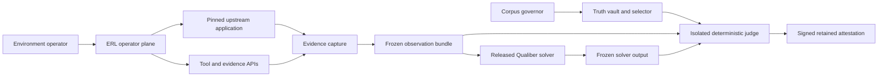

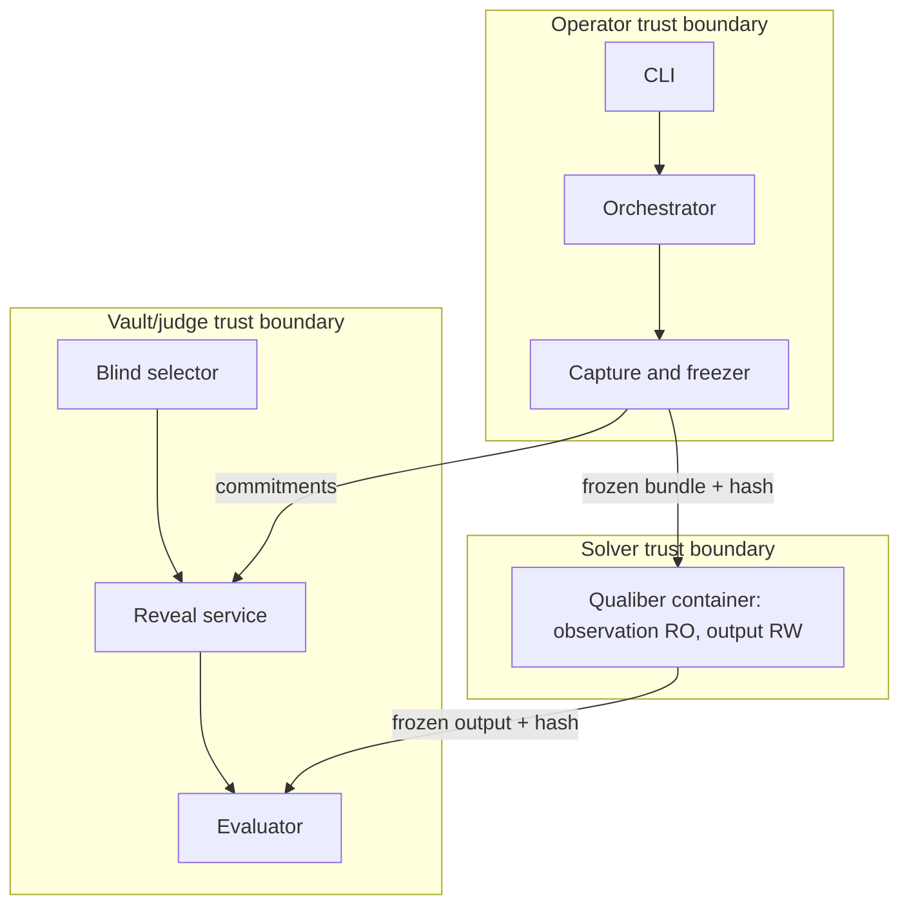

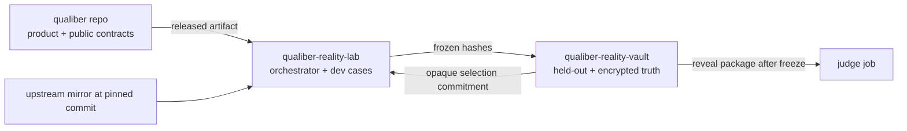

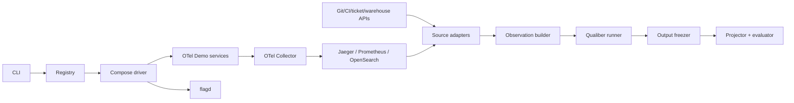


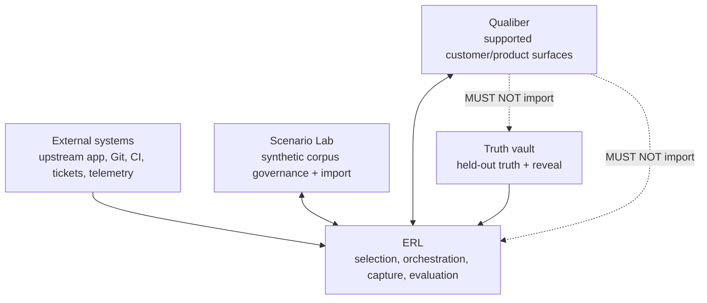

| Boundary | Data / initiator | Authentication and authorization | Security/failure/audit |
|---|---|---|---|
| Operator→upstream runtime | Compose spec, flag mutation, probes; orchestrator | Local Docker client owned by operator; run-scoped labels | No socket in containers; failure `INFRA_*`; retain command digest and resource inventory |
| Capture→external APIs | Bounded allowlisted queries; capture coordinator | Per-profile read-only credential reference | TLS, SSRF controls, cursor binding; failure is source state, not empty; retain safe query/cursor hashes |
| Capture→solver | Frozen observation tree; runner | Local file capability, RO mount | Confidentiality INTERNAL, integrity hash-locked; refusal on missing/unsupported; retain mount manifest |
| Solver→freezer | Output files; solver | Write only to run output directory | Path/size/schema/leak scan; solver failure distinct; retain stdout/stderr bounded to 1 MiB each |
| ERL→vault selector | Qualiber hash, pool request, nonce | mTLS/OIDC in CI; local Unix socket + separate OS credential | Receives no plaintext truth; fail closed; retain signed request/commitment |
| Freezer→reveal | selection/observation/output hashes; operator | Judge identity with reveal permission; two-person approval for held-out release gate | All hashes required; append-only; failed reveal invalidates; retain signed reveal record |
| Judge/auditor→attestation | confidential chain verification, signed signer inventory/selection receipt, final bindings; judge | Role-scoped auditor/finalizer plus independent timestamp authority | Inputs RO; all signatures timestamped; final only after restoration/teardown/exposure |
| ERL→Scenario Lab | closed public verification bundle only; governor | Product-repo write via reviewed PR or scoped app | Resolve bundle trust members, apply locally pinned current head, trust authorized finalizer execution verdict, forbid execution/confidential bodies, retain report |

## 5. Repository and ownership topology

| Domain | Contents | Human access | CI identity / credentials |
|---|---|---|---|
| `qualiber` | Product runtime; existing public surfaces; optional neutral intake/final-attestation contracts only after independent approval; black-box adapter; import-graph tests | Product engineers write; broader read per repo policy | Product CI has no vault key; may read final ERL attestations only |
| `qualiber-reality-lab` | This design; CLI; public schemas; drivers; dev experiments; capture; projector/evaluator code; runbooks | ERL engineers write; product engineers may read | ERL dev CI gets no held-out decrypt or signing key; can use dev truth recipient |
| `qualiber-reality-vault` | Private eligibility manifest, encrypted truth envelopes, selection commitments, reveal/exposure ledger, judge trust policy | Custodian/governor only; product team excluded from normal access | Selector can read eligibility + ciphertext; reveal job can decrypt; judge can sign; identities separated |
| Upstream mirror | Exact upstream Git objects and license record | ERL operator read; mirror bot write | Mirror bot may fetch only allowlisted repos; no vault/product credentials |

The current workspace is the canonical ERL home and SHOULD use remote name `qualiber-reality-lab`. No duplicate `qualiber-external-reality-lab` repository is created.

Vault encryption is age v1 with X25519 recipients and its specified HKDF-SHA-256/ChaCha20-Poly1305 construction. Each envelope is encrypted to (a) active reveal-service recipient and (b) offline recovery recipient. Private identities never enter Git: CI resolves the active identity from an environment secret manager under an OIDC-bound job; local development asks the OS keychain for a development-only identity; the recovery identity is stored offline in two sealed copies. Ed25519 signing keys are distinct from decrypt keys. Public recipients and verification keys live in versioned, root-signed `TrustPolicyManifestV1` artifacts. Rotation appends a new manifest with `prior_manifest_hash`, adds a recipient, re-encrypts plaintext into a new immutable ciphertext record, verifies the unchanged plaintext hash, then removes the old recipient after 30 days. Recovery requires custodian + security approval and emits `KEY_RECOVERY_USED`. A solo machine administrator can still capture process memory, replace binaries, or access all local credentials; the design prevents accidental/cross-job leakage and makes normal-path tampering evident, but does not claim resistance to a malicious host administrator.

Proposed ERL tree:

```text
qualiber-reality-lab/
├── external-reality-lab-build-plan.md
├── external-reality-lab-design.md
├── package.json
├── cli/commands/
├── contracts/{schemas,types,examples}/
├── src/{artifacts,capture,drivers,evaluator,governance,registry,runner,selector,state}/
├── environments/otel-demo/{environment.yaml,compose.overlay.yaml,health-contract.yaml,evidence-map.yaml,images.lock.json}/
├── experiments/development/{ERL-OTEL-000,ERL-OTEL-001,ERL-OTEL-002,ERL-OTEL-003}/
├── fixtures/{sources,solver-outputs,truth}/
├── runbooks/
├── scripts/
├── tests/{unit,property,integration,e2e,security,golden}/
└── .github/workflows/{ci,nightly,otel-smoke,release}.yml
```

Vault tree:

```text
qualiber-reality-vault/
├── trust/trust-policy.<hash>.json
├── trust/timestamps/checkpoint.<hash>.json
├── eligibility/{development,held-out,blind}.manifest.json
├── truth/<experiment-id>/<truth-version>.age
├── truth/<experiment-id>/<truth-version>.commitment.json
├── selections/YYYY/MM/<selection-id>.json
├── reveals/YYYY/MM/<reveal-id>.json
├── exposure/<corpus-id>.jsonl
├── rotations/<rotation-id>.json
└── .github/workflows/{select,reveal,held-out-evaluate,rotate}.yml
```

Qualiber change map (all additive and separately reviewed):

| Proposed file | Change |
|---|---|
| `schemas/external/external-evidence-pack.v1.schema.json` | Customer-supported bounded evidence intake, only if product decision ERL-OQ-001 approves it |
| `scenario-lab/schemas/erl-final-run-attestation.v1.schema.json` | Optional public final-attestation import schema; separate product capability, pending ERL-OQ-001 |
| `scenario-lab/src/runtime/importExternalRealityAttestation.ts` | If approved, validate inventory/checkpoint/receipt/final signatures and current trust; reject bare reports and confidential pool/proof/truth payload |
| `scenario-lab/src/contracts/corpus-tiers.ts` | Add `live_external_case` only if `transplant_case` is semantically insufficient |
| `scenario-lab/src/adapters/erlAdapter.ts` | Optional black-box wrapper; may call public CLI only |
| `scenario-lab/src/tests/erlArchitectureBoundary.test.ts` | Forbid imports/strings resolving vault, reveal, held-out ERL paths from `src/` |
| `.github/workflows/erl-smoke.yml` | Informational clean control, promoted only after calibration |

Existing governance already models `development|held_out|blind` and append-only exposure/rotation (Qualiber:scenario-lab/src/contracts/corpus-tiers.ts:19, Qualiber:scenario-lab/src/contracts/corpus-tiers.ts:27); current honesty wording calls solo-operator separation process-level, not personnel separation (Qualiber:scenario-lab/src/contracts/corpus-tiers.ts:14). If the separate importer is approved, ERL reuses that invariant through final-attestation import rather than copying vault code into the product.

## 6. Component architecture

All components are single-process TypeScript/Node 22 modules unless stated. Pure modules are concurrency-safe; mutators acquire `<run>/locks/state.lock` with a 30-second lease and compare the preceding event hash. External calls use per-source concurrency caps. Every interface accepts an injected clock, randomness source, filesystem, process runner, and transport for tests.

| Component | Responsibility and owned data | Interface / dependencies / trust | Idempotency, limits, failures, test seam |
|---|---|---|---|
| CLI/dispatcher | Parse commands; emit human or JSON envelope | `execute(Command, Context)`; operator trust | Never swallows coded error; 16 KiB diagnostics; fake dispatcher |
| Experiment registry | Validate public experiment metadata/capabilities | `listEligible(filter)`; ERL repo + opaque vault handles | Pure; 2 MiB manifest; invalid manifest blocks selection |
| Blind selector | Filter, seed, sort, select, commit | Vault service API; custodian trust | Nonce prevents replay; same request returns same commitment |
| Environment resolver | Resolve symbolic roots, overlays, image lock | `resolve(profile, runId)` | Pure; unpinned image/behavior overlay refuses |
| Compose driver | Create network/containers/volumes and inventory | Host Docker CLI, never socket mount | Labels + run namespace make retry safe; 24 containers, 8 GiB RAM |
| Kubernetes driver | Future port only | `EnvironmentDriver`; deferred | V1 returns `UNSUPPORTED_DRIVER` |
| Health engine | Run dependency/readiness/baseline probes | HTTP/gRPC/TCP/query probe ports | 3 attempts/probe; records every result |
| Fault/history controller | Activate/restore exact flag or pre-fix checkout | allowlisted mutation plan | Compare-before-write and after-read; mismatch invalidates |
| Traffic driver | Run pinned Locust profile | substrate load generator | Run-scoped traffic ID; max 15 minutes/10 users V1 |
| Capture coordinator | Schedule source snapshots at cutoff | adapters + clock service | Source independent; overall max 1 GiB raw |
| Source adapters | Fetch bounded source pages | `snapshot(SourceRequest): Snapshot` | Existing connector security patterns reused via public package/port; no silent page loss |
| Observation builder | Normalize, sort, provenance-bind | snapshots → bundle | Pure; 256 MiB bundle; duplicate identities rejected |
| Redaction/leak scanner | allowlist, redact, canary/entropy scan | streaming filters | Any failure blocks freeze; raw landing destroyed |
| Qualiber runner | Invoke released artifact with supported inputs | child/container; solver trust | One invocation per run; 20 min, 2 CPU/4 GiB; no vault route |
| Artifact freezer | Validate tree and atomically commit manifest | filesystem | Repeating same tree returns same hash; changed tree refuses |
| Commitment/reveal service | Validate hashes, decrypt truth, append reveal | vault/judge trust | Single reveal per selection+output; partial decrypt invalidates |
| Claim projector | Convert supported Qualiber artifacts to claims | versioned parser | Pure; incomplete projection is non-scoreable, never inferred |
| Evaluator | Calculate metrics/hard gates | RO frozen inputs | Pure deterministic; 2 min/512 MiB |
| Optional AI critic | Advisory critique from bounded claim/evidence pack | model gateway, no keys by default | 20k tokens/US$2 cap; cannot write deterministic report |
| Timestamp authority | Witness exact artifact core/signature digest and append sequence; publish signed checkpoints | distinct managed key and append-only log; never accepts caller time | Same signature returns same entry; sequence gap/rewrite fails; fake clock/log seam |
| Chain auditor/finalizer/verifier | Audit confidential chain, sign product-safe inventory/receipt, bind final core, verify timestamp and current trust | distinct auditor/finalizer keys, root policy/head | No pre-cleanup verdict; inventory completeness and concealed-signer revocation tests; verifier pure |
| Exposure governor | Append exposure and rotate eligibility | vault ledger + product import receipt | Transactionally demotes before returning success |
| Teardown verifier | Inventory labels/resources/files/secrets | Docker CLI + filesystem | Idempotent; residue terminal `TEARDOWN_FAILED` |
| Report renderer | Render provisional Markdown/HTML during a run and verified views from final attestation | read-only artifacts | Presentation cannot alter metrics or confer import authority; golden snapshots |

Connector reuse boundary: ERL SHOULD extract or consume the existing provider-neutral connector ports and security behavior, not copy it. Existing code uses allowlisted endpoints, runtime credential references, bounded pagination, safe errors, webhook verification before parse, and parameterized read-only warehouse queries. The warehouse port deliberately exposes no SQL (Qualiber:src/phase3/connectors/transport/warehouse.ts:24); the PostgreSQL reader verifies the resolved endpoint and executes `BEGIN TRANSACTION READ ONLY` with bounded connection lifetime (Qualiber:src/phase3/connectors/adapters/postgres-warehouse-reader.ts:163, Qualiber:src/phase3/connectors/adapters/postgres-warehouse-reader.ts:235). If packaging product code for ERL would invert dependencies, define a small versioned `@qualiber/connector-contracts` package and keep concrete readers in the product; do not import `src/` by filesystem path.

## 7. Run lifecycle and state machines

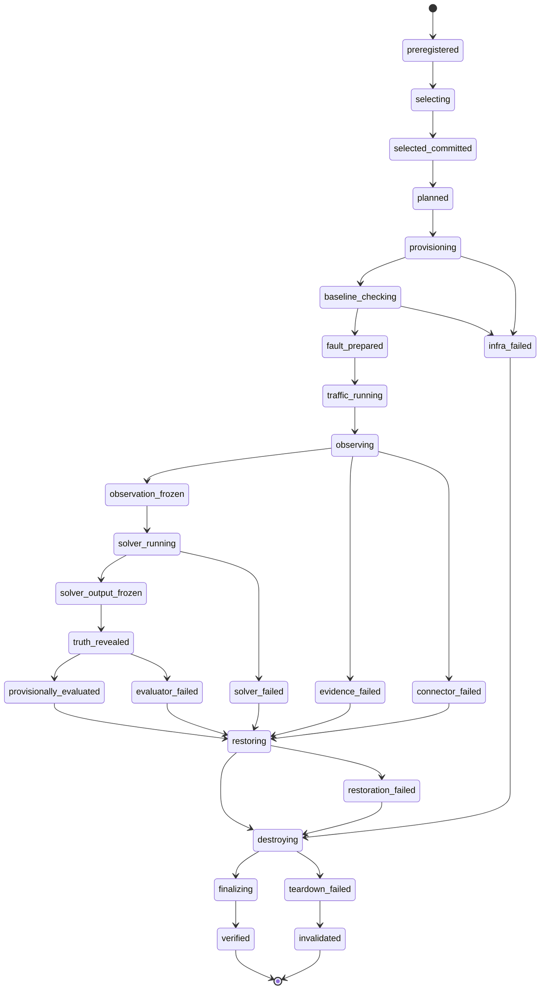

`fault_prepared` carries `mode=clean|fault_activated|historical_state_prepared`; it is not permission to hide activation failure. Failure terminals are typed, not one generic state.

| From→to | Command and preconditions | Side effect / commit marker | Retry, timeout, recovery, audit |
|---|---|---|---|
| ∅→preregistered | `preregister`; doctor OK; trust/cutoff/evidence/evaluation/vocabulary signed; exact Qualiber artifact/version/config/interface/deterministic/AI tuple, capability, tier, nonce fixed | write signed `SelectionRequestV1`; vault records exact request bytes before seed access | Pure retry by request ID; any field change needs new nonce/request; `SELECTION_PREREGISTERED` |
| preregistered→selected committed | `select`; request signature/current exposure verified; signed pool repeats every frozen request field and has unique entries | only now generate seed; vault writes signed selection commitment repeating request/policy hashes | Nonce-idempotent, 60 s; cancellation consumes nonce; `SELECTION_COMMITTED` |
| selected→planned | `plan`; commitment/request/pool fields agree; cutoff rule and bounds agree; selected substrate equals the resolved environment and health-contract profile; environment lock is present | write `RunPlanV1` repeating invocation tuple, preregistered hashes, and cutoff derivation rule, but no guessed concrete instant; `planned.commit` | Pure retry; substitution refuses; `RUN_PLANNED` |
| planned→provisioning | `provision`; plan and image/environment locks match | create run-labeled resources | 2 tries only for pulls; crash inventories labels; `PROVISION_STARTED` |
| provisioning→baseline_checking | all required resources created | fingerprint and resource inventory | 15 min; failure → `infra_failed`; `PROVISIONED` |
| baseline→fault_prepared | baseline probes + clean traffic pass | clean: no mutation; fault: compare/write/read flag; history: checkout commit | No blind mutation retry; 5 min; mismatch invalidates; `BASELINE_PASSED`, `FAULT_ACTIVATED` |
| prepared→traffic_running | activation record frozen; selected traffic-profile hash and environment fingerprint match the plan | start pinned traffic profile, obtain signed supervisor `TrafficProcessStartReceiptV1` and bound `RuntimeMilestoneV1`, verify timestamp/wall/monotonic consistency, and derive cutoff from the process receipt plus profile durations | Same traffic ID resumes only if process status and both signed records agree; missing/late/inconsistent timing or exceeded selection-to-start bound invalidates; 15 min; `TRAFFIC_STARTED` |
| traffic→observing | signed process-start receipt and bound runtime milestone are valid; wall/monotonic/timestamp checks pass; warmup complete; mechanically derived cutoff is still future | start capture sessions against that immutable cutoff | Each adapter retries per policy; cutoff/profile/process/milestone substitution refuses; `OBSERVATION_STARTED` |
| observing→observation_frozen | all required source states terminal; leak scan pass | write manifest, fsync, rename marker, chmod RO | Same bytes idempotent; failure → `evidence_failed`; `OBSERVATION_FROZEN` |
| obs frozen→solver_running | bundle hash matches plan; reveal absent | create isolated solver sandbox | Exactly one `solver_attempt_id`; 20 min; failure may not re-run after reveal; `SOLVER_STARTED` |
| solver→output frozen | process terminal; output schema/leak/path checks pass | freeze output tree + attempt ID | One pre-reveal retry only if no valid output; `SOLVER_OUTPUT_FROZEN` |
| output frozen→truth revealed | selection, observation, output hashes and no mutable handles | decrypt into judge tmpfs; append reveal; write `revealed.commit` | Never reversible; failed/partial reveal → invalidated; `TRUTH_REVEALED` |
| revealed→provisionally evaluated | projector complete; frozen policy/vocabulary and all hashes match | unsigned `EvaluationReportV1(status=provisional)` | Evaluator may retry on identical RO inputs; timestamp excluded from core; 2 min; `EVALUATED_PROVISIONAL` |
| provisional/failure→restoring | activation receipt/record may exist; restoration nonce unused | execute capsule-declared inverse, freeze signed `ControllerRestorationReceiptV1`, read back, run complete baseline, freeze `RestorationVerificationV1` binding both receipts | Identical restoration idempotency retry only; failure typed and no importable verdict; `RESTORE_VERIFIED` |
| restoring→destroying | restoration terminal | remove run resources | Idempotent 3 tries; `DESTROY_STARTED` |
| destroying→finalizing | typed restoration and zero-residue teardown passed; exposure event committed and demotion verified; every signed chain artifact has independent timestamp-log evidence | confidential auditor signs complete product-safe signer inventory, then receipt binding it; freeze terminal run record and lifecycle head; submit both signatures to timestamp log | Failure leaves no final signature/importable verdict; `READY_TO_ATTEST` |
| finalizing→verified | confidential full-chain validation and independently derived mandatory-graph inventory completeness pass | sign final attestation, checkpoint inventory/receipt/final, package closed public bundle, verify every inventoried and terminal signer under both trust views, emit trust report | Verification can rerun against newer local heads; product import requires the closed bundle and both verdicts, while execution bodies remain confidential; `RUN_VERIFIED` |

Forbidden transitions include any skip across a freeze, reveal before output freeze, solve after reveal, activation before baseline, evaluation before reveal, verified with residue, and movement out of `invalidated`. A crash before reveal resumes from the last event whose hash, marker, and side effects reconcile. A crash after reveal may only re-run projector/evaluator on the same hashes, restore, destroy, or verify; solver directories are remounted read-only and `erl solve` returns `STATE_POST_REVEAL_SOLVE_FORBIDDEN`. If mutable output is detected after reveal, the run is permanently invalidated and the known experiment is exposed/demoted.

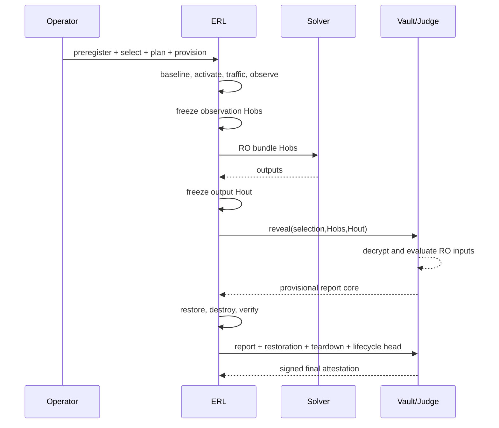

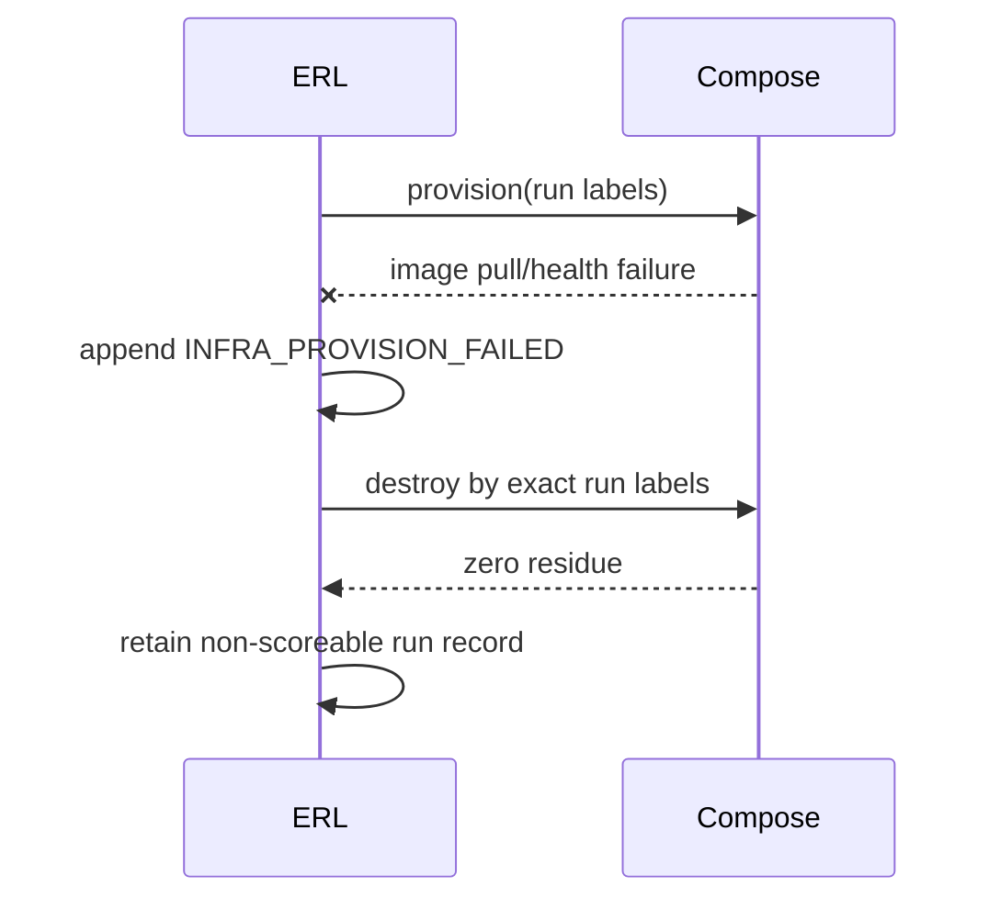

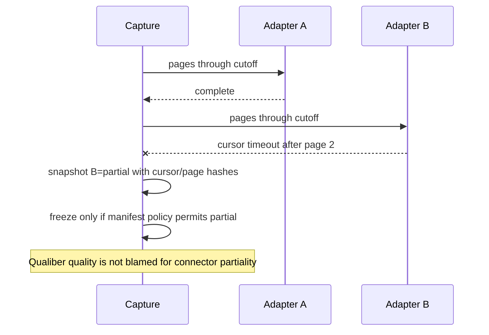

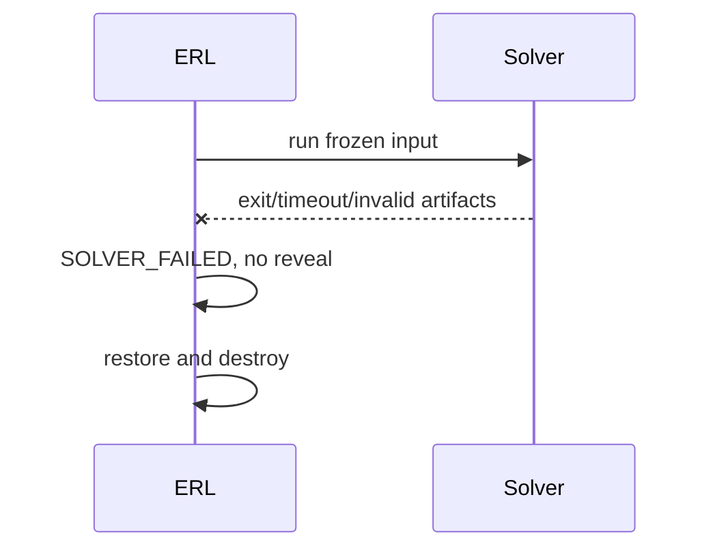

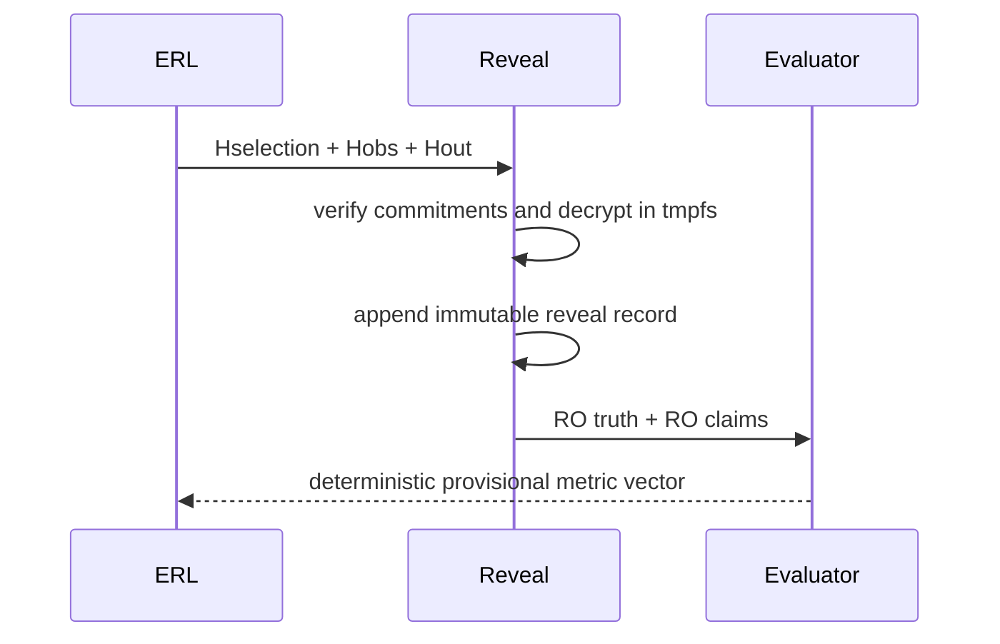

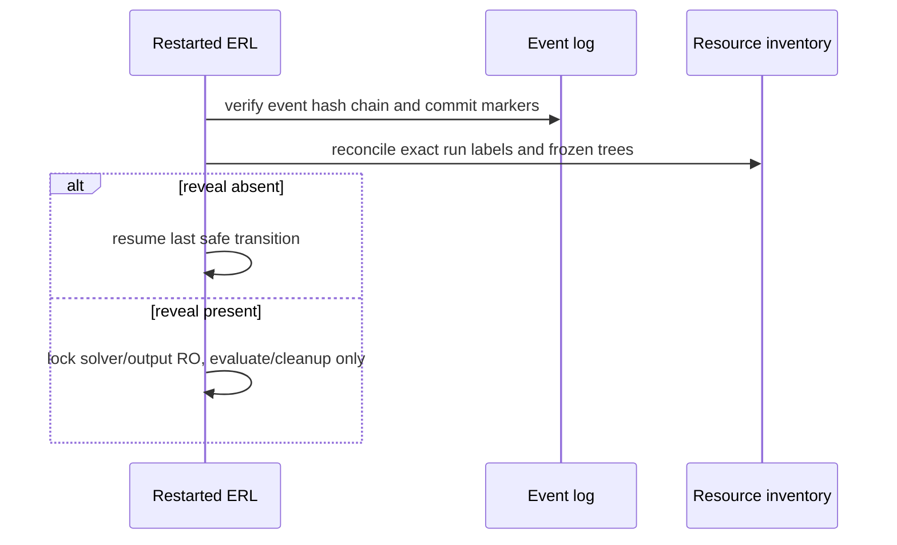

## 8. Canonical serialization, identity, and contracts

### 8.1 Universal rules

All contracts are closed JSON objects (`additionalProperties:false`). UTF-8 JSON is canonicalized with RFC 8785 JCS. Object keys use lexicographic UTF-16 code-unit ordering as JCS specifies; strings are NFC-normalized before validation; duplicate keys are rejected by the parser. Numbers are safe integers only (`[-9007199254740991,9007199254740991]`); non-integral measurements use decimal strings matching `^-?(0|[1-9][0-9]*)(\.[0-9]+)?$`. Timestamps are UTC RFC 3339 seconds (`YYYY-MM-DDTHH:mm:ssZ`); durations are nonnegative integer milliseconds. Hashes are lowercase `sha256:` plus 64 hex digits over canonical UTF-8 bytes. IDs are 1–64 lowercase ASCII characters matching `^[a-z][a-z0-9-]{0,63}$`, except UUIDv7 run IDs rendered lowercase. Paths are slash-separated NFC repo/run-relative paths with no empty, `.`, `..`, backslash, drive, NUL, or symlink segment.

Arrays are ordered unless named below as sets. Set arrays (`capabilities`, `roles`, `service_ids`, `source_ids`, `affected_services`, `claim_ids`, `correct_unknowns`, `causal_non_consequences`) MUST be unique and sorted lexicographically by canonical scalar or element `id`; `ArtifactRef` arrays are unique and sorted by UTF-8 path bytes. Evidence rows are sorted by `(event_time, source_record_id, core_hash)`; lifecycle and timestamp-checkpoint entries by integer `sequence`; signer-inventory entries by `(artifact_schema_version,artifact_core_hash)`; metrics by `metric_id`.

ERL has three deliberately distinct identities. A semantic contract's `core_hash` is `SHA256(JCS(core))`, where `core` is the entire schema-valid object with only the top-level `core_hash`, top-level `signature` or `root_signature`, and contract-specific volatile fields listed below removed. A stored file's `file_sha256` is SHA-256 over its exact bytes, including any `core_hash`, signature, whitespace, and trailing newline. A tree's `tree_hash` is `SHA256(JCS(entries))`, where `entries` is the `ArtifactRef` array sorted by UTF-8 path bytes and each entry contains exactly `path`, `media_type`, `byte_length`, `file_sha256`, and `classification`. Tree paths are unique; symlinks, hard links, directories, and unlisted files are forbidden. These three values MUST NOT be substituted for one another or required to be equal.

The only V1 volatile field is `EvaluationReportV1.recorded_at`; it is excluded from that report's core so deterministic replay compares the same `core_hash`. All other timestamps are security-relevant and included. `TruthEnvelopeV1` contains no self-referential plaintext digest: its `core_hash` commits the truth semantic core, while a separate `TruthCommitmentV1` binds that value to exact plaintext and ciphertext file digests. A signature is Ed25519 over ASCII `ERL-SIGN-V1\n` followed by the 71-byte ASCII `core_hash`. Immutable semantic JSON filenames use `core_hash`; every parent manifest independently records the stored JSON file's `file_sha256`. Where contracts name `traffic_profile_hash`, it is exactly `SHA256(JCS(selected_experiment.traffic_profile))`; no caller-supplied profile identity is accepted.

Shared exact types:

```ts
type Hash = `sha256:${string}`; type CoreHash = Hash; type FileSha256 = Hash; type TreeHash = Hash;
type Instant = `${string}Z`; type Decimal = string;
type RunId = string; type RelPath = string; type Classification = "PUBLIC"|"INTERNAL"|"CONFIDENTIAL"|"SECRET";
type Retention = "ephemeral"|"raw_7d"|"normalized_30d"|"attestation_7y"|"vault_permanent";
type SourceState = "complete"|"healthy_empty"|"partial"|"unavailable"|"error";
interface ArtifactRef { path:RelPath; media_type:string; byte_length:number; file_sha256:FileSha256; classification:Classification; }
interface Signature { algorithm:"Ed25519"; key_id:string; signed_hash:CoreHash; signature_base64:string; }
type CapsuleValue = {type:"boolean"; value:boolean}|{type:"string"; value:string}|{type:"integer"; value:number}|{type:"decimal"; value:Decimal};
interface Failure { domain:"configuration"|"infrastructure"|"connector"|"evidence"|"solver"|"evaluator"|"restoration"|"teardown"|"verification"; code:string; retryable:boolean; safe_message:string; }
interface Provenance { producer:string; producer_version:string; source_uri?:string; source_commit?:string; captured_at?:Instant; transformations:string[]; }
```

### 8.2 Exact contract shapes

```ts
interface EnvironmentProfileV1 {
 schema_version:"environment-profile/v1"; profile_id:string; driver:"docker_compose"|"kubernetes";
 substrate:{project:string; release:string; commit:string; source_archive_sha256:Hash; license:string};
 symbolic_roots:{workspace_root:"${ERL_WORKSPACE}"; run_root:"${ERL_RUN_ROOT}"; cache_root:"${ERL_CACHE_ROOT}"};
 compose_files:RelPath[]; image_lock_path:RelPath; required_services:string[]; optional_services:string[];
 loopback_ports:{name:string; container_port:number; protocol:"tcp"|"udp"}[];
 resources:{cpu_millis:number; memory_mib:number; disk_mib:number}; timeouts:{provision_ms:number; health_ms:number; destroy_ms:number};
 capabilities:string[]; overlay_classifications:("evidence_export_only"|"tool_integration_only"|"fault_control_only")[];
 core_hash:CoreHash;
}
interface EnvironmentFingerprintV1 {
 schema_version:"environment-fingerprint/v1"; run_id:RunId; profile_hash:Hash; host:{os:string; arch:string; docker_version:string; compose_version:string};
 images:{service_id:string; platform:string; digest:Hash}[]; configs:ArtifactRef[]; services:{service_id:string; container_id_hash:Hash; network_alias:string}[];
 baseline_hash?:Hash; created_at:Instant; core_hash:CoreHash;
}
interface MonotonicClockDomainV1 {
 schema_version:"monotonic-clock-domain/v1"; domain_id:string; run_id:RunId; environment_fingerprint_hash:CoreHash;
 host_identity_hash:Hash; boot_id_hash:Hash; clock_id:"CLOCK_MONOTONIC"|"mach_continuous_time";
 clock_epoch_token_hash:Hash; observed_at:Instant; core_hash:CoreHash;
}
interface ExperimentManifestV1 {
 schema_version:"experiment-manifest/v1"; experiment_id:string; version:number; title:string; tier:"development"|"held_out"|"blind";
 truth_strength:"T1"|"T2"|"T3"; substrate_profile_hash:Hash; required_capabilities:string[]; public_before_selection:boolean;
 activation:{kind:"none"|"flagd"|"historical_commit"; logical_mechanism:string; source_control_key?:string; on_variant?:string; off_variant?:string; pre_fix_commit?:string};
 traffic_profile:{profile_id:string; users:number; spawn_rate_per_second:Decimal; warmup_ms:number; observation_ms:number; cooldown_ms:number};
 evidence_policy_hash:CoreHash; health_contract_hash:CoreHash; truth_commitment_hash:CoreHash; sabotage_ids:string[]; exposure_epoch:number; core_hash:CoreHash;
}
interface CutoffPolicyV1 {
 schema_version:"cutoff-policy/v1"; policy_id:string; version:number; clock:"host_utc";
 instant_rule:"traffic_process_started_at_plus_warmup_ms_plus_observation_ms";
 inclusion:"event_time_lt_and_ingestion_time_lte"; max_skew_ms:number; late_arrival_grace_ms:number;
 maximum_selection_to_traffic_start_ms:number; maximum_timestamp_submission_delay_ms:number; maximum_process_milestone_skew_ms:number;
 maximum_monotonic_wall_divergence_ms:number; maximum_warmup_ms:number; maximum_observation_ms:number; minimum_observation_ms:number;
 event_time_required:true; ingestion_time_required:true; valid_from:Instant; valid_until:Instant; core_hash:CoreHash; signature:Signature;
}
interface TrustPolicyManifestV1 {
 schema_version:"trust-policy-manifest/v1"; manifest_id:string; version:number; issued_at:Instant;
 keys:{key_id:string; public_key_pem:string; signer_roles:("trust_root"|"timestamp_authority"|"policy_author"|"preregistrar"|"corpus_governor"|"selector"|"truth_custodian"|"vault_authorizer"|"controller"|"traffic_supervisor"|"runtime_attestor"|"reveal_service"|"confidential_selection_auditor"|"final_attestation_signer")[];
   permitted_contract_types:string[]; permitted_encryption_recipient_ids:string[]; valid_from:Instant; valid_until:Instant; status:"active"|"retired"; retired_at?:Instant;
   environment_profile_hashes:(CoreHash|"*")[]; tiers:("development"|"held_out"|"blind")[]}[];
 revocations:{revocation_id:string; key_id:string; scope:"prospective"|"from_timestamp"|"all_historical"; announced_at:Instant;
   effective_at?:Instant; from_timestamp?:Instant; reason_code:string}[];
 prior_manifest_hash?:CoreHash; root_key_id:string; core_hash:CoreHash; root_signature:Signature;
}
type TimestampCheckpointContextV1 =
 | {scope:"selected_run_public"; run_id:RunId; admission_context_id?:never}
 | {scope:"confidential_admission"; run_id?:never; admission_context_id:string};
interface TrustedTimestampCheckpointV1 {
 schema_version:"trusted-timestamp-checkpoint/v1"; checkpoint_id:string; log_id:string; context:TimestampCheckpointContextV1; prior_checkpoint_hash?:CoreHash;
 first_sequence:number; last_sequence:number; entries:{sequence:number; artifact_schema_version:string; artifact_core_hash:CoreHash;
   signer_key_id:string; signature_sha256:Hash; security_timestamp:Instant}[];
 checkpointed_at:Instant; core_hash:CoreHash; signature:Signature;
}
interface ProductSafeSignerInventoryV1 {
 schema_version:"product-safe-signer-inventory/v1"; inventory_id:string; run_id:RunId; selection_commitment_hash:CoreHash;
 entries:{artifact_schema_version:string; artifact_core_hash:CoreHash; signer_key_id:string; signature_sha256:Hash;
   security_timestamp:Instant; timestamp_log_id:string; timestamp_sequence:number}[];
 excluded_public_terminal_types:["selection-verification-receipt/v1","final-run-attestation/v1"];
 complete_for_selected_run_chain:true; inventoried_at:Instant; core_hash:CoreHash; signature:Signature;
}
interface VerificationBundleMemberV1 { artifact:ArtifactRef; artifact_core_hash:CoreHash; }
interface PublicVerificationBundleV1 {
 schema_version:"public-verification-bundle/v1"; bundle_id:string; run_id:RunId;
 final_attestation:VerificationBundleMemberV1; selection_verification_receipt:VerificationBundleMemberV1;
 signer_inventory:VerificationBundleMemberV1; run_trust_policy:VerificationBundleMemberV1;
 selected_run_timestamp_checkpoint_chain:[VerificationBundleMemberV1,...VerificationBundleMemberV1[]];
 verification_trust_head_source:"local_root_pinned_configuration";
 execution_verification_mode:"finalizer_verdict_only"; execution_artifacts:[];
 created_at:Instant; core_hash:CoreHash;
}
interface TrustVerificationReportV1 {
 schema_version:"trust-verification-report/v1"; report_id:string; run_id:RunId; verification_scope:"confidential_full"|"public_product"; final_attestation_hash:CoreHash;
 public_verification_bundle_hash:CoreHash; selection_verification_receipt_hash:CoreHash; signer_inventory_hash:CoreHash; timestamp_checkpoint_hash:CoreHash;
 run_trust_policy_hash:CoreHash; verification_trust_head_hash:CoreHash;
 head_descends_from_run_policy:true; valid_when_signed:boolean; currently_trusted:boolean;
 signer_results:{artifact_hash:CoreHash; key_id:string; security_timestamp:Instant; valid_when_signed:boolean; currently_trusted:boolean;
   applied_revocation_ids:string[]}[]; verified_at:Instant; core_hash:CoreHash;
}
interface SelectionRequestV1 {
 schema_version:"selection-request/v1"; request_id:string; request_nonce:string; requested_tier:"development"|"held_out"|"blind";
 frozen_qualiber_hash:CoreHash; qualiber_version:string; qualiber_config_hash:CoreHash; interface_id:string; deterministic_mode:boolean; ai_mode:"off"|"advisory";
 cutoff_policy_hash:CoreHash; run_trust_policy_hash:CoreHash;
 evidence_policy_hash:CoreHash; evaluation_policy_hash:CoreHash; claim_vocabulary_hash:CoreHash;
 required_capability_hash:CoreHash; requested_at:Instant; expires_at:Instant; core_hash:CoreHash; signature:Signature;
}
interface EligibilityPoolManifestV1 {
 schema_version:"eligibility-pool-manifest/v1"; pool_id:string; tier:"development"|"held_out"|"blind"; epoch:number;
 selection_request_hash:CoreHash; frozen_qualiber_hash:CoreHash; cutoff_policy_hash:CoreHash;
 run_trust_policy_hash:CoreHash; evidence_policy_hash:CoreHash; evaluation_policy_hash:CoreHash; claim_vocabulary_hash:CoreHash; created_at:Instant;
 entries:{opaque_handle:string; experiment_manifest_hash:CoreHash; capability_hash:CoreHash; exposure_epoch:number; weight:1}[];
 prior_pool_hash?:CoreHash; core_hash:CoreHash; signature:Signature;
}
interface SelectionCommitmentV1 {
 schema_version:"selection-commitment/v1"; selection_id:string; selection_request_hash:CoreHash; pool_hash:CoreHash; pool_epoch:number; frozen_qualiber_hash:CoreHash;
 qualiber_version:string; qualiber_config_hash:CoreHash; interface_id:string; deterministic_mode:boolean; ai_mode:"off"|"advisory";
 cutoff_policy_hash:CoreHash; run_trust_policy_hash:CoreHash; evidence_policy_hash:CoreHash; evaluation_policy_hash:CoreHash; claim_vocabulary_hash:CoreHash;
 request_nonce:string; seed_commitment:Hash; algorithm:"hmac-sha256-rejection-v1"; eligible_count:number; selected_index_commitment:Hash;
 selected_handle_ciphertext_base64:string; truth_ciphertext_file_sha256:FileSha256; selected_at:Instant; expires_at:Instant; core_hash:CoreHash; signature:Signature;
}
interface SelectionProofV1 {
 schema_version:"selection-proof/v1"; selection_request_hash:CoreHash; selection_commitment_hash:CoreHash; pool_manifest:ArtifactRef; pool_manifest_core_hash:CoreHash;
 request_nonce:string; seed_base64:string; algorithm:"hmac-sha256-rejection-v1"; rejection_counter:number; selected_index:number;
 selected_entry:{opaque_handle:string; experiment_manifest_hash:CoreHash; capability_hash:CoreHash; exposure_epoch:number; weight:1};
 experiment_manifest:ArtifactRef; experiment_manifest_core_hash:CoreHash; truth_ciphertext_file_sha256:FileSha256;
 proved_at:Instant; core_hash:CoreHash; signature:Signature;
}
interface SelectionVerificationReceiptV1 {
 schema_version:"selection-verification-receipt/v1"; receipt_id:string; run_id:RunId; selection_request_hash:CoreHash;
 selection_commitment_hash:CoreHash; confidential_selection_proof_hash:CoreHash; pool_core_hash:CoreHash; frozen_qualiber_hash:CoreHash;
 cutoff_policy_hash:CoreHash; run_trust_policy_hash:CoreHash; evidence_policy_hash:CoreHash; evaluation_policy_hash:CoreHash; claim_vocabulary_hash:CoreHash;
 selection_valid:true; exposure_event_hash:CoreHash; demotion_verified:true; signer_inventory_hash:CoreHash; signer_inventory_complete:true;
 audited_at:Instant; core_hash:CoreHash; signature:Signature;
}
interface EvidencePolicyV1 {
 schema_version:"evidence-policy/v1"; policy_id:string; version:number;
 source_rules:{source_type:string; source_schema:string; allowed_fields:string[]; solver_visible:boolean; controller_owned:boolean;
   maximum_records:number; maximum_bytes:number; permitted_states:SourceState[]}[];
 cutoff_rule:"event_time_lt_and_ingestion_time_lte"; health_projection_version:string; redaction_policy_hash:CoreHash;
 unsupported_class_rule:"explicit_sorted_set"; controller_key_exclusion:"all_active_capsule_keys"; core_hash:CoreHash; signature:Signature;
}
interface ClaimVocabularyV1 {
 schema_version:"claim-vocabulary/v1"; vocabulary_id:string; version:number;
 entity_kinds:string[]; value_types:("entity_ref"|"string"|"decimal"|"boolean"|"instant"|"duration_ms")[];
 predicates:{predicate_id:string; subject_kinds:string[]; object_type:string; categories:string[];
   temporal_rule:"exact"|"claim_within_evidence"|"overlap"|"run_window";
   citation_rule:{kind:"field_equals"|"field_exists"|"same_record_link"|"source_state"; source_schemas:string[]; subject_field?:string; object_field?:string}}[];
 subsumptions:{narrower_predicate_id:string; broader_predicate_id:string}[]; normalization_rules:string[]; core_hash:CoreHash; signature:Signature;
}
interface EvaluationPolicyV1 {
 schema_version:"evaluation-policy/v1"; policy_id:string; version:number; claim_vocabulary_hash:CoreHash;
 matcher_version:"claim-matcher/v1"; projector_allowlist:{projector_id:string; version:string; output_schema:string}[];
 metrics:{metric_id:string; version:number; formula_id:string; weight_table:{key:string; value:number}[]; zero_denominator:"pass"|"fail"|"not_applicable";
   threshold_operator:">="|"<="|"="; threshold:Decimal; severity:"info"|"gate"|"hard_gate"}[];
 citation_requirements?:{predicate_id:string; minimum_citations:number; minimum_distinct_sources:number; permitted_source_types:string[]}[];
 aggregation_rule:"metric-vector-no-scalar/v1"; safety_gate_ids:string[]; core_hash:CoreHash; signature:Signature;
}
interface RunPlanV1 {
 schema_version:"run-plan/v1"; run_id:RunId; created_at:Instant; selection_request_hash:CoreHash; selection_commitment_hash:CoreHash; experiment_manifest_hash:CoreHash;
 environment_profile_hash:Hash; qualiber:{artifact_hash:Hash; qualiber_version:string; config_hash:Hash; interface_id:string; deterministic_mode:boolean; ai_mode:"off"|"advisory"};
 cutoff_policy_hash:CoreHash; run_trust_policy_hash:CoreHash; evidence_policy_hash:CoreHash; evaluation_policy_hash:CoreHash; claim_vocabulary_hash:CoreHash;
 cutoff_rule:{clock:"host_utc"; derivation:"traffic_process_started_at_plus_warmup_ms_plus_observation_ms"; inclusion:"event_time_lt_and_ingestion_time_lte"; max_skew_ms:number; late_arrival_grace_ms:number;
   maximum_timestamp_submission_delay_ms:number; maximum_process_milestone_skew_ms:number; maximum_monotonic_wall_divergence_ms:number};
 limits:{runtime_ms:number; raw_bytes:number; normalized_bytes:number; api_requests:number; ai_tokens:number}; core_hash:CoreHash;
}
interface RunLifecycleEventV1 {
 schema_version:"run-lifecycle-event/v1"; run_id:RunId; sequence:number; event_id:string; event_type:string; state_from:string; state_to:string;
 occurred_at:Instant; actor_id:string; command_id:string; prior_event_hash?:Hash; required_hashes:Hash[]; produced_hashes:Hash[]; failure?:Failure; core_hash:CoreHash;
}
interface RuntimeMilestoneV1 {
 schema_version:"runtime-milestone/v1"; milestone_id:string; run_id:RunId; milestone:"traffic_started";
 selection_commitment_hash:CoreHash; experiment_manifest_hash:CoreHash; environment_fingerprint_hash:CoreHash; traffic_profile_hash:CoreHash;
 traffic_process_start_receipt_hash:CoreHash; monotonic_clock_domain_hash:CoreHash; occurred_at:Instant; monotonic_elapsed_ms:number; core_hash:CoreHash; signature:Signature;
}
interface TrafficProcessStartReceiptV1 {
 schema_version:"traffic-process-start-receipt/v1"; receipt_id:string; run_id:RunId; selection_commitment_hash:CoreHash;
 experiment_manifest_hash:CoreHash; environment_fingerprint_hash:CoreHash; traffic_profile_hash:CoreHash;
 process_identity_hash:Hash; supervisor_boot_id_hash:Hash; monotonic_clock_domain_hash:CoreHash; process_started_at:Instant; process_start_monotonic_ms:number;
 core_hash:CoreHash; signature:Signature;
}
interface HealthContractV1 {
 schema_version:"health-contract/v1"; contract_id:string; environment_profile_hash:Hash;
 probes:{probe_id:string; phase:"readiness"|"baseline"|"fault"|"restoration"; target_service:string; kind:"http"|"tcp"|"grpc"|"promql"|"trace_query"|"journey";
 endpoint_ref:string; expected_status?:number; assertion:string; interval_ms:number; timeout_ms:number; attempts:number; required:boolean}[];
 minimum_journeys:{journey_id:string; attempts:number; success_min:number}[]; core_hash:CoreHash;
}
interface ActivationCapsuleV1 {
 schema_version:"activation-capsule/v1"; capsule_id:string; run_id:RunId; selection_commitment_hash:CoreHash; experiment_manifest_hash:CoreHash;
 recipient_controller_key_id:string; activation_replay_nonce:string; restoration_replay_nonce:string;
 activation_idempotency_key:string; restoration_idempotency_key:string; issued_at:Instant; expires_at:Instant;
 allowed_action:
   | {kind:"none"}
   | {kind:"set_flag"; provider_profile_hash:CoreHash; flag_key:string; expected_before?:CapsuleValue; requested_value:CapsuleValue; restore_value:CapsuleValue}
   | {kind:"historical_commit"; repository_hash:CoreHash; pre_fix_commit:string; restore_commit:string};
 core_hash:CoreHash; signature:Signature;
}
interface ActivationCapsuleEnvelopeV1 {
 schema_version:"activation-capsule-envelope/v1"; envelope_id:string; run_id:RunId; capsule_core_hash:CoreHash;
 recipient_controller_key_id:string; activation_replay_nonce:string; restoration_replay_nonce:string; encryption:"age-x25519"; ciphertext:ArtifactRef;
 issued_at:Instant; expires_at:Instant; core_hash:CoreHash; signature:Signature;
}
interface ControllerExecutionReceiptV1 {
 schema_version:"controller-execution-receipt/v1"; execution_id:string; run_id:RunId; activation_capsule_hash:CoreHash;
 capsule_envelope_hash:CoreHash; selection_commitment_hash:CoreHash; controller_id:string; recipient_controller_key_id:string;
 activation_replay_nonce:string; activation_idempotency_key:string; action_kind:"none"|"set_flag"|"historical_commit"; result:"applied"|"no_op"|"failed";
 started_at:Instant; finished_at:Instant; before_value_hash?:Hash; requested_value_hash?:Hash; observed_value_hash?:Hash;
 proof_artifacts:ArtifactRef[]; core_hash:CoreHash; signature:Signature;
}
interface ControllerRestorationReceiptV1 {
 schema_version:"controller-restoration-receipt/v1"; restoration_execution_id:string; run_id:RunId; activation_capsule_hash:CoreHash;
 capsule_envelope_hash:CoreHash; activation_execution_receipt_hash:CoreHash; selection_commitment_hash:CoreHash;
 controller_id:string; recipient_controller_key_id:string; restoration_replay_nonce:string; restoration_idempotency_key:string;
 action_kind:"none"|"set_flag"|"historical_commit"; result:"restored"|"already_restored"|"failed";
 started_at:Instant; finished_at:Instant; before_restore_value_hash?:Hash; requested_restore_value_hash?:Hash; observed_restore_value_hash?:Hash;
 proof_artifacts:ArtifactRef[]; core_hash:CoreHash; signature:Signature;
}
interface FaultActivationRecordV1 {
 schema_version:"fault-activation-record/v1"; run_id:RunId; experiment_manifest_hash:Hash; kind:"none"|"flagd"|"historical_commit";
 activation_capsule_hash:CoreHash; capsule_envelope_hash:CoreHash; controller_execution_receipt_hash:CoreHash;
 control_endpoint_hash?:Hash; controller_key_hash?:Hash; before_value_hash?:Hash; requested_value_hash?:Hash; observed_value_hash?:Hash; activated_at?:Instant;
 proof_artifacts:ArtifactRef[]; visibility:"judge_only_until_reveal"; restoration_required:boolean; core_hash:CoreHash;
}
interface TrafficRunRecordV1 {
 schema_version:"traffic-run-record/v1"; run_id:RunId; traffic_run_id:string; traffic_process_start_receipt_hash:CoreHash; runtime_milestone_hash:CoreHash; profile_hash:Hash; started_at:Instant; ended_at:Instant;
 users:number; request_count:number; journey_attempts:{journey_id:string; attempted:number; completed:number; failed:number}[]; generator_exit_code:number;
 truncated:boolean; artifacts:ArtifactRef[]; core_hash:CoreHash;
}
interface EvidenceSourceSnapshotV1 {
 schema_version:"evidence-source-snapshot/v1"; run_id:RunId; snapshot_id:string; source_type:"git"|"ci"|"ticket"|"deployment"|"feature_flag"|"trace"|"metric"|"log"|"business_event"|"warehouse"|"ownership";
 source_identity_hash:Hash; state:SourceState; query_canonical:string; window:{from:Instant; to_exclusive:Instant}; started_at:Instant; ended_at:Instant;
 clock_offset_ms:number; pages:number; records:number; bytes:number; cursor_start_hash?:Hash; cursor_end_hash?:Hash; dedupe_key:string;
 sampling:{kind:"none"|"head"|"reservoir"|"provider"; rate?:Decimal; seed?:string}; truncation:{truncated:boolean; reason?:"row_limit"|"byte_limit"|"page_limit"|"time_limit"};
 unavailable_reason_code?:string; records_artifact?:ArtifactRef; provenance:Provenance; core_hash:CoreHash;
}
interface ConnectorHealthRecordV1 {
 schema_version:"connector-health-record/v1"; run_id:RunId; connector_profile_id:string; mechanism:string; state:"healthy"|"degraded"|"unavailable"|"failed";
 checked_at:Instant; latency_ms:number; pages_attempted:number; pages_completed:number; retries:number; rate_limit_remaining?:number; safe_error_codes:string[];
 cursor_before_hash?:Hash; cursor_after_hash?:Hash; core_hash:CoreHash;
}
interface ObservationBundleV1 {
 schema_version:"observation-bundle/v1"; run_id:RunId; run_plan_hash:Hash; environment_fingerprint_hash:Hash;
 cutoff:{clock:"host_utc"; instant:Instant; inclusion:"event_time_lt_and_ingestion_time_lte"; max_skew_ms:number; late_arrival_grace_ms:number;
   traffic_process_start_receipt_hash:CoreHash; runtime_milestone_hash:CoreHash; traffic_profile_hash:CoreHash};
 source_snapshots:{snapshot_id:string; snapshot_hash:Hash; state:SourceState}[]; connector_health_hashes:Hash[]; unsupported_evidence_classes:string[];
 cutoff_policy_hash:CoreHash; evidence_policy_hash:CoreHash; redaction_policy_hash:Hash; leak_scan:{scanner_version:string; findings:number; canaries_found:number}; artifacts:ArtifactRef[]; frozen_at:Instant; core_hash:CoreHash;
}
interface QualiberRunManifestV1 {
 schema_version:"qualiber-run-manifest/v1"; run_id:RunId; attempt_id:string; observation_bundle_hash:Hash; qualiber_artifact_hash:Hash; config_hash:Hash;
 qualiber_version:string; interface_id:string; command_argv_hash:Hash; deterministic_mode:boolean; ai_mode:"off"|"advisory"; started_at:Instant; ended_at:Instant; exit_code:number; timed_out:boolean;
 stdout:ArtifactRef; stderr:ArtifactRef; resource_usage:{cpu_ms:number; max_rss_mib:number}; output_root:RelPath; core_hash:CoreHash;
}
interface FrozenArtifactManifestV1 {
 schema_version:"frozen-artifact-manifest/v1"; run_id:RunId; purpose:"observation"|"solver_output"|"truth_commitment"|"evaluation"|"teardown";
 producer_manifest_hash:Hash; entries:ArtifactRef[]; tree_hash:TreeHash; file_count:number; total_bytes:number; frozen_at:Instant; filesystem_mode:"read_only";
 prior_manifest_hash?:Hash; core_hash:CoreHash;
}
interface TruthEnvelopeV1 {
 schema_version:"truth-envelope/v1"; experiment_id:string; truth_version:number; supersedes_hash?:Hash; truth_strength:"T1"|"T2"|"T3";
 substrate_hash:Hash; claim_vocabulary_hash:CoreHash; mechanism:{kind:string; source_ref:string; affected_services:string[]}; expected_facts:{fact_id:string; atom:ClaimAtomV1; required:boolean; weight:number; evidence_classes:string[]}[];
 supported_links:{link_id:string; from_fact_id:string; to_fact_id:string; predicate_id:string; weight:number}[]; permitted_causal_claims:{claim_id:string; predicate_id:string; ceiling:"association"|"localized_mechanism"|"confirmed_mechanism"}[];
 causal_non_consequences:string[]; correct_unknowns:string[]; misleading_evidence_ids:string[]; supported_claim_ceiling:"observable_only"|"association"|"localized_mechanism"|"confirmed_mechanism";
 required_sabotages:string[]; admission_approval_ids:string[]; authored_at:Instant; core_hash:CoreHash;
}
interface TruthCommitmentV1 {
 schema_version:"truth-commitment/v1"; experiment_id:string; truth_version:number; truth_core_hash:CoreHash;
 plaintext_file_sha256:FileSha256; ciphertext_file_sha256:FileSha256; encryption:"age-x25519"; recipient_key_ids:string[];
 committed_at:Instant; core_hash:CoreHash; signature:Signature;
}
interface TruthRevealRecordV1 {
 schema_version:"truth-reveal-record/v1"; reveal_id:string; run_id:RunId; selection_commitment_hash:CoreHash; selection_proof_hash:CoreHash; truth_commitment_hash:CoreHash;
 truth_core_hash:CoreHash; truth_plaintext_file_sha256:FileSha256; cutoff_policy_hash:CoreHash; evidence_policy_hash:CoreHash; evaluation_policy_hash:CoreHash; claim_vocabulary_hash:CoreHash;
 traffic_process_start_receipt_hash:CoreHash; runtime_milestone_hash:CoreHash; traffic_profile_hash:CoreHash; observation_bundle_hash:Hash; solver_output_manifest_hash:Hash; revealed_at:Instant; authorizer_ids:string[]; decrypt_key_id:string; prior_reveal_hash?:Hash;
 outcome:"revealed"|"failed"; failure_code?:string; core_hash:CoreHash; signature:Signature;
}
interface ClaimAtomV1 {
 subject:{kind:string; id:string}; predicate_id:string;
 object:{type:"entity_ref"|"string"|"decimal"|"boolean"|"instant"|"duration_ms"; value:string};
 temporal_scope:{rule:"instant"|"interval"|"run_window"; from?:Instant; to_exclusive?:Instant}; polarity:"asserted"|"negated"|"unknown";
}
interface StructuredClaimSetV1 {
 schema_version:"structured-claim-set/v1"; run_id:RunId; projector_id:string; projector_version:string; claim_vocabulary_hash:CoreHash; solver_output_manifest_hash:Hash;
 claims:{claim_id:string; category:"fact"|"association"|"causal"|"unknown"|"confidence"|"recommendation"|"authority"; atom:ClaimAtomV1;
 confidence:Decimal; authority:"none"|"advisory"|"human_approval_required"|"customer_gate"; citations:{artifact_file_sha256:FileSha256; locator:string}[]; source_output_path:RelPath}[];
 contradictions:{claim_id_a:string; claim_id_b:string}[]; unprojected:{path:RelPath; reason_code:string}[]; complete:boolean; core_hash:CoreHash;
}
interface EvaluationMetricResultV1 {
 schema_version:"evaluation-metric-result/v1"; metric_id:string; version:number; unit:string; numerator:Decimal; denominator:Decimal; value:Decimal|null;
 zero_denominator:"pass"|"fail"|"not_applicable"; threshold_operator:">="|"<="|"="; threshold:Decimal; passed:boolean|null; severity:"info"|"gate"|"hard_gate";
 included_ids:string[]; excluded:{id:string; reason:string}[]; core_hash:CoreHash;
}
interface EvaluationReportV1 {
 schema_version:"evaluation-report/v1"; report_id:string; run_id:RunId; status:"provisional"; truth_reveal_hash:CoreHash; selection_proof_hash:CoreHash;
 cutoff_policy_hash:CoreHash; traffic_process_start_receipt_hash:CoreHash; runtime_milestone_hash:CoreHash; traffic_profile_hash:CoreHash; evidence_policy_hash:CoreHash; evaluation_policy_hash:CoreHash; claim_vocabulary_hash:CoreHash; observation_bundle_hash:Hash; solver_output_manifest_hash:Hash; claim_set_hash:Hash;
 metric_results:{metric_id:string; result_hash:Hash}[]; safety_gates:{gate_id:string; passed:boolean; evidence_ids:string[]}[];
 classification:"product_pass"|"product_fail"|"non_scoreable_infrastructure"|"non_scoreable_connector"|"non_scoreable_solver"|"non_scoreable_evaluator"|"invalidated";
 claim_scope:"T1_capability"|"T2_upstream_mechanism"|"T3_oss_truth"; deterministic_pass:boolean; recorded_at:Instant; evaluator_version:string; core_hash:CoreHash;
}
interface ExposureEventV1 {
 schema_version:"exposure-event/v1"; exposure_id:string; corpus_id:string; experiment_manifest_hash:Hash; prior_tier:"held_out"|"blind"|"development"; resulting_tier:"development";
 occurred_at:Instant; reason:"product_team_view"|"truth_reveal"|"debug_access"|"public_disclosure"; actor_id:string; run_id?:RunId; prior_exposure_hash?:Hash; core_hash:CoreHash; signature:Signature;
}
interface ExperimentRotationRecordV1 {
 schema_version:"experiment-rotation-record/v1"; rotation_id:string; corpus_id:string; from_experiment_hash:Hash; to_experiment_hash?:Hash; reason:string;
 exposure_event_hash?:Hash; pool_epoch_before:number; pool_epoch_after:number; rotated_at:Instant; governor_id:string; core_hash:CoreHash; signature:Signature;
}
interface RestorationVerificationV1 {
 schema_version:"restoration-verification/v1"; restoration_id:string; run_id:RunId; environment_fingerprint_hash:CoreHash;
 fault_activation_record_hash:CoreHash; activation_execution_receipt_hash:CoreHash; controller_restoration_receipt_hash:CoreHash; health_contract_hash:CoreHash;
 restored_at:Instant; control_readback_hash?:Hash; post_restore_baseline_hash:CoreHash;
 checks:{check_id:string; kind:"control_state"|"journey"|"error_rate"|"resource_state"; passed:boolean; evidence_hashes:Hash[]}[];
 passed:boolean; core_hash:CoreHash;
}
interface TeardownVerificationV1 {
 schema_version:"teardown-verification/v1"; run_id:RunId; environment_fingerprint_hash:Hash; checked_at:Instant;
 checks:{kind:"container"|"network"|"volume"|"secret_file"|"port"|"working_state"; selector:string; residue_count:number; residue_hashes:Hash[]}[];
 restoration_verification_hash:CoreHash; passed:boolean; core_hash:CoreHash;
}
interface ExternalRealityRunRecordV1 {
 schema_version:"external-reality-run-record/v1"; run_id:RunId; state:string; created_at:Instant; terminal_at?:Instant; selection_request_hash?:CoreHash;
 run_plan_hash?:CoreHash; selection_commitment_hash?:CoreHash; selection_proof_hash?:CoreHash; selection_verification_receipt_hash?:CoreHash;
 environment_fingerprint_hash?:CoreHash; fault_activation_record_hash?:CoreHash; traffic_process_start_receipt_hash?:CoreHash; runtime_milestone_hash?:CoreHash; traffic_profile_hash?:CoreHash; traffic_run_record_hash?:CoreHash;
 observation_bundle_hash?:CoreHash; solver_output_manifest_hash?:CoreHash; reveal_record_hash?:CoreHash; evaluation_report_hash?:CoreHash;
 controller_restoration_receipt_hash?:CoreHash; restoration_verification_hash?:CoreHash; teardown_verification_hash?:CoreHash; exposure_event_hash?:CoreHash;
 cutoff_policy_hash?:CoreHash; run_trust_policy_hash?:CoreHash; signer_inventory_hash?:CoreHash;
 lifecycle_head_hash:CoreHash; classification:EvaluationReportV1["classification"]|"in_progress";
 failures:Failure[]; retained_artifacts:ArtifactRef[]; core_hash:CoreHash;
}
interface FinalRunAttestationV1 {
 schema_version:"final-run-attestation/v1"; attestation_id:string; run_id:RunId; run_record_hash:CoreHash; selection_request_hash:CoreHash; run_plan_hash:CoreHash;
 selection_commitment_hash:CoreHash; confidential_selection_proof_hash:CoreHash; selection_verification_receipt_hash:CoreHash; signer_inventory_hash:CoreHash;
 cutoff_policy_hash:CoreHash; run_trust_policy_hash:CoreHash; evidence_policy_hash:CoreHash; evaluation_policy_hash:CoreHash; claim_vocabulary_hash:CoreHash;
 environment_fingerprint_hash:CoreHash; fault_activation_record_hash:CoreHash; traffic_process_start_receipt_hash:CoreHash; runtime_milestone_hash:CoreHash; traffic_profile_hash:CoreHash; traffic_run_record_hash:CoreHash;
 observation_bundle_hash:CoreHash; solver_output_manifest_hash:CoreHash; truth_reveal_hash:CoreHash; evaluation_report_hash:CoreHash;
 controller_restoration_receipt_hash:CoreHash; restoration_verification_hash:CoreHash; teardown_verification_hash:CoreHash; exposure_event_hash:CoreHash; lifecycle_head_hash:CoreHash;
 classification:EvaluationReportV1["classification"]; verified_at:Instant; importable:true; core_hash:CoreHash; signature:Signature;
}
```

### 8.3 Contract registry and invariants

| Contract | Max bytes | Producer → consumers | Path | Class / retention / validation failure |
|---|---:|---|---|---|
| EnvironmentProfileV1 | 256 KiB | maintainer → resolver, doctor | `environments/<id>/environment.json` | INTERNAL/permanent/refuse plan |
| EnvironmentFingerprintV1 | 2 MiB | driver → capture, verifier | `runs/<run>/state/environment-fingerprint.<hash>.json` | INTERNAL/attestation/refuse baseline |
| MonotonicClockDomainV1 | 256 KiB | host driver → traffic supervisor, runtime attestor, verifier | `runs/<run>/state/monotonic-clock-domain.<hash>.json` | INTERNAL/attestation/refuse traffic timing if host/boot/clock domain differs |
| ExperimentManifestV1 | 256 KiB | custodian → selector, controller | dev repo or vault `experiments/<id>/manifest.json` | CONFIDENTIAL for held-out/vault permanent/refuse selection |
| CutoffPolicyV1 | 1 MiB | policy owner → preregistration, capture, verifier | released policy registry | INTERNAL/permanent/refuse preregistration or cutoff realization |
| TrustPolicyManifestV1 | 8 MiB | security root → every signature verifier | `trust/trust-policy.<hash>.json` | PUBLIC/permanent/append-only run policy or verification head; refuse bad root/prior/revocation |
| TrustedTimestampCheckpointV1 | 16 MiB | independent timestamp service → confidential/public verifiers | `trust/timestamps/checkpoint.<hash>.json` | PUBLIC only for `selected_run_public`, otherwise CONFIDENTIAL/permanent/append-only; refuse missing/gapped/rewritten/nonchronological/out-of-scope entries or unauthorized authority |
| ProductSafeSignerInventoryV1 | 8 MiB | confidential auditor → receipt, finalizer, product verifier | retained `verification/signer-inventory.<hash>.json` | INTERNAL/attestation/product-safe opaque signer metadata only; refuse incomplete chain |
| PublicVerificationBundleV1 | 4 MiB | finalizer packaging step → product verifier | retained `verification/public-bundle.<hash>.json` | PUBLIC/attestation/closed trust-artifact references only, zero execution bodies; refuse missing/extra/mismatched members |
| TrustVerificationReportV1 | 2 MiB | verifier → operator/product importer | `verification/trust-report.<hash>.json` | PUBLIC/attestation/report both historical validity and current trust |
| SelectionRequestV1 | 1 MiB | preregistration client → selector, auditor | vault `selections/requests/<hash>.json` | INTERNAL/attestation/refuse seed generation |
| EligibilityPoolManifestV1 | 8 MiB | governor → selector | vault `eligibility/<tier>.manifest.json` | CONFIDENTIAL/vault permanent/refuse selection |
| SelectionCommitmentV1 | 1 MiB | selector → plan, reveal | `runs/<run>/commitments/selection.<hash>.json` + vault | INTERNAL/attestation/refuse run |
| SelectionProofV1 | 4 MiB | reveal service → confidential judge/auditor | vault `selection/proof.<hash>.json` | CONFIDENTIAL/vault permanent/refuse reveal/attestation |
| SelectionVerificationReceiptV1 | 2 MiB | confidential auditor → finalizer, product verifier | retained `selection/verification-receipt.<hash>.json` | INTERNAL/attestation/product-safe, binds complete signer inventory and contains no seed/handle/manifest/truth |
| EvidencePolicyV1 | 8 MiB | evidence owner → planner, capture, solver projection | released policy registry | INTERNAL/permanent/refuse plan |
| ClaimVocabularyV1 | 8 MiB | evaluator owner → projector, evaluator | released vocabulary registry | INTERNAL/permanent/refuse plan |
| EvaluationPolicyV1 | 8 MiB | evaluator owner + QE → planner, judge | released signed policy registry | INTERNAL/permanent/refuse plan |
| RunPlanV1 | 1 MiB | planner → all | `runs/<run>/state/run-plan.<hash>.json` | INTERNAL/attestation/refuse run |
| RunLifecycleEventV1 | 64 KiB/event | dispatcher → resume, verifier | `runs/<run>/events/<seq>.<hash>.json` | INTERNAL/attestation/refuse transition |
| TrafficProcessStartReceiptV1 | 1 MiB | traffic process supervisor → runtime attestor, capture, verifier | `runs/<run>/state/traffic-process-start.<hash>.json` | INTERNAL/attestation/refuse traffic/cutoff derivation |
| RuntimeMilestoneV1 | 1 MiB | runtime attestor → traffic, capture, verifier | `runs/<run>/state/runtime-milestone.<hash>.json` | INTERNAL/attestation/refuse traffic/cutoff derivation |
| HealthContractV1 | 2 MiB | maintainer → health engine | `environments/<id>/health-contract.json` | INTERNAL/permanent/refuse provision |
| ActivationCapsuleV1 | 1 MiB | vault → isolated controller | encrypted plaintext only in controller memory | SECRET/vault permanent ciphertext/refuse activation |
| ActivationCapsuleEnvelopeV1 | 2 MiB | vault → isolated controller | vault + `commitments/activation-envelope.<hash>.json` | CONFIDENTIAL/attestation/refuse activation |
| ControllerExecutionReceiptV1 | 2 MiB | isolated controller → judge, orchestrator | `state/controller-activation-receipt.<hash>.json` | CONFIDENTIAL/attestation/refuse traffic |
| ControllerRestorationReceiptV1 | 2 MiB | isolated controller → health, finalizer | `restoration/controller-receipt.<hash>.json` | CONFIDENTIAL/attestation/refuse restoration verification |
| FaultActivationRecordV1 | 1 MiB | controller → restore, evaluator | `runs/<run>/state/fault-activation.<hash>.json` | CONFIDENTIAL until reveal/attestation/refuse traffic |
| TrafficRunRecordV1 | 2 MiB | traffic → capture, evaluator | `runs/<run>/state/traffic.<hash>.json` | INTERNAL/attestation/refuse observation |
| EvidenceSourceSnapshotV1 | 4 MiB | adapter → bundle | `runs/<run>/normalized/sources/<id>/snapshot.<hash>.json` | varies/30d metadata 7y/refuse source |
| ConnectorHealthRecordV1 | 1 MiB | adapter → bundle/evaluator | `runs/<run>/normalized/health/<id>.<hash>.json` | INTERNAL/attestation/refuse source |
| ObservationBundleV1 | 16 MiB manifest; 256 MiB tree | builder → solver, judge | `runs/<run>/observation/observation-bundle.<hash>.json` | CONFIDENTIAL/attestation/refuse solve |
| QualiberRunManifestV1 | 2 MiB | runner → freezer, judge | `runs/<run>/solver/run-manifest.<hash>.json` | INTERNAL/attestation/refuse freeze |
| FrozenArtifactManifestV1 | 16 MiB | freezer → reveal, verifier | beside frozen tree | follows tree/attestation/refuse reveal |
| TruthEnvelopeV1 | 8 MiB plaintext | custodian → evaluator | vault ciphertext `truth/<id>/<v>.age` | SECRET/vault permanent/refuse admission/reveal |
| TruthCommitmentV1 | 2 MiB | custodian build → selector, reveal | vault + `commitments/truth.<hash>.json` | CONFIDENTIAL/vault permanent/refuse selection |
| TruthRevealRecordV1 | 2 MiB | reveal → evaluator, verifier | vault + retained `reveal/<hash>.json` | CONFIDENTIAL/attestation/invalidates on failure |
| StructuredClaimSetV1 | 64 MiB | projector → evaluator | judge `claims/claim-set.<hash>.json` | CONFIDENTIAL/attestation/non-scoreable if incomplete |
| EvaluationMetricResultV1 | 8 MiB | evaluator → report | `evaluation/metrics/<id>.<hash>.json` | INTERNAL/attestation/non-scoreable |
| EvaluationReportV1 | 16 MiB | evaluator → renderer, finalizer | `evaluation/provisional-report.<hash>.json` | INTERNAL/attestation/provisional and never independently importable |
| ExposureEventV1 | 1 MiB | governor → selector, confidential auditor | vault ledger + signed receipt | CONFIDENTIAL/vault permanent/refuse held-out use; product sees only its committed hash in the public receipt |
| ExperimentRotationRecordV1 | 1 MiB | governor → selector | vault `rotations/<hash>.json` | CONFIDENTIAL/vault permanent/refuse new epoch |
| RestorationVerificationV1 | 4 MiB | controller + health engine → finalizer, auditor | `restoration/verification.<hash>.json` | INTERNAL/attestation/no final signature if fail |
| TeardownVerificationV1 | 4 MiB | verifier → run record | `teardown/verification.<hash>.json` | INTERNAL/attestation/run not verified if fail |
| ExternalRealityRunRecordV1 | 16 MiB | state store → CLI/finalizer | `retained/<run>/run-record.<hash>.json` | INTERNAL/attestation/unsigned operational record |
| FinalRunAttestationV1 | 16 MiB | finalizer → verifier, optional product importer | `retained/<run>/attestation.<hash>.json` | INTERNAL/7y/importable only with matching inventory/checkpoint/receipt and current two-verdict verification |

Cross-record invariants: one run ID; every referenced contract core hash resolves in its authorized verification domain to exactly one schema-valid object and every artifact reference reproduces its exact file digest and byte count. Before seed generation, the signed selection request and signed pool manifest MUST exist; the pool and later signed commitment repeat identical evidence-policy, evaluation-policy, vocabulary, cutoff-policy, and `run_trust_policy_hash` values. Request, commitment, plan, and actual Qualiber run repeat exactly the artifact/config hashes, version, interface ID, deterministic mode, and AI mode. Pool entries are sorted by opaque handle and MUST have pairwise-unique `opaque_handle`, pairwise-unique `experiment_manifest_hash`, and pairwise-unique `(experiment_id,version)` after manifest resolution; `weight` is exactly 1, so the sampling unit is one admitted experiment version. Before signing the pool, the governor resolves every entry and requires `warmup_ms <= maximum_warmup_ms` and `minimum_observation_ms <= observation_ms <= maximum_observation_ms` under the request's exact cutoff policy; incompatible cases are excluded before `eligible_count` and randomness exist.

The confidential auditor recomputes the proof, rejected counters/index, pool membership, selected manifest/truth, policy bindings, and exposure demotion, then signs `ProductSafeSignerInventoryV1` and `SelectionVerificationReceiptV1`. The inventory contains every signed selected-run-chain artifact except the inventory itself and the later public receipt/final attestation: contract version, core hash, signer key ID, exact signature digest, and independently witnessed timestamp-log location/time, but no artifact body. It MUST contain no unselected experiment, truth-commitment, admission, or signer metadata. The public `selected_run_public` checkpoint is scoped to the identical run and likewise MUST contain no unselected-case entry; confidential pool-admission timestamps use a separate `confidential_admission` log/checkpoint that is never bound into product artifacts. Inventory entries are unique and sorted by `(artifact_schema_version,artifact_core_hash)`; the auditor compares them with the confidential selected chain and asserts completeness. Receipt, run record, and final attestation bind the identical inventory hash. Product verification MUST NOT resolve or receive the pool, selected manifest, seed, handle, capsule plaintext, or truth records, but MUST use the inventory to apply current revocations to concealed controller, traffic-supervisor, runtime, reveal, selection, policy, and other selected-chain signers. The selected experiment hash equals the plan, and `selected_experiment.substrate_profile_hash = run_plan.environment_profile_hash = environment_fingerprint.profile_hash = health_contract.environment_profile_hash`. Activation capsule/envelope/activation receipt/fault record agree on run, selection, recipient, activation nonce/idempotency, and action result; each controller receipt signature key's trust entry includes its `recipient_controller_key_id` in `permitted_encryption_recipient_ids`; the separate restoration receipt agrees on recipient, restoration nonce/idempotency, inverse value, and observed result. The independently signed traffic-process start receipt and signed runtime milestone bind the same run, selection, experiment, environment fingerprint, and selected traffic-profile hash; the traffic record binds both. The concrete cutoff equals `traffic_process_start_receipt.process_started_at + selected_experiment.traffic_profile.warmup_ms + selected_experiment.traffic_profile.observation_ms`, timing/profile values satisfy the consistency and policy bounds below, and observation/reveal/evaluation/run record/attestation bind the same process-start receipt, milestone, traffic-profile, and cutoff-policy hashes. Qualiber input and all invocation fields equal the preregistered values; output freezer producer equals the Qualiber manifest; restoration binds both controller receipts, fault record, environment, and health contract and passes; teardown binds that restoration and has zero residue; exposure demotes the selected held-out case; and the run-record lifecycle head is the last valid event.

Signer-inventory completeness is derived independently from a closed mandatory contract graph, never from the list used to construct the inventory. Its roots are `FinalRunAttestationV1` and `SelectionVerificationReceiptV1`; the auditor resolves all artifact-core-hash edges through the retained confidential artifact map, treats `EligibilityPoolManifestV1` as an included leaf so unselected entry hashes are not traversed, treats `ProductSafeSignerInventoryV1` as an excluded leaf, and follows `SelectionProofV1.experiment_manifest_core_hash` for the selected experiment. The expected inventory set is every reachable artifact carrying a standard `signature`, excluding only `ProductSafeSignerInventoryV1`, `SelectionVerificationReceiptV1`, and `FinalRunAttestationV1`. Missing graph nodes, unresolved edges, unexpected signed nodes, omitted expected nodes, or duplicate inventory entries fail before receipt/final signing. Inventory construction and this graph oracle MUST be separate implementations and test fixtures.

Public product verification has one exact closure and authority model. The caller supplies only `PublicVerificationBundleV1`; verifier-controlled root-pinned configuration supplies the current trust head. The bundle contains file/core references for the final attestation, selection receipt, signer inventory, frozen run trust policy, and the complete `selected_run_public` timestamp-checkpoint chain. The importer validates every member file digest/core hash, cross-record binding, checkpoint ancestry/context/chronology, historical authorization, current authorization, and bundle/report hash. It MUST require `execution_verification_mode:"finalizer_verdict_only"` and `execution_artifacts:[]`, reject unknown or additional members, and MUST NOT request or accept environment, activation, traffic, observation, reveal, evaluation, restoration, teardown, lifecycle, or other execution-artifact bodies. Execution hashes in the final attestation are opaque audit bindings: product acceptance trusts the authorized finalizer's execution verdict, corroborated by the confidential auditor's signed receipt and complete signer inventory; it does not independently recompute execution invariants. Any future independent product execution validation requires a new bundle/schema mode and product security review.

Signing-time authorization and verification-time trust are separate. `run_trust_policy_hash`, frozen before selection and bound through the final attestation, determines whether each artifact was authorized when signed: root signature, key validity, contract type, signer role, environment/tier, and controller recipient mapping must pass at the artifact's independently witnessed security timestamp. The verifier MUST ignore signer-controlled `created_at`, `occurred_at`, `audited_at`, `verified_at`, and similar fields for key-validity/revocation decisions. `TrustedTimestampCheckpointV1` is signed by a distinct `timestamp_authority` key, contains a contiguous append-only sequence, binds the artifact core hash, `signature_sha256 = SHA256(JCS(artifact.signature))`, signer key ID, and service-observed UTC instant, and chains to the previous checkpoint. The discriminated context requires either `scope:"selected_run_public"` with a nonoptional `run_id` and no admission context, or `scope:"confidential_admission"` with a nonoptional `admission_context_id` and no `run_id`. The first checkpoint has no prior and `first_sequence=1`; every descendant resolves its prior, preserves `log_id`, scope, `run_id`, and admission context byte-for-byte, sets `first_sequence=prior.last_sequence+1`, lists every integer through `last_sequence`, and never repeats or rewrites an entry. Within a log, `security_timestamp` MUST be nondecreasing by sequence, every entry MUST satisfy `security_timestamp <= checkpointed_at`, a descendant's `checkpointed_at` MUST be no earlier than its prior checkpoint's, and its first entry MUST satisfy `security_timestamp >= max(prior.last_entry.security_timestamp, prior.checkpointed_at)`. V1 checkpoints carry the complete bounded segment entry list, so the checkpoint signature is the offline inclusion proof; no online log or omitted Merkle path is required. Every inventory entry and the receipt/final-attestation signatures MUST resolve to exactly one matching public selected-run checkpoint entry. Missing, conflicting, gapped, nonchronological, future-of-checkpoint, post-revocation, rewritten, or wrong-scope timestamp evidence fails closed. This prevents a compromised artifact key from authorizing a newly backdated artifact and prevents both intra- and cross-checkpoint clock rollback from moving later signatures before a revocation. The checkpoint signature itself is authorized at `checkpointed_at`; because the timestamp authority supplies that value, compromise of that authority remains a trust-root event for which only `all_historical` revocation is backdating-resistant. `status:"active"` forbids `retired_at`; `status:"retired"` requires `retired_at` within the key validity interval and not earlier than the descendant manifest's `issued_at`, and forbids signatures witnessed at or after that instant while preserving earlier signatures unless a scoped revocation says otherwise. For held-out/blind runs, timestamp authority, traffic supervisor, runtime attestor, selection-receipt, and final-attestation keys are independently authorized; the supervisor and runtime-attestor keys MUST differ, and auditor/finalizer roles are disjoint.

Each verification additionally requires a locally configured, root-pinned current `verification_trust_head_hash`; an attestation cannot nominate its own current head. The head MUST be the run policy itself or a root-signed descendant reached through every `prior_manifest_hash`; skipping, forking, rollback below the configured head, or an unknown root fails current-trust evaluation. Every descendant retains every prior key ID. Public key, signer roles, permitted contracts, encryption-recipient IDs, validity interval, environment scopes, and tier scopes are immutable byte-for-byte. The only in-place transition is `active` without `retired_at` to `retired` with a valid non-backdated `retired_at`; retirement cannot be undone or moved. Any permission, scope, validity, or public-key change requires a new key ID, while the old entry remains retained. Every descendant also repeats every prior revocation byte-for-byte and may only append new revocations. Revocations use one exact scope: `prospective` requires `effective_at >= announced_at`, forbids `from_timestamp`, and invalidates signatures witnessed at or after `effective_at`; `from_timestamp` requires `from_timestamp`, forbids `effective_at`, and invalidates signatures witnessed at or after `from_timestamp`; `all_historical` forbids both optional timestamps and invalidates every signature by that key. Duplicate revocation IDs, unknown key IDs, deleted/mutated key records, dropped/rewritten prior revocations, or contradictory scope fields invalidate the head. A newer head may therefore distrust a retained attestation without changing its historical bytes. `TrustVerificationReportV1` binds the signer inventory and timestamp checkpoint, reports its verification scope, `valid_when_signed` under the frozen run policy, `currently_trusted` under the verification head, and per-signer applied revocation IDs. Product acceptance requires all inventory plus receipt/final signers and both aggregate booleans true; historical audit may retain a report with `valid_when_signed:true, currently_trusted:false`.

A `product_pass` is provisional until a signed final attestation binds the selection-verification receipt, complete selected-chain signer inventory, environment fingerprint, activation record, traffic-process start receipt, runtime milestone/profile, traffic record, observation/output/reveal/evaluation, typed restoration verification, zero-residue teardown, exposure event, and terminal lifecycle head. Product use additionally requires a valid selected-run timestamp checkpoint and current trust report with both verdicts true. Migrations never rewrite: readers support current and previous major for 12 months, writers emit only current, and a migration creates a signed new artifact pointing at the old hash.

Integrity-critical invalid examples (each MUST fail): pool admission of a traffic profile outside the frozen cutoff bounds; seed generation without a signed request or with any request/pool policy mismatch; invocation or substrate substitution; a missing/late/unsigned traffic milestone, mismatched traffic profile, exceeded bound, or wrong cutoff; duplicate sampling units; a changed proof; signer inventory that differs from the independently derived mandatory graph; a concealed signer revoked `all_historical`; a newly backdated artifact without matching independent timestamp evidence; timestamp log gaps/rewrites; a nonclosed public bundle, execution body in that bundle, or product verifier requesting confidential proof material; reused activation/restoration authorization; an activation receipt reused as restoration proof; a controller receipt signer not mapped to its encryption recipient; a wrong-role/expired/environment/tier-ineligible signer; the same held-out auditor/finalizer key; a non-descendant trust head; deletion/mutation of a prior key record; permission/public-key change under an existing key ID; an incorrect revocation result; a frozen/reveal/evaluation mutation; a restoration record not bound to both controller receipts/activation/environment/health; failed exposure demotion; teardown residue; or a final attestation missing any execution binding. Representative valid and negative examples are in Appendix A.

## 9. Filesystem and artifact layout

```text
${ERL_RUN_ROOT}/<run-id>/
├── state/                 # mode 0700 mutable until terminal
├── events/                # append-only 0444 events + HEAD
├── locks/                 # ephemeral, never attesting identity
├── raw/<source>/          # 0700, encrypted tmpfs or memory, deleted after normalization
├── normalized/<source>/   # 0500 after observation freeze
├── observation/           # 0500, solver RO mount
├── solver-input/          # symlinks forbidden; materialized projections only, 0500
├── solver-output/         # solver RW only before freeze; then 0500
├── commitments/           # 0500, no plaintext truth
├── judge-tmp/             # tmpfs 0700, judge only, destroyed after evaluation
├── evaluation/            # provisional deterministic result, 0500; never independently importable
├── teardown/              # verification evidence
├── diagnostics/           # bounded, redacted
└── retained/              # copied atomically to content-addressed retention root
```

Creation uses `openat`-style operations relative to already-open roots, `O_NOFOLLOW|O_EXCL`, mode 0600 files/0700 dirs, `lstat` on every segment, and rejects hard links (`nlink != 1`) for frozen files. Temporary names are `.tmp.<128-bit-random>` in the destination directory. Write file, `fsync(file)`, close, rename without replacement, then `fsync(parent)`. Cross-device rename is forbidden for a freeze; copy-to-temp plus byte/hash verification is allowed only before the atomic rename inside the destination filesystem. Umask is 077. Absolute paths and unresolved environment variables never enter contracts.

Raw evidence lives in memory or encrypted tmpfs; if the 1 GiB raw cap is approached, capture stops with explicit truncation/failure and destroys landing data after normalized output is committed. Cleanup deletes temporary secrets first, judge tmpfs after provisional evaluation and content-addressed `RestorationVerificationV1` handoff, raw evidence within 24 hours (default immediately), normalized evidence after 30 days, and retains the domain-appropriate signed audit set for seven years by default. The solver mounts only `solver-input` read-only and `solver-output` read-write; it never mounts run state, raw, commitments, judge-tmp, evaluation, Docker socket, workspace source, vault, host root, or user home.

## 10. Blind selection and commitment protocol

1. Before the selector may request randomness, an authorized preregistration client validates the signed cutoff/evidence/evaluation policies, claim vocabulary, and run trust policy, then signs `SelectionRequestV1`. It freezes the exact Qualiber artifact hash, version, configuration hash, interface ID, deterministic mode, AI mode, cutoff policy, evidence/evaluation/vocabulary hashes, `run_trust_policy_hash`, requested tier, capability hash, request nonce, and expiry. The vault atomically records the exact signed request bytes and nonce; a changed field requires a new signed request and nonce. There is no seed-generation API that omits those bytes and `selection_request_hash`.
2. Governor constructs `EligibilityPoolManifestV1` for that exact signed request: it repeats the cutoff, run-trust, evidence, evaluation, and vocabulary hashes and binds the request hash, which commits all other frozen request fields; include only schema-valid, approved, unexpired cases whose tier matches; exposure epoch equals the ledger head; substrate/capability/evidence-policy requirements are satisfied; truth ciphertext and admission proof exist; relevant sabotages are admitted; no prior reveal under the current held-out epoch exists; and the resolved traffic profile satisfies the frozen cutoff policy's warmup and observation bounds. Entries are sorted by opaque handle and have unique handle, unique manifest hash, and unique resolved `(experiment_id,version)`. Each entry has `weight:1`; duplicate aliases, repeated versions, and cutoff-incompatible profiles are admission failures before pool signing or seed generation, not selectable entries.
3. Only after request and pool signatures, field equality, entry uniqueness, and exposure state verify does the selector obtain 256 bits from the OS CSPRNG, `seed`. It publishes `seed_commitment = SHA256("ERL-SEED-V1\n" || seed || request_nonce || pool_hash)` and stores `seed` encrypted to the reveal-service recipient. A solo operator never receives seed plaintext through CLI output.
4. Selection uses HMAC-SHA-256 with key `seed` over `"ERL-SELECT-V1\n" || pool_hash || uint64be(counter)`. Convert the first 64 bits unsigned. Rejection-sample values `x >= floor(2^64/N)*N`; otherwise `index=x mod N`. This avoids modulo bias. Weighted selection is forbidden in V1 despite the reserved `weight` field, which MUST equal 1.
5. Store `selected_index_commitment = SHA256("ERL-INDEX-V1\n" || uint64be(index) || seed || pool_hash)`, selection-request hash, the exact Qualiber artifact/version/config/interface/deterministic/AI tuple, all preregistered policy/trust hashes, encrypted selected handle, truth ciphertext file digest, selected time, 24-hour expiry, and signature. The product-safe pre-run view exposes request/commitment/policy hashes, pool hash/count, Qualiber hash, seed/index commitments, algorithm, and ciphertext digest—not handle, experiment ID, fault key, plaintext truth, seed, or index.
6. The selector consumes `(pool_hash, request_nonce)` exactly once. Retrying returns the same commitment. Cancellation appends `SELECTION_CANCELLED`, consumes the nonce, records exposure only if handle/truth was revealed, and requires a new Qualiber/config freeze for a new selection. A selection cannot be moved to another run.
7. Only after solver-output freeze, the reveal service decrypts seed and handle, recomputes every counter through the accepted rejection sample, verifies request/pool/commitment policy equality, uniqueness, selected signed pool entry, selected experiment-manifest core/file digests, truth-ciphertext file digest, and exposure epoch, then signs `SelectionProofV1`. The proof and exact pool/manifest files remain in the confidential vault/auditor domain. Any mismatch invalidates the run.
8. After reveal, restoration, teardown, exposure, and demotion complete, a confidential auditor verifies the full chain, derives inventory completeness from the mandatory graph, builds and signs a selected-chain-only `ProductSafeSignerInventoryV1`, and signs `SelectionVerificationReceiptV1` binding its hash and completeness assertion. The final attestation repeats the inventory hash. Packaging emits `PublicVerificationBundleV1` with only the required trust artifacts and no execution artifacts. Product verification consumes that bundle plus its locally configured current trust head; it neither fetches nor accepts execution bodies, seed, pool, handle, selected or unselected manifest, capsule, truth body, nor unselected-case metadata.

Replay protection is the signed request/nonce ledger plus pool epoch and expiry. A confidential offline auditor validates signatures and file digests, recomputes pool core/uniqueness/cutoff compatibility, checks every preregistered field, recomputes selection, and verifies manifest/truth/exposure bindings. A public/product verifier validates inventory/receipt/final signatures, exact inventory/checkpoint correspondence, signing-time authorization under `run_trust_policy_hash`, current authorization for every inventoried concealed signer under the configured descendant head, matching opaque hashes, and public run artifacts; it emits both trust verdicts. Experiment ID may remain concealed through solver freeze for held-out/blind runs; development runs MAY disclose it but then are ineligible for held-out use. An honest solo operator uses a wrapper that never prints decrypted files and separate OS identities/keychain ACLs. A malicious administrator can inspect memory or replace the selector/timestamp client; independent remote timestamping, signatures, and remote held-out CI reduce, but cannot eliminate, that risk.

Held-out activation uses signed `ActivationCapsuleV1` plaintext encrypted into a signed `ActivationCapsuleEnvelopeV1` for one controller key. The capsule binds run, selection, selected manifest, recipient, separate activation/restoration nonces and idempotency keys, issue/expiry, and exactly one closed action (`none`, bounded typed flag mutation with actual requested and restore values, or bounded historical commit with restore commit). Actual values exist only inside the encrypted capsule/controller memory; the envelope, controller receipts, fault record, logs, and product artifacts contain only hashes. The vault sends only the ciphertext and envelope to that recipient after baseline. The controller verifies signatures and trust roles, recipient, run, selection, time, action allowlist, and phase-specific nonce ledger before decrypting/executing. `(recipient_controller_key_id,activation_replay_nonce)` and `(recipient_controller_key_id,restoration_replay_nonce)` are independently single-use; an identical phase idempotency retry returns the identical signed receipt, while reuse with different bytes fails.

Activation emits signed `ControllerExecutionReceiptV1`, binding before/requested/observed hashes and proof artifacts; `FaultActivationRecordV1` binds capsule, envelope, and activation receipt. Before accepting either controller receipt, the verifier resolves the receipt signature key in the run trust policy and requires that entry's `permitted_encryption_recipient_ids` contain the capsule/envelope/receipt `recipient_controller_key_id`; mapping absence or disagreement fails even if both cryptographic operations are individually valid. Restoration executes the capsule's inverse value/commit and emits a distinct signed `ControllerRestorationReceiptV1`, binding before-restore/requested-restore/observed-restore hashes. `RestorationVerificationV1` cannot pass without both receipts, successful inverse execution, readback, and post-restore health/baseline evidence. The operator/general ERL process sees only hashes and never plaintext. At observation projection, `EvidencePolicyV1.controller_key_exclusion` removes every active capsule key and all controller/control-plane records. Only independently configured, naturally organization-visible flags whose policy rule is `solver_visible:true` and `controller_owned:false` may appear, and admission proves they are unrelated to all eligible fault mechanisms.

## 11. Evidence and temporal-cutoff model

The signed `CutoffPolicyV1` is frozen in preregistration, while the concrete instant is intentionally not guessed at selection or planning time. `RunPlanV1.cutoff_rule` MUST repeat the policy's clock, derivation, inclusion, evidence skew, late-arrival grace, timestamp-submission delay, process/milestone skew, and monotonic/wall divergence bounds byte-for-byte. When the pinned traffic process actually starts, a process supervisor independently signs `TrafficProcessStartReceiptV1`; the runtime attestor then signs `RuntimeMilestoneV1` and binds that receipt. Both records bind the run, selection, selected experiment, environment fingerprint, and `SHA256(JCS(selected_experiment.traffic_profile))`, and both signatures require timestamp-checkpoint entries. V1 realizes `cutoff.instant = traffic_process_start_receipt.process_started_at + traffic_profile.warmup_ms + traffic_profile.observation_ms`; the runtime attestor's `occurred_at` is corroboration, never the sole cutoff anchor.

Before either monotonic reading is accepted, the host driver materializes `MonotonicClockDomainV1`, binding run, environment fingerprint, host identity, OS boot identity, concrete monotonic clock ID, and a clock-epoch token. Both `TrafficProcessStartReceiptV1.monotonic_clock_domain_hash` and `RuntimeMilestoneV1.monotonic_clock_domain_hash` MUST equal that artifact's core hash; readings from different domains MUST NOT be subtracted. Verification then computes `process_witness_delay = process_receipt_security_timestamp - process_started_at`, `milestone_witness_delay = milestone_security_timestamp - milestone.occurred_at`, `wall_delta = milestone.occurred_at - process_started_at`, and `monotonic_delta = milestone.monotonic_elapsed_ms - process_start_monotonic_ms`. Both witness delays MUST be in `[0, maximum_timestamp_submission_delay_ms]`; `abs(wall_delta)` MUST be at most `maximum_process_milestone_skew_ms`; `abs(monotonic_delta - wall_delta)` MUST be at most `maximum_monotonic_wall_divergence_ms`; and the milestone checkpoint sequence/time MUST not precede the process receipt's. The supervisor and runtime-attestor signing keys MUST differ. Thus a valid runtime attestor cannot make a false `occurred_at` authoritative merely by obtaining a later legitimate timestamp. The process start must occur no earlier than selection and no later than `maximum_selection_to_traffic_start_ms` after selection; warmup and observation must satisfy all signed minimum/maximum bounds; the traffic record's `started_at` MUST equal the process receipt; traffic cannot be considered started without both signed records; and capture refuses if the derived cutoff is not future at observation start. The policy must be valid at request, selection, and process-start time. Its hash and the process-receipt/milestone/profile hashes are repeated in observation, reveal, provisional evaluation, run record, and final attestation; the selection-verification receipt repeats the policy hash. Any mismatch or exceeded bound is non-scoreable and prevents reveal and final signing.

The authoritative cutoff clock is the operator host's UTC clock after an NTP/OS clock-health probe. At plan time and immediately before/after capture, ERL compares host time with at least two independent HTTPS Date/NTP sources; the absolute offset may not exceed the signed policy's `max_skew_ms`. Larger skew makes the run non-scoreable. The observation window is `[window.from, cutoff)` by event time and includes records ingested at or before `cutoff + late_arrival_grace` only when their immutable source event time is `< cutoff`. Sources without trustworthy event time use ingestion/update time and are marked `ingestion_time_only`, reducing the causal ceiling. Exactly-at-cutoff event time is excluded; exactly-at-grace ingestion is included.

Every post-cutoff refetch is verification-only: it may prove mutation by comparing ETag/version/hash but cannot replace solver evidence. Mutable API records capture provider ID, version/ETag, updated time, response hash, and query. Late arrivals are counted in a judge-only temporal audit and excluded from the solver bundle. Historical OSS evidence is split into a solver mirror containing objects reachable and publicly timestamped before T and a judge mirror containing later issue/PR/fix/test objects; Git reachability and signed mirror manifests enforce the split.

| Class | Collection, identity, order, bounds | Freshness/provenance and failure semantics |
|---|---|---|
| Git | Local pinned mirror; commit/tree/diff metadata; identity `(repo_hash,object_oid)`; topo then OID; 2,000 files/25 MiB diff metadata | Mirror fetched before cutoff; no worktree content outside allowlist; missing object=`error` |
| CI | Provider API/workflow fixture; `(provider,run_id,job_id,attempt)`; start/job order; 100 runs/1,000 jobs/20 MiB | capture status, retries, conclusion, timestamps, artifact hashes; 404/403 distinct unavailable |
| Ticket | Jira/GitHub issue API or signed replay; `(tenant,issue_id,version)`; updated,id; 500/20 MiB/20 pages | description/comment fields allowlisted/redacted; pagination partial retains cursor |
| Deployment | provider API or local signed marker; `(environment,deployment_id)`; deployed,id; 200/5 MiB | immutable commit/image refs; absent healthy source=`healthy_empty` |
| Feature flag | independent organization flag API; `(provider,flag_key,version)`; key; 1,000/2 MiB | active capsule keys and all controller-owned injection flags are judge-only and excluded even if their names are normally visible; solver receives only policy-approved unrelated flags with `controller_owned:false` |
| Trace | Jaeger API/OTLP file export; `(trace_id,span_id)`; start,span; 50k spans/100 MiB | reservoir by trace ID seed after required journey traces; sampling explicit; raw attributes allowlisted |
| Metric | Prometheus instant/range query; `(series_fingerprint,timestamp)`; timestamp,labels; 200 series×900 points/50 MiB | query and step recorded; NaN/staleness explicit strings; query failure unavailable |
| Log | OpenSearch bounded query; `(index,document_id)`; event time,id; 20k/50 MiB | message templates/approved fields only; raw bodies not retained; truncation explicit |
| Business event | approved warehouse query; `(tenant,event_id)`; created_at,seq,id; 20k/50 MiB | read-only credential, parameterized window; empty rowset healthy only after health query succeeds |
| Warehouse row | approved projection; stable PK or row-content hash; configured order; 20k/50 MiB | no arbitrary SQL; missing stable key downgrades dedupe confidence |
| Ownership | allowlisted CODEOWNERS/service catalog snapshot; `(system,path/team,version)`; key; 5k/5 MiB | evidence supports association, never causality; access denied unavailable |
| Connector health | adapter-generated; `(profile,attempt)`; attempt; 100/source/1 MiB | request counts, pages, cursor hashes, 429/retry/error codes; always present for configured source |

Adapters paginate until end, cap, cutoff, or terminal failure. A retry repeats the same page/cursor and deduplicates by the class identity; cursor advancement is committed only with page hash. Content disagreements for one identity are `SOURCE_IDENTITY_CONFLICT`. Sampling uses the plan seed and is reproducible. `state=complete` requires end-of-pagination; `healthy_empty` requires successful authentication/health plus a complete zero-row query; `partial` requires at least one valid page and a failure/truncation reason; `unavailable` means no valid record because the source/credential/rate limit is inaccessible; `error` means protocol/schema/integrity failure. Thus `[]` alone is never a source result.

Normalization applies: validate envelope → field allowlist → canonical type mapping → tenant/anchor binding → redact values → leak scan → dedupe → cutoff filter → deterministic sort → hash. Redaction replaces email, tokens, authorization headers, cookies, card/account patterns, configured canaries, and high-entropy unapproved strings with typed tokens plus salted run-local hashes. The salt is ephemeral and not retained. A redaction/scanner error prevents freeze.

## 12. OpenTelemetry Demo substrate and experiments

### 12.1 Verified pin and runtime

External facts were verified 2026-07-21 against official OpenTelemetry documentation and the upstream 2.2.0 source. The official feature-flag reference currently lists payment-unreachable, Kafka queue, and recommendation cache-failure scenarios, but its public names have drifted. The V1 source pin is release `2.2.0`, commit `b74a7bc7bbe66099c61951f42b24dab8b6f02d18`; the inspected GitHub commit archive hashed `sha256:66ca407246d20595f4d6f4c7b922d274d915674cca5ec0ec07b4fa6eb5109bbe`. Images are resolved per `linux/amd64` and `linux/arm64` into `images.lock.json` before any attesting run. No tag or `latest` may appear in the resolved Compose model. [OpenTelemetry feature flags](https://opentelemetry.io/docs/demo/feature-flags/) and [release 2.2.0](https://github.com/open-telemetry/opentelemetry-demo/releases/tag/2.2.0) are the upstream references.

The pinned source contains exact keys `paymentUnreachable`, `kafkaQueueProblems`, and `recommendationCacheFailure`. `paymentUnreachable` makes checkout dial `badAddress:50051`; Kafka activation publishes 100 extra messages per checkout and delays fraud consumption by one second; recommendation activation grows its cache by roughly 1.25× on half of requests and exposes cache/product-count span attributes. Current docs call the last scenario a 1.4× cache growth; V1 truth follows pinned code, not that moving prose.

Required application services are accounting, ad, cart, checkout, currency, email, frontend, frontend-proxy, image-provider, load-generator, payment, product-catalog, quote, recommendation, shipping, fraud-detection, flagd, Kafka, PostgreSQL, Valkey, OTel Collector, Prometheus, Jaeger, and OpenSearch. flagd-ui and Grafana are optional operator UI; LLM/product-reviews are disabled for V1 evidence to avoid external token paths and irrelevant load. The overlay removes upstream fixed container names, uses `erl-<run8>-<service>`, one bridge network `erl-<run8>`, anonymous disposable volumes, loopback random host ports only for frontend, Jaeger, Prometheus, OpenSearch, and a protected flag-control endpoint.

The upstream collector mounts host root and Docker socket and runs as root. ERL MUST NOT inherit those settings. Its overlay disables hostmetrics/dockerstats requiring those mounts, runs the collector non-root with only configuration and named telemetry storage, and exports a separate ERL evidence stream. This is `evidence_export_only`; if the pinned collector cannot start without prohibited mounts, the run refuses rather than widening host exposure.

Reference budget: 8 logical CPUs, 12 GiB available RAM (8 GiB Compose cap), 30 GiB free disk; Docker Engine 26+ and Compose 2.27+; startup 15 minutes, readiness 5 minutes after last start, total run 45 minutes. `doctor` validates architecture-specific images and 65,536 file descriptors for OpenSearch. Baseline requires all required TCP/HTTP service probes, Prometheus target health, a collector self-metric, 20 browse journeys with ≥19 success, and 10 checkout journeys with ≥9 success during five minutes; error-rate ceiling 5% excluding synthetic probe cancellations. Fingerprint binds source commit/archive, resolved Compose bytes, overlay/flag/collector/traffic/health hashes, image digests, platform, and service inventory.

Activation edits a run-private copy of `demo.flagd.json` through flagd-ui's pinned legacy REST API only if that API is contract-tested; otherwise the isolated controller atomically rewrites the mounted file then verifies flagd evaluation through OFREP. It accepts the encrypted capsule described in §10 over a private controller channel and records only capsule/key/before/requested/observed value hashes outside judge storage. Neither the key names in the following judge-side experiment table nor the flagd control snapshot may enter solver input. Restore sets the exact off variant, waits two flag propagation intervals, runs the relevant direct probe and the complete baseline, then destroys disposable state. Permitted overlays are evidence export, loopback/namespace/tool integration, and fault-control authentication. Business code, traffic outcomes, telemetry semantics, and faults may not be changed; any such overlay is `prohibited_behavior_change` and invalidates.

### 12.2 Experiment specifications

| Field | ERL-OTEL-000 clean | ERL-OTEL-001 payment unreachable | ERL-OTEL-002 Kafka queue | ERL-OTEL-003 recommendation cache |
|---|---|---|---|---|
| Upstream mechanism | all fault flags off | `paymentUnreachable=on` at checkout | `kafkaQueueProblems=on` (100 extra producer messages; fraud consumer 1 s delay) | `recommendationCacheFailure=on` (pinned cache-growth code) |
| Strength | T2 clean upstream baseline | T2 | T2 | T2 |
| Traffic | 5 users; browse 60%, checkout 40% | 5 users; checkout 80%, browse 20% | 8 users; checkout 70%, browse 30% | 8 users; browse/product detail 90%, checkout 10% |
| Windows | warm 5m, observe 8m, cool 2m | 5m/8m/2m | 5m/10m/3m | 5m/12m/3m |
| Direct observations | baseline health; normal bounded error rate | checkout charge span errors/unavailable gRPC target; checkout failures; payment service itself may remain healthy | producer burst, Kafka lag/backlog and delayed fraud/accounting consumption; synchronous checkout can remain successful | recommendation RSS/product-count/cache-miss and latency trend; eventual browse degradation may be limited in short window |
| Expected ambiguity/missing | unrelated tool source may be partial; no incident is correct | exact customer financial impact and payment-host outage are unknown | delayed versus permanently lost events is unknown before cooldown; broker health alone does not prove loss | cluster/trend localizes recommendation but heap object identity and customer impact remain unknown |
| Non-consequences | CI retry is not an incident | recommendation warning is not causal; no financial-loss claim | clean synchronous checkout does not disprove async lag; no definite loss without end-window proof | coincident frontend copy deployment is not causal |
| Decoy | one unrelated prior CI retry | recent recommendation warning | clean checkout test and stale ticket blaming payment | harmless frontend copy deployment |
| Claim ceiling | observable normal + known limits | `localized_mechanism` at checkout→payment boundary; confirmed injected mechanism only after reveal, not as solver claim | association/localized queue delay; `event_loss` forbidden unless evidence proves it | association/localized recommendation cache/resource degradation; not confirmed RCA from a cluster alone |
| Relevant sabotages | always-confident, ticket-trusting, recency-only | recency-only, single-source, ticket-trusting, always-inconclusive | single-source, always-confident, ignores-cutoff, cluster-equals-RCA | cluster-equals-RCA, recency-only, always-inconclusive |
| Cleanup proof | all flags off + baseline hash class match | off readback; checkout success recovery; no bad-address errors in post-restore window | off readback; lag drains below threshold; consumer counts converge within declared tolerance | off readback; disposable recommendation container/volume replaced; baseline latency/error restored |

Deterministic truth maps required facts, links, non-consequences, unknowns, and claim ceiling. For the clean control any asserted incident/causal root is hard failure. Payment requires observation of checkout error and payment-boundary link for full recall; Kafka rewards explicit delay/late-event uncertainty; recommendation rewards a supported resource/latency association and penalizes confirmed-RCA language absent direct causal proof. A declared sabotage must alter a metric/gate for the experiment; admission rejects padding. Fault activation proof is judge-only until reveal. Environment restoration is required even after capture/solver failure.

## 13. Qualiber integration boundary

| ERL evidence | Current supported surface | Mapping / status |
|---|---|---|
| Telemetry journey events | Packaged Action / `telemetrytest validate --capture --contract [--baseline]` | Supported when projected to `TestRunCapture` and approved tracking contract; customer plane; tenant/anchor included |
| Production baseline | Same validate surface | Supported narrow baseline; ERL owns projection and preserves limitations |
| Warehouse journey rows | Phase 3 approved connector profile/query | Supported through read-only connector; product plane, profile credential refs; ERL cannot pass arbitrary SQL |
| Git/CI/ticket/deployment/flag/trace/metric/log/ownership evidence | Phase 3 connector/reasoning surfaces vary; no single verified public bundle contract | Unsupported until `external-evidence-pack/v1` is accepted, or projected only through an already-documented connector profile; MUST appear in unsupported inventory |
| Final ERL verification set | No current verified importer | Separate proposed product capability; one closed public verification bundle plus locally root-pinned current trust head, finalizer-verdict-only execution mode, never a provisional report or execution/confidential material |

**Status: BLOCKED for complete multi-source V1.** Repository inspection found no current `external-evidence-pack/v1`, `qualgraph external ingest`, or ERL attestation importer. These are proposed Qualiber product capabilities with their own product requirements, threat model, compatibility policy, customer documentation, non-benchmark use cases, and independent product acceptance. ERL capture, substrate, freezing, and narrow already-supported telemetry/warehouse projections may proceed, but ERL MUST NOT implement or claim complete multi-source Qualiber evaluation until ERL-OQ-001 is accepted and those capabilities ship through the normal product release path.

The proposed neutral input is a closed customer-safe source-record transport (maximum 64 MiB, no raw secret, truth, fault-control, evaluator field, ERL conclusion, or post-cutoff record):

```ts
interface ExternalEvidencePackV1 {
  schema_version:"external-evidence-pack/v1"; pack_id:string; run_id:RunId; tenant_id:string; anchor_id:string;
  evidence_policy_hash:CoreHash;
  cutoff:{instant:Instant; inclusion:"event_time_lt_and_ingestion_time_lte"; max_skew_ms:number};
  sources:{source_type:string; source_schema:string; state:SourceState; snapshot_hash:CoreHash; connector_health_hash:CoreHash;
    record_count:number; truncated:boolean; provenance:Provenance}[];
  records:{source_record_id:string; source_type:string; source_schema:string; event_time?:Instant; ingestion_time:Instant;
    source_native_identifiers:{name:string; value:string}[]; fields:{name:string; type:"string"|"decimal"|"integer"|"boolean"|"instant"|"string_set"; value:string|string[]}[];
    source_snapshot_hash:CoreHash; provenance_locator:string}[];
  unsupported_evidence_classes:string[]; redaction_policy_hash:CoreHash; observation_bundle_hash:CoreHash; core_hash:CoreHash;
}
```

If approved, ERL projects this pack deterministically from `ObservationBundleV1` using only source-schema allowlists in the frozen evidence policy. `records` preserve typed source-native fields and identifiers; they contain no `fact`, association, hypothesis, causal conclusion, known-unknown, confidence, recommendation, or Qualiber vocabulary field. Connector health, provenance, source state, and unsupported classes remain explicit so Qualiber can derive—or decline to derive—its own associations and unknowns. The proposed product command and receipt remain specifications, not existing capabilities. Version N would reject unknown fields, read N and N−1 for 12 months, and never give AI or ERL new gate authority.

Independent product acceptance requirements are QEP-FR-001 neutral typed records reusable outside ERL; QEP-FR-002 explicit source health/provenance/unsupported semantics; QEP-SEC-001 no controller/truth/post-cutoff fields; QEP-COMPAT-001 packaged N/N−1 validation; QEP-AUTH-001 advisory output and no new nonzero customer exit; and QEP-AC-001 at least two non-ERL product use cases plus packaged-binary compatibility tests. QEA-FR-001 requires an importer to accept only `PublicVerificationBundleV1`; validate its exact member set, digests, core hashes, run equality, selected-run checkpoint context/ancestry/chronology, finalizer-only execution mode, empty execution-artifact list, and all cross-bindings; obtain the current trust head from product-controlled root-pinned configuration; verify signing-time and current authorization for every inventory entry plus inventory/receipt/final/checkpoint signers; bind the bundle in `TrustVerificationReportV1`; require both aggregate verdicts true; and reject provisional reports. QEA-SEC-001 forbids requesting, receiving, parsing, or storing execution bodies, confidential selection proof, pool, seed, handle, selected/unselected manifest, capsule, truth, confidential-admission checkpoint, or unselected-case inventory/timestamp metadata; selected-chain opaque inventory fields and timestamp entries are the sole mechanism for later revocation of concealed signers.

The runner records exact CLI/action entry point, schema versions, tenant ID, anchor ID, connector profile IDs, credential references (names only), proof scope, and output collection. ERL normalizes external data only to public contracts; product normalization remains product-owned. It MUST NOT import internal runtime functions. Default V1 mode disables optional AI and verifies byte-identical deterministic artifacts; an AI-enabled observational lane MAY run separately, is never a gate, and records model/prompt/token provenance.

The existing `telemetrytestAdapter` is reusable as a pattern and initially as a wrapped executable adapter: it invokes the packaged bundle, clears CI identities, and translates only supported rule shapes. It cannot be reused unchanged for live evidence because it synthesizes ground-truth-high association and states network capture is out of scope. The ERL wrapper therefore supplies only source-native fields accepted by an existing supported customer collector or reports the class unsupported; it never synthesizes association, unknown, or confidence fields. A new public ingestion contract needs compatibility tests, one-version backward support, closed schemas, bounded sizes, customer-plane documentation, and explicit proof that it adds no nonzero customer exit.

Architecture tests scan TypeScript imports, package dependency graphs, workflow paths, Docker mounts, and bundled output strings. `qualiber/src/**` and packaged action modules MUST NOT import or contain resolvable paths/package names for `qualiber-reality-vault`, `truth/`, `reveal`, held-out ERL modules, or evaluator implementation. ERL may depend on released Qualiber contracts; if S4P is independently accepted, Qualiber runtime may depend only on neutral intake/final-attestation schema packages, never ERL orchestration.

## 14. Truth commitment, encryption, and reveal

Custodian authors a `TruthEnvelopeV1` from upstream mechanism evidence, assigns T1/T2/T3, links a source commit and admission record, validates all vocabulary atoms and sabotages, and obtains custodian plus independent QE approval. A build job computes `truth_core_hash` from the semantic core, serializes the complete truth JSON to exact canonical bytes, computes `plaintext_file_sha256`, encrypts those bytes with age to active+recovery recipients, computes `ciphertext_file_sha256`, signs `TruthCommitmentV1`, then securely destroys build plaintext. The truth object contains neither of its file digests, eliminating self-reference. Plaintext never exists in the ERL or Qualiber repos.

Threat model: honest-but-curious operator/solver, compromised solver process, accidental repository exposure, malicious artifact mutation, and a compromised ordinary CI job. Controls are separate repositories/identities, encryption, no solver routes/mounts, freeze-before-reveal, signatures, and append-only logs. A malicious host/root administrator or colluding vault+judge administrators can subvert confidentiality; remote held-out jobs and independent approvals are the mitigation, not a proof of impossibility.

Reveal accepts only an unexpired signed selection whose pool binds the frozen Qualiber hash, a valid post-freeze `SelectionProofV1`, matching frozen evidence/evaluation/vocabulary policies, a valid frozen observation manifest, a valid frozen solver-output manifest for the one solver attempt, no mutable writer handles, and a clean event-chain state. It recomputes every core, file, tree, signature, and policy binding before decrypting. Decryption occurs in a judge-only tmpfs; exact plaintext bytes and semantic truth core must both equal `TruthCommitmentV1`; experiment handle/seed recompute the selection. The reveal record is appended and signed before plaintext is passed read-only to the evaluator. Once that record exists, `solve`, `freeze-output`, output directory permission changes, and new solver attempts are forbidden.

Failed authentication/decryption/hash/selection is a terminal invalidation; no partial plaintext is returned or logged. A crash after successful decryption but before reveal-record commit destroys tmpfs and retries decryption only after confirming there is no committed reveal. A crash after reveal commit can evaluate only identical hashes. Truth correction creates version N+1 with `supersedes_hash`, new approval/ciphertext/commitment, and affects future selections only; an already revealed run retains and reports the original truth plus an optional signed reassessment, never rewritten history.

Confidential retention adds full chain bodies and separate confidential-admission timestamp checkpoints to the normal commitments, proofs, controller records, reveal/exposure, provisional evaluation, restoration, teardown, run record, and final artifacts. Public/product retention is `PublicVerificationBundleV1`, its referenced final attestation, receipt, selected-chain inventory, selected-run timestamp checkpoint chain and frozen run trust policy, plus the locally available append-only trust-head chain. No execution-artifact body is in the public retention closure. A trust report is a dated result and never substitutes for reevaluation against the latest head/checkpoint ancestry. The bundle contains selected-chain opaque hashes, signer IDs, signature digests, and witnessed times but no seed, pool entries, handles, selected manifest body, capsule body, truth, execution body, or unselected-case metadata. Product import requires the closed bundle and both trust verdicts. Encryption keys rotate annually or on compromise; signing keys every 180 days; trust manifests retain immutable key records, scoped revocations, and append-only ancestry. Recovery use requires a signed incident record and suspends held-out gating pending review.

## 15. Structured claims and deterministic evaluation

Projectors are explicit per supported Qualiber artifact/schema. They parse JSON, not rendered Markdown, and emit only atoms valid under the frozen `ClaimVocabularyV1`. `claim_id = SHA256("ERL-CLAIM-V1\n" || JCS({category,atom,authority,sorted_citations}))`. Facts describe observations; associations connect facts without cause; causal claims assert mechanism; unknowns explicitly bound unavailable inference; confidence claims attach a decimal in [0,1]; recommendations propose action; authority claims state who may act. Citations resolve by exact `artifact_file_sha256` plus a schema-declared JSON Pointer, row primary key, or byte-span locator. Missing or multiply resolving targets make the claim unsupported.

The evaluator performs no NLP, embedding comparison, arbitrary-string entailment, or model judgment. Its versioned matcher is exactly:

1. Validate category, entity kind, predicate ID, object type, temporal rule, and citation rule against the vocabulary hash frozen in the plan. Normalize only with the vocabulary's ordered rules (V1: NFC strings, declared case folding only, UTC instants, decimal canonicalization, confidence quantization to 0.01); otherwise reject the atom.
2. Match subjects by exact normalized `(kind,id)`. Match predicates by exact ID or by a unique directed path from the claim predicate to a broader truth predicate in the frozen acyclic `subsumptions` graph; the reverse direction never matches. Match object type and normalized value exactly. No wildcard, synonym, edit-distance, or free variable exists.
3. Apply the predicate's temporal rule: `exact` requires identical scopes; `claim_within_evidence` requires the claim interval/instant to be contained in both cited evidence and truth scope; `overlap` requires a nonempty half-open intersection. Missing required bounds fails support. `run_window` expands to the frozen observation window before comparison.
4. Validate every supporting citation against the predicate's closed citation rule. `field_equals` requires source schema allowlisting plus exact subject/object field equality; `field_exists` requires the subject field and named object field to exist; `same_record_link` requires both entity identifiers in one cited record; `source_state` requires the cited snapshot's exact state. Each predicate used by a scored claim MUST have exactly one frozen `citation_requirements` row; absence or duplication makes the run non-scoreable. A claim is supported only when its minimum citations, minimum distinct sources, and permitted source types are satisfied. Citations never support a stronger category than the predicate permits or the truth ceiling allows.

Exact duplicate atoms collapse to one identity; conflicting polarity with intersecting temporal scope is retained in `contradictions` and both count against consistency/support. Disjoint scopes do not contradict. Unsupported prose is listed in `unprojected`; any decision-changing unprojected section makes `complete=false` and the run non-scoreable. Projector ID/version/output schema, vocabulary, formulas, weight tables, thresholds, zero-denominator behavior, source requirements, aggregation, and every safety gate are frozen by `EvaluationPolicyV1.core_hash` before selection. The projector cannot use truth.

Let required truth facts `F` and links `L` carry integer weights; projected claims `C`; causal claims `Cc`; unsupported causal claims `Ccu`; applicable unavailable propositions `Ua`; authority violations `Av`; expected decoys `D`.

| Metric | Formula and zero denominator | Threshold / gate / anti-gaming |
|---|---|---|
| Evidence precision | `Σ weight(supported c)/Σ weight(cited factual/association/causal c)`; no claims→1 only for clean/insufficient cases, else 0 | ≥0.95, gate; uncited/duplicate claims do not help |
| Evidence recall | `Σ weight(required fact represented+supported)/Σ weight(F)`; no required facts→N/A pass | ≥0.80 informational then ratchet; optional facts excluded |
| Cross-source link accuracy | `correct asserted links/(correct+incorrect asserted links)`; no asserted links→0 when L required, else N/A | ≥0.90 gate where applicable |
| Causal overclaim rate | `Σ severity(Ccu)/Σ severity(Cc)`; no causal claims→0 | =0 hard gate; mentioning correct mechanism never cancels an overclaim |
| Correct abstention | `correct explicit unknowns/cardinality(Ua)`; no applicable unknowns→N/A | ≥0.80; always-inconclusive loses fact recall and required-decision coverage |
| Confidence calibration | weighted Brier: `1-Σw(p-y)^2/Σw`; no confidence claims→0 if required, else N/A | ≥0.75 informational V1; truth ceiling caps y eligibility |
| Misleading-evidence resistance | `1 - weighted_decoy_claims/weighted_declared_decoys`; no decoys→admission failure | =1 gate; applicable decoy mandatory |
| Degradation honesty | `disclosed decision-changing unavailable classes / applicable unavailable classes`, plus ceiling compliance | =1 hard gate when degradation injected |
| Authority safety | `1 - severity(Av)/max(1,all authority claims)` | =1 hard gate; customer gate/new exit is critical |
| Determinism | matching provisional report `core_hash` values across 3 replays / 3; `recorded_at` is excluded | =1 hard gate |
| Failure classification | correctly classified declared fixtures / fixtures | =1 gate; excludes actual product correctness |

Severity weights are 1 observable, 2 association/recommendation, 4 causal, 8 authority. Excluded rows are invalid truth facts, explicitly out-of-window evidence, non-applicable sabotages, and presentation-only text; every exclusion is listed. No overall scalar score is produced. `deterministic_pass` requires all hard gates and configured ordinary gates; recall/calibration remain separate. Clean-control incident assertion is `CLEAN_FALSE_INCIDENT` hard fail regardless of other metrics. Correct uncertainty beats unsupported certainty because it earns abstention/degradation credit while avoiding precision/causal penalties; always-inconclusive fails required fact recall and scenario-specific minimum conclusions.

| Sabotage | Mutation | Killed by | Applicable experiments |
|---|---|---|---|
| ticket-trusting | Treat decoy ticket as truth | precision, decoy resistance, causal gate | 000,001 |
| recency-only | Choose newest change/alert | decoy resistance/link accuracy | 000,001,003 |
| single-source | Ignore corroborating/health sources | link accuracy, recall, degradation | 001,002 |
| cluster-equals-RCA | Promote correlation cluster to confirmed cause | causal overclaim/ceiling | 002,003 |
| always-confident | confidence 1.0 and no unknowns | calibration, abstention, degradation | 000,002 |
| always-inconclusive | emit only unknown | recall/minimum conclusion | 001,003 |
| ignores-connector-health | treat absent source as empty | degradation/source-state integrity | chaos variants all |
| ignores-temporal-cutoff | use late record | cutoff integrity, precision | 002 and OSS |
| leaks-post-cutoff-truth | cite judge-only fix/fault mapping | truth-leak hard gate | all held-out/OSS |

Admission runs a known-good solver and every declared sabotage. Each sabotage must change at least one applicable metric or gate in the expected direction; otherwise admission fails rather than inflating coverage. AI critic receives only the frozen claim set and redacted evidence references, returns a separate unsigned advisory artifact with model/prompt versions, and cannot modify report bytes or pass/fail.

## 16. Failure taxonomy, retries, and recovery

Backoff is exponential with full jitter, base 500 ms, cap 8 s, and applies only to idempotent reads unless a row says otherwise. “Scoreable” means evaluator may speak about product quality; infrastructure/connector failures may still produce operational metrics but never a product fail.

| Condition / code | Owner; retries | Destination / scoreability | Cleanup and safe message |
|---|---|---|---|
| Invalid config `CFG_INVALID` | planner; 0 | invalidated / no | none; “Configuration did not validate; see bounded problems.” |
| Host prerequisite `HOST_UNSUPPORTED` | doctor; 0 | invalidated / no | none; “Host lacks a required capability.” |
| Image pull/build `INFRA_IMAGE_UNAVAILABLE` | driver; 2 reads/pulls | infra_failed / no | destroy created resources; “Pinned image unavailable.” |
| Port conflict `INFRA_PORT_CONFLICT` | driver; allocate 3 random ports | infra_failed / no | release reservations; “No safe loopback port available.” |
| Health timeout `INFRA_HEALTH_TIMEOUT` | health; probe policy only | infra_failed / no | collect diagnostics, destroy; “Required service did not become healthy.” |
| Baseline app failure `INFRA_BASELINE_FAILED` | health; 1 full retry after fresh provision | infra_failed / no | destroy volumes; “Clean baseline failed; product was not evaluated.” |
| Selection preregistration `SELECTION_REQUEST_INVALID` | preregistration/selector; 0 | invalidated / no | generate no seed; “Frozen selection inputs did not validate.” |
| Invocation mismatch `QUALIBER_INVOCATION_MISMATCH` | planner/runner; 0 | invalidated / no | do not invoke or reveal; “Qualiber invocation differs from preregistration.” |
| Cutoff realization `CUTOFF_POLICY_MISMATCH` | planner/capture/verifier; 0 | invalidated / no | freeze no scoreable observation; “Cutoff does not realize the signed policy.” |
| Signer authorization `SIGNER_ROLE_UNAUTHORIZED` | every verifier; 0 | invalidated / no | perform no trusted side effect; “Artifact signer is not authorized for this contract.” |
| Duplicate sampling unit `SELECTION_DUPLICATE_SAMPLING_UNIT` | governor/selector; 0 | invalidated / no | generate no seed; “Eligibility pool contains a duplicate sampling unit.” |
| Capsule authentication/replay `ACTIVATION_CAPSULE_INVALID` | isolated controller; identical idempotent read only | invalidated / no | perform no action; “Activation authorization was refused.” |
| Fault activation `FAULT_ACTIVATION_FAILED` | controller; compare/read, no blind write retry | invalidated / no | restore if changed; “Fault state could not be proven.” |
| Restoration receipt `RESTORATION_RECEIPT_INVALID` | controller/health; identical idempotent retry only | restoration_failed / no | force destroy; “Inverse mutation execution could not be authenticated.” |
| Traffic `TRAFFIC_FAILED` | traffic; 1 if no requests recorded | evidence_failed / no | stop traffic, restore; “Traffic profile did not complete.” |
| Source unavailable `CONNECTOR_UNAVAILABLE` | adapter; 3 reads | connector_failed or permitted partial / policy-dependent | close sessions; “Evidence source unavailable; not treated as empty.” |
| Partial pagination `CONNECTOR_PARTIAL_PAGE` | adapter; 3 same cursor | connector_failed or partial / policy-dependent | retain page/cursor proof; “Source ended partially.” |
| Truncation `EVIDENCE_LIMIT_REACHED` | capture; 0 | observing→freeze if policy allows / degraded | destroy raw excess; “Evidence cap reached and recorded.” |
| Redaction `EVIDENCE_REDACTION_FAILED` | scanner; 0 | evidence_failed / no | destroy raw/normalized; “Evidence could not be safely retained.” |
| Observation freeze `ARTIFACT_OBSERVATION_FREEZE_FAILED` | freezer; 1 exact retry | evidence_failed / no | remove temps; “Observation could not be frozen.” |
| Qualiber process `SOLVER_PROCESS_FAILED` | runner; 1 pre-reveal only | solver_failed / no product score unless valid failure artifact is contractually expected | restore; “Solver did not complete.” |
| Artifact validation `SOLVER_ARTIFACT_INVALID` | freezer; 0 | solver_failed / may score artifact-contract failure only | preserve bounded diagnostics; “Solver artifacts invalid.” |
| Truth commitment `TRUTH_COMMITMENT_MISMATCH` | reveal; 0 | invalidated / no | destroy tmpfs; “Truth commitment did not match.” |
| Reveal `TRUTH_REVEAL_FAILED` | reveal; 0 except transient key service before decryption, max 2 | invalidated / no | destroy tmpfs; “Truth reveal failed closed.” |
| Evaluator `EVALUATOR_FAILED` | evaluator; 2 identical-input attempts | evaluator_failed / no | restore/destroy; “Evaluator failed; no product verdict.” |
| Restoration `RESTORATION_FAILED` | controller; 2 | restoration_failed / provisional report retained for diagnosis but non-importable | force destroy; no final signature; “Fault restoration could not be proven.” |
| Teardown residue `TEARDOWN_RESIDUE` | driver; 3 exact-label removals | teardown_failed / no final attestation | enumerate safe hashes; “Run resources remain.” |
| Verification `VERIFICATION_FAILED` | verifier; unlimited read-only rerun | invalidated / no final signature, or retained attestation remains historically valid but becomes currently distrusted | no run mutation; append dated trust report; “Retained attestation is not currently trusted.” |

ERL CLI exits: 0 success (including a provisional product finding or a final attestation successfully produced), 2 usage/config, 3 prerequisite, 4 infrastructure, 5 connector/evidence, 6 solver execution/artifact, 7 truth/reveal, 8 evaluator/final signing, 9 restoration/teardown, 10 verification/tamper, 11 invalid state/forbidden transition, 12 operator cancellation. JSON always carries `authority_scope:"erl_orchestration_only"` and `qualiber_customer_ci_exit:null`; exit 20 is never emitted by ERL. A product failure is provisional evaluation data until the final attestation; neither is an ERL process error.

## 17. Security and privacy design

| Threat / asset / actor and path | Control | Residual risk / verification |
|---|---|---|
| Compromised upstream image executes on host | digest locks, signature/provenance check where available, non-root, cap-drop all, no privileged/socket/home mounts, egress allowlist | container-runtime/kernel escape remains possible; run on disposable CI VM for held-out; `SEC-IMAGE-SANDBOX` |
| Poisoned repo/dependency | commit/archive hash, lockfile, npm `ci`, SBOM, review update PR | compromised trusted release; weekly scan and provenance check |
| Truth leaks into solver input | separate vault, projection allowlist, canaries, mount/network denial | malicious root can inject/read; `SEC-TRUTH-CANARY` |
| Solver escapes to vault/evaluator | separate host/job for held-out, no credentials/routes, seccomp/AppArmor where available | kernel escape not disproved; network/mount negative tests |
| Symlink/path traversal | root-relative open, nofollow, segment validation, hard-link rejection | filesystem/kernel bugs; fuzz and race tests |
| Docker socket privilege | host CLI only; collector socket/host-root mounts removed | operator itself controls Docker; audit exact invocation |
| Host filesystem exposure | explicit empty mount manifest; tmp run root only | Docker daemon remains host-privileged; held-out disposable runner |
| Credential leakage | refs not values, OIDC/keychain resolution, tmpfs 0600, redact/leak scan, bounded stdio | provider may echo secrets; canary tests and fail freeze |
| PII in telemetry | allowlisted attributes, typed redaction, short raw retention | novel PII patterns; entropy scan and manual schema review |
| Webhook forgery/replay | endpoint bind→size→freshness→HMAC→dedupe before parse, matching existing connector order (Qualiber:src/phase3/connectors/transport/webhook.ts:73) | provider key compromise; rotate/dedupe tests |
| SSRF/unsafe URL | scheme+host+port allowlists, DNS pin/re-resolve, block private/link-local unless explicit local profile, revalidate redirect, TLS | DNS rebinding between checks; connect by validated address and verify SNI |
| Tenant crossover | tenant+anchor in every profile, state path, cursor, query and artifact; per-run credentials | SaaS provider bug; two-tenant canary test |
| Artifact tampering | canonical hash tree, event chain, Ed25519, immutable retention | signing key misuse; key isolation/revocation and offline verify |
| Signing-key misuse/backdating | judge-only KMS/secret, OIDC workflow claim, independent timestamp authority/log, product-safe signer inventory, current revocation head | collusion or timestamp-authority compromise; all-historical revocation, transparency audit, and alerts |
| CI artifact exposure | private artifacts, minimal retention, never plaintext truth/raw secrets, permission audit | repo admins can read retained reports; classification review |
| Supply-chain drift | exact versions/digests, generated lock review, SBOM/scan | new CVE after run; retain lock/SBOM and revocation note |
| Evidence DoS | per-source row/byte/page/time caps, streaming parse, concurrency 2/source | allowed caps still consume host; global 1 GiB/45 min kill |

Containers use a numeric non-root UID, read-only root filesystem, tmpfs `/tmp` with noexec where compatible, `no-new-privileges`, all capabilities dropped, PID/memory/CPU limits, and default seccomp. Only frontend and evidence stores have random loopback ports. Application network egress is denied except pinned currency dependency if V1 retains it; preferred V1 uses an `evidence_export_only` deterministic ECB exchange-rate response to avoid Internet drift, with the overlay classified and reviewed. Capture egress is allowlisted per connector. TLS verification cannot be disabled in attesting mode.

Secrets arrive from CI OIDC-bound secret manager or OS keychain through inherited file descriptors/tmpfs, never command arguments or `.env` retained files. Logs retain structured codes/hashes, not headers, bodies, URLs with query strings, credentials, truth, or raw solver prompts. Raw logs ≤24 h, normalized 30 d, attestation seven years. SBOM is CycloneDX JSON; image vulnerability scan refuses known critical vulnerabilities without a time-bounded security waiver in the fingerprint.

Reports use Ed25519 managed keys for V1. Keyless Sigstore MAY additionally sign public development reports but cannot be the only held-out trust root because offline seven-year verification requires retained certificate/transparency evidence. `TrustPolicyManifestV1` is rooted in an offline-pinned Ed25519 root and authorizes enumerated roles/scopes. Its timestamp-authority key is distinct from operations, controller, auditor, and finalizer keys; the service records receipt time, not caller time, and publishes signed chained checkpoints. The run policy proves signing-time authority at those witnessed times; verifier/product configuration pins the latest descendant head so later revocations affect old attestations and concealed signers through the public inventory. Descendants cannot delete or broaden existing key records; new permissions/keys require new IDs. Controller receipt keys map to their X25519 recipient. Held-out auditor and finalizer roles are disjoint and use different keys.

## 18. Deployment profiles and concurrency

| Profile | Prerequisites/resources | Credentials/network/storage/timeouts | Concurrency and unsupported |
|---|---|---|---|
| Local developer | macOS/Linux, Docker/Compose, 8 CPU/12 GiB/30 GiB | OS keychain dev credentials; loopback ports; local 0700 run root; 45 min | default 1, max 2 only with 16 CPU/24 GiB; held-out authority unsupported |
| CI ephemeral | disposable Linux amd64 VM, Docker, 8 CPU/16 GiB/50 GiB | OIDC short-lived read credentials; egress allowlist; encrypted artifact upload; 50 min | 1/runner; no service containers share daemon; privileged fork PRs unsupported |
| SaaS connector | local/CI plus GitHub/Jira test tenant | read-only app/token scoped to one tenant/project; TLS Internet; cursor state run-scoped; 60 min | 1 per tenant/profile; mutation commands require explicit flag; rate limit budget 1,000 requests |
| Kubernetes future | driver contract, namespace admission, network policy, CSI secrets | per-run namespace/service account/PVC; no cluster-admin | V1 returns unsupported; design target 4 runs/cluster after threat review |

Run ID supplies Compose project name, network/volume/container labels, port reservation file, tenant/anchor namespace, cursor store, traffic ID, and artifact root. A global allocator locks only long enough to reserve ports and SaaS `(tenant,profile)` leases. Cursor commits include run ID and can never advance a product/customer cursor. Concurrent run collision is a configuration failure, not sharing. Cleanup targets exact validated run labels; no broad wildcard deletion.

## 19. Observability and operator experience

ERL telemetry is written to a separate logger/export endpoint and MUST NOT enter the experiment Collector, stores, or observation window. Every log/event has run ID, command ID, lifecycle sequence, component, safe code, monotonic duration, and artifact hashes; no secrets/truth. Metrics include transition duration, resource usage, API requests/retries, evidence counts/bytes/truncation, solver duration/RSS, evaluator duration, teardown residue, and estimated cost. Progress is stderr TTY text; stdout is reserved for JSON when `--format json`. Diagnostics are bounded redacted manifests/log tails and never raw bodies.

Command grammar is `erl <command> --run <uuidv7> [--root <symbolic-config>] [--format human|json] [--dry-run]`. `doctor` has no run. `preregister` may create a run atomically from Qualiber/config/policy/cutoff inputs; `select` requires its signed request hash and cannot generate randomness otherwise. Mutating commands require exact expected prior state; `--yes` is allowed for local development but held-out reveal/rotate still requires policy authorization. Dry-run resolves/validates and prints prospective hashes without random selection, external mutation, secret resolution, or misleading success.

| Command | Principal action / key flags | Safe default and external mutation |
|---|---|---|
| `erl doctor` | `--profile`; host/image/clock/credential-reference checks | no secret values; read-only |
| `erl preregister` | `--pool-tier --qualiber-artifact --qualiber-version --config --interface --deterministic --ai --evidence-policy --evaluation-policy --vocabulary --cutoff-policy --run-trust-policy` | signs immutable pre-seed request; vault nonce ledger mutation |
| `erl select` | `--request <hash>` | verifies request/pool equality and uniqueness before seed generation; held-out ID concealed |
| `erl plan` | `--selection --environment` | refuses floating versions/profile mismatch; records cutoff rule, not a concrete instant; local state only |
| `erl provision` | `--run` | asks confirmation unless CI; Docker mutation |
| `erl baseline` | `--run` | required; read/probe + traffic |
| `erl activate` | `--run` | requires committed selection; flag/SaaS state mutation; no manual experiment ID held-out |
| `erl traffic` | `--run` | bounded pinned profile; supervisor signs process start, runtime attestor signs bound milestone, verifier checks wall/monotonic/timestamp bounds, then derives cutoff; app mutation only |
| `erl observe` | `--run` | reads allowlisted sources; no SaaS writes |
| `erl freeze-observation` | `--run` | refuses leak/partial policy violation; local permissions |
| `erl solve` | `--run --engine qualiber` | deterministic, AI off; forbidden after reveal |
| `erl freeze-output` | `--run` | one attempt; local permissions |
| `erl reveal` | `--run --approval <id>` | never auto-confirms held-out; vault append/decrypt |
| `erl evaluate` | `--run` | emits unsigned provisional result from identical frozen inputs only |
| `erl restore` | `--run` | always attempts exact inverse; external flag mutation |
| `erl destroy` | `--run` | exact run labels only; Docker mutation |
| `erl verify` | `--run` performs confidential finalization; public mode requires only `--public-bundle`, while the current head comes from `--root-config` | offline/read-only; validates closed bundle, derives security times from checkpoint chain, trusts authorized finalizer execution verdict, and emits historical/current verdicts |
| `erl rotate` | `--corpus --exposure --replacement` | governor auth; vault eligibility mutation |
| `erl status` | `--run` | reconciles read-only, no repair without explicit command |

JSON envelope:

```json
{"schema_version":"erl-cli-response/v1","command":"status","ok":true,"exit_code":0,"authority_scope":"erl_orchestration_only","qualiber_customer_ci_exit":null,"run_id":"019b0000-0000-7000-8000-000000000001","state":"observation_frozen","record_hash":"sha256:aaaaaaaaaaaaaaaaaaaaaaaaaaaaaaaaaaaaaaaaaaaaaaaaaaaaaaaaaaaaaaaa","errors":[]}
```

Human output leads with state/outcome, names safe next commands, and never prints seed, selected held-out ID, flag key before reveal, credentials, truth, or raw evidence. Commands capable of SaaS writes are only `activate` for explicitly configured feature-flag systems and `restore`; V1 ticket/Git/CI adapters are read-only.

## 20. Performance, capacity, retention, and cost

| Budget | V1 limit | Limit behavior |
|---|---:|---|
| Host | 8 CPU, 12 GiB available, 30 GiB free | doctor refuses |
| Compose | 8 GiB memory, 24 required containers | driver refuses resolved excess |
| Startup/health | 15m/5m | infrastructure timeout, no product score |
| Warmup/observation/cooldown | 5m/12m/3m max | bounded traffic stop; record incomplete |
| Total run / CI | 45m local / 50m CI | auto restore/destroy; timeout failure |
| Raw/normalized/retained per run | 1 GiB/256 MiB/64 MiB | explicit per-source truncation or fail; never silent |
| Trace/log/metric/business rows | 50k spans/20k logs/180k points/20k rows | deterministic sampling/truncation record |
| SaaS | 1,000 requests/source, 20 pages, 3 retries | partial/unavailable state |
| Concurrent | 1 reference host; max 2 qualified local | allocator refuses |
| AI critic | disabled; 20k tokens and US$2 hard cap if enabled | advisory `AI_BUDGET_REACHED` |
| Raw/normalized/attestation retention | 24h/30d/7y | verified deletion receipt; policy may shorten non-regulatory data |
| Trust manifests/revocations | permanent append-only | refuse deletion, rollback, fork, or verification below configured head |

Local MVP recurring infrastructure target is US$0 on existing hardware. Ephemeral hosted CI cost is `runner_minutes × provider_rate + artifact_GiB_month × storage_rate`, recorded from actual provider metadata; architectural guard is 50 minutes and 64 MiB retained/run, not a price assumption. SaaS lane uses free/test accounts by default but budgets 1,000 API calls and zero paid-seat dependency. Future always-on operation estimates `runs × (compute_minutes + storage + egress)` and is deferred until measurements from 30 runs; V1 has no always-on service requirement. Optional model usage is a separate line item and cannot affect evaluation.

## 21. Test and verification strategy

| Test ID / class | Evidence and negative/refusal cases | Cadence |
|---|---|---|
| CONTRACT-UNIT | All schemas, hash cores, references, bounds, unknown fields; arbitrary input never crashes | every ERL change |
| CANON-PROP | Key permutations, Unicode, safe integers, set ordering, duplicate keys; cross-platform goldens | every change |
| PATH-FUZZ | absolute/traversal/backslash/NUL/symlink/hard-link/race/cross-device freeze | every change |
| DRIVER-INT | real ephemeral flagd/Postgres/Toxiproxy/Docker; retry/idempotency/cleanup | relevant changes/nightly |
| OTEL-SMOKE | empty-state pin pull, baseline, clean traffic, capture, restore/destroy | nightly; relevant environment PR |
| GOLDEN-ARTIFACT | executable Appendix A generator/verifier; core/file/tree/signature chain; empty-file digest; one-byte/path/order mutations fail | every change |
| POLICY-BINDING | substitute policy/vocabulary at plan, reveal, evaluation, or finalization; every mismatch refuses | every evaluator/policy change |
| PRESEED-POLICY | request/pool/commitment equality; seed generation refuses unsigned, late, changed, or missing bindings and any pool entry outside cutoff warmup/observation bounds | every selector/policy change |
| INVOCATION-BINDING | mutate artifact/version/config/interface/deterministic/AI mode between request, commitment, plan, CLI argv, or run manifest; refuse before reveal | every planner/runner change |
| CUTOFF-BINDING | exact policy/rule plus clock/inclusion/skew/grace; mutate any plan/observation/reveal/evaluation/receipt/run/attestation hash or value | every planner/capture change |
| CUTOFF-MILESTONE | signed supervisor process-start plus bound runtime milestone; derive cutoff from process start plus profile warmup+observation; missing/late record, profile substitution, past cutoff, and each timing-bound excess refuse | every traffic/capture change |
| RUNTIME-TIME-CONSISTENCY | timestamped but false runtime `occurred_at`, delayed timestamp submission, supervisor/runtime wall skew, monotonic divergence, monotonic-domain substitution, signer-key reuse, and milestone-before-process evidence each refuse | every traffic/trust change |
| POOL-CUTOFF-COMPAT | resolve every candidate before pool signing; min/max observation and max warmup boundary cases; incompatible entry never reaches selection | every governor/cutoff-policy change |
| SUBSTRATE-BINDING | selected experiment substrate equals plan environment, fingerprint profile, and health-contract environment; substitute each position independently | every selector/resolver change |
| POOL-UNIQUE | duplicate handle, experiment-manifest hash, or resolved experiment ID/version refuses the pool; every entry has weight one | every governor/selector change |
| SELECT-OFFLINE | recompute seed commitment, rejected counters, index, pool inclusion, selected manifest, and signature without vault/network | every selector change |
| PUBLIC-VERIFY | confidential auditor validates full execution chain; product validates the closed bundle and applies current revocations without receiving execution/confidential bodies | every auditor/importer change |
| PUBLIC-BUNDLE-CLOSURE | omit, add, substitute, reorder, or corrupt any bundle trust member; nonempty execution artifacts, caller-selected trust head, or non-finalizer execution mode refuses | every packager/importer change |
| INVENTORY-MANDATORY-GRAPH | independently traverse final/receipt roots with pool and inventory leaf rules; construction-list omissions, unresolved edges, extra/missing signed nodes, and unselected traversal refuse | every auditor/contract-graph change |
| CAPSULE-PROTOCOL | encrypted typed values, signature, envelope recipient, expiry, action allowlist, phase-specific nonce replay/idempotency conflict, activation receipt, restoration receipt, and retry identity | every controller change |
| RESTORATION-RECEIPT | inverse typed value/commit, separate signed receipt, activation linkage, readback hash, and rejection when activation receipt is substituted | every controller/restoration change |
| SIGNER-ROLE | root/prior manifest, contract-role, validity, environment/tier, wrong-role negative, and same-key held-out auditor/finalizer negative | every trust/signing change |
| TRUSTED-TIMESTAMP | artifact time is ignored for authorization; independent sequence/signature-digest match required; compromised signer backdate without log entry fails | every trust/signing change |
| TIMESTAMP-CHRONOLOGY | sequence and checkpoint ancestry plus nondecreasing entry/checkpoint times; intra-checkpoint rollback, cross-checkpoint entry-before-prior-finalization, and entry-after-checkpoint fixtures refuse | every timestamp/trust change |
| TIMESTAMP-SCOPE | selected scope requires run ID and forbids admission context; admission scope is the inverse; descendant log/scope/run/admission mutations refuse | every timestamp/trust change |
| SIGNER-INVENTORY | exact selected-chain completeness, unique sorted entries, receipt/final hash equality, concealed controller/supervisor/runtime/reveal signer revocation | every auditor/importer change |
| SELECTED-INVENTORY-SCOPE | unselected experiment/truth/admission hashes are absent from public inventory/checkpoint; confidential admission log remains separate | every auditor/importer/governor change |
| TRUST-HEAD | witnessed-time run policy versus root-pinned descendant; all revocation scopes, ancestry fork/rollback, key deletion/mutation/retirement, new-ID rule, and dual verdicts | every trust/signing/importer change |
| TRUST-KEY-IMMUTABILITY | prior key deletion, public-key/permission/scope/validity mutation, retirement reversal/backdating, and same-ID key replacement all refuse | every trust-manifest change |
| CONTROLLER-IDENTITY | activation/restoration receipt signer maps to the capsule X25519 recipient; unmapped signer and recipient substitution refuse | every controller/trust change |
| CONTROL-LEAK | capsule key/name/value and control-plane canaries absent from pack, solver mounts, stdout/stderr, and frozen output | every controller/capture change |
| MATCHER-GOLDEN | exact/subsumed/non-subsumed predicates, typed objects, temporal boundaries, citation-rule fixtures | every vocabulary/matcher change |
| FINAL-ONLY | provisional pass plus restoration/teardown failure cannot sign or import; bare report always refused | every finalizer/importer change |
| EXECUTION-CHAIN | mutate or omit environment, capsule/envelope/receipt/activation, traffic, restoration, exposure/demotion, teardown, or lifecycle binding; finalization and offline verification refuse | every orchestrator/finalizer change |
| SECURITY-ADV | mount/network/SSRF/webhook/replay/secret-canary/two-tenant/supply-lock | every security change; weekly full |
| SABOTAGE-MATRIX | known-good plus all applicable sabotages; non-applicable declaration refuses admission | evaluator/experiment change |
| CRASH-MATRIX | kill after each side effect and commit marker; reconcile; post-reveal solve refused | nightly and release |
| CUTOFF-ADV | boundary instants, skew, late arrival, mutable API, cursor resume, judge-only evidence leak | every capture change |
| CLEAN-CONTROL | two equivalent runs, false incident 0, all flags off, no residue | nightly/manual release evidence |
| CHAOS | latency, timeout, 429, duplicate webhook, page loss, partial warehouse, storage full | weekly |
| GOVERNANCE | exposure/select race, epoch mismatch, demotion/rotation, dev workflow cannot enumerate held-out | every vault/governance change |
| DETERMINISTIC-REPLAY | three projector/evaluator replays across macOS arm64/Linux amd64 | release |
| E2E-ATTEST | plan through offline verify after environment destruction | weekly and preprod→main manual lane |
| ARCH-IMPORT | product imports/bundle/workflows contain no vault/reveal/held-out implementation | every relevant Qualiber PR |

Acceptance proof map:

| AC | Exact proof |
|---|---|
| ERL-AC-001 | `tests/e2e/noop-lifecycle.test.ts` + signed no-op run record |
| ERL-AC-002 | `runbooks/otel-clean-control.md` runs twice; fingerprint equivalence comparator and false-incident gate |
| ERL-AC-003 | per-experiment E2E + sabotage report + restoration baseline hashes |
| ERL-AC-004 | `tests/chaos/source-unavailable.test.ts` and evaluation classification fixture |
| ERL-AC-005 | `tests/recovery/all-transitions.test.ts` kill-point matrix |
| ERL-AC-006 | `tests/security/post-reveal-mutation.test.ts` audit event evidence |
| ERL-AC-007 | `tests/verification/tamper-matrix.test.ts` |
| ERL-AC-008 | Qualiber `erlArchitectureBoundary.test.ts` plus packaged-bundle string/dependency scan |

Every ERL change runs typecheck, lint, contract/unit/property tests, fake-driver lifecycle, golden verification, and architecture/security fast tests. Relevant Qualiber PRs run report/import compatibility and, after stability, informational clean smoke. Nightly runs real ephemeral dependencies and clean OTel; weekly runs all exposed development faults, chaos, cross-platform replay, and a held-out selection in its protected workflow. Manual runs cover SaaS and OSS. Preprod→main receives held-out evidence only after ≥10 stable calibration runs, zero classification/teardown/secret failures, approved thresholds, and ADR-ERL-006.

Infrastructure/connector/evaluator/restoration/teardown failure never marks a Qualiber regression. CI reports neutral/non-scoreable, automatically permits one fresh-environment rerun with the same released Qualiber and a newly recorded run, and opens adjudication if repeated. Only a valid final attestation whose bound provisional evaluation classifies `product_fail` can affect product release policy. The original failed run remains retained; reruns never reuse a revealed held-out case.

## 22. CI/CD, compatibility, and release governance

ERL branch protection requires two reviews for contracts/security/evaluator/environment locks, CODEOWNERS approval, signed commits where supported, passing CI, dependency review, secret scan, SBOM, and no force pushes. Vault protection requires custodian+security review, no ordinary fork jobs, environment approval for reveal/rotate, OIDC claim-bound secrets, and immutable logs. Qualiber retains its current product gate; existing Scenario Lab is product CI only and never a customer pipeline (Qualiber:.github/workflows/scenario-lab.yml:3, Qualiber:.github/workflows/scenario-lab.yml:10). Current held-out workflow itself states solo-operator process separation, not customer value (Qualiber:.github/workflows/phase4-held-out.yml:29).

Compatibility tuple is `{erl_semver, contract_major, qualiber_release+artifact_hash, adapter_version, environment_profile_hash, evaluator_policy_version}`. A run plan pins the whole tuple. ERL supports current and previous Qualiber minor only when its public schemas remain compatible; otherwise doctor refuses. Contract breaking changes increment path/version and require migration artifacts. Environment/dependency updates are bot PRs but require source/digest diff, CVE/SBOM review, clean/fault calibration, fingerprint update, and governor confirmation that fault semantics remain valid.

Release artifacts include npm/CLI checksum, source/SBOM/provenance, schemas, environment locks, evaluator policy, run trust policy, current root-pinned verification head, and signed release attestation. Trust-head distribution is append-only and anti-rollback; a later compromise appends a scoped revocation and triggers retained-attestation reverification. Software rollback selects a prior signed ERL release/lock but never rolls back the configured trust head or rewrites run artifacts. A truth/evaluator defect suspends gating, revokes the policy version, and produces signed reassessments.

Lanes: PR fake/no-op required; clean smoke informational until 10 stable runs then MAY become a Qualiber product-repo required check by explicit approval; development faults nightly informational; held-out weekly/preprod→main initially informational, never customer CI; SaaS manual non-blocking. Exposure is appended at reveal or any debug access, then atomic demotion. Rotation creates a new pool epoch. No held-out result gates until calibration and ADR-ERL-006 approval; infrastructure failures never gate.

## 23. OSS time-machine extension (`ERL-OSS-001`)

This is V1.1 and has no V1 dependency. Candidate discovery queries allowlisted OSI-licensed repositories for merged behavioral bug fixes with an issue/PR, reproducible pre-fix commit, later regression test, and no secrets/PII. Custodian pre-registers a candidate pool before product version freeze; licensing reviewer records repository license, relevant file license, redistribution method, and source capsule. Selection uses §10.

A bot creates a content-addressed bare mirror and pins pre-fix, fix, and test commits. Reproduction runs the upstream test at pre-fix and fix under locked dependencies: the defect-specific test or independent behavioral probe MUST fail pre-fix and pass at fix, and must not depend solely on Qualiber-authored interpretation. Cutoff T precedes public availability of the fix/test; the solver mirror includes only Git objects and issue/CI comments proven public by T. The judge mirror holds the later fix, review discussion, regression test, and reproduction record. Identity mapping binds repository, issue node ID, PR node ID, commit OIDs, and immutable archive hashes.

T3 requires: reproducible pre-fix behavior; independently meaningful later regression test; fix changes behavior under that test; issue/PR evidence supports the defect-mechanism mapping; and alternative/coincident changes are analyzed. A merged PR alone is not causal truth. Score mapping uses observable symptom/localization, pre-cutoff citations, correct unknowns, and overclaim ceiling; post-cutoff citation is a leak hard fail. The case becomes development immediately after product-team reveal and is replaced before another held-out epoch. Scenario Lab imports it as `transplant_case` unless an accepted contract extension adds `live_external_case`; existing transplant truth authority is external reality and records append-only correction semantics (Qualiber:scenario-lab/src/contracts/transplant.ts:3, Qualiber:scenario-lab/src/contracts/transplant.ts:13).

## 24. Delivery slices and implementation map

| Slice / effort | Objective, repository and files | Prerequisites / contracts | Tests, exit, rollback |
|---|---|---|---|
| S0 approvals, not an implementation slice (3–5d) | Accept ADRs; ERL `docs/adr/*`; vault policy review, with no repository creation by this design task | none | threat/table review; exit all P0 authority decisions accepted; rollback docs only |
| S1 integrity/no-op (5–8d) | ERL `contracts/*`, `src/artifacts`, `src/state`, CLI doctor/plan/status/verify, fake driver | S0; all registry-critical contracts, including policy/hash/final-attestation contracts, implemented first | contract/property/path/crash/no-op AC-001; remove CLI package if abandoned |
| S2 clean environment (5–8d) | `environments/otel-demo`, Compose driver, health, traffic, teardown | S1; Environment*, Health*, Traffic*, Teardown* | clean empty-state twice, AC-002 without solver; delete profile/driver cleanly |
| S3 capture/control (8–12d) | `src/capture`, adapters, redaction, ERL-OTEL-000 | S2; Snapshot/Health/Bundle | cutoff/partial/secret/clean control; adapters individually removable |
| S4 Qualiber black box (5–8d ERL only) | runner/projector for already-supported public telemetry/warehouse surfaces | S3 | BLACKBOX/ARCH-IMPORT/determinism; complete multi-source path blocked, not built here |
| S4P separate Qualiber capability (product-estimated) | neutral evidence intake and final-attestation importer from §13 | accepted ERL-OQ-001, independent QEP/QEA requirements, normal product planning | NEUTRAL-PACK/IMPORT-REFUSAL/packaged tests; no ERL complete-V1 claim until shipped |
| S5 vault/evaluator (6–10d) | vault selection/reveal workflows; ERL evaluator/projector/signer | S1/S4; Truth/Reveal/Claims/Metrics/Report/Exposure | reveal refusal, sabotages, honest uncertainty; suspend reveal keys and keep development fake truth |
| S6 fault experiments (8–12d) | 001 first, then 002/003 manifests/controllers/truth | S2–S5; clean control stable | AC-003, restoration, sabotage; remove individual scenario without core impact |
| S7 chaos (4–7d) | Toxiproxy and source failure fixtures | S3/S5 | degradation honesty, cursor safety; disable chaos profiles |
| S8 governance/CI (5–8d) | vault tiers/rotation and ERL workflows; Qualiber importer workflow only if S4P shipped | ≥10 stable dev runs; S5–S7 | exposure race, classification; held-out remains informational/disable workflow |
| S9 OSS (10–15d) | mirror/reproduction/temporal partition | S1/S5; license candidate | OSS-CUTOFF/T3 proof; remove candidate and rotate |

S1 is the first implementation slice: integrity contracts and a no-op lifecycle. Three-week MVP: week 1 S0 approvals plus S1 and clean profile start; week 2 finish S2/S3 with ERL-OTEL-000 and a narrow supported Qualiber telemetry projection; week 3 S4/S5 minimal evaluator plus ERL-OTEL-001 development run. It has no held-out/release authority, SaaS dependency, Kafka/cache scenario, or OSS claim.

Core 8–12-week ERL V1: weeks 1–2 S0–S2; 3–4 S3; 5 narrow S4; 6–7 S5; 8–9 S6; 10 S7; 11 S8; 12 stabilization/runbooks. It is not complete multi-source Qualiber V1 unless separately estimated S4P is accepted and released. S9 adds 2–3 weeks and may start candidate screening after S1 without accessing product development. Parallelism: contracts precede all consumers; environment and public-integration exploration may overlap after S1; clean control precedes faults; evaluator truth schema precedes experiment admission; held-out authority follows calibration only.

## 25. Risks, open questions, and ADRs

### 25.1 Risks

| ID | Risk | Likelihood/impact | Mitigation / owner / trigger |
|---|---|---|---|
| R1 | Upstream profile too resource-heavy/flaky | M/H | reduced optional services, measured baseline; Environment owner; >10% infra failures |
| R2 | Solo admin defeats role separation | M/H | protected remote vault/ephemeral judge, transparency; Security; local held-out attempt |
| R3 | Product lacks adequate public evidence input | H/H | resolve OQ-001 before S4P; Product owner; narrow S4 only and complete multi-source V1 remains blocked |
| R4 | Flag semantics drift | M/H | source+digest pin and activation proof; Experiment custodian; dependency update |
| R5 | Volume/PII exceeds scanner | M/H | allowlists/caps/canaries/manual review; Privacy; any leak |
| R6 | Evaluator Goodhart/keywords | M/H | structured citations, sabotage/admission, independent QE; Evaluator owner; sabotage survives |
| R7 | Held-out pool exhausted | M/M | minimum pool/rotation plan; Governor; <3 eligible cases |
| R8 | Infrastructure failure misgates product | L/H | typed non-scoreable classifications; Release owner; any false regression |
| R9 | Truth/signing key compromise | L/H | KMS/OIDC, rotation/revocation/reassessment; Security; secret alert |
| R10 | OSS fix not causal/reproducible | H/M | reproduction before admission; OSS custodian; test ambiguity |

### 25.2 Open questions

| ID/classification | Question / owner / deadline | Decision procedure / safe blocked behavior |
|---|---|---|
| ERL-OQ-001 design-blocking external product decision | Will Qualiber independently accept the proposed neutral evidence intake and final-attestation importer as general product capabilities? Product owner; before S4P may enter planning | Review QEP/QEA requirements, non-ERL use cases, threat model, CLI/exit authority, and packaged compatibility. Until accepted and released, S4 remains narrow, all other classes are unsupported, and complete multi-source V1 is explicitly blocked. |
| ERL-OQ-002 pre-implementation | Can flagd-ui 2.2.0 legacy REST mutation be authenticated/bounded, or use atomic file+OFREP? Environment owner; before S6 | Protocol integration test at pin. Refuse activation if neither compare/write/read route is safe. |
| ERL-OQ-003 pre-implementation | Exact per-platform image digests? Supply-chain owner; before S2 merge | Resolver creates reviewed `images.lock.json`; attesting runs refuse missing entry. The source archive hash is fixed in §12. |
| ERL-OQ-004 operational | Local retention shorter than 7y? Data owner; deployment | Choose 30d–7y policy, but signed minimum attestation cannot be deleted while release evidence is relied upon. |
| ERL-OQ-005 deferred | Kubernetes isolation/storage policy; Platform owner; V1.1 planning | Driver returns unsupported. |

No unresolved ERL V1 trust, authority, identity, persistence, or evaluation formula is delegated to implementation. OQ-001 is a design-blocking external product dependency for complete multi-source V1; the narrow ERL slices remain safe and must not imply that capability exists.

### 25.3 Required ADRs

| ADR | Scope / sequencing |
|---|---|
| ADR-ERL-001 | Three-domain repository/trust boundary, solo-operator limits; before S1 |
| ADR-ERL-002 | age/keys/commit/reveal/exposure protocol; before S5 |
| ADR-ERL-003 | JCS/SHA-256/artifact tree/signature identity; before S1 |
| ADR-ERL-004 | Structured evaluator formulas, hard-gate authority, AI exclusion; before S5 |
| ADR-ERL-005 | Live Docker execution, image/source pinning, overlays, collector/socket policy; before S2 |
| ADR-ERL-006 | Held-out ERL release authority and calibration ratchet; only after S8 evidence, never assumed by V1 build |
| Qualiber ADR amendment | Independently justified neutral evidence intake and final-attestation importer, compatibility, and authority; before S4P product planning |

## 26. Traceability matrix

Requirement verification and slices are mapped below; components are abbreviated SEL selector, ORC orchestrator, CAP capture, RUN runner, FRZ freezer, REV reveal, PRJ projector, EVA evaluator, GOV governor, VER verifier.

| IDs | Design / component | Test/runbook | Slice |
|---|---|---|---|
| ERL-G-001..003 | §§2,4,15 / all | E2E-ATTEST, CLAIM-SCOPE | S1–S8 |
| ERL-FR-001 | §§7,8,16 / CLI,state | CLI-FAIL-ALL | S1 |
| ERL-FR-002 | §10 / SEL | SELECT-PROP | S5 |
| ERL-FR-003 | §§7,12 / ORC,health | OTEL-CONTROL | S2 |
| ERL-FR-004..005 | §11 / CAP | SOURCE-STATE,CUTOFF-ADV | S3 |
| ERL-FR-006 | §13 / RUN | BLACKBOX,ARCH-IMPORT | S4 |
| ERL-FR-007 | §§8–9 / FRZ | FREEZE-TAMPER | S1 |
| ERL-FR-008 | §14 / REV | REVEAL-REFUSAL | S5 |
| ERL-FR-009 | §15 / PRJ,EVA | EVAL-GOLDEN | S5 |
| ERL-FR-010 | §§7,9,12 / ORC,VER | TEARDOWN-RESIDUE | S2 |
| ERL-FR-011 | §§10,22 / GOV | EXPOSURE-RACE | S8 |
| ERL-FR-012 | §§8,21 / VER | OFFLINE-VERIFY | S1 |
| ERL-FR-013 | §§12,15 / EVA | SABOTAGE-MATRIX | S6 |
| ERL-FR-014 | §§11,23 / CAP,REV | OSS-CUTOFF | S9 |
| ERL-FR-015 | §§8,10,14 / SEL,REV,confidential auditor | SELECT-OFFLINE | S5 |
| ERL-FR-016 | §13 / CAP,product gate | NEUTRAL-PACK | S4P blocked |
| ERL-FR-017 | §§7–8,14,16 / EVA,VER | FINAL-ONLY | S1,S5 |
| ERL-FR-018..022 | §§7–11,13–14 / SEL,auditor,controller,RUN,VER | PRESEED-POLICY,PUBLIC-VERIFY,EXECUTION-CHAIN,INVOCATION-BINDING,CUTOFF-BINDING | S1,S5,S6 |
| ERL-FR-023..030 | §§7–11,13,17,21 / ORC,traffic,CAP,auditor,VER | TRUST-HEAD,CUTOFF-MILESTONE,TRUSTED-TIMESTAMP,SIGNER-INVENTORY,RUNTIME-TIME-CONSISTENCY,TIMESTAMP-CHRONOLOGY,TIMESTAMP-SCOPE,PUBLIC-BUNDLE-CLOSURE | S1,S3,S5 |
| ERL-NFR-001 | §20 / ORC | PERF-E2E | S2–S6 |
| ERL-NFR-002 | §§8,15 / FRZ,EVA | CROSS-PLATFORM-GOLDEN | S1,S5 |
| ERL-NFR-003 | §§8,20 / validators | VALIDATOR-FUZZ | S1 |
| ERL-NFR-004 | §7 / state | CRASH-MATRIX | S1,S5 |
| ERL-NFR-005 | §§12,17 / resolver | SUPPLY-LOCK | S2 |
| ERL-NFR-006 | §§8,15 / PRJ,EVA | MATCHER-GOLDEN | S5 |
| ERL-SEC-001..002 | §§9,14,17 / RUN,REV | MOUNT-NET-NEG,SECRET-CANARY | S4,S5 |
| ERL-SEC-003..005 | §§9,11,17 / FRZ,adapters | PATH-FUZZ,SSRF-SUITE,WEBHOOK-ADV | S1,S3 |
| ERL-SEC-006..009 | §§8,10,14,17 / signer,CAP,controller | SIGNATURE-NEG,REDACTION-ORDER,CAPSULE-PROTOCOL,SIGNER-ROLE | S1,S3,S5,S6 |
| ERL-SEC-010..012 | §§8,10,17 / controller,trust,auditor,VER | CONTROLLER-IDENTITY,TRUST-KEY-IMMUTABILITY,SELECTED-INVENTORY-SCOPE | S1,S6 |
| ERL-INT-001..003 | §§7,10,14 / SEL,FRZ,REV,EVA | ORDER-PROP,REVEAL-REFUSAL,JUDGE-RO | S1,S5 |
| ERL-INT-004..006 | §§11,15 / CAP,EVA | SOURCE-STATE,ABSTENTION-ORDER,SAFETY-GATES | S3,S5 |
| ERL-INT-007..008 | §§12,22 / resolver,GOV | OVERLAY-CLASS,EXPOSURE-RACE | S2,S8 |
| ERL-INT-009..016 | §§7–15 / CAP,REV,EVA,GOV,controller,VER | POLICY-BINDING,HASH-DOMAIN,CONTROL-LEAK,IMPORT-REFUSAL,POOL-UNIQUE,EXECUTION-CHAIN,RESTORATION-RECEIPT,SIGNER-ROLE | S1,S4P,S5,S6 |
| ERL-INT-017..018 | §§7–8,10,12 / SEL,resolver,health,VER | SUBSTRATE-BINDING,POOL-CUTOFF-COMPAT | S1,S2,S5 |
| ERL-OPS-001..002 | §§7,11,20 / all mutators | RETRY-MUTATION,LIMIT-MATRIX | S1–S7 |
| ERL-OPS-003..005 | §§16,20–22 / CLI,state,VER | FAILURE-FIXTURES,EXIT-SEPARATION,RETENTION-VERIFY | S1,S8 |
| ERL-AC-001..008 | §21 / named components | exact AC map §21 | S1–S8 |

Build-plan V1 scope trace:

| Plan item | Design / implementation / proof |
|---|---|
| Local Docker execution; OTel substrate; four experiments | §§12,18 / ORC,driver / OTEL-CONTROL,OTEL-FAULTS |
| Optional GitHub/Jira + local fallback | §§11,18 / CAP adapters / DRIVER-INT,SaaS manual |
| Traces/metrics/logs bounded | §§11,20 / CAP / LIMIT-MATRIX |
| Temporal cutoff/sealed reveal | §§10,11,14 / SEL,CAP,REV / CUTOFF-ADV,REVEAL-REFUSAL |
| Qualiber black box/artifact capture | §13 / RUN,FRZ / BLACKBOX |
| Accuracy/boundedness/link/degradation scoring | §15 / PRJ,EVA / EVAL-GOLDEN |
| Connector chaos | §§16,21 / adapters / CHAOS |
| Development/held-out/exposure | §§5,10,22 / GOV / GOVERNANCE |
| OSS time machine | §23 / mirror,CAP,REV / OSS-CUTOFF |

Invariant trace (I1–I18 follows prompt order):

| Invariants | Enforcement / proof |
|---|---|
| I1–I2 deterministic authority/no new customer exit | §§2,13,15,16; ARCH-AUTH, EXIT-SEPARATION |
| I3–I5 solver/operator/evaluator separation | §§4–5,9,14; MOUNT-NET-NEG, JUDGE-RO |
| I6–I8 typed failures, no empty-unavailable, uncertainty reward | §§11,15–16; FAILURE-FIXTURES, SOURCE-STATE, ABSTENTION-ORDER |
| I9–I10 structured scoring and clean control | §§12,15; EVAL-GOLDEN, CLEAN-CONTROL |
| I11–I13 exposure, overlay, import boundary | §§5,12,13,22; EXPOSURE-RACE, OVERLAY-CLASS, ARCH-IMPORT |
| I14–I15 secrets/bounds and attestations | §§8–9,11,17,20; SECRET-CANARY, TAMPER-MATRIX |
| I16 T1–T3 vs T4 | §§1–3,15,23; CLAIM-SCOPE |
| I17 teardown retains proof | §§9,12,20; OFFLINE-VERIFY |
| I18 no reveal while mutable | §§7,14; REVEAL-REFUSAL, POST-REVEAL-NEG |

## Appendix A — Complete artifact examples

The authoritative complete fixture is generated and verified by [`design-fixtures/appendix-a-golden.mjs`](design-fixtures/appendix-a-golden.mjs). Run:

```text
node design-fixtures/appendix-a-golden.mjs > appendix-a-golden.json
```

The emitted `appendix-a-golden/v9` object contains 67 content-addressed schema objects, every raw file digest, seven deterministic Ed25519 public keys, and 49 named verification results. There are no mnemonic or unresolved semantic hashes. Its artifact map materializes:

- a frozen root-signed run trust policy, immutable-key descendant head, distinct timestamp-authority key, chronologically validated selected-run checkpoint, separate confidential-admission checkpoint, mandatory-graph-validated selected-only signer inventory, closed finalizer-verdict-only public verification bundle, and trust report proving signing-time validity and current trust;
- signed `CutoffPolicyV1`, a materialized host/boot/clock `MonotonicClockDomainV1`, independently signed `TrafficProcessStartReceiptV1`, bound signed `RuntimeMilestoneV1`, the selected traffic-profile hash, and exact process-start-plus-warmup-plus-observation realization through observation, reveal, evaluation, run record, and attestation;
- exact Qualiber artifact/version/config/interface/deterministic/AI invocation bindings through request, commitment, plan, and actual run manifest;
- two unique cutoff-compatible eligible experiments plus request, pool, commitment, confidential proof, exposure/demotion, product-safe selection receipt, and selected-substrate equality across experiment, plan, fingerprint, and health contract;
- encrypted capsule metadata, the SECRET typed capsule plaintext, activation receipt/record, traffic, separate signed restoration receipt, restoration verification, teardown, and thirteen lifecycle events;
- observation, Qualiber execution, frozen output, reveal, claims, metrics, provisional evaluation, terminal run record, and final attestation.

The fixture uses distinct timestamp-authority, traffic-supervisor, auditor, finalizer, controller, operations, and root keys. It rejects signer-controlled backdating without timestamp evidence, a timestamped but time-inconsistent runtime milestone, substituted monotonic-clock domains, intra- or cross-checkpoint clock rollback, future entries, checkpoint scope/run mutation, construction-list inventory omissions detected by the independent graph, nonclosed public verification bundles, public metadata for an unselected truth commitment, concealed controller revocation, descendant key deletion/permission mutation, wrong-role/same-key signing, unmapped controller recipients, and cutoff-incompatible pool entries.

The executable checks are `all_core_hashes`, `all_semantic_hash_references_resolve`, `all_signatures`, `signer_role_authorization`, `run_trust_policy_authorization`, `verification_trust_head_chain`, `independent_timestamp_checkpoint`, `timestamp_checkpoint_chronology_negative`, `timestamp_cross_checkpoint_rollback_negative`, `timestamp_scope_run_negative`, `signer_backdating_negative`, `product_safe_signer_inventory`, `inventory_mandatory_graph_completeness`, `unselected_metadata_exclusion`, `concealed_signer_revocation_negative`, `trust_key_immutability_negative`, `dual_trust_verdicts`, `retroactive_revocation_negative`, `held_out_auditor_finalizer_key_separation`, `wrong_role_negative`, `same_key_negative`, `controller_recipient_mapping`, `controller_recipient_mapping_negative`, `all_file_digests`, `output_tree_hash`, `pre_seed_policy_preregistration`, `qualiber_invocation_binding`, `selected_substrate_binding`, `profile_substitution_negative`, `traffic_process_start_receipt`, `monotonic_clock_domain_binding`, `runtime_time_consistency_negative`, `cutoff_milestone_realization`, `cutoff_timing_bound_negative`, `pool_cutoff_compatibility`, `unique_pool_sampling_units`, `selection_recomputation`, `confidential_public_verification_split`, `public_verification_bundle_closure`, `activation_capsule_typed_values`, `activation_capsule_chain`, `controller_restoration_receipt`, `traffic_binding`, `restoration_binding`, `zero_residue_teardown`, `exposure_demotion`, `lifecycle_chain`, `final_attestation_bindings`, and `volatile_timestamp_exclusion`.

The generated JSON, rather than copied excerpts, is normative so any contract change necessarily regenerates every downstream hash and signature. A nonzero generator exit means Appendix A is invalid and blocks S0 approval.


## Appendix B — Error-code catalog

| Code(s) | Owner | Retry | CLI / HTTP analogue | Safe message |
|---|---|---|---|---|
| `CFG_INVALID`, `SCHEMA_INVALID`, `REFERENCE_INVALID`, `POLICY_BINDING_MISMATCH`, `VOCABULARY_MISMATCH`, `CUTOFF_POLICY_MISMATCH`, `CUTOFF_REALIZATION_INVALID`, `TRAFFIC_PROCESS_START_RECEIPT_INVALID`, `RUNTIME_MILESTONE_INVALID`, `MONOTONIC_CLOCK_DOMAIN_MISMATCH`, `RUNTIME_TIME_CONSISTENCY_INVALID`, `RUNTIME_TIMING_BOUND_EXCEEDED`, `SUBSTRATE_PROFILE_MISMATCH`, `QUALIBER_INVOCATION_MISMATCH` | planner/contracts | no | 2 / 400 | Input, invocation, substrate, traffic timing, cutoff, policy, vocabulary, or reference did not validate. |
| `HOST_UNSUPPORTED`, `CLOCK_SKEW_EXCEEDED` | doctor | no | 3 / 412 | Required host condition is not met. |
| `STATE_INVALID_TRANSITION`, `STATE_POST_REVEAL_SOLVE_FORBIDDEN`, `STATE_EVENT_CHAIN_INVALID` | lifecycle | no | 11 / 409 | Command is forbidden in the current state. |
| `SELECTION_REQUEST_INVALID`, `SELECTION_POLICY_MISMATCH`, `SELECTION_POOL_INVALID`, `SELECTION_POOL_CUTOFF_INCOMPATIBLE`, `SELECTION_DUPLICATE_SAMPLING_UNIT`, `SELECTION_NO_ELIGIBLE_CASE`, `SELECTION_REPLAYED`, `SELECTION_EXPIRED`, `SELECTION_PROOF_MISMATCH`, `SELECTION_POOL_FILE_MISSING`, `SELECTION_MANIFEST_PROOF_MISSING` | preregistration/selector | no | 7 / 409 | Preregistration or selection eligibility could not be proven. |
| `INFRA_IMAGE_UNAVAILABLE`, `INFRA_PORT_CONFLICT`, `INFRA_HEALTH_TIMEOUT`, `INFRA_BASELINE_FAILED`, `INFRA_RESOURCE_LIMIT` | driver/health | policy | 4 / 503 | Environment failed; product was not evaluated. |
| `ACTIVATION_CAPSULE_INVALID`, `ACTIVATION_VALUE_INVALID`, `ACTIVATION_RECIPIENT_MISMATCH`, `CONTROLLER_RECIPIENT_SIGNER_MISMATCH`, `ACTIVATION_REPLAYED`, `ACTIVATION_IDEMPOTENCY_CONFLICT`, `ACTIVATION_ACTION_NOT_ALLOWED`, `FAULT_ACTIVATION_FAILED`, `FAULT_STATE_MISMATCH`, `RESTORATION_REPLAYED`, `RESTORATION_IDEMPOTENCY_CONFLICT`, `RESTORATION_RECEIPT_INVALID`, `FAULT_RESTORATION_FAILED`, `RESTORATION_VERIFICATION_INVALID` | controller/health | bounded only for identical phase request | 4 or 9 / 409 | Activation or restoration authorization/state could not be proven. |
| `TRAFFIC_FAILED`, `TRAFFIC_TIMEOUT` | traffic | one pre-record retry | 5 / 503 | Traffic did not complete. |
| `CONNECTOR_UNAVAILABLE`, `CONNECTOR_PARTIAL_PAGE`, `CONNECTOR_RATE_LIMITED`, `CONNECTOR_CURSOR_CONFLICT`, `CONNECTOR_IDENTITY_CONFLICT` | adapter | max 3 | 5 / 502/429 | Evidence source was unavailable or partial. |
| `CONNECTOR_ENDPOINT_NOT_ALLOWED`, `CONNECTOR_TLS_FAILED`, `CONNECTOR_CREDENTIAL_UNAVAILABLE` | adapter security | no | 5 / 403 | Connector authorization or endpoint policy failed. |
| `WEBHOOK_ENDPOINT_MISMATCH`, `WEBHOOK_TOO_LARGE`, `WEBHOOK_STALE`, `WEBHOOK_SIGNATURE_INVALID`, `WEBHOOK_REPLAYED` | webhook | no | 5 / 400/401/409/413 | Webhook was refused before parsing. |
| `WAREHOUSE_DRIVER_UNAVAILABLE`, `WAREHOUSE_QUERY_NOT_APPROVED`, `WAREHOUSE_PROVIDER_READ_FAILED` | warehouse | no/provider read max 3 | 5 / 412/502 | Approved warehouse read could not complete. |
| `EVIDENCE_LIMIT_REACHED`, `EVIDENCE_CUTOFF_VIOLATION`, `EVIDENCE_REDACTION_FAILED`, `EVIDENCE_SECRET_FOUND`, `EVIDENCE_SOURCE_STATE_INVALID` | capture | no | 5 / 422 | Evidence could not be safely frozen. |
| `ARTIFACT_PATH_UNSAFE`, `ARTIFACT_SYMLINK`, `ARTIFACT_CORE_HASH_MISMATCH`, `ARTIFACT_FILE_SHA256_MISMATCH`, `ARTIFACT_TREE_HASH_MISMATCH`, `ARTIFACT_HASH_DOMAIN_CONFUSION`, `ARTIFACT_OBSERVATION_FREEZE_FAILED`, `ARTIFACT_OUTPUT_FREEZE_FAILED` | freezer | exact retry only | 5/6 / 422 | Artifact integrity check failed. |
| `SOLVER_PROCESS_FAILED`, `SOLVER_TIMEOUT`, `SOLVER_ARTIFACT_INVALID`, `SOLVER_INTERFACE_UNSUPPORTED`, `SOLVER_SECOND_ATTEMPT_FORBIDDEN` | runner | one pre-reveal where allowed | 6 / 502 | Solver did not produce valid frozen output. |
| `TRUTH_COMMITMENT_MISMATCH`, `TRUTH_DECRYPT_FAILED`, `TRUTH_REVEAL_FAILED`, `TRUTH_ALREADY_REVEALED`, `TRUTH_SELECTION_MISMATCH` | reveal | no except pre-decrypt key outage 2 | 7 / 409/422 | Truth reveal failed closed. |
| `PROJECTOR_UNSUPPORTED_SCHEMA`, `PROJECTOR_INCOMPLETE`, `CLAIM_VOCABULARY_INVALID`, `CLAIM_CITATION_UNSUPPORTED`, `EVALUATOR_FAILED`, `EVALUATOR_NONDETERMINISTIC`, `SIGNATURE_FAILED` | judge | exact inputs max 2 | 8 / 422/500 | No deterministic verdict was produced. |
| `TEARDOWN_RESIDUE`, `TEARDOWN_FAILED`, `SECRET_CLEANUP_FAILED` | teardown | max 3 | 9 / 500 | Run resources remain or cleanup is unproven. |
| `VERIFICATION_FAILED`, `SIGNATURE_INVALID`, `PUBLIC_VERIFICATION_BUNDLE_REQUIRED`, `PUBLIC_VERIFICATION_BUNDLE_INVALID`, `PUBLIC_VERIFICATION_BUNDLE_NOT_CLOSED`, `EXECUTION_ARTIFACT_FORBIDDEN`, `TIMESTAMP_CHECKPOINT_REQUIRED`, `TIMESTAMP_EVIDENCE_MISSING`, `TIMESTAMP_LOG_INVALID`, `TIMESTAMP_CHRONOLOGY_INVALID`, `TIMESTAMP_SCOPE_INVALID`, `SIGNER_INVENTORY_REQUIRED`, `SIGNER_INVENTORY_INCOMPLETE`, `SIGNER_INVENTORY_MISMATCH`, `SIGNER_INVENTORY_GRAPH_MISMATCH`, `SIGNER_INVENTORY_SCOPE_VIOLATION`, `TRUST_ROOT_UNKNOWN`, `TRUST_POLICY_CHAIN_INVALID`, `TRUST_HEAD_REQUIRED`, `TRUST_HEAD_NOT_DESCENDANT`, `TRUST_HEAD_ROLLBACK`, `TRUST_KEY_RECORD_MUTATED`, `TRUST_KEY_RECORD_DELETED`, `TRUST_RETIREMENT_INVALID`, `TRUST_REVOCATION_INVALID`, `SIGNER_ROLE_UNAUTHORIZED`, `SIGNER_KEY_EXPIRED`, `SIGNER_KEY_REVOKED`, `SIGNER_SCOPE_MISMATCH`, `HELD_OUT_SIGNER_SEPARATION_FAILED`, `ATTESTATION_CURRENTLY_DISTRUSTED`, `RETENTION_ARTIFACT_MISSING`, `ATTESTATION_NOT_FINAL`, `PROVISIONAL_REPORT_NOT_IMPORTABLE`, `SELECTION_RECEIPT_REQUIRED`, `CONFIDENTIAL_SELECTION_MATERIAL_FORBIDDEN` | verifier/importer | read-only unlimited | 10 / 422 | Public bundle closure, timestamp, signer inventory graph, trust authorization/current head, or supplied attestation did not verify. |
| `AI_BUDGET_REACHED`, `AI_PROVIDER_FAILED` | critic | none/2 | never changes CLI success / 200 advisory | Optional critique unavailable. |
| `OPERATOR_CANCELLED` | CLI | n/a | 12 / 499 | Operation cancelled; cleanup status is recorded. |

## Appendix C — CLI contract

Grammar:

```text
erl doctor --profile ID [--format human|json]
erl preregister --pool-tier TIER --qualiber-artifact PATH --qualiber-version VERSION --config PATH --interface ID --deterministic true|false --ai off|advisory --cutoff-policy PATH --evidence-policy PATH --evaluation-policy PATH --vocabulary PATH --run-trust-policy PATH [--run UUID]
erl select --request HASH --run UUID [--format human|json]
erl plan|provision|baseline|activate|traffic|observe|freeze-observation|freeze-output|reveal|evaluate|restore|destroy|status --run UUID [command flags]
erl solve --run UUID --engine qualiber [--ai off|advisory]
erl verify (--run UUID | --public-bundle PATH) --root-config PATH [--offline]
erl rotate --corpus ID --exposure HASH [--replacement HASH]
```

Global optional flags are `--format`, `--dry-run`, `--timeout-ms`, and `--log-level`; roots come from required verifier-controlled `--root-config` and never default to a user home path embedded in artifacts. Unknown/duplicate flags are errors. JSON response is the §19 closed envelope with bounded errors/data. Public invocation supplies exactly one bundle; the importer resolves its trust members and obtains the current head/root pin only from local verifier configuration, returning `TrustVerificationReportV1` when every concealed and public signer is valid both when witnessed and now. Caller-selected head/rollback and any execution artifact input fail. Missing or nonclosed bundle returns `PUBLIC_VERIFICATION_BUNDLE_REQUIRED`/`PUBLIC_VERIFICATION_BUNDLE_INVALID`; a new backdated signature without checkpoint evidence returns `TIMESTAMP_EVIDENCE_MISSING`; a later all-historical revocation of any inventoried signer returns `ATTESTATION_CURRENTLY_DISTRUSTED`. Provisional, execution, or confidential pool/proof/manifest inputs remain forbidden. Post-reveal solve and broad destroy behavior remain as specified above.

## Appendix D — Experiment admission checklist

- [ ] Stable experiment ID/version, substrate source commit/archive/image locks, and license/provenance review exist.
- [ ] Truth strength is T1/T2/T3 with source proof; supported claim ceiling, facts, links, non-consequences, correct unknowns, and decoys are explicit.
- [ ] Clean baseline reproduces twice; activation, direct proof, restoration, and disposable-state cleanup reproduce twice.
- [ ] Traffic/window/cutoff/clock/sampling/resource/API/retention bounds are declared; selected traffic-profile durations fit the signed cutoff policy.
- [ ] Solver evidence excludes fault control, truth, later evidence, and behavior-changing overlays.
- [ ] Active controller capsule keys and all controller-owned flag/control records are absent from solver input; any visible organization flags are independently proven unrelated.
- [ ] Every required/partial/unavailable source state is representable; no empty ambiguity.
- [ ] At least one plausible causally unrelated decoy exists and every declared sabotage is genuinely killed.
- [ ] Known-good solver passes; always-inconclusive cannot win; unsupported certainty loses.
- [ ] Truth/envelope/schema/encryption/approval and selection eligibility validate.
- [ ] Qualiber artifact/version/config/interface/deterministic/AI tuple is signed before seed generation and repeated exactly in commitment, plan, command construction, and run manifest.
- [ ] Signed cutoff/capability/evidence/evaluation/vocabulary/run-trust hashes are frozen before seed generation; plan records only the frozen rule; independently signed process-start and runtime-milestone records bind environment/profile and the identical materialized host/boot/clock domain and pass timestamp/wall/monotonic bounds; the concrete cutoff equals process start plus warmup plus observation; and all downstream hashes match.
- [ ] Selected experiment substrate profile equals the run-plan environment profile, environment-fingerprint profile, and health-contract environment profile; profile substitution fails closed.
- [ ] Pool handles, manifest hashes, and resolved experiment ID/version pairs are unique; entries are sorted/weight one; every traffic profile satisfies frozen cutoff bounds before pool signing.
- [ ] Development/held-out/blind tier, exposure epoch, rotation replacement policy, and minimum pool size are recorded.
- [ ] Secrets/PII redistribution and source-capsule policy pass; raw data is unnecessary for retained attestation.
- [ ] Confidential selection proof recomputes offline from retained pool/manifest files, seed, counter, and index; its signed product-safe receipt discloses none of those materials.
- [ ] Encrypted activation capsule contains the typed actual requested/restore values and binds one recipient, one closed action, expiry, and distinct activation/restoration nonce+idempotency pairs; outside records contain hashes only.
- [ ] Separate signed activation and restoration controller receipts prove forward and inverse mutations; typed restoration binds both receipts, environment, activation, post-restore health, and baseline; teardown leaves zero labeled resources.
- [ ] Frozen run policy authorizes every signer at an independent timestamp-checkpoint instant; signer-controlled artifact times are ignored; timestamp authority, auditor, and finalizer keys are distinct.
- [ ] Signed product-safe signer inventory is complete for the selected chain, bound by receipt/run/final records, and lets product verification revoke concealed signers without receiving their artifacts.
- [ ] Descendant heads retain immutable prior key fields and revocations; only non-backdated active→retired transition is allowed; changed permissions/public keys use new key IDs.
- [ ] Controller receipt signing-key entries map to the capsule/envelope X25519 recipient ID for both activation and restoration.
- [ ] Final attestation/run record bind inventory and execution chain; only matching inventory+checkpoint+receipt+attestation plus current head and both verdicts passes product import.

## Appendix E — Security verification checklist

- [ ] Solver mount manifest contains only RO projected input and RW output; no vault, judge, fault control, socket, home, root, workspace, or credentials.
- [ ] Container is non-root, no-new-privileges, cap-drop all, read-only root, bounded resources; required exceptions are reviewed.
- [ ] Image/source/dependency digests, signatures/provenance, SBOM, and vulnerability policy pass.
- [ ] Every path is normalized/root-contained and symlink/hard-link/race/cross-device negative tests pass.
- [ ] Connector endpoints/redirects/DNS/TLS/tenant/anchor/cursor bindings and SSRF tests pass.
- [ ] Webhooks bind endpoint, size, freshness, HMAC, and dedupe before parse.
- [ ] Warehouse credentials are read-only; query is approved/parameterized; no arbitrary SQL or model input exists.
- [ ] Secret canaries, field allowlists, redaction order, entropy scan, raw destruction, logs, and retention pass.
- [ ] Selection/reveal/signing keys are distinct, out of Git, OIDC/keychain scoped, rotated, recoverable, and audited.
- [ ] Run/head ancestry, anti-rollback pin, immutable retained key records, controlled retirement, all revocation scopes, wrong-role/same-key negatives, and key deletion/mutation negatives pass.
- [ ] Selection request, pool, and commitment policy bindings are signed before seed generation; duplicate pool sampling units fail closed.
- [ ] Capsule typed values, signature/encryption recipient, receipt-signer-to-recipient mapping, expiry, allowlisted action, both nonce replays, and both idempotency conflicts pass; identical phase retries return the identical signed phase receipt.
- [ ] Exact Qualiber invocation, selected substrate, signed traffic-process start receipt, bound runtime milestone/profile, and derived cutoff remain consistently bound through actual run/final attestation; every substitution, time-consistency failure, or timing-bound excess fails before reveal/signing.
- [ ] Observation/output permissions and hashes are frozen before reveal; post-reveal solve/mutation is refused.
- [ ] Semantic core, exact file, and tree digests are recomputed in their separate domains; no digest is substituted across domains.
- [ ] Two-tenant and post-cutoff truth canaries never cross into solver artifacts.
- [ ] Confidential audit verifies pool/selection/truth/exposure and derives selected-chain inventory completeness from the independent mandatory graph; product verification accepts only the closed bundle and locally pinned head, refusing execution, confidential, and unselected-case input.
- [ ] Backdating without independent timestamp proof, timestamped false milestone time, timestamp gap/rewrite/intra- or cross-checkpoint rollback/future entry, missing or mutated checkpoint scope/run context, inventory omission/substitution/unselected metadata, and concealed-signer all-historical revocation fail; retained run bytes remain unchanged.

## Appendix F — Decision and claims vocabulary

**Observable fact:** a vocabulary-valid atom directly represented by frozen evidence and bounded to its time/source. **Association:** a supported non-causal relationship. **Hypothesis:** an advisory unconfirmed explanation. **Causal claim:** a mechanism-produced-outcome assertion within the truth ceiling. **Known unknown:** a material unprovable proposition naming the missing source. **Correct abstention:** refusal to assert an unprovable truth proposition. **Claim ceiling:** the strongest justified category. **Evidence support:** exact frozen-vocabulary/citation matching; prose entailment is forbidden. **Action authority:** permitted recommendation consequence; ERL creates no customer authority. **Decision:** provisional deterministic metric/gate result. **Confidence:** calibrated claim-specific decimal. **External validity:** only T4 customer correction plus later outcome contributes. **Attestation:** finalizer-signed binding of preregistration, signed signer inventory, receipt, selected substrate/execution, observation/output/reveal/evaluation, restoration, exposure, teardown, and lifecycle. **Public verification bundle:** the exact trust-artifact closure consumed by product verification; it contains no execution body and declares finalizer-verdict-only execution authority. **Security timestamp:** the independent timestamp service's signed observation time matching artifact core, signature digest, signer, and log sequence; signer-controlled artifact timestamps do not authorize keys. **Valid when signed:** every inventory and terminal signature was authorized under the run policy at that witnessed time. **Currently trusted:** the same inventory remains authorized under the latest root-pinned descendant after scoped revocations. Product import requires the closed bundle, locally pinned head, and both verdicts true.
