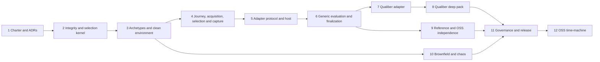

# External Reality Lab V2 — Detailed Implementation Plan

**Status:** Draft for implementation approval  
**Date:** 2026-07-23  
**Normative source:** `external-reality-lab-design-v2.md`, revision `2.0.0-draft.11`  
**Repository:** `qualiber-reality-lab`  
**Core V2 estimate:** 12–18 working weeks for one experienced engineer, followed by calibration and release hardening  
**Optional OSS time-machine extension:** 2–3 additional working weeks  

## 1. Purpose and authority

This document converts the approved External Reality Lab V2 design into an executable delivery program. It defines implementation order, package boundaries, work packages, dependencies, artifacts, tests, exit gates, rollback boundaries, staffing, and release criteria.

The plan is subordinate to:

1. accepted ERL2 ADRs;
2. `external-reality-lab-design-v2.md`;
3. versioned contracts and golden fixtures produced from that design;
4. this implementation plan.

An implementation conflict must fail closed and be resolved through an ADR or design revision. Code must not silently choose different identity, trust, selection, reveal, validity, cleanup, or claim semantics.

The implementation must remain useful without Qualiber. Qualiber is one opaque subject integration and one optional deep evaluation pack. Removing every Qualiber-owned package must leave the core, reference subjects, generic evaluation, verification, and environment operation functional.

## 2. Delivery outcomes

### 2.1 Core V2 outcome

Core V2 is complete when the Lab can:

- acquire and freeze an opaque subject package before challenge selection;
- run a generic acquisition-to-removal journey without knowing product features;
- construct a clean or constrained software-delivery/operations ecosystem;
- provide only subject-visible instructions and evidence to an adapter;
- capture setup, configuration, functional, operational, cleanup, and invalid-run behavior;
- select held-out challenges using the role-separated, single-beacon, checkpointed protocol;
- freeze subject output before truth or judge expectations are revealed;
- produce independent validity, journey, domain, and optional deep results;
- restore or contain the environment and prove cleanup;
- produce a valid terminal attestation and `PublicVerificationBundleV2`, or exactly one `InvalidLabRunRecordV1` with no attestation;
- verify public bundles and invalid records offline;
- run unchanged generic challenges against reference subjects and Qualiber without a core code change;
- make only the bounded claims authorized by the design.

### 2.2 Independence outcome

The architectural-independence claim is earned only after the same released core digest, challenge, policies, and replay evidence envelope run against:

- truthful limited reference subject;
- correct reference subject;
- misleading reference subject;
- Qualiber;
- one neutrally selected non-Qualiber OSS subject.

The claim is withheld if OSS selection, adapter certification, replay-envelope equality, translation totality, or core-purity tests fail.

### 2.3 Explicitly deferred outcomes

Core V2 does not require:

- publishing Qualiber publicly;
- changing Qualiber’s internal architecture;
- a Qualiber importer for the complete Reality Lab evidence graph;
- customer production credentials or production tenants;
- Kubernetes support;
- unsafe native installers;
- threshold-VRF randomness;
- a universal benchmark for arbitrary software products;
- customer external-validity claims without a later T4 customer bundle.

## 3. Delivery strategy

### 3.1 Release levels

| Level | Meaning | Minimum evidence | Claim ceiling |
|---|---|---|---|
| Feasibility proof | Architecture can run end to end | fake lifecycle, one clean Compose ecosystem, replay comparison, two adapters, offline verification | engineering feasibility only |
| Core V2 preview | Generic core and contracts are stable | Slices 1–6, clean environment, generic evaluation, reference subjects | bounded T1–T3 development evidence |
| Integration preview | Qualiber and reference/OSS subjects run through unchanged core | Slices 7–9 | bounded architectural-independence claim if all gates pass |
| Core V2 release | Brownfield, chaos, governance, calibration, and release evidence pass | Slices 1–11 | design-authorized T1–T3 claims |
| OSS time-machine extension | Historical replay is governed and cutoff-safe | Slice 12 | T3 historical reproduction only |
| T4 customer extension | Genuine customer correction and later outcome close | verified customer bundle | contextual T4 evidence only |

### 3.2 Milestones

| Milestone | Demonstrable result | Slice |
|---|---|---:|
| M0 — Authorized | Domain, ownership, ADRs, repository controls, and ledger approved | 1 |
| M1 — Integrity kernel | Valid and invalid fake runs survive tamper, crash, restart, and offline verification | 2 |
| M2 — Clean ecosystem | Fake and Compose drivers provision, probe, restore, and destroy twice reproducibly | 3 |
| M3 — Generic journey | Acquisition, blind selection, actor journey, capture, and terminal outcomes work | 4 |
| M4 — Adapter platform | Sandboxed external adapters certify and run without truth or core authority | 5 |
| M5 — Generic evaluation | Four result planes, terminal unions, result join, and generic bundles close | 6 |
| M6 — Qualiber generic integration | Local private Qualiber package runs as an opaque subject | 7 |
| M7 — Qualiber deep supplement | Optional Qualiber deep result changes no generic/base ancestor | 8 |
| M8 — Independence evidence | Reference, Qualiber, and neutral OSS subjects pass cross-subject proof | 9 |
| M9 — Reality hardening | Three constrained/brownfield archetypes and chaos/emergency cleanup pass | 10 |
| M10 — Core V2 release | Governance, calibration, CI, runbooks, and claim controls pass | 11 |
| M11 — Historical extension | OSS time-machine case reproduces without future-evidence leakage | 12 |

### 3.3 Critical path



## 4. Repository and package topology

Create the following structure incrementally. Empty directories are not required before their slice starts.

```text
qualiber-reality-lab/
  package.json
  tsconfig.base.json
  packages/
    contracts/
      schemas/
      generated/
      examples/
      invalid-examples/
      src/
    integrity/
      src/canonical/
      src/hash/
      src/artifacts/
      src/signatures/
      src/trust/
      src/timestamps/
      src/graph/
    core/
      src/lifecycle/
      src/admission/
      src/selection/
      src/journey/
      src/environment/
      src/capture/
      src/cleanup/
      src/validity/
      src/finalization/
    adapter-sdk/
      src/protocol/
      src/certification/
    evaluation-sdk/
      src/dsl/
      src/runtime/
      src/metrics/
    public-verifier/
      src/library/
      src/cli/
    cli/
      src/commands/
      src/output/
  adapters/
    reference-correct/
    reference-limited/
    reference-misleading/
    qualiber/
    oss-selected/
  packs/
    operations/
    qualiber-deep/
  environments/
    fake/
    otel-demo/
    archetypes/
  challenges/
    development/
    held-out-manifests/
  fixtures/
    golden/
    invalid/
    tampered/
    sabotage/
  tests/
    architecture/
    contract/
    integration/
    e2e/
    adversarial/
  docs/
    adr/
    decisions/
    claims/
  runbooks/
  scripts/
  .github/workflows/
```

### 4.1 Dependency rules

The allowed package dependency direction is:

```text
contracts <- integrity <- core
contracts <- adapter-sdk <- adapters/*
contracts <- evaluation-sdk <- packs/*
contracts + integrity <- public-verifier
core + public-verifier <- cli
```

The following dependencies are forbidden:

- core to `adapters/*`;
- core to `packs/qualiber-deep`;
- core to Qualiber source or package names;
- generic contracts to product-specific schemas;
- adapter SDK to truth, judge, selection-opening, or finalizer modules;
- evaluation packs to environment mutation, network, clock, randomness, process, or validity APIs;
- public verifier to vault plaintext or mutable remote registry state.

Architecture tests must inspect imports, package manifests, bundled files, lockfiles, CLI help, error codes, and string constants.

### 4.2 Private authority boundary

Held-out truth, unselected entry openings, threshold reveal shares, exposure history, and protected selection operations should live in a separately permissioned `qualiber-reality-vault` repository or equivalent protected store. Development fixtures may emulate this boundary, but must be labeled development-only.

The public Lab repository may contain:

- public keys and pinned trust configuration fixtures;
- encrypted selected payload fixtures;
- public development challenges;
- public verification artifacts;
- selected-only receipts required for closure.

It must not contain held-out plaintext truth, unselected openings, private keys, or real custodian shares.

## 5. Engineering rules applying to every slice

1. **Contract first:** schema, valid fixture, invalid fixture, generated type, validator, and compatibility test precede producer/consumer code.
2. **Closed schemas:** unknown fields fail; unions use literal discriminants; no generic extension bags.
3. **Single identity implementation:** RFC 8785 JCS and domain-separated SHA-256 come only from `packages/integrity`.
4. **Acyclic evidence:** artifact freezes before any checkpoint anchoring its hash; no object contains its own anchoring checkpoint.
5. **Immutable publication:** write temporary, validate, inventory, fsync, atomically publish, freeze marker last, never rewrite.
6. **Lifecycle authority:** every external mutation is intent → receipt → event → derived snapshot; recovery reconciles receipts before retry.
7. **Fail closed:** unknown version, graph ambiguity, trust failure, cutoff uncertainty, selection error, or cleanup uncertainty prevents attestation.
8. **Typed ownership:** Lab, dependency, adapter, subject, evaluator, inconclusive, cancellation, cleanup, and teardown outcomes remain distinct.
9. **Freeze before reveal:** neither truth nor judge expectations are available before subject output freezes.
10. **Cleanup before finalization:** valid finalization requires the terminal-stage-applicable cleanup branch; invalid runs still attempt bounded cleanup.
11. **No product authority:** adapters translate I/O only; deep packs cannot change validity, generic results, or base artifacts.
12. **Offline verification:** verifier trust roots/current heads come from explicit local configuration.
13. **Determinism:** inject clock, randomness, filesystem, transport, and process seams; prohibit ambient values in core calculations.
14. **Bounded diagnostics:** cap and redact logs; never retain secrets, hidden truth, or judge plaintext in Lab telemetry.
15. **Evidence with every issue:** a work item is complete only with tests and generated evidence, not code alone.

## 6. Program controls and ownership

### 6.1 Roles

| Role | Owns | Must not approve alone |
|---|---|---|
| Core owner | contracts, lifecycle, validity, finalizer | subject adapter truth/evaluation |
| Integrity/security owner | cryptography, trust, timestamps, sandbox, broker | own security exception |
| Environment governor | archetypes, substrate locks, clean controls | adapter implementation |
| Challenge governor | journey/challenge admission and exposure | matching subject adapter |
| Adapter owner | package-specific installation and translation | challenge truth or domain pack |
| Evaluation governor | generic metrics and pack certification | core validity changes |
| Vault custodians | held-out openings, truth and threshold shares | selector or subject operations |
| Independent verifier/QE | evidence review, selection receipt, release checks | implementation being independently reviewed |
| Privacy/legal | retention and T4 disclosure modes | technical validity |

Solo work may use separate OS accounts, keychain ACLs, keys, and protected workflows, but must report this as process separation rather than personnel independence.

### 6.2 Change classes

| Change | Required control |
|---|---|
| Trust, identity, canonical bytes, reveal, selection, validity, graph, hard-safety formula | accepted ADR + new golden fixtures |
| Breaking contract | new schema major |
| Truth change | superseding artifact + exposure review |
| Generic metric change | evaluation review + calibration rerun |
| Environment image/source change | digest qualification + clean-control rerun |
| Adapter-only change | adapter certification; no core change |
| Editorial plan/doc change | two reviewers for normative meaning |

## 7. Slice 1 — Charter, decisions, and repository bootstrap

**Estimate:** 3–5 working days  
**Entry:** design draft.11 approved for planning  
**Goal:** prevent implementation from creating accidental architecture policy.

### 7.1 Work packages

| ID | Work | Deliverables |
|---|---|---|
| S1.1 | Approve scope and claim boundary | signed approval record; explicit non-goals and claim ceilings |
| S1.2 | Create requirement ledger | machine-readable requirement → contract → package → test → owner → status mapping |
| S1.3 | Accept foundation ADRs | ADR-ERL2-001 through 006 and ADR-ERL2-011 |
| S1.4 | Resolve early open questions | OQ-005 OTel lock owner; OQ-007 beacon/trust/custodian plan; dates for OQ-001/004 |
| S1.5 | Bootstrap workspace | Node 22, strict TypeScript, workspace manager, test runner, lint/format, schema compiler |
| S1.6 | Establish repository controls | CODEOWNERS, protected branches, secret scanning, dependency review, release naming |
| S1.7 | Create architecture purity baseline | empty dependency graph and named-subject scan fixture |
| S1.8 | Establish development keys | test-only roles, rotation/revocation fixture, no production secret material |

### 7.2 Exit gate

- Requirement ledger covers every P0 requirement and AC-001 through AC-043.
- ADRs 001–006 and 011 are accepted or explicitly block corresponding code.
- Threshold VRF is marked inactive with `THRESHOLD_VRF_NOT_ACTIVATED`.
- Repository CI installs, type-checks, tests, and runs secret/purity scans.
- No core package or CLI exposes a Qualiber-specific concept.

### 7.3 Rollback

Documentation and empty scaffolding only. If ownership or crypto choices change, revise ADRs before Slice 2.

## 8. Slice 2 — Integrity, lifecycle, selection, trust, and offline verification kernel

**Estimate:** 5–8 working days  
**Entry:** Slice 1 complete  
**Goal:** implement a complete fake valid/invalid run and the security-critical V2 selection graph before live infrastructure.

### 8.1 Contract freeze order

Implement contract groups in this order:

1. universal scalar types, `ArtifactRef`, signatures, JCS/hash envelopes;
2. trust policy, signer inventory, timestamp checkpoint, exposure and lifecycle event contracts;
3. selection request, actor/journey policy, pool entry/profile/manifest;
4. active external-beacon randomness policy and Lab/verifier association wrapper;
5. randomness-source trust verification report;
6. selection commitment, checkpoint references, threshold reveal receipt, selected binding, proof, verification receipt;
7. threshold-VRF disabled marker and refusal fixture—no successful implementation;
8. valid pre-environment, valid environment, and invalid run-record unions;
9. cleanup, validity, final-attestation, public-bundle, and mandatory-closure contracts;
10. public and invalid-record verifier outputs and stable error codes.

### 8.2 Integrity implementation

- RFC 8785 canonicalization with documented numeric restrictions.
- Domain-separated SHA-256 helper with a closed domain registry.
- Content-addressed artifact store.
- Logical path confinement: traversal, symlink escape, hard-link substitution, case collision, special-file, and root escape rejection.
- Atomic artifact publication and freeze markers.
- Ed25519 signature verification with role authorization.
- Trust-at-creation and trust-at-verification verdicts.
- Locally pinned current-head resolution; bundle state cannot self-authorize.
- Acyclic timestamp checkpoint verification.
- Verifier-derived mandatory graph closure; producer arrays are claims only.

### 8.3 Selection implementation

Implement a pure selection library before orchestration:

1. validate one external-beacon source and source-trust identity;
2. validate role/key separation audit;
3. build uniformly padded, threshold-encrypted opaque pool entries;
4. derive ordered pool root;
5. freeze and checkpoint pool manifest;
6. determine the first finalized beacon round after the checkpoint;
7. validate beacon-native round/output proof against locally pinned source keys;
8. create and sign the separate ERL source-association wrapper;
9. produce the source-trust verification report;
10. deterministically derive the selected index using HMAC-SHA-256 rejection sampling;
11. freeze selection commitment;
12. checkpoint commitment;
13. validate threshold reveal shares and access-log closure;
14. open only the selected entry;
15. freeze and checkpoint selected binding;
16. produce proof and independent verification receipt.

The external beacon never receives or signs the ERL request binding. The wrapper and verifier make the association.

### 8.4 Lifecycle and persistence

- Explicit transition table generated from the design state machine.
- Append-only events with previous-event hash.
- Atomic derived snapshot replacement.
- Run-state lease and prior-event compare-and-swap.
- Same operation ID + same bytes is idempotent.
- Same operation ID + different bytes is a conflict.
- Crash recovery reconciles side effects before continuing.
- Every accepted unrecoverable failure or cancellation freezes one invalid record.
- No invalid record can reach generic finalization or any bundle.

### 8.5 CLI vertical slice

Implement initially:

```text
erl2 doctor
erl2 status --run UUID
erl2 resume --run UUID
erl2 verify --public-bundle PATH --root-config PATH --offline
erl2 verify-record --record PATH --lifecycle PATH --artifact-root PATH --root-config PATH --offline
```

Add an internal fixture command or test harness for fake no-op runs. Do not expose development-only shortcuts in the release CLI.

### 8.6 Required tests

- CONTRACT, CANON, PATH, TAMPER, VERSION-CLOSURE.
- NOOP-LIFECYCLE valid pre-environment and environment variants.
- INVALID-TERMINAL for every currently reachable fake phase.
- cancellation without fabricated finding.
- crash before/after write, freeze, event, snapshot, and checkpoint.
- pool entry order/root substitution.
- source list, fallback, retry, wrong round, wrong source, unpinned source key.
- beacon-native proof versus ERL-wrapper signing-scope confusion.
- timestamp self-reference and wrong-target checkpoint.
- early selected opening, insufficient shares, unlogged share, role/key overlap.
- variable pool-entry metadata and malformed padding.
- threshold-VRF policy/receipt/runtime rejection.
- public bundle omission/extra member.
- invalid record passed to bundle verifier and valid record passed to record verifier.

### 8.7 Exit gate

- Fake valid run verifies offline with network disabled.
- Fake invalid run verifies offline without any attestation or bundle.
- Every security-critical selection mutation has a stable refusal code.
- Cross-platform JCS/hash/signature goldens pass on macOS arm64 and Linux amd64.
- Core dependency/purity scan passes.
- No checkpoint-containing artifact depends on the checkpoint anchoring itself.

### 8.8 Rollback

Remove unreleased packages and fixtures. Do not migrate or rewrite frozen artifacts; change majors if a frozen contract changes.

## 9. Slice 3 — Environment archetypes and clean ecosystem

**Estimate:** 5–8 working days  
**Entry:** integrity kernel stable  
**Goal:** prove environment construction is generic and reproducible before subject execution.

### 9.1 Work packages

| ID | Work | Deliverables |
|---|---|---|
| S3.1 | Environment contracts | archetype, instance, resource inventory, driver receipts, baseline and teardown schemas |
| S3.2 | Driver interface | `provision`, `probe`, `mutate`, `restore`, `destroy`, `inspect` |
| S3.3 | Fake driver | deterministic fixtures for every lifecycle/failure path |
| S3.4 | Compose driver | isolated project/network/volume/port naming and exact cleanup |
| S3.5 | OTel Demo lock | archive commit, per-platform image digests, SBOM/provenance, config hashes |
| S3.6 | Clean control | health, traffic, telemetry/evidence source probes and baseline fingerprint |
| S3.7 | Resource frontier | independently derive resources and safe cleanup actions |

### 9.2 Implementation rules

- No environment contract may name Qualiber or a supported evidence class.
- Global allocator stores reservation leases only.
- Every resource identity includes run ID and is validated before cleanup.
- Broad deletion, ambient Docker project discovery, and shared writable host paths are forbidden.
- Lab telemetry is routed to a separate sink and excluded from challenge evidence.

### 9.3 Tests

- provision/probe/destroy twice with identical expected fingerprints;
- concurrent two-run isolation;
- stale lease recovery;
- partial provision and emergency frontier enumeration;
- foreign-resource and broad-delete rejection;
- source-neutral environment admission;
- OTel source/image digest mismatch;
- clean-control contamination detection.

### 9.4 Exit gate

- Fake and Compose drivers satisfy the same contract suite.
- Clean environment reaches stable baseline twice.
- Teardown leaves zero applicable residue.
- OTel lock is qualified or Compose remains disabled and the plan stays on fake driver.

### 9.5 Rollback

Disable Compose driver and continue kernel work with the fake driver.

## 10. Slice 4 — Journey, acquisition, blind selection, and capture

**Estimate:** 6–9 working days  
**Entry:** clean environment and selection kernel  
**Goal:** execute the complete generic journey while preserving oracle separation.

### 10.1 Work packages

| ID | Work | Deliverables |
|---|---|---|
| S4.1 | Journey contracts | definition, subject-visible step, encrypted judge expectation, commitment |
| S4.2 | Acquisition contracts | preregistration, source, phase-specific requests, acquisition/package records and manifest |
| S4.3 | Generic step engine | planned/started/succeeded/failed/unsupported for every intent |
| S4.4 | Journey measurement | elapsed/active time, attempts, documentation, prompts, credentials, interventions |
| S4.5 | Challenge registry | family actor/journey policies, admission and exposure checks |
| S4.6 | Selection orchestration | role audit, pool, beacon, commitment, threshold opening, proof and receipt |
| S4.7 | Capture coordinator | source snapshots, cutoff, source states, observation freeze |
| S4.8 | Replay/live envelopes | replay byte identity and live semantic-projection contracts |
| S4.9 | Early terminal paths | acquisition/package/setup failure evaluation and cleanup |

### 10.2 Required ordering

```text
acquisition preregistration
→ measured acquisition
→ acquired-byte freeze
→ package verification
→ exact subject package manifest
→ challenge request and role audit
→ ordered pool and pool checkpoint
→ one independent beacon round
→ checkpointed opaque commitment
→ threshold selected opening
→ verified selected persona/journey
→ environment and execution plan
→ generic journey/capture
→ subject output freeze
→ permitted reveal
```

### 10.3 Oracle canary

Every judge expectation receives unique canary tokens. Tests scan:

- adapter requests;
- mounted files;
- environment variables;
- process arguments;
- diagnostics;
- subject output prefill;
- network egress;
- Lab telemetry.

Any canary outside the judge/vault boundary invalidates the run.

### 10.4 Tests

- acquisition requests contain no case/environment/truth identity;
- package bytes cannot change after acquisition or before selection;
- selected persona and journey remain hidden through commitment checkpoint;
- execution plan uses exactly the opened persona;
- every intent supports success, failure, unsupported, cancellation, crash, and resume;
- no subject/adapter execution after reveal;
- future/post-cutoff evidence rejected;
- replay/live mode crossover rejected;
- source state unavailable/permission/empty/truncated retained explicitly;
- pre-environment terminal contains no environment/teardown/selection artifacts.

### 10.5 Exit gate

- CLI can run acquisition through frozen output with a fake subject.
- Blind selection chain verifies independently.
- Exact journey closure is derived from commitments/lifecycle, not producer arrays.
- Early-terminal valid and invalid variants verify offline.
- Oracle-canary suite passes.

### 10.6 Rollback

Use public non-blind development journeys only. No held-out/blind claim.

## 11. Slice 5 — Adapter SDK, sandbox host, and reference subject

**Estimate:** 5–8 working days  
**Entry:** journey contracts stable  
**Goal:** allow opaque subjects without transferring Lab authority.

### 11.1 Work packages

- Adapter manifest and certification receipt.
- Phase-specific request validators.
- Adapter protocol process with bounded stdin/stdout or local RPC.
- Core-owned sandbox launcher.
- Read-only input and evidence mounts; writable output only.
- Credential handle broker and deny-by-default egress.
- Capability and privilege broker with closed operations—no shell.
- Mutation intent/receipt/compensation ledger.
- Total canonical-evidence translation receipt.
- Subject-output freezer and bounded diagnostics scanner.
- Correct and limited reference adapters.

### 11.2 Certification requirements

An adapter must prove:

- exact package/provenance identity;
- declared operations and required privileges;
- no truth, judge, selection-handle, Docker socket, host-home, or forbidden network access;
- every mutation has compensation;
- every canonical envelope entry is mapped exact, mapped lossy, or unsupported exactly once;
- unsupported does not remove a challenge;
- deterministic projection for identical inputs;
- no adapter execution after output freeze/reveal;
- residue-free uninstall/cleanup where supported.

### 11.3 Tests

- broken installer and unsupported install;
- hidden mutation and undeclared privilege;
- symlink/mount escape;
- SSRF, redirect and DNS revalidation;
- secret canary and excessive credential scope;
- omitted or duplicate evidence mapping;
- diagnostics containing judge tokens;
- timeout, output limit and process-tree termination;
- adapter crash and idempotent resume;
- reference correct/limited expected outcomes.

### 11.4 Exit gate

- Certified reference adapter runs through the unchanged core.
- Broken/malicious adapters yield typed adapter/Lab outcomes, never false subject defects.
- External adapter packages can be removed without modifying core.
- OQ-001 either selects an audited broker or restricts V2 to unprivileged container subjects.

### 11.5 Rollback

Disable external/native adapters; retain reference adapter and unprivileged container profile.

## 12. Slice 6 — Generic evaluation, terminal closure, and finalization

**Estimate:** 6–9 working days  
**Entry:** stable subject output and capture contracts  
**Goal:** produce deterministic generic results without product-specific scoring.

### 12.1 Work packages

| ID | Work | Deliverables |
|---|---|---|
| S6.1 | Finding union | Lab/dependency/adapter/subject/evaluator/inconclusive ownership |
| S6.2 | Pack runtime | data-only DSL initially; no I/O, clock, random, process, network or validity API |
| S6.3 | Journey evaluator | setup and interaction metrics, support/failure attribution |
| S6.4 | Domain evaluator | operations-domain claims, facts, citations and safety assertions |
| S6.5 | Result join | journey + evaluated-or-N/A domain result before cleanup |
| S6.6 | Validity evaluator | Lab-owned gates only |
| S6.7 | Cleanup unions | pre-environment, environment restoration, emergency cleanup actions |
| S6.8 | Generic index | valid branches only; binds validity, journey, domain and join |
| S6.9 | Finalizer | run record, attestation, public bundle, signer inventory, graph closure |

### 12.2 Evaluation rules

- No scalar leaderboard score.
- Journey, domain, validity, and deep planes remain separate.
- Metric definitions specify numerator, denominator, zero behavior, inclusions, exclusions, thresholds, and claim ceiling.
- Domain packs cannot alter core validity or journey history.
- Failed setup/connection may produce journey results and domain N/A, but not invented functional scoring.
- `status="invalid"` routes directly to invalid terminal record.
- Invalid runs cannot assert subject defects as attested results.

### 12.3 Tests

- correct, limited, always-inconclusive, misleading and fabricated-citation subjects;
- zero denominator and empty-source cases;
- result join missing/reordered/extra artifact;
- cleanup attempted before join;
- invalid validity routed to generic index;
- early terminal with synthetic environment artifacts;
- emergency cleanup safe action without receipt;
- unsafe skip without reason or with receipt;
- producer-supplied closure array that omits a required artifact;
- finalizer signature before cleanup/exposure/trust closure;
- V1/V2 bundle crossover.

### 12.4 Exit gate

- Reference correct, limited, misleading, and inconclusive subjects produce expected typed outcomes.
- Public bundle verifies offline.
- Invalid records verify offline and cannot generate a bundle.
- Pack mutation cannot change validity or generic thresholds.
- OQ-004 is resolved or pack execution remains data-only DSL.

### 12.5 Rollback

Retain frozen measurements and journey results; disable domain claims and attestation until deterministic pack runtime passes.

## 13. Slice 7 — Qualiber generic adapter and challenge suite

**Estimate:** 5–8 working days  
**Entry:** adapter certification and generic evaluation stable  
**Goal:** run private local Qualiber as one opaque subject without core changes.

### 13.1 Local private-package workflow

1. Build Qualiber outside the Lab repository.
2. Produce exact archive/container bytes, provenance and SBOM.
3. Copy the package to a Lab-controlled intake location.
4. Preregister the local-delivery source and Qualiber adapter.
5. Acquire, freeze, scan, and verify the package through normal journey stages.
6. Never read the Qualiber source checkout or authoring path.
7. Run only supported external interfaces declared by the adapter.

### 13.2 Adapter work

- Translate generic install/configure/auth/connect/discover/exercise/observe/diagnose/recover/remove intents.
- Map canonical evidence without modifying it.
- Retain unsupported inputs.
- Freeze Qualiber output and project only into generic claim contracts.
- Record documentation steps, manual interventions, requested/granted/used credentials, retries and residue.
- Support replay mode for the architecture proof and live mode for realistic runs.

### 13.3 Generic challenges

Use generic operations/delivery challenges that make sense independently of Qualiber. Do not author cases from Qualiber features or known strengths. Begin with:

- clean-control inspection;
- service dependency failure diagnosis;
- delayed/partial telemetry or evidence source;
- deployment/configuration regression;
- recovery/rollback decision;
- unsupported evidence-class retention.

### 13.4 Tests and exit gate

- Qualiber package acquisition and setup failures are measurable outcomes.
- Core digest and core source tree are unchanged by Qualiber integration.
- No core import/string/schema/CLI branch names Qualiber.
- Removing `adapters/qualiber` leaves all core/reference tests passing.
- At least one correct and one limited result match independently authored expectations.

### 13.5 Rollback

Remove the Qualiber adapter package. Core V2 remains releasable as a generic preview.

## 14. Slice 8 — Qualiber deep-conformance supplement

**Estimate:** 4–6 working days  
**Entry:** Qualiber generic adapter complete  
**Goal:** evaluate product-specific semantics without contaminating generic/base evidence.

### 14.1 Work packages

- Deep evaluation commitment before randomness request.
- Qualiber-specific vocabulary and compatibility fixtures.
- Deep pack certification and sandboxing.
- `DeepResultV1`, supplement attestation and deep verification bundle.
- Separate deep trust policy, signer inventory, timestamp chain and locally pinned verification.

### 14.2 Ancestry invariant

Run the same base input twice: once with deep evaluation enabled and once disabled. These bytes must be identical:

- observation and canonical envelope;
- subject output and generic claim set;
- validity, journey and domain results;
- result join and generic index;
- run record and base final attestation;
- base public verification bundle.

Only deep commitment/result/supplement/bundle artifacts may differ.

### 14.3 Exit gate

- Deep toggle changes no generic/base ancestor hash.
- Deep failure cannot change base validity or bundle.
- Deep verifier rejects self-anchored or stale trust heads.
- Removing the deep pack leaves Qualiber generic integration intact.

### 14.4 Rollback

Omit deep descendants and publish only generic/base results.

## 15. Slice 9 — Reference subjects, neutral OSS subject, and independence proof

**Estimate:** 7–10 working days  
**Entry:** core/generic contracts stable; OQ-003 resolved  
**Goal:** prove the Lab is not a disguised Qualiber test harness.

### 15.1 Neutral OSS selection

Before adapter feasibility work:

1. publish a candidate inventory of at least three independently discovered projects;
2. apply OSI license, reproducible package, relevant evidence input, finding/decision output, sandbox feasibility, provenance, and no-prior-Lab-integration criteria;
3. score candidates without considering adapter convenience;
4. use deterministic tie-break/random selection;
5. retain rejected/failed-candidate records.

If fewer than two eligible candidates remain, withhold the independence claim.

### 15.2 Reference subjects

- truthful limited;
- correct;
- misleading/causal overclaimer;
- optionally always-inconclusive for failure taxonomy.

### 15.3 Proof runs

Use one non-blind development replay challenge and one byte-identical `ReplayCanonicalEvidenceEnvelopeV1`. Across subjects, freeze:

- same core digest;
- same challenge/archetype/truth/policies/domain pack;
- same actor journey and step commitments;
- same replay envelope bytes/tree/core hash;
- complete adapter translation receipt.

Run a separate live ecosystem suite using semantic-equivalence receipts; never call live bytes identical.

### 15.4 Exit gate

- Reference, Qualiber and OSS subjects run through unchanged core.
- Translation covers every entry exactly once.
- Expected limited/correct/misleading behaviors are distinguished.
- Mutation inserting a named-subject core branch fails purity tests.
- Independence evidence package is reviewed by independent QE.

### 15.5 Rollback

Withhold the architectural-independence claim. Do not block core preview or Qualiber adapter usage.

## 16. Slice 10 — Brownfield archetypes, chaos, and emergency cleanup

**Estimate:** 8–10 working days  
**Entry:** archetype framework and generic lifecycle stable  
**Goal:** represent realistic setup/configuration disorder and prove safe failure handling.

### 16.1 First three constrained archetypes

OQ-002 must select parameter sets through external evidence and repeatability trials. Recommended categories:

- version/configuration drift;
- partial permissions or source availability;
- noisy/stale/duplicated evidence with retained provenance.

Each archetype needs:

- independent rationale;
- content-addressed seed/configuration;
- control probes;
- repeatability bounds;
- cleanup expectations;
- applicable sabotage subjects;
- claim limitations.

### 16.2 Chaos matrix

Inject failure around:

- environment provision/baseline;
- acquisition and package freeze;
- selection source/checkpoint/reveal;
- adapter start/timeout/crash;
- evidence pagination and cutoff;
- output freeze and reveal;
- evaluator and finalizer;
- restoration and teardown;
- filesystem publication and lifecycle event append.

### 16.3 Emergency cleanup

For restoration or teardown failure:

1. freeze resource frontier;
2. independently enumerate possible actions;
3. attempt every independently safe action;
4. require a receipt for succeeded/failed actions;
5. record unsafe skip with reason and no receipt;
6. freeze remaining-resource containment state;
7. freeze invalid record only after emergency verification.

### 16.4 Exit gate

- Three constrained archetypes pass admission and repeatability.
- Crash matrix produces no duplicate mutations or ambiguous state.
- Two concurrent runs have no tenant/resource contamination.
- Restoration/teardown failures cannot bypass emergency cleanup.
- Residual resources are contained and explicitly reported.

### 16.5 Rollback

Release clean-environment preview only. Brownfield/chaos claims remain withheld.

## 17. Slice 11 — Governance, calibration, customer verifier, and Core V2 release

**Estimate:** 5–8 working days plus calibration elapsed time  
**Entry:** Slices 2–10 release candidates  
**Goal:** convert working code into an honest, supportable release.

### 17.1 Protected workflows

- Role/key conflict scanning.
- Single-beacon source/trust configuration review.
- Pool/read/randomness/share/opening/access audit logs.
- Exposure demotion and rotation.
- Claim-scope generation and prohibited-language scanner.
- Signer inventory and trust-head verification.
- Retention/deletion jobs with legal policy.
- Release evidence archive and reproducible build/SBOM.

### 17.2 Calibration

Run at least ten clean/fault/recovery executions across supported platforms and collect:

- valid/invalid rate;
- flake classification;
- stage duration and operator active time;
- retry/intervention distribution;
- evidence and output sizes;
- cleanup residue;
- source availability;
- CI minutes, storage and egress;
- metric behavior across reference subjects.

Calibration may tune operational limits only through committed policy revisions. It cannot alter results post hoc.

### 17.3 Customer verification extension

Implement the verifier and contracts for:

- `CustomerOutcomeEvidenceV1`;
- customer role/threshold trust policy;
- signer inventory;
- public versus confidential-auditor disclosure manifest;
- customer verification bundle and graph closure;
- locally pinned customer trust head.

No synthetic run emits T4. The extension is validated with fixtures only until genuine customer correction and later outcome evidence exists.

### 17.4 Release CI

| Lane | Trigger | Required suites |
|---|---|---|
| PR | every change | contract, canonicalization, purity, fake lifecycle, unit, lint/type |
| Nightly | main | clean Compose, crash subset, tamper, reference subjects |
| Weekly | scheduled | brownfield, full crash/security matrix, Qualiber development run |
| Protected held-out | authorized manual/workflow | role separation, blind live mode, exposure, audit, claim controls |
| Manual independence | release candidate | replay cross-subject and live-equivalence suites |
| Release | tagged candidate | all suites, two platforms, SBOM/provenance, offline verification |

### 17.5 Release gate

- All P0 requirements and AC-001 through AC-043 pass.
- Ten-run calibration reviewed and unexplained flakes are zero.
- OQ-006 retention approval is resolved or held-out release is disabled.
- Threshold VRF remains inactive unless a later audited ADR and new majors approve it.
- Blind reports contain mandatory role-separated assurance and residual-collusion limitation.
- Security, privacy, environment, evaluation, adapter, Qualiber, and independent-QE approvals are recorded.
- Installation, local-private-package, verification, cleanup, incident, key-rotation, and exposure runbooks are tested.
- Public verifier reproduces final verdict with network disabled.

### 17.6 Rollback

Release informational/development preview only; disable held-out claims, customer T4 emission, or affected integrations independently.

## 18. Slice 12 — Optional OSS time-machine extension

**Estimate:** 10–15 working days  
**Entry:** Core V2 released  
**Goal:** reproduce a historical defect with correct time and evidence boundaries.

### 18.1 Work packages

- Neutral historical-case selection.
- Pre-fix/fix source archive and package locks.
- Historical evidence mirror.
- Cutoff and reachability manifests.
- Later judge-only evidence separated from subject-visible evidence.
- Historical truth admission and T3 claim policy.
- Reproduction pack and public evidence package.

### 18.2 Exit gate

- Pre-fix behavior reproduces and fix changes expected behavior.
- Subject cannot access post-cutoff/future evidence.
- Historical case makes no customer external-validity claim.
- Removal of the extension changes no Core V2 package.

### 18.3 Rollback

Defer extension without Core V2 impact.

## 19. Cross-cutting test architecture

### 19.1 Test layers

| Layer | Purpose | Runtime target |
|---|---|---:|
| Unit | pure contract, hash, transition, metric and policy logic | seconds |
| Contract | schemas, examples, negative unions and major-version closure | <2 min |
| Component | fake driver/adapter/pack/verifier processes | <5 min |
| Integration | artifact store, lifecycle, selection, sandbox and Compose | <15 min |
| End-to-end | complete valid/invalid run and offline verification | <45 min clean |
| Adversarial | tamper, crash, leakage, privilege, source/trust and residue | scheduled/release |
| Calibration | repeatability, flake, limits, cost and claim behavior | protected/manual |

### 19.2 Mandatory test families

Every family named in design §24 must exist as a stable test suite. At minimum:

- CONTRACT, CANON, PATH, VERSION-CLOSURE;
- CORE-PURITY and dependency graph;
- NOOP-LIFECYCLE;
- ACQUISITION-BINDING and REQUEST-ANCESTRY;
- BLIND-ACTOR-POLICY and BLIND-JOURNEY-FAMILY;
- SINGLE-RANDOMNESS-SOURCE, RANDOMNESS-VARIANT-CLOSURE, BEACON-WRAPPER-OWNERSHIP, RANDOMNESS-SOURCE-TRUST;
- SELECTION-CHAIN-CLOSURE, ACYCLIC-SELECTION-TIME, POOL-METADATA-UNIFORMITY, SELECTION-NON-COLLUSION;
- JOURNEY-CAPTURE and JOURNEY-ORACLE-CANARY;
- ADAPTER-CERT, SECURITY-ADV and PRIV-BROKER;
- CANONICAL-EVIDENCE, COMPARISON-MODE and SEMANTIC-EQUIVALENCE;
- EVAL-GOLDEN, RESULT-JOIN and FAILURE-OWNERSHIP;
- EARLY-TERMINAL-CLOSURE, INVALID-TERMINAL and INVALID-REASON-PHASE;
- EMERGENCY-CLEANUP and EMERGENCY-ACTION-EVIDENCE;
- GRAPH-CLOSURE, VERIFY-INVALID-RECORD, TAMPER and CRASH-MATRIX;
- DEEP-ANCESTRY, CUSTOMER-BUNDLE and EXTERNAL-TRUST-PIN;
- CROSS-SUBJECT and CLAIM-SCOPE.

### 19.3 Golden-fixture policy

- Goldens are generated only by a pinned generator release.
- A golden change requires a semantic diff report.
- Security-critical golden changes require integrity/security approval.
- Invalid fixtures must name the exact invariant and expected refusal code.
- Retained V1 bytes are never rewritten to V2.
- Every new major has distinct positive and crossover-negative fixtures.

## 20. Operational and nonfunctional work

### 20.1 Performance budgets

Initial clean-reference budgets:

- 45 minutes per run;
- 8 CPU, 16 GiB RAM, 40 GiB disk;
- 1 GiB raw evidence;
- 256 MiB normalized observation;
- 64 MiB subject output;
- 1,000 API calls and 20 pages per source;
- three read retries where policy permits;
- diagnostics capped at 16 KiB per component.

Brownfield runs may declare up to 90 minutes. Limit changes are versioned policy changes.

### 20.2 Retention

| Data | Default retention |
|---|---:|
| temporary secrets and judge plaintext | delete immediately |
| raw evidence | ≤24 hours |
| normalized evidence and diagnostics | 30 days |
| run/final/evaluation/cleanup bundles | 7 years, pending legal approval |
| trust and exposure history | append-only permanent |

Deletion jobs must preserve verification closure and produce signed deletion/audit receipts where required.

### 20.3 Observability

Lab telemetry must be separate from challenge evidence. Record run, command, lifecycle event, component, safe error code, monotonic duration, artifact hashes, resource usage and limits. Never record credentials, truth plaintext, unselected openings, subject-private data beyond policy, or judge canaries.

## 21. Staffing and schedule

### 21.1 Solo engineer

| Period | Primary slices | Expected outcome |
|---|---|---|
| Weeks 1–2 | 1–2 | approved scaffold and integrity/selection kernel |
| Weeks 3–4 | 3–4 start | clean environment and acquisition/journey foundation |
| Weeks 5–6 | 4–5 | capture, selection orchestration and adapter host |
| Weeks 7–8 | 6 | generic evaluation and terminal closure |
| Weeks 9–10 | 7–8 | Qualiber generic and deep integrations |
| Weeks 11–13 | 9–10 | OSS/reference proof and brownfield/chaos |
| Weeks 14–18 | 11 + contingency | calibration, governance, security and release |

Re-estimate after Slices 2 and 5 using measured velocity and open environment/security work.

### 21.2 Small team

Recommended minimum team:

- one core/integrity engineer;
- one environment/adapter engineer;
- one evaluation/governance engineer or shared QE/security partner.

Parallelization after Slice 2:

- environment work and journey-contract work;
- adapter host and evaluation DSL prototypes;
- Qualiber adapter after stable SDK while reference subjects expand;
- brownfield archetypes while deep-pack work proceeds;
- governance/runbooks throughout, not only at release.

Likely elapsed target: 8–12 weeks plus calibration, assuming prompt security and environment decisions.

### 21.3 Smallest 3–4 week proof

Include only:

- fake valid/invalid lifecycle and offline verification;
- one clean Compose environment;
- acquisition/package-before-selection;
- public non-blind replay mode;
- split journey-oracle canary;
- truthful limited reference adapter;
- local-private Qualiber adapter;
- byte-identical replay envelope and same core digest.

Exclude held-out selection, external beacon, threshold reveal, live equivalence, deep pack, brownfield, OSS, customer bundles and release claims. Label the output feasibility-only.

## 22. Work-item and reporting structure

### 22.1 Epic hierarchy

```text
Program: ERL V2
  Epic: Slice N
    Feature: contract or component family
      Task: schema / producer / consumer / tests / docs
      Evidence: fixture / CLI transcript / verification report
      Gate: slice exit review
```

### 22.2 Required issue fields

Every implementation issue must include:

- design requirement and acceptance IDs;
- owning package and allowed dependencies;
- contract/schema IDs changed;
- threat or failure mode addressed;
- positive and negative tests;
- expected CLI/verifier evidence;
- rollback/feature-disable path;
- reviewer roles;
- claim impact;
- definition of done.

### 22.3 Weekly review

Review evidence, not percentage-complete estimates:

- contracts frozen and compatibility impact;
- passing/failing acceptance suites;
- first unexplained lifecycle divergence;
- invalid-run and cleanup evidence;
- architecture-purity report;
- open ADR/OQ status;
- security/privacy findings;
- calibration and flake data;
- claims enabled or still withheld.

## 23. Immediate implementation backlog

Execute in this exact order after approval:

1. Archive the obsolete 0.9.8 plan in version control history; make this plan canonical.
2. Create `docs/adr/ADR-ERL2-001` through `ADR-ERL2-011` stubs with required decisions and owners.
3. Create the machine-readable requirement ledger.
4. Bootstrap Node 22/TypeScript workspace and CI.
5. Add core-purity and dependency-boundary tests before adapters exist.
6. Implement contract envelope, scalar formats, JCS and domain-separated hashing.
7. Implement artifact store, freeze and path-confinement primitives.
8. Implement trust/signature/timestamp fixtures and verifier-pinned configuration.
9. Implement lifecycle event chain, snapshots, leases and crash injection.
10. Freeze active external-beacon selection contracts and threshold-VRF refusal marker.
11. Build fake pool/beacon/wrapper/trust/commitment/opening/proof/receipt fixtures.
12. Implement valid/invalid terminal unions and mandatory closure.
13. Implement offline public and invalid-record verifiers.
14. Demonstrate fake valid and invalid CLI runs.
15. Conduct Slice 2 security/design checkpoint and re-estimate remaining schedule.

## 24. Principal risks and controls

| Risk | Trigger | Control / fallback |
|---|---|---|
| Core becomes Qualiber-shaped | named product branch/schema/CLI/string | purity test; remove offending dependency |
| Contracts expand without closure | extension bag/unknown field/inheritance | closed schemas and major versions |
| Beacon integration is not verifiable | native proof/round semantics unclear | non-blind development only; OQ-007 remains blocked |
| Selection roles collude | overlapping identities/keys or unlogged shares | fail admission; disclose residual limitation |
| Threshold VRF activated prematurely | successful threshold-VRF fixture/runtime | mandatory refusal; later audited ADR and new majors |
| Adapter gains semantic authority | case filtering, evidence rewrite, validity API | certification failure and sandbox denial |
| Brownfield is irreproducible | control probes/seed mismatch | clean-only preview |
| Native installer escapes | host privilege/reboot/root shell required | disposable VM prototype or unsupported |
| Evaluation rewards product vocabulary | candidate tokens/shortcuts | bias scan, reference/OSS subjects, review separation |
| Cleanup leaves resources | residue or uncertain frontier | emergency containment; invalid record; no attestation |
| OSS subject selected for convenience | adapter work before selection record | neutral procedure; withhold independence claim |
| Retention is not approved | legal/privacy block | no held-out production release |
| Solo role separation overstated | same person controls all roles | label process separation; no personnel-independence claim |

## 25. Definition of done

A work item is done only when:

- contracts and generated types validate;
- valid and adversarial fixtures exist;
- implementation respects dependency boundaries;
- unit/component/integration tests pass;
- relevant golden and mutation tests pass;
- CLI/verifier evidence is retained;
- error codes and operator guidance are documented;
- no secret/truth/private-package bytes leak;
- rollback or feature-disable path is tested;
- traceability ledger is updated;
- required reviewers approve;
- claim impact is explicitly recorded.

A slice is done only when all work items and its exit gate pass on a clean checkout.

## 26. Core V2 final release checklist

- [ ] ADR-ERL2-001 through 006 and 011 are accepted and implemented.
- [ ] Every P0 requirement and AC-001 through AC-043 maps to passing evidence.
- [ ] Core purity passes with all Qualiber packages removed.
- [ ] Acquisition/package identity freezes before challenge selection.
- [ ] Blind request exposes no exact persona, journey, steps, truth or challenge identity.
- [ ] Pool is uniformly padded and checkpointed.
- [ ] Exactly one verifier-authorized beacon round drives selection.
- [ ] Beacon proof and ERL association wrapper have distinct signing scopes.
- [ ] Threshold VRF is inactive unless separately approved through new majors.
- [ ] Commitment and binding checkpoints are acyclic.
- [ ] Threshold reveal shares, roles and access logs close.
- [ ] Residual collusion limitation appears in held-out reports.
- [ ] Oracle canaries never reach adapter/subject inputs or egress.
- [ ] Canonical evidence translation is total.
- [ ] Unsupported remains an outcome, not a case filter.
- [ ] Journey and domain results join before cleanup.
- [ ] Validity alone controls attestation eligibility.
- [ ] Invalid runs freeze one verifiable invalid record and no bundle.
- [ ] Restoration/teardown failure passes through receipt-backed emergency cleanup.
- [ ] Deep pack changes no generic/base ancestor bytes.
- [ ] Public and invalid-record verification work offline.
- [ ] Reference, Qualiber and neutral OSS subjects use the same released core digest.
- [ ] Brownfield and chaos gates pass or release is explicitly clean-only.
- [ ] Ten-run calibration and flake review pass.
- [ ] Security, privacy, environment, evaluation, adapter, Qualiber and independent-QE approvals are recorded.
- [ ] Claim text remains within T1–T3; T4 requires a separate verified customer bundle.
- [ ] Installation, operation, verification, cleanup, incident, key rotation, exposure and private-package runbooks are tested.

## 27. Approval requested

Approval of this implementation plan authorizes:

- Slice 1 repository/document/bootstrap work;
- Slice 2 contract, integrity, fake lifecycle, active external-beacon fixture, and offline-verifier implementation;
- local development keys and public development fixtures.

It does not authorize:

- real held-out truth publication;
- production/customer credentials;
- unsafe host privilege;
- threshold-VRF activation;
- public Qualiber distribution;
- external customer-validity claims;
- claims beyond the exit gates actually passed.
